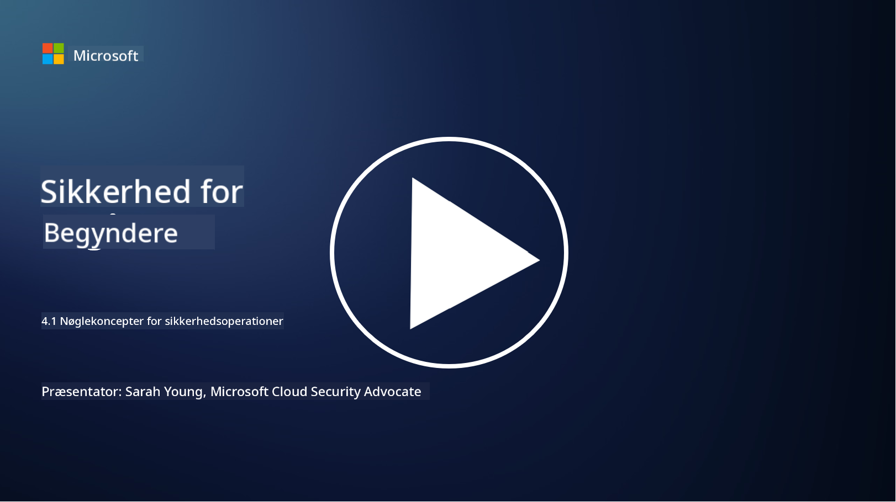

<!--
CO_OP_TRANSLATOR_METADATA:
{
  "original_hash": "6a55b31df9eebf550d040cef0ef7dff3",
  "translation_date": "2025-09-03T22:14:54+00:00",
  "source_file": "4.1 SecOps key concepts.md",
  "language_code": "da"
}
-->
# Nøglebegreber inden for sikkerhedsoperationer

Sikkerhedsoperationer er en afgørende del af en organisations samlede sikkerhedsfunktion. I denne lektion vil vi lære mere om dette:

 - Hvad er en sikkerhedsoperationsfunktion i en virksomhed?
   
 - Hvilke former kan sikkerhedsoperationer antage?
   
   - Hvordan adskiller sikkerhedsoperationer sig fra traditionelle IT-operationer?

## Hvad er en sikkerhedsoperationsfunktion i en virksomhed?

En sikkerhedsoperationsfunktion i en virksomhed refererer til et dedikeret team eller afdeling, der er ansvarlig for at overvåge, opdage, undersøge og reagere på cybersikkerhedstrusler og hændelser. Det primære mål for en sikkerhedsoperationsfunktion er at sikre fortroligheden, integriteten og tilgængeligheden af organisationens digitale aktiver ved proaktivt at identificere og reducere sikkerhedsrisici samt reagere effektivt på sikkerhedshændelser.

## Hvilke former kan sikkerhedsoperationer antage?

Sikkerhedsoperationer kan antage forskellige former afhængigt af organisationens størrelse og kompleksitet. Nogle almindelige former inkluderer:

**Security Operations Center (SOC):** Et centraliseret team, der er ansvarligt for overvågning, analyse og respons på sikkerhedshændelser døgnet rundt. SOC'er bruger ofte avancerede værktøjer og teknologier til at identificere og reagere på trusler i realtid.

**Incident Response Team:** Et specialiseret team, der fokuserer på at reagere på sikkerhedshændelser og brud. De udfører undersøgelser, koordinerer responsindsatser og faciliterer genopretning.

**Threat Hunting Team:** Et team, der proaktivt søger efter tegn på avancerede trusler og skjulte sårbarheder, som muligvis ikke opdages af traditionelle sikkerhedsværktøjer.

**Red Team/Blue Team:** Red team simulerer angreb for at identificere sårbarheder, mens blue team forsvarer mod disse angreb. Begge teams arbejder sammen for at forbedre sikkerhedsforanstaltninger.

**Managed Security Services Provider (MSSP):** Nogle organisationer outsourcer deres sikkerhedsoperationer til tredjepartsleverandører, der specialiserer sig i sikkerhedsovervågning og hændelsesrespons.

## Hvordan adskiller sikkerhedsoperationer sig fra traditionelle IT-operationer?

Sikkerhedsoperationer og traditionelle IT-operationer er relaterede, men adskilte funktioner:

**Fokus:** IT-operationer fokuserer på at administrere og vedligeholde organisationens IT-infrastruktur og sikre dens funktionalitet og tilgængelighed. Sikkerhedsoperationer prioriterer derimod at identificere og reducere sikkerhedsrisici samt reagere på hændelser.

**Ansvarsområder:** IT-operationer håndterer opgaver som systemvedligeholdelse, softwareopdateringer og brugerunderstøttelse. Sikkerhedsoperationer håndterer trusselsdetektion, hændelsesrespons, sårbarhedshåndtering og sikkerhedsovervågning.

**Tidsaspekt:** IT-operationer lægger vægt på øjeblikkelig systemtilgængelighed og ydeevne. Sikkerhedsoperationer fokuserer på at identificere og afhjælpe trusler, hvilket ikke altid stemmer overens med øjeblikkelig tilgængelighed.

**Kompetencer:** Sikkerhedsoperationer kræver specialiserede færdigheder inden for trusselsanalyse, hændelsesrespons og cybersikkerhedsværktøjer. IT-operationer kræver ekspertise inden for systemadministration, netværksstyring og applikationssupport.

## Workflow for hændelsesrespons

NIST Cybersecurity Framework Core Functions angiver fem overordnede funktioner, der bør udføres kontinuerligt som en del af en organisations operationelle miljø for at reducere cybersikkerhedsrisici. 

Det er vigtigt at forstå, at disse aktiviteter bør eksistere som en del af en større cirkel, der integreres med og tilpasses organisationens bredere cybersikkerhedsprocesser. 

**Note:** Du kan læse mere om NIST Cybersecurity Framework på [https://www.nist.gov/cybersecurity](https://www.nist.gov/cybersecurity)

## Yderligere læsning

- [Security operations | Microsoft Learn](https://learn.microsoft.com/security/operations/overview?WT.mc_id=academic-96948-sayoung)
- [Implementing security operations processes | Microsoft Learn](https://learn.microsoft.com/security/operations/?WT.mc_id=academic-96948-sayoung)
- [What is a security operations center (SOC)? | Microsoft Security](https://www.microsoft.com/security/business/security-101/what-is-a-security-operations-center-soc?WT.mc_id=academic-96948-sayoung)
- [What Is a Security Operations Center | Cybersecurity | CompTIA](https://www.comptia.org/content/articles/what-is-a-security-operations-center)

---

**Ansvarsfraskrivelse**:  
Dette dokument er blevet oversat ved hjælp af AI-oversættelsestjenesten [Co-op Translator](https://github.com/Azure/co-op-translator). Selvom vi bestræber os på nøjagtighed, skal du være opmærksom på, at automatiserede oversættelser kan indeholde fejl eller unøjagtigheder. Det originale dokument på dets oprindelige sprog bør betragtes som den autoritative kilde. For kritisk information anbefales professionel menneskelig oversættelse. Vi er ikke ansvarlige for eventuelle misforståelser eller fejltolkninger, der opstår som følge af brugen af denne oversættelse.