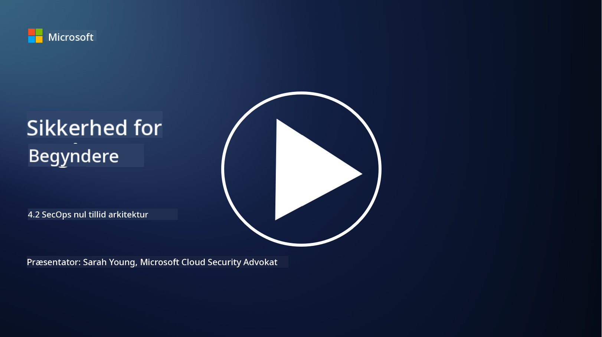

<!--
CO_OP_TRANSLATOR_METADATA:
{
  "original_hash": "45bbdc114e70936816b0b3e7c40189cf",
  "translation_date": "2025-09-03T21:19:23+00:00",
  "source_file": "4.2 SecOps zero trust architecture.md",
  "language_code": "da"
}
-->
# SecOps zero trust-arkitektur

Sikkerhedsoperationer udgør to dele af zero trust-arkitekturen, og i denne lektion vil vi lære om begge:

- Hvordan skal IT-arkitekturer bygges for at muliggøre centraliseret logindsamling?

- Hvad er de bedste praksisser for sikkerhedsoperationer i moderne IT-miljøer?

## Hvordan skal IT-arkitekturer bygges for at muliggøre centraliseret logindsamling?

Centraliseret logindsamling er en kritisk komponent i moderne sikkerhedsoperationer. Det giver organisationer mulighed for at samle logs og data fra forskellige kilder, såsom servere, applikationer, netværksenheder og sikkerhedsværktøjer, i et centralt lager til analyse, overvågning og incident response. Her er nogle bedste praksisser for at bygge IT-arkitekturer, der understøtter centraliseret logindsamling:

1. **Integration af logkilder**:

- Sørg for, at alle relevante enheder og systemer er konfigureret til at generere logs. Dette inkluderer servere, firewalls, routere, switches, applikationer og sikkerhedsapparater.

- Konfigurer logkilder til at videresende logs til en central logindsamler eller administrationssystem.

2. **Vælg det rette SIEM-værktøj (Security Information and Event Management)**:

- Vælg en SIEM-løsning, der passer til din organisations behov og skala.

- Sørg for, at den valgte løsning understøtter logindsamling, aggregering, analyse og rapportering.

3. **Skalerbarhed og redundans**:

- Design arkitekturen til skalerbarhed for at imødekomme et stigende antal logkilder og øget logvolumen.

- Implementer redundans for høj tilgængelighed for at undgå afbrydelser på grund af hardware- eller netværksfejl.

4. **Sikker transport af logs**:

- Brug sikre protokoller som TLS/SSL eller IPsec til at transportere logs fra kilder til det centrale lager.

- Implementer autentifikation og adgangskontrol for at sikre, at kun autoriserede enheder kan sende logs.

5. **Normalisering**:

- Standardiser logformater og normaliser data for at sikre konsistens og let analyse.

6. **Lagring og opbevaring**:

- Fastlæg den passende opbevaringsperiode for logs baseret på compliance- og sikkerhedskrav.

- Opbevar logs sikkert og beskyt dem mod uautoriseret adgang og manipulation.

## Hvad er de bedste praksisser for sikkerhedsoperationer i moderne IT-miljøer?

Ud over centraliseret logindsamling er her nogle bedste praksisser for sikkerhedsoperationer i moderne IT-miljøer:

1. **Kontinuerlig overvågning**: Implementer kontinuerlig overvågning af netværks- og systemaktiviteter for at opdage og reagere på trusler i realtid.

2. **Trusselsintelligens**: Hold dig opdateret om nye trusler og sårbarheder ved at bruge feeds og tjenester for trusselsintelligens.

3. **Brugeruddannelse**: Gennemfør regelmæssig sikkerhedsbevidsthedstræning for medarbejdere for at reducere risici forbundet med social engineering og phishing-angreb.

4. **Incident response-plan**: Udvikl og test en incident response-plan for at sikre en hurtig og effektiv reaktion på sikkerhedshændelser.

5. **Sikkerhedsautomatisering**: Udnyt sikkerhedsautomatiserings- og orkestreringsværktøjer til at effektivisere incident response og gentagne opgaver.

6. **Backup og gendannelse**: Implementer robuste backup- og katastrofegendannelsesløsninger for at sikre data tilgængelighed i tilfælde af datatab eller ransomware-angreb.

## Yderligere læsning

- [Microsoft Security Best Practices module: Security operations | Microsoft Learn](https://learn.microsoft.com/security/operations/security-operations-videos-and-decks?WT.mc_id=academic-96948-sayoung)
- [Security operations - Cloud Adoption Framework | Microsoft Learn](https://learn.microsoft.com/azure/cloud-adoption-framework/secure/security-operations?WT.mc_id=academic-96948-sayoung)
- [What is Security Operations and Analytics Platform Architecture? A Definition of SOAPA, How It Works, Benefits, and More (digitalguardian.com)](https://www.digitalguardian.com/blog/what-security-operations-and-analytics-platform-architecture-definition-soapa-how-it-works#:~:text=All%20in%20all%2C%20security%20operations%20and%20analytics%20platform,become%20more%20efficient%20and%20operative%20with%20your%20security.)

---

**Ansvarsfraskrivelse**:  
Dette dokument er blevet oversat ved hjælp af AI-oversættelsestjenesten [Co-op Translator](https://github.com/Azure/co-op-translator). Selvom vi bestræber os på nøjagtighed, skal du være opmærksom på, at automatiserede oversættelser kan indeholde fejl eller unøjagtigheder. Det originale dokument på dets oprindelige sprog bør betragtes som den autoritative kilde. For kritisk information anbefales professionel menneskelig oversættelse. Vi er ikke ansvarlige for eventuelle misforståelser eller fejltolkninger, der måtte opstå som følge af brugen af denne oversættelse.