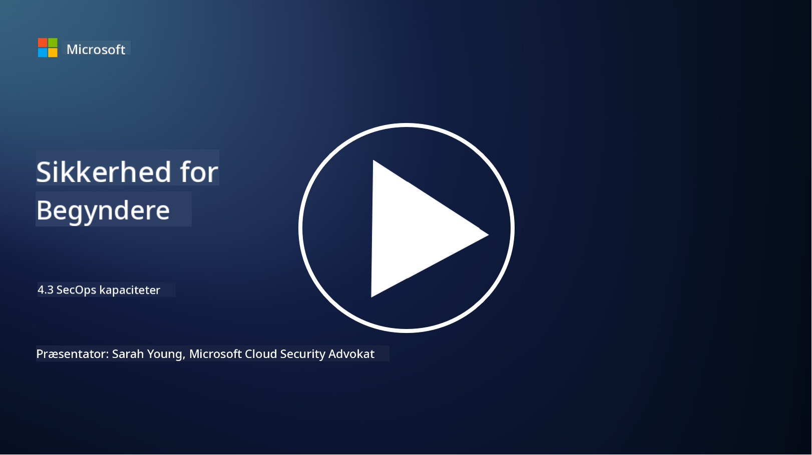

<!--
CO_OP_TRANSLATOR_METADATA:
{
  "original_hash": "553eb694c89f1caca0694e8d8ab89e0e",
  "translation_date": "2025-09-03T21:45:02+00:00",
  "source_file": "4.3 SecOps capabilities.md",
  "language_code": "da"
}
-->
# SecOps-funktioner

I denne sektion vil vi dække flere detaljer om de centrale værktøjer og funktioner, der kan bruges i sikkerhedsoperationer.

I denne lektion vil vi gennemgå:

- Hvad er et Security Information and Event Management (SIEM)-værktøj?

- Hvad er XDR?

- Hvilke funktioner kan bruges til at forbedre sikkerhedsoperationer?

## Hvad er et Security Information and Event Management (SIEM)-værktøj?

Et Security Information and Event Management (SIEM)-værktøj bruges til at analysere sikkerhedsalarmer, der genereres i en organisations IT-miljø. Det indsamler, aggregerer, korrelerer og analyserer logdata og sikkerhedshændelser fra forskellige kilder, såsom netværksenheder, servere, applikationer og sikkerhedssystemer.

Nøglefunktioner og kapaciteter ved SIEM-værktøjer inkluderer:

1. **Logindsamling**: SIEM-værktøjer indsamler logfiler og sikkerhedshændelsesdata fra en bred vifte af enheder, systemer og applikationer, herunder firewalls, indtrængningsdetekteringssystemer, antivirussoftware og mere.

2. **Data-normalisering**: De normaliserer logdata til et fælles format for at lette analyse og korrelation.

3. **Hændelseskorrelation**: SIEM-værktøjer korrelerer hændelser for at identificere mønstre og anomalier, der kan indikere sikkerhedshændelser eller trusler.

4. **Advarsler og notifikationer**: SIEM-værktøjer genererer advarsler og notifikationer i realtid, når mistænkelige aktiviteter eller sikkerhedsbrud opdages, hvilket muliggør øjeblikkelig respons.

5. **Hændelsesdetektion**: De letter detektionen af sikkerhedshændelser, herunder uautoriseret adgang, databrud, malware-infektioner og interne trusler.

6. **Bruger- og enhedsadfærdsanalyse (UEBA)**: Nogle SIEM-værktøjer inkluderer UEBA-funktioner til at identificere unormal bruger- og enhedsadfærd, der kan indikere kompromitterede konti eller interne trusler.

7. **Integration af trusselsintelligens**: SIEM-værktøjer kan integreres med trusselsintelligensfeeds for at forbedre trusselsdetektion ved at sammenligne kendte kompromisindikatorer (IOCs) med netværksaktivitet.

8. **Automatisering og orkestrering**: Automatiseringsfunktioner gør det muligt for SIEM-værktøjer at automatisere respons på almindelige sikkerhedshændelser, hvilket reducerer responstider og manuel indsats.

9. **Dashboard og visualisering**: De tilbyder dashboards og visualiseringsværktøjer til overvågning af sikkerhedsdata og oprettelse af tilpassede rapporter.

10. **Integration med andre sikkerhedsværktøjer**: SIEM-værktøjer integreres ofte med andre sikkerhedsværktøjer og teknologier, såsom Endpoint Detection and Response (EDR)-løsninger, for at give et holistisk billede af en organisations sikkerhedsstatus.

## Hvad er XDR?

XDR (Extended Detection and Response) er en teknologi, der udvider kapaciteterne for traditionelle Endpoint Detection and Response (EDR) og kombinerer dem med bredere sikkerhedstelemetri fra forskellige kilder for at give et mere omfattende billede af en organisations sikkerhedsstatus. XDR har til formål at forbedre trusselsdetektion, hændelsesrespons og den samlede sikkerhed ved at adressere begrænsningerne ved kun at stole på EDR, SIEM eller andre individuelle sikkerhedsværktøjer.

Nøglekarakteristika og komponenter ved XDR inkluderer:

1. **Dataintegration**: XDR integrerer data fra flere kilder, herunder endpoints, netværkstrafik, cloud-tjenester, e-mail og mere. Denne omfattende dataindsamling giver en bredere kontekst for trusselsdetektion og analyse.

2. **Avanceret analyse**: XDR anvender avanceret analyse, maskinlæring og adfærdsanalyse til at identificere og prioritere sikkerhedstrusler. Det søger efter mønstre og anomalier i de integrerede data for at opdage både kendte og ukendte trusler.

3. **Automatiseret trusselsdetektion**: XDR automatiserer detektionen af sikkerhedstrusler og anomalier ved at korrelere information fra forskellige kilder. Det kan identificere komplekse angrebskæder, der kan strække sig over flere vektorer.

4. **Hændelsesundersøgelse og respons**: XDR tilbyder værktøjer til hændelsesundersøgelse og respons, der hjælper sikkerhedsteams med hurtigt at vurdere omfanget og virkningen af hændelser og tage passende afhjælpende handlinger.

5. **Integration af trusselsintelligens**: Det integrerer trusselsintelligensfeeds og data for at forbedre trusselsdetektion ved at sammenligne kendte kompromisindikatorer (IOCs) med organisationens netværks- og endpoint-aktivitet.

6. **Samlet konsol**: XDR tilbyder typisk en samlet konsol eller dashboard, hvor sikkerhedsteams kan se og administrere sikkerhedsalarmer og hændelser fra forskellige kilder på en centraliseret måde.

7. **Dækning på tværs af platforme**: XDR-løsninger dækker en bred vifte af platforme, herunder endpoints, servere, cloud-miljøer og mobile enheder, hvilket gør det velegnet til moderne, multi-platform IT-miljøer.

## Hvilke funktioner kan bruges til at forbedre sikkerhedsoperationer?

For at forbedre sikkerhedsoperationer kan organisationer udnytte flere funktioner ud over SIEM-værktøjer:

1. **Maskinlæring og kunstig intelligens**: Implementer avanceret analyse, maskinlæring og AI til at opdage udviklende trusler og automatisere trusselsjagt.

2. **Bruger- og enhedsadfærdsanalyse (UEBA)**: Analyser bruger- og enhedsadfærd for at opdage anomalier og interne trusler.

3. **Trusselsintelligensfeeds**: Integrer trusselsintelligensfeeds for at holde sig opdateret om de nyeste trusler og kompromisindikatorer.

4. **Sikkerhedsorkestrering, automatisering og respons (SOAR)**: Implementer SOAR-platforme for at automatisere hændelsesrespons og strømline arbejdsprocesser i sikkerhedsoperationer.

5. **Bedragsteknologier**: Implementer bedragsteknologier for at vildlede og opdage angribere inden for netværket.

## Yderligere læsning

- [What is SIEM? | Microsoft Security](https://www.microsoft.com/security/business/security-101/what-is-siem?WT.mc_id=academic-96948-sayoung)
- [What Is SIEM? - Security Information and Event Management - Cisco](https://www.cisco.com/c/en/us/products/security/what-is-siem.html)
- [Security information and event management - Wikipedia](https://en.wikipedia.org/wiki/Security_information_and_event_management)
- [What Is XDR? | Microsoft Security](https://www.microsoft.com/security/business/security-101/what-is-xdr?WT.mc_id=academic-96948-sayoung)
- [XDR & XDR Security (kaspersky.com.au)](https://www.kaspersky.com.au/resource-center/definitions/what-is-xdr)
- [The Power of SecOps: Redefining Core Security Capabilities - The New Stack](https://thenewstack.io/the-power-of-secops-redefining-core-security-capabilities/)
- [Seven Steps to Improve Your Security Operations and Response (securityintelligence.com)](https://securityintelligence.com/seven-steps-to-improve-your-security-operations-and-response/)

---

**Ansvarsfraskrivelse**:  
Dette dokument er blevet oversat ved hjælp af AI-oversættelsestjenesten [Co-op Translator](https://github.com/Azure/co-op-translator). Selvom vi bestræber os på at sikre nøjagtighed, skal det bemærkes, at automatiserede oversættelser kan indeholde fejl eller unøjagtigheder. Det originale dokument på dets oprindelige sprog bør betragtes som den autoritative kilde. For kritisk information anbefales professionel menneskelig oversættelse. Vi påtager os ikke ansvar for eventuelle misforståelser eller fejltolkninger, der måtte opstå som følge af brugen af denne oversættelse.