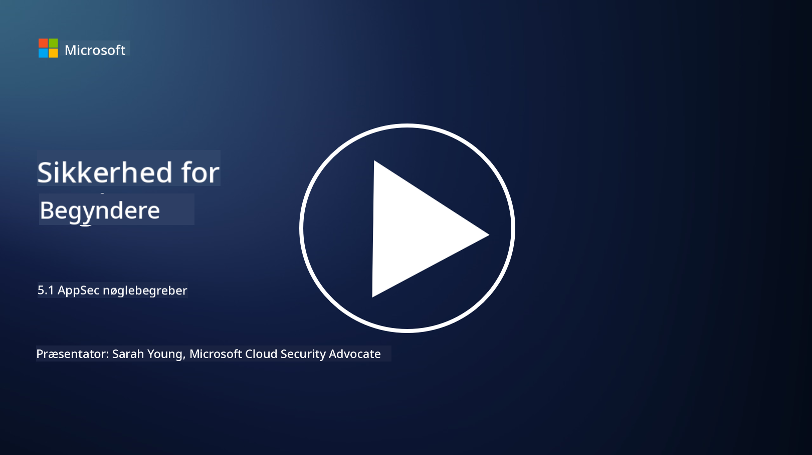

<!--
CO_OP_TRANSLATOR_METADATA:
{
  "original_hash": "e4b56bb23078d3ffb7ad407d280b0c36",
  "translation_date": "2025-09-03T21:08:53+00:00",
  "source_file": "5.1 AppSec key concepts.md",
  "language_code": "da"
}
-->
# AppSec nøglebegreber

Applikationssikkerhed er en sikkerhedsspecialisering i sig selv. I denne del af kurset vil vi dykke mere ned i applikationssikkerhed.

## Introduktion

I denne lektion vil vi dække:

- Hvad er applikationssikkerhed?

- Hvad er nøglebegreber/principper inden for applikationssikkerhed?

## Hvad er applikationssikkerhed?

Applikationssikkerhed, ofte forkortet som "AppSec," refererer til praksissen med at beskytte softwareapplikationer mod sikkerhedstrusler, sårbarheder og angreb. Det omfatter de processer, teknikker og værktøjer, der bruges til at identificere, afbøde og forhindre sikkerhedsrisici gennem hele udviklings-, implementerings- og vedligeholdelseslivscyklussen for en applikation.

Applikationssikkerhed er afgørende, fordi applikationer ofte er mål for cyberangreb. Ondsindede aktører udnytter sårbarheder og svagheder i software til at opnå uautoriseret adgang, stjæle data, forstyrre tjenester eller udføre andre skadelige aktiviteter. Effektiv applikationssikkerhed hjælper med at sikre fortroligheden, integriteten og tilgængeligheden af en applikation og dens tilknyttede data.

## Hvad er nøglebegreber/principper inden for applikationssikkerhed?

Nøglebegreber og principper, der understøtter applikationssikkerhed, inkluderer:

1. **Sikkerhed ved design**:

- Sikkerhed bør integreres i applikationens design og arkitektur fra starten, i stedet for at blive tilføjet som en eftertanke.

2. **Inputvalidering**:

- Alle brugerinput bør valideres for at sikre, at de overholder forventede formater og er fri for skadelig kode eller data.

3. **Outputkodning**:

- Data, der sendes til klienten, bør korrekt kodes for at forhindre sårbarheder som cross-site scripting (XSS).

4. **Autentifikation og autorisation**:

- Autentificer brugere og autoriser deres adgang til ressourcer baseret på deres roller og tilladelser.

5. **Databeskyttelse**:

- Følsomme data bør krypteres, når de lagres, overføres og behandles for at forhindre uautoriseret adgang.

6. **Sessionshåndtering**:

- Sikker sessionshåndtering sikrer, at brugersessioner er beskyttet mod kapring og uautoriseret adgang.

7. **Sikre afhængigheder**:

- Hold alle softwareafhængigheder opdateret med sikkerhedsrettelser for at forhindre sårbarheder.

8. **Fejlhåndtering og logning**:

- Implementer sikker fejlhåndtering for at undgå at afsløre følsomme oplysninger og sikre sikre logningspraksisser.

9. **Sikkerhedstest**:

- Test regelmæssigt applikationer for sårbarheder ved hjælp af metoder som penetrationstest, kodegennemgange og automatiserede scanningsværktøjer.

10. **Sikker softwareudviklingslivscyklus (SDLC)**:

- Integrer sikkerhedspraksisser i hver fase af softwareudviklingslivscyklussen, fra krav til implementering og vedligeholdelse.

## Yderligere læsning

- [SheHacksPurple: What is Application Security? - YouTube](https://www.youtube.com/watch?v=eNmccQNzSSY)
- [What Is Application Security? - Cisco](https://www.cisco.com/c/en/us/solutions/security/application-first-security/what-is-application-security.html#~how-does-it-work)
- [What is application security? A process and tools for securing software | CSO Online](https://www.csoonline.com/article/566471/what-is-application-security-a-process-and-tools-for-securing-software.html)
- [OWASP Cheat Sheet Series | OWASP Foundation](https://owasp.org/www-project-cheat-sheets/)

---

**Ansvarsfraskrivelse**:  
Dette dokument er blevet oversat ved hjælp af AI-oversættelsestjenesten [Co-op Translator](https://github.com/Azure/co-op-translator). Selvom vi bestræber os på at opnå nøjagtighed, skal du være opmærksom på, at automatiserede oversættelser kan indeholde fejl eller unøjagtigheder. Det originale dokument på dets oprindelige sprog bør betragtes som den autoritative kilde. For kritisk information anbefales professionel menneskelig oversættelse. Vi påtager os ikke ansvar for eventuelle misforståelser eller fejltolkninger, der måtte opstå som følge af brugen af denne oversættelse.