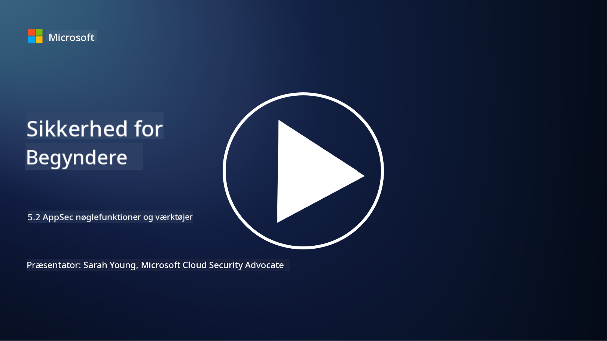

<!--
CO_OP_TRANSLATOR_METADATA:
{
  "original_hash": "790a3fa7e535ec60bb51bde13e759781",
  "translation_date": "2025-09-03T21:23:44+00:00",
  "source_file": "5.2 AppSec key capabilities.md",
  "language_code": "da"
}
-->
I denne sektion vil vi dække flere detaljer om de centrale værktøjer og funktioner, der bruges inden for applikationssikkerhed:

## Introduktion

I denne lektion vil vi gennemgå de vigtigste funktioner og værktøjer, der anvendes inden for applikationssikkerhed.

## Nøglefunktioner og værktøjer inden for AppSec

Nøglefunktioner og værktøjer, der bruges inden for applikationssikkerhed, er afgørende for at identificere, afbøde og forhindre sikkerhedssårbarheder og trusler i softwareapplikationer. Her er nogle af de vigtigste:

**1. Statisk applikationssikkerhedstest (SAST)**:

- **Funktioner**: Analyserer kildekode, bytekode eller binær kode for at identificere sikkerhedssårbarheder i applikationens kodebase.

- **Værktøjer**: Eksempler inkluderer Fortify, Checkmarx og Veracode.

**2. Dynamisk applikationssikkerhedstest (DAST)**:

- **Funktioner**: Scanner en kørende applikation for at identificere sårbarheder ved at sende inputforespørgsler og analysere svar.

- **Værktøjer**: Eksempler inkluderer ZAP, Burp Suite og Qualys Web Application Scanning.

**3. Interaktiv applikationssikkerhedstest (IAST)**:

- **Funktioner**: Kombinerer elementer fra SAST og DAST for at analysere kode under runtime, hvilket giver mere præcise resultater og reducerer falske positiver.

- **Værktøjer**: Eksempler inkluderer Contrast Security og HCL AppScan.

**4. Runtime applikationsselvbeskyttelse (RASP)**:

- **Funktioner**: Overvåger og beskytter applikationer i realtid, opdager og reagerer på sikkerhedstrusler, mens de opstår.

- **Værktøjer**: Eksempler inkluderer Veracode Runtime Protection og F5 Advanced WAF med RASP.

**5. Webapplikations-firewalls (WAFs)**:

- **Funktioner**: Tilbyder et beskyttende lag mellem applikationen og internettet, filtrerer indgående trafik og blokerer skadelige forespørgsler.

- **Værktøjer**: Eksempler inkluderer ModSecurity, AWS WAF og Akamai Kona Site Defender.

**6. Afhængighedsscanning**:

- **Funktioner**: Identificerer sårbarheder i tredjepartsbiblioteker og komponenter, der bruges i applikationen.

- **Værktøjer**: Eksempler inkluderer OWASP Dependency-Check og Snyk.

**7. Penetrationstest (Pen Testing)**:

- **Funktioner**: Simulerer realistiske angreb for at opdage sårbarheder og vurdere applikationens sikkerhed.

- **Værktøjer**: Udføres af certificerede etiske hackere og sikkerhedsprofessionelle ved hjælp af forskellige værktøjer som Metasploit og Nmap.

**8. Sikkerhedsscanning og analyse**:

- **Funktioner**: Scanner for kendte sårbarheder, konfigurationsfejl og sikkerhedsfejlkonfigurationer.

- **Værktøjer**: Eksempler inkluderer Nessus, Qualys Vulnerability Management og OpenVAS.

**9. Værktøjer til containersikkerhed**:

- **Funktioner**: Fokuserer på at sikre containeriserede applikationer og deres miljøer.

- **Værktøjer**: Eksempler inkluderer Docker Security Scanning og Aqua Security.

**10. Uddannelse i sikker udvikling**:

- **Funktioner**: Tilbyder træning og oplysningsprogrammer for udviklingsteam for at fremme sikre kodningspraksisser.

- **Værktøjer**: Skræddersyede træningsprogrammer og platforme.

**11. Rammer for sikkerhedstest**:

- **Funktioner**: Tilbyder omfattende testrammer til forskellige behov inden for applikationssikkerhedstest.

- **Værktøjer**: OWASP Amass, OWASP OWTF og FrAppSec.

**12. Værktøjer til sikker kodegennemgang**:

- **Funktioner**: Gennemgår kildekode for sikkerhedssårbarheder og kodningsbedste praksis.

- **Værktøjer**: Eksempler inkluderer SonarQube og Checkmarx.

**13. Værktøjer til sikre API'er og mikrotjenester**:

- **Funktioner**: Fokuserer på at sikre API'er og mikrotjenester, herunder autentificering, autorisation og databeskyttelse.

- **Værktøjer**: Eksempler inkluderer Apigee, AWS API Gateway og Istio.

## Yderligere læsning

- [What Is Application Security? Concepts, Tools & Best Practices | HackerOne](https://www.hackerone.com/knowledge-center/what-application-security-concepts-tools-best-practices)
- [What is IAST? (Interactive Application Security Testing) (comparitech.com)](https://www.comparitech.com/net-admin/what-is-iast/)
- [10 Types of Application Security Testing Tools: When and How to Use Them (cmu.edu)](https://insights.sei.cmu.edu/blog/10-types-of-application-security-testing-tools-when-and-how-to-use-them/)
- [Shifting the Balance of Cybersecurity Risk: Principles and Approaches for Security-by-Design and Default | Cyber.gov.au](https://www.cyber.gov.au/about-us/view-all-content/publications/principles-and-approaches-for-security-by-design-and-default)

---

**Ansvarsfraskrivelse**:  
Dette dokument er blevet oversat ved hjælp af AI-oversættelsestjenesten [Co-op Translator](https://github.com/Azure/co-op-translator). Selvom vi bestræber os på at sikre nøjagtighed, skal det bemærkes, at automatiserede oversættelser kan indeholde fejl eller unøjagtigheder. Det originale dokument på dets oprindelige sprog bør betragtes som den autoritative kilde. For kritisk information anbefales professionel menneskelig oversættelse. Vi påtager os ikke ansvar for misforståelser eller fejltolkninger, der måtte opstå som følge af brugen af denne oversættelse.