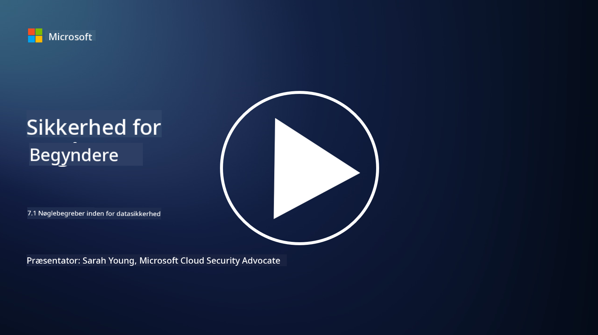

<!--
CO_OP_TRANSLATOR_METADATA:
{
  "original_hash": "9703868f41dcddd5a98dea9ea6fcd94d",
  "translation_date": "2025-09-03T20:38:43+00:00",
  "source_file": "7.1 Data security key concepts.md",
  "language_code": "da"
}
-->
# Nøglebegreber inden for datasikkerhed

Vi har nævnt datasikkerhed og berørt emnet flere gange i dette kursus. Nu dykker vi dybere ned i emnet. I denne lektion vil du lære:

- Hvad er datasikkerhed?

- Hvad er dataklassificering?

- Hvad er datalivscyklusstyring?

- Hvad er forebyggelse af datatab (DLP)?

- Hvorfor er datasikkerhed vigtig for en organisation?

## Hvad er datasikkerhed?

**Datasikkerhed** refererer til praksissen med at beskytte digitale data, såsom databaser, filer og følsomme oplysninger, mod uautoriseret adgang, offentliggørelse, ændring eller ødelæggelse. Det primære mål med datasikkerhed er at sikre fortrolighed, integritet og tilgængelighed af data. Dette indebærer implementering af en kombination af tekniske, administrative og fysiske sikkerhedsforanstaltninger for at beskytte data mod forskellige trusler og sårbarheder, herunder cyberangreb, interne trusler og databrud. Datasikkerhedsforanstaltninger kan omfatte kryptering, adgangskontrol, autentifikation, revisionsspor og sikkerhedspolitikker.

## Hvad er dataklassificering?

**Dataklassificering** er processen med at kategorisere data baseret på deres følsomhed, værdi og betydning for en organisation. Formålet med dataklassificering er at hjælpe organisationer med at identificere og prioritere beskyttelsen og håndteringen af forskellige typer data. Almindelige kategorier for dataklassificering inkluderer "offentlig," "intern," "fortrolig" og "begrænset" eller "højt fortrolig." Når data er klassificeret, kan organisationer anvende passende sikkerhedskontroller og adgangsbegrænsninger for at sikre, at følsomme data er tilstrækkeligt beskyttet, og at overholdelse af lovgivningsmæssige krav opretholdes.

## Hvad er datalivscyklusstyring?

**Datalivscyklusstyring** er en struktureret tilgang til at administrere data gennem hele deres livscyklus, fra oprettelse eller erhvervelse til arkivering eller sletning. Datalivscyklussen består typisk af stadier som oprettelse, opbevaring, behandling, transmission, arkivering og bortskaffelse. Datalivscyklusstyring indebærer at definere politikker og procedurer for hvert stadie af dataens livscyklus, herunder dataopbevaring, adgangskontrol, sikkerhedskopier og datarensning. Effektiv datalivscyklusstyring hjælper organisationer med at optimere datalagring, forbedre datakvalitet og sikre overholdelse af databeskyttelsesregler.

## Hvad er forebyggelse af datatab (DLP)?

**Forebyggelse af datatab (DLP)** refererer til en række teknologier, politikker og praksisser designet til at forhindre uautoriseret adgang, deling eller lækage af følsomme eller fortrolige data. DLP-løsninger bruger indholdsinspektion og kontekstuel analyse til at overvåge og kontrollere data i bevægelse (f.eks. e-mails, webtrafik), data i hvile (f.eks. lagrede filer og databaser) og data i brug (f.eks. data, der tilgås eller manipuleres af brugere). DLP har til formål at identificere og blokere eller kryptere følsomme data for at forhindre databrud, overholde databeskyttelsesregler og beskytte en organisations omdømme.

## Hvorfor er datasikkerhed vigtig for en organisation?

Datasikkerhed er afgørende for organisationer af flere grunde:

- **Beskyttelse af følsomme oplysninger**: Organisationer opbevarer ofte følsomme data, såsom kunderegistre, intellektuel ejendom, finansielle data og medarbejderoplysninger. Datasikkerhed beskytter disse følsomme oplysninger mod uautoriseret adgang eller tyveri.

- **Overholdelse**: Mange industrier og jurisdiktioner har strenge regler for databeskyttelse og privatliv. Datasikkerhed hjælper organisationer med at overholde disse love og undgå juridiske sanktioner og skader på omdømmet.

- **Forebyggelse af databrud**: Databrud kan resultere i økonomiske tab, skader på omdømmet og juridiske konsekvenser. Effektive datasikkerhedsforanstaltninger hjælper med at forhindre databrud eller begrænse deres konsekvenser.

- **Bevarelse af tillid**: Kunder og interessenter stoler på, at organisationer beskytter deres data. Datasikkerhedsbrud underminerer tilliden. Stærk datasikkerhed hjælper med at bevare tillid og kundernes troværdighed.

- **Konkurrencefordel**: At demonstrere en forpligtelse til datasikkerhed kan være en konkurrencefordel. Kunder og partnere er mere tilbøjelige til at samarbejde med organisationer, der tager datasikkerhed alvorligt.

- **Operationel kontinuitet**: Datasikkerhedsforanstaltninger, herunder sikkerhedskopier og katastrofeberedskabsplanlægning, hjælper med at sikre tilgængeligheden af kritiske data og forretningskontinuitet i tilfælde af datatab eller katastrofer.

- **Beskyttelse mod interne trusler**: Datasikkerhedsforanstaltninger adresserer også trusler inden for organisationen, herunder utilsigtet dataeksponering fra medarbejdere og ondsindede handlinger fra interne aktører.

Sammenfattende er datasikkerhed afgørende for at beskytte følsomme oplysninger, overholde regler, forhindre databrud, bevare tillid og sikre en organisations fortsatte succes og omdømme.

## Yderligere læsning

- [What Is Data Security? | Microsoft Security](https://www.microsoft.com/en-au/security/business/security-101/what-is-data-security?WT.mc_id=academic-96948-sayoung)
- [Automatically Classify & Protect Documents & Data | Microsoft Purview Information Protection](https://youtu.be/v8LqmzBUaOo)
- [Example data classification policy](https://www.cmu.edu/data/guidelines/data-classification.html)
- [What is Data Security? Data Security Definition and Overview | IBM](https://www.ibm.com/topics/data-security)
- [Data Lifecycle Management: A 2023 Guide for Your Business (cloudwards.net)](https://www.cloudwards.net/data-lifecycle-management/)
- [What is data loss prevention (DLP)? | Microsoft Security](https://www.microsoft.com/security/business/security-101/what-is-data-loss-prevention-dlp?WT.mc_id=academic-96948-sayoung)
- [What is DLP? How data loss prevention software works and why you need it | CSO Online](https://www.csoonline.com/article/569559/what-is-dlp-how-data-loss-prevention-software-works-and-why-you-need-it.html)

---

**Ansvarsfraskrivelse**:  
Dette dokument er blevet oversat ved hjælp af AI-oversættelsestjenesten [Co-op Translator](https://github.com/Azure/co-op-translator). Selvom vi bestræber os på at sikre nøjagtighed, skal det bemærkes, at automatiserede oversættelser kan indeholde fejl eller unøjagtigheder. Det originale dokument på dets oprindelige sprog bør betragtes som den autoritative kilde. For kritisk information anbefales professionel menneskelig oversættelse. Vi påtager os ikke ansvar for eventuelle misforståelser eller fejltolkninger, der måtte opstå som følge af brugen af denne oversættelse.