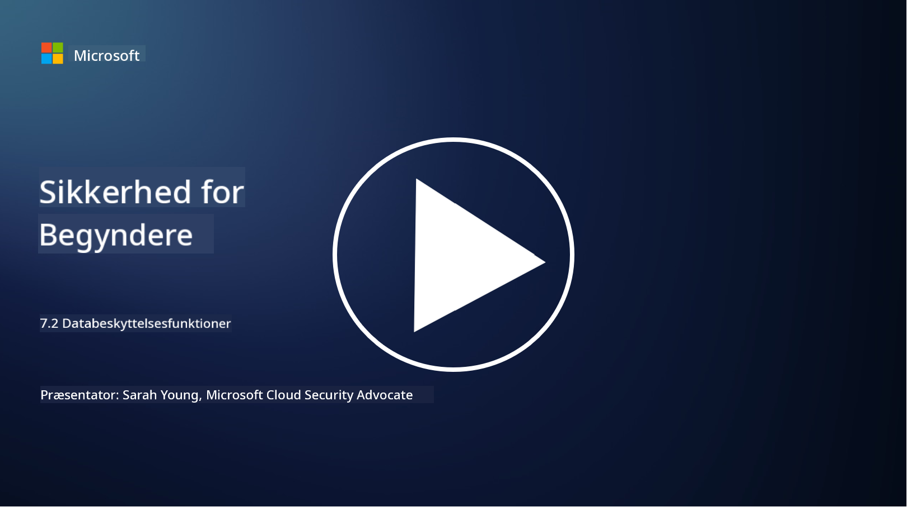

<!--
CO_OP_TRANSLATOR_METADATA:
{
  "original_hash": "50697add9758e54693442d502d2d5f8a",
  "translation_date": "2025-09-03T21:28:40+00:00",
  "source_file": "7.2 Data security capabilities.md",
  "language_code": "da"
}
-->
# Datasikkerhedsfunktioner

I denne sektion vil vi dække flere detaljer om de kerneværktøjer og funktioner, der bruges til datasikkerhed:

**Introduktion**

I denne lektion vil vi gennemgå:

- Hvad er værktøjer til forebyggelse af datatab?

- Hvad er værktøjer til håndtering af interne risici?

- Hvilke værktøjer til dataopbevaring er tilgængelige?

## Hvad er værktøjer til forebyggelse af datatab?

Værktøjer til forebyggelse af datatab (Data Loss Prevention, DLP) refererer til en række softwareløsninger og teknologier designet til at forhindre uautoriseret adgang, deling eller lækage af følsomme eller fortrolige data i en organisation. Disse værktøjer bruger indholdsinspektion, politikhåndhævelse og overvågning til at identificere og beskytte følsomme data mod at blive eksponeret eller misbrugt. Eksempler på DLP-produkter inkluderer: Symantec Data Loss Prevention, McAfee Total Protection for Data Loss Prevention, Microsoft 365 DLP**: Integrerer med Microsoft 365-applikationer for at hjælpe organisationer med at identificere og beskytte følsomme data i e-mails, dokumenter og beskeder.

## Hvad er værktøjer til håndtering af interne risici?

Værktøjer til håndtering af interne risici hjælper organisationer med at identificere og reducere risici forårsaget af medarbejdere, kontraktansatte eller partnere, der bevidst eller ubevidst kan kompromittere datasikkerheden. Disse værktøjer overvåger brugeradfærd, adgangsmønstre og dataanvendelse for at opdage mistænkelige aktiviteter og potentielle interne trusler. Eksempler på produkter til håndtering af interne risici inkluderer: Microsoft Insider Risk Management (en del af Microsoft 365), Forcepoint Insider Threat Data Protection, Varonis Insider Threat Detection.

## Hvilke værktøjer til dataopbevaring er tilgængelige?

Værktøjer til dataopbevaring omfatter software og løsninger designet til at håndtere opbevaring og sletning af data i overensstemmelse med en organisations dataopbevaringspolitikker og juridiske krav. Disse værktøjer hjælper med at automatisere processen med at opbevare data i bestemte perioder og sikkert slette dem, når de ikke længere er nødvendige. Eksempler på produkter til dataopbevaring inkluderer: Veritas Enterprise Vault, Commvault Complete Data Protection, Microsoft data lifecycle management. Disse løsninger hjælper organisationer med at opretholde kontrol over dataopbevaring og -sletning, sikre overholdelse af databeskyttelsesregler og effektivt håndtere data gennem hele deres livscyklus.

## Yderligere læsning

- [Guide til Data Security Posture Management (DSPM) | CSA (cloudsecurityalliance.org)](https://cloudsecurityalliance.org/blog/2023/03/31/the-big-guide-to-data-security-posture-management-dspm/)
- [Forebyggelse af datatab på tværs af enheder, apps og tjenester | Microsoft Purview](https://youtu.be/hvqq8L_0kgI)
- [18 bedste værktøjer til forebyggelse af datatab i 2023 (gratis + betalt) (comparitech.com)](https://www.comparitech.com/data-privacy-management/data-loss-prevention-tools-software/)
- [Forebyggelse af datatab (nist.gov)](https://tsapps.nist.gov/publication/get_pdf.cfm?pub_id=904672)
- [Lær om håndtering af interne risici | Microsoft Learn](https://learn.microsoft.com/purview/insider-risk-management?WT.mc_id=academic-96948-sayoung)
- [Data Lifecycle Management | IBM](https://www.ibm.com/topics/data-lifecycle-management)
- [Hvad er Data Lifecycle Management (DLM)? | 2023 bedste praksis (selecthub.com)](https://www.selecthub.com/big-data-analytics/data-lifecycle-management/)

---

**Ansvarsfraskrivelse**:  
Dette dokument er blevet oversat ved hjælp af AI-oversættelsestjenesten [Co-op Translator](https://github.com/Azure/co-op-translator). Selvom vi bestræber os på nøjagtighed, skal du være opmærksom på, at automatiserede oversættelser kan indeholde fejl eller unøjagtigheder. Det originale dokument på dets oprindelige sprog bør betragtes som den autoritative kilde. For kritisk information anbefales professionel menneskelig oversættelse. Vi er ikke ansvarlige for eventuelle misforståelser eller fejltolkninger, der opstår som følge af brugen af denne oversættelse.