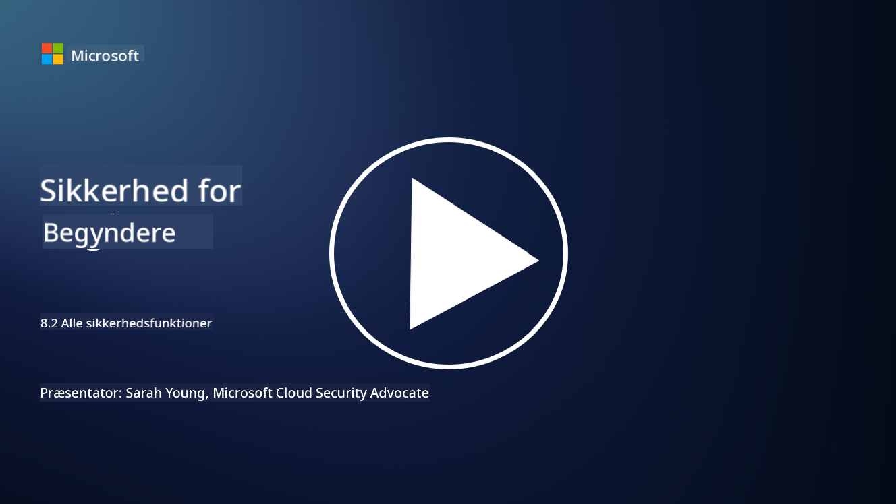

<!--
CO_OP_TRANSLATOR_METADATA:
{
  "original_hash": "b6bb7175672298d1e2f73ba7e0006f95",
  "translation_date": "2025-09-03T21:35:34+00:00",
  "source_file": "8.2 AI security capabilities.md",
  "language_code": "da"
}
-->
# AI-sikkerhedsfunktioner

## Hvilke værktøjer og funktioner har vi i øjeblikket til at sikre AI-systemer?

I øjeblikket findes der flere værktøjer og funktioner til at sikre AI-systemer:

-   **Counterfit**: Et open-source automatiseringsværktøj til sikkerhedstest af AI-systemer, designet til at hjælpe organisationer med at gennemføre AI-sikkerhedsrisikovurderinger og sikre robustheden af deres algoritmer.
-   **Adversarial Machine Learning Tools**: Disse værktøjer evaluerer robustheden af maskinlæringsmodeller mod angreb, hvilket hjælper med at identificere og afhjælpe sårbarheder.
-   **AI-sikkerhedsværktøjssæt**: Der findes open-source værktøjssæt, som tilbyder ressourcer til at sikre AI-systemer, herunder biblioteker og rammer til implementering af sikkerhedsforanstaltninger.
-   **Samarbejdsplatforme**: Partnerskaber mellem virksomheder og AI-fællesskaber for at udvikle AI-specifikke sikkerhedsscannere og andre værktøjer til at sikre AI-forsyningskæden.

Disse værktøjer og funktioner er en del af et voksende felt, der er dedikeret til at forbedre sikkerheden i AI-systemer mod forskellige trusler. De repræsenterer en kombination af forskning, praktiske værktøjer og industrielt samarbejde, der sigter mod at tackle de unikke udfordringer, som AI-teknologier medfører.

## Hvad med AI red teaming? Hvordan adskiller det sig fra traditionel sikkerhedsred teaming?

AI red teaming adskiller sig fra traditionel sikkerhedsred teaming på flere vigtige områder:

-   **Fokus på AI-systemer**: AI red teaming retter sig specifikt mod de unikke sårbarheder i AI-systemer, såsom maskinlæringsmodeller og datapipelines, frem for traditionel IT-infrastruktur.
-   **Test af AI-adfærd**: Det indebærer test af, hvordan AI-systemer reagerer på usædvanlige eller uventede input, hvilket kan afsløre sårbarheder, som angribere kunne udnytte.
-   **Undersøgelse af AI-fejl**: AI red teaming ser både på ondsindede og utilsigtede fejl og overvejer et bredere sæt af personas og potentielle systemfejl ud over blot sikkerhedsbrud.
-   **Prompt Injection og indholdsgenerering**: AI red teaming inkluderer også test for fejl som prompt injection, hvor angribere manipulerer AI-systemer til at generere skadeligt eller ubegrundet indhold.
-   **Etisk og ansvarlig AI**: Det er en del af at sikre ansvarlig AI ved design, så AI-systemer er robuste over for forsøg på at få dem til at opføre sig på utilsigtede måder.

Samlet set er AI red teaming en udvidet praksis, der ikke kun dækker test for sikkerhedssårbarheder, men også inkluderer test for andre typer systemfejl, der er specifikke for AI-teknologier. Det er en vigtig del af udviklingen af sikrere AI-systemer ved at forstå og afhjælpe nye risici forbundet med AI-implementering.

## Yderligere læsning

 - [Microsoft AI Red Team bygger fremtidens sikrere AI | Microsoft Security Blog](https://www.microsoft.com/en-us/security/blog/2023/08/07/microsoft-ai-red-team-building-future-of-safer-ai/?WT.mc_id=academic-96948-sayoung)
 - [Microsoft annoncerer open automation framework til red teaming af generative AI-systemer | Microsoft Security Blog](https://www.microsoft.com/en-us/security/blog/2024/02/22/announcing-microsofts-open-automation-framework-to-red-team-generative-ai-systems/?WT.mc_id=academic-96948-sayoung)
 - [AI-sikkerhedsværktøjer: Det open-source værktøjssæt | Wiz](https://www.wiz.io/academy/ai-security-tools)

---

**Ansvarsfraskrivelse**:  
Dette dokument er blevet oversat ved hjælp af AI-oversættelsestjenesten [Co-op Translator](https://github.com/Azure/co-op-translator). Selvom vi bestræber os på nøjagtighed, skal du være opmærksom på, at automatiserede oversættelser kan indeholde fejl eller unøjagtigheder. Det originale dokument på dets oprindelige sprog bør betragtes som den autoritative kilde. For kritisk information anbefales professionel menneskelig oversættelse. Vi er ikke ansvarlige for eventuelle misforståelser eller fejltolkninger, der opstår som følge af brugen af denne oversættelse.