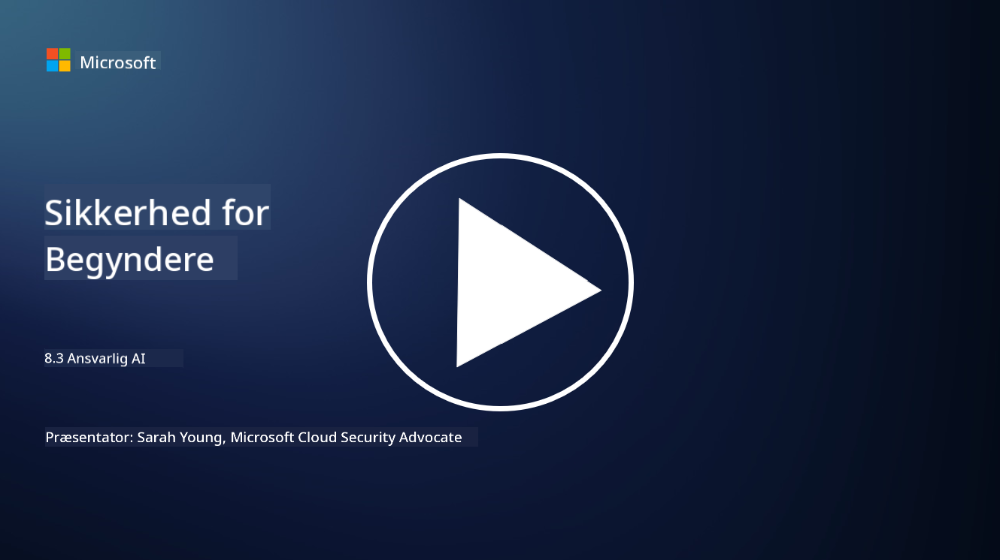

<!--
CO_OP_TRANSLATOR_METADATA:
{
  "original_hash": "5e9775ee91bde7d44577891d5f11c4c5",
  "translation_date": "2025-09-03T20:45:45+00:00",
  "source_file": "8.3 Responsible AI.md",
  "language_code": "da"
}
-->
# Ansvarlig AI

## Hvad er ansvarlig AI, og hvordan relaterer det sig til AI-sikkerhed?

Ansvarlig AI refererer til udviklingen og brugen af kunstig intelligens på en måde, der er etisk, gennemsigtig og i overensstemmelse med samfundets værdier. Det omfatter principper som retfærdighed, ansvarlighed og robusthed, hvilket sikrer, at AI-systemer er designet og opererer til gavn for individer, fællesskaber og samfundet som helhed.

Forholdet mellem ansvarlig AI og AI-sikkerhed er vigtigt, fordi:

-   **Etiske Overvejelser**: Ansvarlig AI indebærer etiske overvejelser, der direkte påvirker sikkerheden, såsom privatliv og databeskyttelse. At sikre, at AI-systemer respekterer brugerens privatliv og beskytter personlige data, er en central del af ansvarlig AI.
-   **Robusthed og Pålidelighed**: AI-systemer skal være robuste over for manipulation og angreb, hvilket er et kerneprincip for både ansvarlig AI og AI-sikkerhed. Dette inkluderer beskyttelse mod fjendtlige angreb og sikring af integriteten i AI’s beslutningsprocesser.
-   **Gennemsigtighed og Forklarbarhed**: En del af ansvarlig AI er at sikre, at AI-systemer er gennemsigtige, og deres beslutninger kan forklares. Dette er afgørende for sikkerheden, da interessenter skal forstå, hvordan AI-systemer fungerer for at kunne stole på deres sikkerhedsforanstaltninger.
-   **Ansvarlighed**: AI-systemer bør være ansvarlige for deres handlinger, hvilket betyder, at der skal være mekanismer til at spore beslutninger og rette eventuelle problemer. Dette stemmer overens med sikkerhedspraksis, der overvåger og reviderer systemaktiviteter for at forhindre og reagere på brud.

Kort sagt er ansvarlig AI og AI-sikkerhed tæt forbundet, hvor ansvarlige AI-principper styrker sikkerheden i AI-systemer og omvendt. Implementering af ansvarlige AI-principper hjælper med at skabe AI-systemer, der ikke kun er etisk forsvarlige, men også mere sikre mod potentielle trusler.

## Hvordan kan jeg sikre, at mit AI-system er både sikkert og etisk?

At sikre, at dit AI-system er både sikkert og etisk, kræver en flerstrenget tilgang, der inkluderer følgende trin:

- **Følg Etiske Principper**: Følg etablerede etiske retningslinjer, der understreger menneskelig, samfundsmæssig og miljømæssig trivsel; retfærdighed; beskyttelse af privatliv; pålidelighed; gennemsigtighed; mulighed for at bestride beslutninger; og ansvarlighed.

- **Implementer Stærke Sikkerhedsforanstaltninger**: Brug proaktive sikkerhedstest og AI-tillids-, risikostyrings- og sikkerhedsprogrammer til at beskytte mod trusler og sårbarheder.

- **Involver Mangfoldige Interessenter**: Inkluder en bred vifte af deltagere i AI-udviklingsprocessen, herunder etikere, samfundsvidenskabsfolk og repræsentanter fra berørte fællesskaber for at sikre, at forskellige perspektiver og værdier bliver taget i betragtning.

- **Sikre Gennemsigtighed og Forklarbarhed**: Sørg for, at AI’s beslutningsprocesser er gennemsigtige og kan forklares, hvilket skaber større tillid og gør det lettere at identificere potentielle bias eller fejl.

- **Beskyt Dataprivacy**: Beskyt privatliv og ægthed af data gennem kryptering og andre databeskyttelsesforanstaltninger for at respektere brugernes privatlivsrettigheder.

- **Muliggør Menneskelig Overvågning**: Implementer mekanismer for menneskelig overvågning, så beslutninger truffet af AI-systemer kan bestrides, og ansvarlighed sikres.

- **Hold Dig Opdateret om AI-sikkerhed**: Følg med i den nyeste forskning og diskussioner om AI-sikkerhed for at forstå det skiftende landskab inden for AI-sikkerhed og etik.

- **Overhold Regler og Love**: Sørg for, at dit AI-system overholder alle relevante love og regler, herunder databeskyttelseslove, antidiskriminationslove og branchespecifikke retningslinjer.

## Kan du give mig nogle eksempler på sikkerhedsproblemer forårsaget af uetisk brug af AI?

Her er nogle eksempler på sikkerhedsproblemer, der kan opstå ved uetisk brug af AI:

- **Bias i Beslutningstagning**: AI-systemer kan videreføre og forstærke eksisterende bias, hvis de er trænet på skæve datasæt. For eksempel kan en søgemaskine, der er trænet på data, der afspejler samfundsmæssige stereotyper, vise skæve søgeresultater, hvilket kan føre til uretfærdig behandling eller diskrimination.

- **AI i Retssystemer**: Brug af AI i juridisk beslutningstagning kan skabe etiske bekymringer, især hvis AI’s beslutningsproces mangler gennemsigtighed eller er påvirket af skæve data. Dette kan resultere i uretfærdige juridiske afgørelser og krænke individers rettigheder.

- **Manipulation af AI-systemer**: AI-systemer kan være sårbare over for fjendtlige angreb, hvor små ændringer i inputdata kan føre til forkerte resultater. For eksempel kan autonome køretøjer blive vildledt til at fejlfortolke trafikskilte, hvilket kan skabe sikkerhedsrisici.

- **AI-drevet Overvågning**: Anvendelse af AI til overvågningsformål kan føre til brud på privatlivets fred, især hvis det bruges uden korrekt samtykke eller på måder, der krænker individuelle friheder. Dette kan være særligt problematisk i autoritære regimer, der kan bruge AI til at overvåge og undertrykke dissens.

Disse eksempler understreger vigtigheden af etiske overvejelser i udviklingen og implementeringen af AI-systemer for at forhindre sikkerhedsproblemer og beskytte individers rettigheder og privatliv.

## Yderligere læsning

 - [Microsoft Responsible AI Standard v2 General Requirements](https://query.prod.cms.rt.microsoft.com/cms/api/am/binary/RE5cmFl?culture=en-us&country=us&WT.mc_id=academic-96948-sayoung)
 - [Responsible AI (mit.edu)](https://sloanreview.mit.edu/big-ideas/responsible-ai/)
 - [13 Principles for Using AI Responsibly (hbr.org)](https://hbr.org/2023/06/13-principles-for-using-ai-responsibly)

---

**Ansvarsfraskrivelse**:  
Dette dokument er blevet oversat ved hjælp af AI-oversættelsestjenesten [Co-op Translator](https://github.com/Azure/co-op-translator). Selvom vi bestræber os på nøjagtighed, skal du være opmærksom på, at automatiserede oversættelser kan indeholde fejl eller unøjagtigheder. Det originale dokument på dets oprindelige sprog bør betragtes som den autoritative kilde. For kritisk information anbefales professionel menneskelig oversættelse. Vi er ikke ansvarlige for eventuelle misforståelser eller fejltolkninger, der opstår som følge af brugen af denne oversættelse.