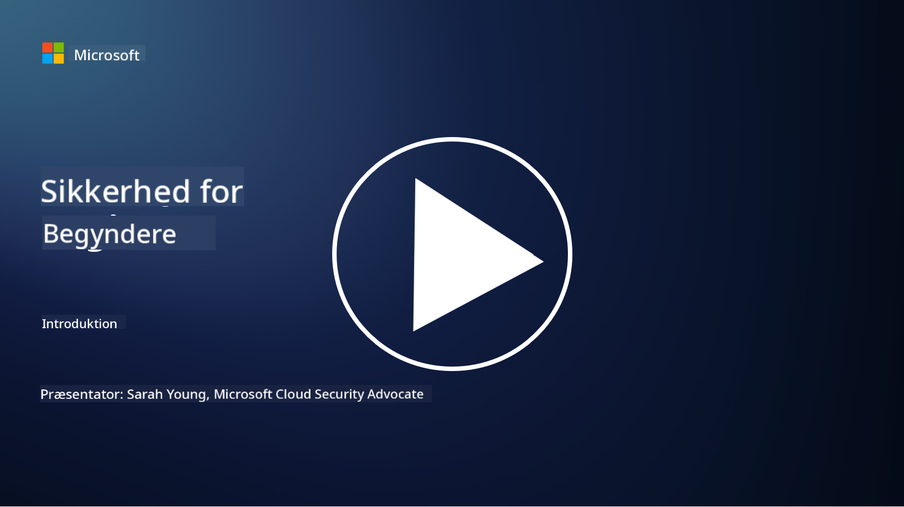

<!--
CO_OP_TRANSLATOR_METADATA:
{
  "original_hash": "fc3d47b5af0cc4fc954ae5d2ea2f7811",
  "translation_date": "2025-10-24T09:08:39+00:00",
  "source_file": "README.md",
  "language_code": "da"
}
-->

### 🌐 Flersproget support

#### Understøttet via GitHub Action (Automatisk & Altid opdateret)

<!-- CO-OP TRANSLATOR LANGUAGES TABLE START -->
[Arabisk](../ar/README.md) | [Bengali](../bn/README.md) | [Bulgarsk](../bg/README.md) | [Burmesisk (Myanmar)](../my/README.md) | [Kinesisk (Forenklet)](../zh/README.md) | [Kinesisk (Traditionelt, Hong Kong)](../hk/README.md) | [Kinesisk (Traditionelt, Macau)](../mo/README.md) | [Kinesisk (Traditionelt, Taiwan)](../tw/README.md) | [Kroatisk](../hr/README.md) | [Tjekkisk](../cs/README.md) | [Dansk](./README.md) | [Hollandsk](../nl/README.md) | [Estisk](../et/README.md) | [Finsk](../fi/README.md) | [Fransk](../fr/README.md) | [Tysk](../de/README.md) | [Græsk](../el/README.md) | [Hebraisk](../he/README.md) | [Hindi](../hi/README.md) | [Ungarsk](../hu/README.md) | [Indonesisk](../id/README.md) | [Italiensk](../it/README.md) | [Japansk](../ja/README.md) | [Koreansk](../ko/README.md) | [Litauisk](../lt/README.md) | [Malaysisk](../ms/README.md) | [Marathi](../mr/README.md) | [Nepalesisk](../ne/README.md) | [Norsk](../no/README.md) | [Persisk (Farsi)](../fa/README.md) | [Polsk](../pl/README.md) | [Portugisisk (Brasilien)](../br/README.md) | [Portugisisk (Portugal)](../pt/README.md) | [Punjabi (Gurmukhi)](../pa/README.md) | [Rumænsk](../ro/README.md) | [Russisk](../ru/README.md) | [Serbisk (Kyrillisk)](../sr/README.md) | [Slovakisk](../sk/README.md) | [Slovensk](../sl/README.md) | [Spansk](../es/README.md) | [Swahili](../sw/README.md) | [Svensk](../sv/README.md) | [Tagalog (Filippinsk)](../tl/README.md) | [Tamil](../ta/README.md) | [Thai](../th/README.md) | [Tyrkisk](../tr/README.md) | [Ukrainsk](../uk/README.md) | [Urdu](../ur/README.md) | [Vietnamesisk](../vi/README.md)
<!-- CO-OP TRANSLATOR LANGUAGES TABLE END -->

**Hvis du ønsker yderligere oversættelser, kan understøttede sprog findes [her](https://github.com/Azure/co-op-translator/blob/main/getting_started/supported-languages.md)**

#### Bliv en del af vores fællesskab 

# 🚀 Cybersikkerhed for begyndere – et pensum

I denne hurtigt skiftende tid med AI-teknologi er det endnu vigtigere at forstå, hvordan man sikrer IT-systemer. Dette kursus er designet til at lære dig grundlæggende cybersikkerhedskoncepter og kickstarte din læring inden for sikkerhed. Det er leverandøruafhængigt og opdelt i små lektioner, der tager omkring 30-60 minutter at gennemføre. Hver lektion indeholder en lille quiz og links til yderligere læsning, hvis du ønsker at dykke dybere ned i emnet.

Hvad dette kursus dækker 📚

- 🔐 Grundlæggende cybersikkerhedskoncepter som CIA-triaden, forskelle mellem risici, trusler osv.
- 🛡️ Forståelse af, hvad en sikkerhedskontrol er, og hvilke former de kan tage.
- 🌐 Forståelse af, hvad zero trust er, og hvorfor det er vigtigt i moderne cybersikkerhed.
- 🔑 Forståelse af nøglekoncepter og temaer inden for identitet, netværk, sikkerhedsoperationer, infrastruktur og datasikkerhed.
- 🔧 Eksempler på værktøjer, der bruges til at implementere sikkerhedskontroller.

Hvad dette kursus ikke dækker 🙅‍♂️

- 🚫 Hvordan man bruger specifikke sikkerhedsværktøjer.
- 🚫 Hvordan man "hacker" eller udfører red teaming/offensiv sikkerhed.
- 🚫 Læring om specifikke overholdelsesstandarder.

Når du har afsluttet dette kursus, kan du gå videre til nogle af vores Microsoft Learn-moduler. Vi anbefaler, at du fortsætter din læring med [Microsoft Security, Compliance, and Identity Fundamentals.](https://learn.microsoft.com/training/paths/describe-concepts-of-security-compliance-identity/?WT.mc_id=academic-96948-sayoung) 

Til sidst kan du overveje at tage [Eksamen SC-900: Microsoft Security, Compliance, and Identity Fundamentals.](https://learn.microsoft.com/credentials/certifications/exams/sc-900/?WT.mc_id=academic-96948-sayoung)

> 💁 Hvis du har feedback eller forslag til dette kursus og indhold, vi mangler, vil vi meget gerne høre fra dig!

## Moduloversigt 📝 
| **Modulnummer** | **Modulnavn**                           | **Lærte koncepter**                  | **Læringsmål**                                                                                          |
|-------------------|-------------------------------------------|--------------------------------------|-----------------------------------------------------------------------------------------------------------------|
| **1.1**           | Grundlæggende sikkerhedskoncepter                   | [CIA-triaden](https://github.com/microsoft/Security-101/blob/main/1.1%20The%20CIA%20triad%20and%20other%20key%20concepts.md)                        | Lær om fortrolighed, tilgængelighed og integritet. Også autenticitet, uafviselighed og privatliv. |
| **1.2**           | Grundlæggende sikkerhedskoncepter                   | [Almindelige cybersikkerhedstrusler](https://github.com/microsoft/Security-101/blob/main/1.2%20Common%20cybersecurity%20threats.md)        | Lær om de almindelige cybersikkerhedstrusler, som individer og organisationer står overfor.                             |
| **1.3**           | Grundlæggende sikkerhedskoncepter                   | [Forståelse af risikostyring](https://github.com/microsoft/Security-101/blob/main/1.3%20Understanding%20risk%20management.md)       | Lær om vurdering og forståelse af risiko – påvirkning/sandsynlighed og implementering af kontroller.                                                                                                               | |
| **1.4**           | Grundlæggende sikkerhedskoncepter                   | [Sikkerhedspraksis og dokumentation](https://github.com/microsoft/Security-101/blob/main/1.4%20Security%20practices%20and%20documentation.md) | Lær om forskellen mellem politikker, procedurer, standarder og reguleringer/love.                         |
| **1.5**           | Grundlæggende sikkerhedskoncepter                   | [Zero trust](https://github.com/microsoft/Security-101/blob/main/1.5%20Zero%20trust.md)                           | Lær om, hvad zero trust er, og hvordan det påvirker arkitekturen. Hvad er forsvar i dybden?                   |
| **1.6**           | Grundlæggende sikkerhedskoncepter                   | [Den delte ansvarsmodel](https://github.com/microsoft/Security-101/blob/main/1.6%20Shared%20responsibility%20model.md)                           | Hvad er den delte ansvarsmodel, og hvordan påvirker den cybersikkerhed?                  |
| **1.7**           | [Slut på modul quiz](https://github.com/microsoft/Security-101/blob/main/1.7%20End%20of%20module%20quiz.md)                        |                                      |                                                                                                                 |
| **2.1**           | Grundlæggende identitets- og adgangsstyring | [IAM nøglekoncepter](https://github.com/microsoft/Security-101/blob/main/2.1%20IAM%20key%20concepts.md)                     | Lær om princippet om mindst privilegium, opdeling af opgaver, hvordan IAM understøtter zero trust.               |
| **2.2**           | Grundlæggende identitets- og adgangsstyring | [IAM zero trust arkitektur](https://github.com/microsoft/Security-101/blob/main/2.2%20IAM%20zero%20trust%20architecture.md)          | Lær om, hvordan identitet er den nye perimeter for moderne IT-miljøer og de trusler, det afhjælper.          |
| **2.3**           | Grundlæggende identitets- og adgangsstyring | [IAM kapaciteter](https://github.com/microsoft/Security-101/blob/main/2.3%20IAM%20capabilities.md)                     | Lær om IAM kapaciteter og kontroller til at sikre identiteter                                                  |
| **2.4**           | [Slut på modul quiz](https://github.com/microsoft/Security-101/blob/main/2.4%20End%20of%20module%20quiz.md)                        |                                      |                                                                                                                 |
| **3.1**           | Grundlæggende netværkssikkerhed             | [Netværksnøglekoncepter](https://github.com/microsoft/Security-101/blob/main/3.1%20Networking%20key%20concepts.md)              | Lær om netværkskoncepter (IP-adressering, portnumre, kryptering osv.)                                 |
| **3.2**           | Grundlæggende netværkssikkerhed             | [Netværk zero trust arkitektur](https://github.com/microsoft/Security-101/blob/main/3.2%20Networking%20zero%20trust%20architecture.md)   | Lær om, hvordan netværk bidrager til en E2E ZT arkitektur og de trusler, det afhjælper.                  |
| **3.3**           | Grundlæggende netværkssikkerhed             | [Netværkssikkerhedskapaciteter](https://github.com/microsoft/Security-101/blob/main/3.3%20Network%20security%20capabilities.md)        | Lær om netværkssikkerhedsværktøjer – firewalls, WAF, DDoS-beskyttelse osv.                                    |
| **3.4**           | [Slut på modul quiz](https://github.com/microsoft/Security-101/blob/main/3.4%20End%20of%20module%20quiz.md)                        |                                      |                                                                                                                 |
| **4.1**           | Grundlæggende sikkerhedsoperationer          | [SecOps nøglekoncepter](https://github.com/microsoft/Security-101/blob/main/4.1%20SecOps%20key%20concepts.md)                  | Lær om, hvorfor sikkerhedsoperationer er vigtige, og hvordan de adskiller sig fra normale IT-driftsteams.                  |
| **4.2**           | Grundlæggende sikkerhedsoperationer          | [SecOps zero trust arkitektur](https://github.com/microsoft/Security-101/blob/main/4.2%20SecOps%20zero%20trust%20architecture.md)       | Lær om, hvordan SecOps bidrager til en E2E ZT arkitektur og de trusler, det afhjælper.                      |
| **4.3**           | Grundlæggende sikkerhedsoperationer          | [SecOps kapaciteter](https://github.com/microsoft/Security-101/blob/main/4.3%20SecOps%20capabilities.md)                  | Lær om SecOps værktøjer – SIEM, XDR osv.                                                                    |
| **4.4**           | [Slut på modul quiz](https://github.com/microsoft/Security-101/blob/main/4.4%20End%20of%20module%20quiz.md)                        |                                      |                                                                                                                 |
| **5.1**           | Grundlæggende applikationssikkerhed         | [AppSec nøglekoncepter](https://github.com/microsoft/Security-101/blob/main/5.1%20AppSec%20key%20concepts.md)                  | Lær om AppSec koncepter som sikkerhed ved design, inputvalidering osv.                                    |
| **5.2**           | Grundlæggende om applikationssikkerhed    | [AppSec kapaciteter](https://github.com/microsoft/Security-101/blob/main/5.2%20AppSec%20key%20capabilities.md)                  | Lær om AppSec-værktøjer: pipeline-sikkerhedsværktøjer, kode-scanning, hemmelighedsscanning osv.                 |
| **5.3**           | [Quiz ved afslutning af modul](https://github.com/microsoft/Security-101/blob/main/5.3%20End%20of%20module%20quiz.md)                        |                                      |                                                                                                                 |
| **6.1**           | Grundlæggende om infrastruktursikkerhed   | [Nøglekoncepter for infrastruktursikkerhed](https://github.com/microsoft/Security-101/blob/main/6.1%20Infrastructure%20security%20key%20concepts.md) | Lær om systemhærdning, opdateringer, sikkerhedshygiejne, containersikkerhed.                                    |
| **6.2**           | Grundlæggende om infrastruktursikkerhed   | [Kapaciteter for infrastruktursikkerhed](https://github.com/microsoft/Security-101/blob/main/6.2%20Infrastructure%20security%20capabilities.md) | Lær om værktøjer, der kan hjælpe med infrastruktursikkerhed, f.eks. CSPM, containersikkerhed osv.               |
| **6.3**           | [Quiz ved afslutning af modul](https://github.com/microsoft/Security-101/blob/main/6.3%20End%20of%20module%20quiz.md)                        |                                      |                                                                                                                 |
| **7.1**           | Grundlæggende om datasikkerhed            | [Nøglekoncepter for datasikkerhed](https://github.com/microsoft/Security-101/blob/main/7.1%20Data%20security%20key%20concepts.md)           | Lær om dataklassificering og opbevaring, og hvorfor dette er vigtigt for en organisation.                       |
| **7.2**           | Grundlæggende om datasikkerhed            | [Kapaciteter for datasikkerhed](https://github.com/microsoft/Security-101/blob/main/7.2%20Data%20security%20capabilities.md)           | Lær om datasikkerhedsværktøjer – DLP, intern risikostyring, datastyring osv.                                    |
| **7.3**           | [Quiz ved afslutning af modul](https://github.com/microsoft/Security-101/blob/main/7.3%20End%20of%20module%20quiz.md)                        |
| **8.1**           | Grundlæggende om AI-sikkerhed             | [Nøglekoncepter for AI-sikkerhed](https://github.com/microsoft/Security-101/blob/main/8.1%20AI%20security%20key%20concepts.md)          | Lær om forskelle og ligheder mellem traditionel sikkerhed og AI-sikkerhed.                                     |
| **8.2**           | Grundlæggende om AI-sikkerhed             | [Kapaciteter for AI-sikkerhed](https://github.com/microsoft/Security-101/blob/main/8.2%20AI%20security%20capabilities.md)           | Lær om AI-sikkerhedsværktøjer og de kontroller, der kan bruges til at sikre AI.                                |
| **8.3**           | Grundlæggende om AI-sikkerhed             | [Ansvarlig AI](https://github.com/microsoft/Security-101/blob/main/8.3%20Responsible%20AI.md)          | Lær om, hvad ansvarlig AI er, og AI-specifikke skader, som sikkerhedsprofessionelle skal være opmærksomme på.   |
| **8.4**           | [Quiz ved afslutning af modul](https://github.com/microsoft/Security-101/blob/main/8.4%20End%20of%20module%20quiz.md)     

## 🎒 Andre kurser 

Vores team producerer andre kurser! Tjek dem ud:

<!-- CO-OP TRANSLATOR OTHER COURSES START -->
### Azure / Edge / MCP / Agenter

---
 
### Generativ AI-serie

[-9333EA?style=for-the-badge&labelColor=E5E7EB&color=9333EA)](https://github.com/microsoft/Generative-AI-for-beginners-dotnet?WT.mc_id=academic-105485-koreyst)
[-C084FC?style=for-the-badge&labelColor=E5E7EB&color=C084FC)](https://github.com/microsoft/generative-ai-for-beginners-java?WT.mc_id=academic-105485-koreyst)
[-E879F9?style=for-the-badge&labelColor=E5E7EB&color=E879F9)](https://github.com/microsoft/generative-ai-with-javascript?WT.mc_id=academic-105485-koreyst)

---
 
### Kerneundervisning

---
 
### Copilot-serie

<!-- CO-OP TRANSLATOR OTHER COURSES END -->

## Få hjælp

Hvis du sidder fast eller har spørgsmål om at bygge AI-apps, så deltag i:

Hvis du har produktfeedback eller oplever fejl under udvikling, besøg:

---

**Ansvarsfraskrivelse**:  
Dette dokument er blevet oversat ved hjælp af AI-oversættelsestjenesten [Co-op Translator](https://github.com/Azure/co-op-translator). Selvom vi bestræber os på nøjagtighed, skal du være opmærksom på, at automatiserede oversættelser kan indeholde fejl eller unøjagtigheder. Det originale dokument på dets oprindelige sprog bør betragtes som den autoritative kilde. For kritisk information anbefales professionel menneskelig oversættelse. Vi er ikke ansvarlige for eventuelle misforståelser eller fejltolkninger, der opstår som følge af brugen af denne oversættelse.