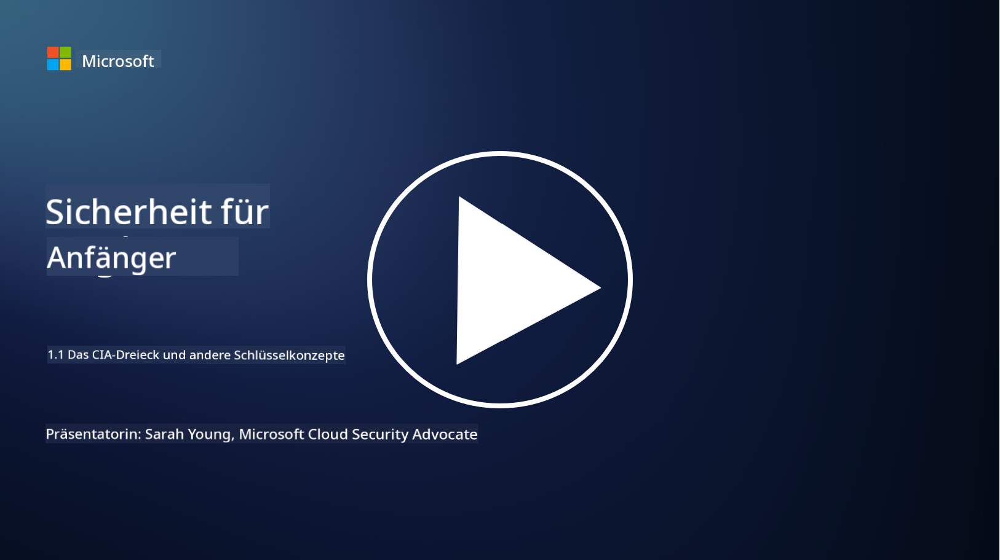
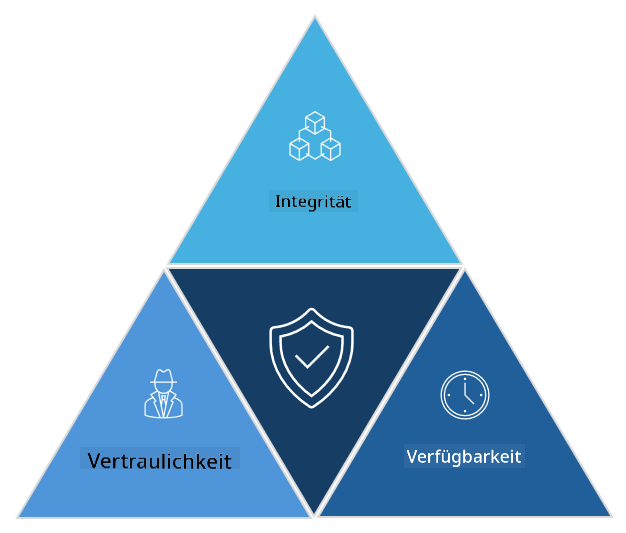

<!--
CO_OP_TRANSLATOR_METADATA:
{
  "original_hash": "16a76f9fa372fb63cffb6d76b855f023",
  "translation_date": "2025-09-03T18:46:30+00:00",
  "source_file": "1.1 The CIA triad and other key concepts.md",
  "language_code": "de"
}
-->
# Die CIA-Triade und andere wichtige Konzepte

## Einführung

In dieser Lektion behandeln wir:

 - Was ist Cybersicherheit?
   
 
 - Was ist die CIA-Triade der Cybersicherheit?

   

 - Was bedeuten Authentizität, Nichtabstreitbarkeit und Datenschutz im Kontext der Cybersicherheit?

## Was ist Cybersicherheit?

Cybersicherheit, auch bekannt als Informationssicherheit, ist die Praxis, Computersysteme, Netzwerke, Geräte und Daten vor digitalen Angriffen, unbefugtem Zugriff, Schäden oder Diebstahl zu schützen. Das Hauptziel der Cybersicherheit ist es, die Vertraulichkeit, Integrität und Verfügbarkeit von digitalen Vermögenswerten und Informationen sicherzustellen. Fachleute für Cybersicherheit entwerfen und implementieren Sicherheitsmaßnahmen, um Vermögenswerte, Daten und Informationen zu schützen. Da immer mehr Aspekte unseres Lebens digitalisiert und online sind, ist Cybersicherheit sowohl für Privatpersonen als auch für Organisationen zu einer zentralen Sorge geworden.

## Was ist die CIA-Triade der Cybersicherheit?

Die CIA-Triade der Cybersicherheit bezieht sich auf ein Modell, das die drei Hauptaspekte jeder Arbeit im Bereich Cybersicherheit oder beim Entwerfen eines Systems/Umfelds umfasst:

### Vertraulichkeit

Dies ist der Aspekt, den die meisten Menschen mit „Cybersicherheit“ verbinden: Vertraulichkeit ist der Prozess, Daten und Informationen vor unbefugten Zugriffsversuchen zu schützen, d.h. nur Personen, die die Informationen benötigen, können darauf zugreifen. Allerdings sind nicht alle Daten gleich, und Daten werden normalerweise kategorisiert und geschützt, basierend darauf, wie viel Schaden entstehen würde, wenn sie in die falschen Hände geraten.

### Integrität

Bezieht sich auf den Schutz der Genauigkeit und Vertrauenswürdigkeit von Daten innerhalb von Umgebungen und darauf, dass die Daten nicht von unbefugten Personen verändert oder manipuliert werden. Beispiel: Ein Student ändert sein Geburtsdatum in den Führerscheinunterlagen beim DMV, um älter zu erscheinen, damit er seinen Führerschein mit einem früheren Geburtsdatum neu ausstellen lassen kann, um Alkohol zu kaufen.

### Verfügbarkeit

Dies ist ein Aspekt, der in der operativen IT wichtig ist, aber auch für die Cybersicherheit von Bedeutung ist. Es gibt spezielle Arten von Angriffen, die auf die Verfügbarkeit abzielen und gegen die Sicherheitsfachleute Schutzmaßnahmen ergreifen müssen (z.B. Distributed Denial of Service – DDoS – Angriffe).

**CIA-Triade der Cybersicherheit**

## Was bedeuten Authentizität, Nichtabstreitbarkeit und Datenschutz im Kontext der Cybersicherheit?

Dies sind weitere wichtige Konzepte, die sich auf die Sicherstellung der Sicherheit und Vertrauenswürdigkeit von Systemen und Daten beziehen:

**Authentizität** - bezieht sich auf die Gewissheit, dass die Informationen, die Kommunikation oder die Entität, mit der Sie interagieren, echt sind und nicht von unbefugten Parteien manipuliert oder verändert wurden.

**Nichtabstreitbarkeit** - ist das Konzept, sicherzustellen, dass eine Partei ihre Beteiligung oder die Echtheit einer Transaktion oder Kommunikation nicht abstreiten kann. Es verhindert, dass jemand behauptet, er habe keine Nachricht gesendet oder keine bestimmte Aktion ausgeführt, wenn es Beweise dafür gibt.

**Datenschutz** - bezieht sich auf den Schutz sensibler und persönlich identifizierbarer Informationen vor unbefugtem Zugriff, Nutzung, Offenlegung oder Manipulation. Es geht darum, zu kontrollieren, wer Zugang zu persönlichen Daten hat und wie diese Daten gesammelt, gespeichert und weitergegeben werden.

## Weiterführende Literatur

[Was ist Informationssicherheit (InfoSec)? | Microsoft Security](https://www.microsoft.com/security/business/security-101/what-is-information-security-infosec#:~:text=Three%20pillars%20of%20information%20security%3A%20the%20CIA%20triad,as%20guiding%20principles%20for%20implementing%20an%20InfoSec%20plan.)

---

**Haftungsausschluss**:  
Dieses Dokument wurde mit dem KI-Übersetzungsdienst [Co-op Translator](https://github.com/Azure/co-op-translator) übersetzt. Obwohl wir uns um Genauigkeit bemühen, beachten Sie bitte, dass automatisierte Übersetzungen Fehler oder Ungenauigkeiten enthalten können. Das Originaldokument in seiner ursprünglichen Sprache sollte als maßgebliche Quelle betrachtet werden. Für kritische Informationen wird eine professionelle menschliche Übersetzung empfohlen. Wir übernehmen keine Haftung für Missverständnisse oder Fehlinterpretationen, die sich aus der Nutzung dieser Übersetzung ergeben.