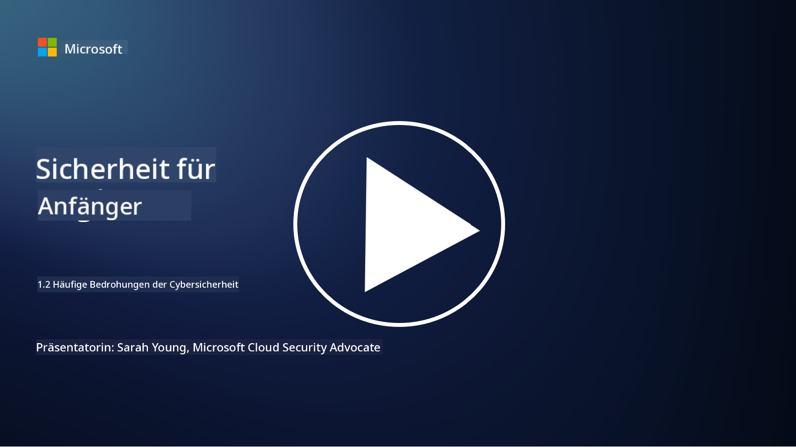

<!--
CO_OP_TRANSLATOR_METADATA:
{
  "original_hash": "6fc3030323139d7134a4ca9d03eccac9",
  "translation_date": "2025-09-03T18:15:32+00:00",
  "source_file": "1.2 Common cybersecurity threats.md",
  "language_code": "de"
}
-->
# Häufige Bedrohungen der Cybersicherheit

## Einführung

In dieser Lektion behandeln wir:

- Was ist eine Bedrohung der Cybersicherheit?

- Warum wollen böswillige Akteure Daten und IT-Systeme kompromittieren?

- Was sind die häufigsten Arten von Bedrohungen der Cybersicherheit?

- Was ist das MITRE ATT&CK-Framework?

- Wo kann ich mich über die Bedrohungslandschaft der Cybersicherheit auf dem Laufenden halten?

## Was ist eine Bedrohung der Cybersicherheit?

Eine Bedrohung der Cybersicherheit bezieht sich auf jede potenzielle Gefahr oder jedes Risiko, das die Vertraulichkeit, Integrität oder Verfügbarkeit von Daten oder IT-Systemen gefährden könnte. Diese Bedrohungen gehen von böswilligen Akteuren aus, die versuchen, Schwachstellen auszunutzen, um unbefugten Zugriff zu erlangen, sensible Informationen zu stehlen, Abläufe zu stören oder Schaden für Einzelpersonen, Organisationen oder sogar ganze Nationen zu verursachen. Bedrohungen der Cybersicherheit können verschiedene Formen annehmen und unterschiedliche Aspekte digitaler Systeme und Daten ins Visier nehmen.

## Warum wollen böswillige Akteure Daten und IT-Systeme kompromittieren?

Böswillige Akteure kompromittieren Daten und IT-Systeme aus verschiedenen Gründen, die oft von persönlichem Gewinn, ideologischen Motiven oder dem Wunsch nach Störung getrieben sind. Das Verständnis dieser Motivationen kann Organisationen und Einzelpersonen helfen, sich besser gegen Cyberbedrohungen zu verteidigen. Einige häufige Gründe, warum böswillige Akteure Cyberangriffe durchführen, sind:

1. **Finanzieller Gewinn**: Viele Angriffe werden durch das Streben nach finanziellem Profit motiviert. Böswillige Akteure können sensible Informationen wie Kreditkartennummern, Bankkontodaten oder persönliche Identifikationsinformationen stehlen, um Betrug, Identitätsdiebstahl zu begehen, Lösegeld zu fordern oder die gestohlenen Daten im Dark Web zu verkaufen.

2. **Spionage**: Staaten, Wettbewerber oder andere Akteure können Cyber-Spionage betreiben, um sensible Regierungs-, Unternehmens- oder Forschungsdaten für politische, wirtschaftliche oder militärische Vorteile zu stehlen.

3. **Störung und Sabotage**: Einige Angriffe zielen darauf ab, kritische Infrastrukturen, Dienstleistungen oder Abläufe aus politischen oder ideologischen Gründen zu stören. Diese Angriffe können weitreichendes Chaos, finanzielle Verluste und Rufschäden verursachen.

4. **Ideologische Motivationen**: Hacktivisten und Gruppen mit ideologischen oder politischen Motiven können Systeme kompromittieren, um auf bestimmte Themen aufmerksam zu machen, ihre Überzeugungen zu fördern oder gegen bestimmte Aktionen oder Organisationen zu protestieren.

5. **Unbeabsichtigte Handlungen**: Nicht alle böswilligen Handlungen sind absichtlich; einige Personen können unwissentlich zu Cyberbedrohungen beitragen, indem sie Opfer von Social Engineering werden oder Teil eines kompromittierten Netzwerks sind.

Letztendlich können die Motivationen für die Kompromittierung von Daten und IT-Systemen stark variieren, und die Auswirkungen dieser Angriffe können schwerwiegend sein. Es ist wichtig, dass Einzelpersonen, Organisationen und Regierungen Cybersicherheit ernst nehmen und Maßnahmen ergreifen, um sich gegen diese Bedrohungen zu schützen.

## Was sind die häufigsten Arten von Bedrohungen der Cybersicherheit?

Es gibt mehrere häufige Arten von Cyberangriffen, die böswillige Akteure nutzen, um Systeme zu kompromittieren, Daten zu stehlen und Störungen zu verursachen. Hier sind einige der am weitesten verbreiteten Arten zum Zeitpunkt der Erstellung dieses Textes:

1. **Phishing**:

Phishing beinhaltet das Versenden täuschender E-Mails oder Nachrichten, die von legitimen Quellen zu stammen scheinen, um Empfänger dazu zu bringen, sensible Informationen wie Passwörter, Kreditkartennummern oder persönliche Daten preiszugeben. Phishing kann Opfer auch auf bösartige Websites führen oder dazu bringen, Malware herunterzuladen.

2. **Malware**:

Malware (bösartige Software) umfasst eine Reihe von schädlichen Programmen, die darauf abzielen, Systeme zu infizieren, Daten zu stehlen oder Schaden zu verursachen. Arten von Malware umfassen:

- **Ransomware**: Verschlüsselt Dateien und fordert ein Lösegeld für die Entschlüsselung.

- **Trojans**: Als legitime Software getarnt, gewähren sie Angreifern unbefugten Zugriff.

- **Viren**: Selbstreplizierende Programme, die sich an Dateien anhängen und verbreiten.

- **Würmer**: Selbstreplizierende Programme, die sich über Netzwerke verbreiten.

3. **Denial of Service (DoS) und Distributed Denial of Service (DDoS)**:

DoS-Angriffe überlasten ein Zielsystem, sodass es für Benutzer nicht verfügbar ist. DDoS-Angriffe nutzen ein Netzwerk kompromittierter Geräte, um ein Ziel mit Traffic zu überfluten, wodurch das System nicht mehr ordnungsgemäß funktioniert oder vollständig ausfällt.

4. **SQL-Injection**:

Bei diesem Angriff manipulieren Angreifer Eingabefelder einer Webanwendung, um bösartige SQL-Abfragen einzuschleusen, wodurch sie möglicherweise unbefugten Zugriff auf Datenbanken und sensible Daten erhalten.

5. **Cross-Site Scripting (XSS)**:

Angreifer schleusen bösartige Skripte in Webanwendungen ein, die dann von den Browsern ahnungsloser Benutzer ausgeführt werden. Dies kann zum Diebstahl von Benutzerdaten und/oder zur Verbreitung von Malware führen.

6. **Social Engineering**:

Social Engineering nutzt menschliche Psychologie aus, um Einzelpersonen dazu zu bringen, vertrauliche Informationen preiszugeben oder Aktionen auszuführen, die die Sicherheit gefährden.

7. **Zero-Day (0day) Exploits**:

Diese Angriffe zielen auf Schwachstellen in Software oder Hardware ab, die dem Anbieter oder der Öffentlichkeit noch nicht bekannt sind. Angreifer nutzen diese Schwachstellen aus, bevor Patches entwickelt werden. Viele Organisationen sorgen sich um Zero-Days, da es keine Patches dafür gibt, aber sie sind nicht so häufig wie die anderen Angriffe auf dieser Liste. Sobald ein Zero-Day entdeckt wird, arbeiten Sicherheitsforscher schnell an einem Patch, und daher sind Zero-Days in der Regel von kurzer Dauer.

8. **Credential-Angriffe**:

Diese Angriffe umfassen Brute-Force-Angriffe, bei denen Angreifer wiederholt Passwörter erraten, und Credential-Stuffing-Angriffe, bei denen gestohlene Zugangsdaten von einer Website verwendet werden, um auf andere Websites zuzugreifen.

## Was ist das MITRE ATT&CK-Framework?

Das [MITRE ATT&CK-Framework](https://attack.mitre.org/) (Adversarial Tactics, Techniques, and Common Knowledge) ist ein Framework, das die Taktiken, Techniken und Verfahren (TTPs) katalogisiert und kategorisiert, die Gegner bei Cyberangriffen verwenden. Das Framework wurde von der MITRE Corporation erstellt, einer gemeinnützigen Organisation, die Forschungs- und Entwicklungszentren für verschiedene Regierungsbehörden betreibt.

Das MITRE ATT&CK-Framework bietet eine standardisierte Möglichkeit, Cyberbedrohungen zu beschreiben und zu analysieren, sodass Cybersicherheitsexperten besser verstehen und sich gegen verschiedene Angriffstechniken verteidigen können. Es wird von Sicherheitsteams, Threat Huntern und Incident Respondern häufig verwendet, um:

1. **Verhalten von Gegnern verstehen**: Das Framework dokumentiert reale Angriffsverhalten und beschreibt die Schritte, die Angreifer von der ersten Eindringung bis zur Erreichung ihrer Ziele unternehmen. Es deckt eine breite Palette von Angriffstechniken ab, die von verschiedenen Bedrohungsgruppen verwendet werden.

2. **Verteidigungsstrategien planen und umsetzen**: Sicherheitsteams können das Framework nutzen, um proaktive Verteidigungsstrategien zu entwickeln, die sich an den spezifischen Taktiken und Techniken orientieren, die Gegner möglicherweise einsetzen.

3. **Vorfallreaktion und Threat Hunting**: Bei der Untersuchung von Vorfällen oder der Durchführung von Threat Hunting können Sicherheitsexperten auf das Framework zurückgreifen, um spezifische Techniken von Angreifern zu identifizieren und zu entschärfen.

Das MITRE ATT&CK-Framework ist in Matrizen organisiert, die Angriffstechniken basierend auf spezifischen Plattformen und Umgebungen wie Windows, macOS, Linux und Cloud-Diensten gruppieren. Jede Matrix ist in Taktiken (hochrangige Ziele) und Techniken (spezifische Methoden zur Erreichung dieser Ziele) unterteilt. Für jede Technik bietet das Framework Informationen darüber, wie sie funktioniert, mögliche Gegenmaßnahmen und relevante Referenzen zu realen Bedrohungsakteuren, die die Technik verwendet haben.

Das Framework wird kontinuierlich aktualisiert und erweitert, wenn neue Bedrohungsinformationen gesammelt werden und sich die Cybersicherheitslandschaft weiterentwickelt. Es ist eine wertvolle Ressource zur Verbesserung der Cybersicherheitslage einer Organisation, da es ein tieferes Verständnis darüber ermöglicht, wie Angreifer vorgehen und wie man sich gegen ihre Taktiken verteidigen kann.

## Wo kann ich mich über die Bedrohungslandschaft der Cybersicherheit auf dem Laufenden halten?

Es gibt viele Quellen, die genutzt werden können, um sich über Cyberbedrohungen auf dem Laufenden zu halten. Hier sind einige ausgewählte:

- [Open Web Application Security Project (OWASP) Top 10 Schwachstellen](https://owasp.org/Top10/)
- [Common Vulnerabilities and Exposures (CVEs)](https://www.bing.com/ck/a?!&&p=53df6007f017bca2JmltdHM9MTY5MjU3NjAwMCZpZ3VpZD0zYmY4N2RiYS1jYWI1LTYwMDgtMWY1YS02ZmYyY2JjNjYxZWUmaW5zaWQ9NTc2OQ&ptn=3&hsh=3&fclid=3bf87dba-cab5-6008-1f5a-6ff2cbc661ee&psq=cve&u=a1aHR0cHM6Ly9iaW5nLmNvbS9hbGluay9saW5rP3VybD1odHRwcyUzYSUyZiUyZmN2ZS5taXRyZS5vcmclMmYmc291cmNlPXNlcnAtcnImaD1BZXN4S0VBWTNnbGhNZEFpd3daMlNSZkZQNTlrODhIUnYxRUtlSkY1RTk0JTNkJnA9a2NvZmZjaWFsd2Vic2l0ZQ&ntb=1 "Common Vulnerabilities and Exposures")
- [Microsoft Security Response Center Blogs](https://msrc.microsoft.com/blog/)
- [National Institute of Standards and Technology (NIST)](https://www.dhs.gov/topics/cybersecurity): NIST bietet Ressourcen, Warnungen und aktuelle Updates zu potenziellen Cyberbedrohungen.
- [Cybersecurity and Infrastructure Security Agency (CISA)](https://www.cisa.gov/resources-tools/resources/free-cybersecurity-services-and-tools): CISA bietet Cybersicherheitsressourcen und bewährte Verfahren für Unternehmen, Regierungsbehörden und andere Organisationen. CISA teilt aktuelle Informationen über hochwirksame Sicherheitsaktivitäten, die die Gemeinschaft betreffen, sowie detaillierte Analysen zu neuen und sich entwickelnden Cyberbedrohungen.
- [National Cybersecurity Center of Excellence (NCCoE)](https://www.dhs.gov/topics/cybersecurity): NCCoE ist ein Zentrum, das praktische Cybersicherheitslösungen bietet, die in realen Situationen angewendet werden können.
- [US-CERT](https://www.cisa.gov/resources-tools/resources/free-cybersecurity-services-and-tools): Das United States Computer Emergency Readiness Team (US-CERT) bietet eine Vielzahl von Cybersicherheitsressourcen, darunter Warnungen, Tipps und mehr.
- Das Cyber Emergency Response Team (CERT) Ihres Landes

---

**Haftungsausschluss**:  
Dieses Dokument wurde mit dem KI-Übersetzungsdienst [Co-op Translator](https://github.com/Azure/co-op-translator) übersetzt. Obwohl wir uns um Genauigkeit bemühen, beachten Sie bitte, dass automatisierte Übersetzungen Fehler oder Ungenauigkeiten enthalten können. Das Originaldokument in seiner ursprünglichen Sprache sollte als maßgebliche Quelle betrachtet werden. Für kritische Informationen wird eine professionelle menschliche Übersetzung empfohlen. Wir übernehmen keine Haftung für Missverständnisse oder Fehlinterpretationen, die sich aus der Nutzung dieser Übersetzung ergeben.