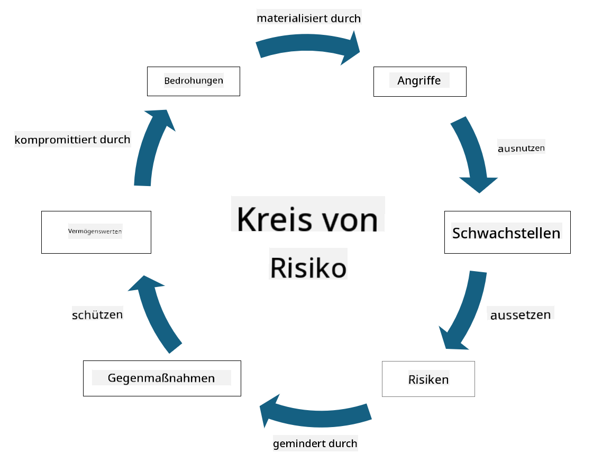

<!--
CO_OP_TRANSLATOR_METADATA:
{
  "original_hash": "fcca304f072cabf206388199e8e2e578",
  "translation_date": "2025-09-03T18:51:12+00:00",
  "source_file": "1.3 Understanding risk management.md",
  "language_code": "de"
}
-->
# Verständnis des Risikomanagements

## Einführung

In dieser Lektion behandeln wir:

- Definitionen häufig verwendeter Sicherheitsbegriffe

- Arten von Sicherheitsmaßnahmen

- Bewertung von Sicherheitsrisiken

## Definitionen häufig verwendeter Sicherheitsbegriffe

Diese Begriffe sind grundlegende Konzepte im Bereich der Cybersicherheit und des Risikomanagements. Lassen Sie uns jeden Begriff und seine Beziehung zueinander genauer betrachten:

1. **Bedrohungsakteur**:

Ein Bedrohungsakteur ist eine Einzelperson, Gruppe, Organisation oder ein automatisiertes System, das die Fähigkeit besitzt, Schwachstellen in einem System oder Netzwerk auszunutzen, um Schaden oder Schäden zu verursachen. Bedrohungsakteure können Hacker, Malware-Autoren, unzufriedene Mitarbeiter oder jede Entität sein, die ein Risiko für Informations- und Technologiesysteme darstellt.

2. **Bedrohung**:

Eine Bedrohung ist ein potenzielles Ereignis oder eine Handlung, die Schwachstellen in einem System ausnutzen und einem Vermögenswert Schaden zufügen kann. Bedrohungen können Aktionen wie Hacking, Datenlecks, Denial-of-Service-Angriffe und mehr umfassen. Bedrohungen sind das „Was“ in Bezug auf potenziellen Schaden, der einem Vermögenswert einer Organisation zugefügt werden kann.

3. **Schwachstelle**:

Eine Schwachstelle ist eine Schwäche oder ein Fehler im Design, in der Implementierung oder Konfiguration eines Systems, die von einem Bedrohungsakteur ausgenutzt werden kann, um die Sicherheit des Systems zu gefährden. Schwachstellen können in Software, Hardware, Prozessen oder menschlichem Verhalten existieren. Das Identifizieren und Beheben von Schwachstellen ist entscheidend, um das Risiko erfolgreicher Angriffe zu minimieren.

4. **Risiko**:

Risiko ist das Potenzial für Verlust, Schaden oder Beeinträchtigung, das sich aus der Interaktion zwischen einer Bedrohung und einer Schwachstelle ergibt. Es ist die Wahrscheinlichkeit, dass ein Bedrohungsakteur eine Schwachstelle ausnutzt, um eine negative Auswirkung zu verursachen. Risiken werden oft in Bezug auf ihre potenziellen Auswirkungen und die Wahrscheinlichkeit ihres Auftretens bewertet.

5. **Vermögenswert**:

Ein Vermögenswert ist alles von Wert, das eine Organisation schützen möchte. Vermögenswerte können physische Objekte (wie Computer und Server), Daten (Kundeninformationen, Finanzunterlagen), geistiges Eigentum (Geschäftsgeheimnisse, Patente) und sogar menschliche Ressourcen (Fähigkeiten und Wissen der Mitarbeiter) umfassen. Der Schutz von Vermögenswerten ist ein Hauptziel der Cybersicherheit.

6. **Exposition**:

Exposition bezieht sich auf den Zustand, anfällig für potenzielle Bedrohungen zu sein. Sie tritt auf, wenn eine Schwachstelle existiert, die von einem Bedrohungsakteur ausgenutzt werden könnte. Exposition hebt das Risiko hervor, das mit dem Vorhandensein von Schwachstellen in einem System oder Netzwerk verbunden ist.

7. **Maßnahme**:

Eine Maßnahme ist eine Vorkehrung, die getroffen wird, um das Risiko im Zusammenhang mit Schwachstellen und Bedrohungen zu reduzieren. Maßnahmen können technischer, prozeduraler oder administrativer Natur sein. Sie sind darauf ausgelegt, potenzielle Bedrohungen und Schwachstellen zu verhindern, zu erkennen oder zu mindern. Beispiele sind Firewalls, Zugriffskontrollen, Verschlüsselung, Sicherheitsrichtlinien und Mitarbeiterschulungen.

Zusammenfassend lässt sich sagen, dass Bedrohungsakteure Schwachstellen ausnutzen, um Bedrohungen auszuführen, die zu Risiken führen können, die wertvollen Vermögenswerten Schaden zufügen. Exposition tritt auf, wenn Schwachstellen vorhanden sind, und Maßnahmen werden ergriffen, um das Risiko zu reduzieren, indem die Auswirkungen von Bedrohungen auf Vermögenswerte verhindert oder gemindert werden. Dieses Rahmenwerk bildet die Grundlage des Risikomanagements in der Cybersicherheit und hilft Organisationen, potenzielle Risiken für ihre Informationssysteme und Vermögenswerte zu identifizieren, zu bewerten und zu adressieren.

## Arten von Sicherheitsmaßnahmen

Sicherheitsmaßnahmen sind Vorkehrungen oder Schutzmaßnahmen, die implementiert werden, um Informationssysteme und Vermögenswerte vor verschiedenen Bedrohungen und Schwachstellen zu schützen. Sie können basierend auf ihrem Fokus und Zweck in verschiedene Kategorien eingeteilt werden. Hier sind einige gängige Arten von Sicherheitsmaßnahmen:

1. **Administrative Maßnahmen**:

Diese Maßnahmen beziehen sich auf Richtlinien, Verfahren und Leitlinien, die die Sicherheitspraktiken und das Benutzerverhalten der Organisation regeln.

- Sicherheitsrichtlinien und -verfahren: Dokumentierte Leitlinien, die definieren, wie Sicherheit innerhalb einer Organisation aufrechterhalten wird.

- Sicherheitsbewusstsein und Schulungen: Programme zur Sensibilisierung der Mitarbeiter für Sicherheitsbestpraktiken und potenzielle Bedrohungen.

- Vorfallreaktion und -management: Pläne zur Reaktion auf und Minderung von Sicherheitsvorfällen.

2. **Technische Maßnahmen**:

Technische Maßnahmen beinhalten den Einsatz von Technologie, um Sicherheitsvorkehrungen durchzusetzen und Systeme sowie Daten zu schützen. Beispiele für technische Maßnahmen sind:

- Zugriffskontrollen: Maßnahmen, die den Zugriff von Benutzern auf Ressourcen basierend auf ihren Rollen und Berechtigungen einschränken.

- Verschlüsselung: Umwandlung von Daten in ein sicheres Format, um unbefugten Zugriff zu verhindern.

- Firewalls: Netzwerksicherheitsgeräte, die eingehenden und ausgehenden Datenverkehr filtern und kontrollieren.

- Systeme zur Erkennung und Verhinderung von Eindringlingen (IDPS): Werkzeuge, die den Netzwerkverkehr auf verdächtige Aktivitäten überwachen.

- Antivirus- und Antimalware-Software: Programme, die bösartige Software erkennen und entfernen.

- Authentifizierungsmechanismen: Methoden zur Überprüfung der Identität von Benutzern, wie Passwörter, biometrische Daten und Multi-Faktor-Authentifizierung.

- Patch-Management: Regelmäßige Aktualisierung von Software, um bekannte Schwachstellen zu beheben.

3. **Physische Maßnahmen**:

Physische Maßnahmen sind Vorkehrungen zum Schutz physischer Vermögenswerte und Einrichtungen.

- Sicherheitskräfte und Zugangskontrollpersonal: Personal, das den Zugang zu physischen Räumlichkeiten überwacht und kontrolliert.

- Überwachungskameras: Videoüberwachungssysteme zur Überwachung und Aufzeichnung von Aktivitäten.

- Schlösser und physische Barrieren: Physische Maßnahmen zur Einschränkung des Zugangs zu sensiblen Bereichen.

- Umweltkontrollen: Maßnahmen zur Regulierung von Temperatur, Luftfeuchtigkeit und anderen Umweltfaktoren, die Geräte und Rechenzentren beeinflussen.

4. **Betriebliche Maßnahmen**:

Diese Maßnahmen beziehen sich auf tägliche Abläufe und Aktivitäten, die die kontinuierliche Sicherheit von Systemen gewährleisten.

- Änderungsmanagement: Prozesse zur Nachverfolgung und Genehmigung von Änderungen an Systemen und Konfigurationen.

- Backup und Notfallwiederherstellung: Pläne zur Sicherung und Wiederherstellung von Daten im Falle von Systemausfällen oder Katastrophen.

- Protokollierung und Prüfung: Überwachung und Aufzeichnung von Systemaktivitäten für Sicherheits- und Compliance-Zwecke.

- Sichere Programmierpraktiken: Leitlinien für das Schreiben von Software, um Schwachstellen zu minimieren.

5. **Rechtliche und regulatorische Maßnahmen**:

Diese Maßnahmen gewährleisten die Einhaltung relevanter Gesetze, Vorschriften und Branchenstandards. Die Standards, die eine Organisation einhalten muss, hängen von der Gerichtsbarkeit, der Branche und anderen Faktoren ab.

- Datenschutzvorschriften: Einhaltung von Gesetzen wie DSGVO, HIPAA und CCPA.

- Branchenspezifische Standards: Einhaltung von Standards wie PCI DSS für die Sicherheit von Zahlungskartendaten.

Diese Kategorien von Sicherheitsmaßnahmen arbeiten zusammen, um eine umfassende Sicherheitsstrategie für Organisationen zu schaffen, die ihre Systeme, Daten und Vermögenswerte vor einer Vielzahl von Bedrohungen schützt.

## Bewertung von Sicherheitsrisiken

Einige Sicherheitsexperten sind der Meinung, dass das Risikomanagement ausschließlich den Risikomanagement-Experten überlassen werden sollte. Dennoch ist es wichtig, dass jeder Sicherheitsexperte den Prozess des Sicherheitsrisikomanagements versteht, um Sicherheitsrisiken in einer Sprache auszudrücken, die der Rest der Organisation verstehen und darauf reagieren kann.

Organisationen müssen Sicherheitsrisiken ständig bewerten und entscheiden, welche Maßnahmen (oder keine) gegen Risiken für das Unternehmen ergriffen werden sollen. Im Folgenden finden Sie eine Übersicht darüber, wie dies typischerweise durchgeführt wird. Beachten Sie, dass dieser Prozess normalerweise von mehreren Teams innerhalb einer Organisation durchgeführt wird. Es ist selten, dass ein Team für das gesamte Risikomanagement verantwortlich ist.

1. **Identifizierung von Vermögenswerten und Bedrohungen**:

Die Organisation identifiziert die Vermögenswerte, die sie schützen möchte. Dazu können Daten, Systeme, Hardware, Software, geistiges Eigentum und mehr gehören. Anschließend werden potenzielle Bedrohungen identifiziert, die diese Vermögenswerte angreifen könnten.

2. **Bewertung von Schwachstellen**:

Organisationen identifizieren Schwachstellen oder Schwächen in Systemen oder Prozessen, die von Bedrohungen ausgenutzt werden könnten. Diese Schwachstellen können aus Softwarefehlern, Fehlkonfigurationen, fehlenden Sicherheitsmaßnahmen und menschlichen Fehlern resultieren.

3. **Wahrscheinlichkeitsbewertung**:

Die Organisation bewertet die Wahrscheinlichkeit des Auftretens jeder Bedrohung. Dies umfasst die Berücksichtigung historischer Daten, Bedrohungsinformationen, Branchentrends und interner Faktoren. Die Wahrscheinlichkeit kann als niedrig, mittel oder hoch eingestuft werden, basierend auf der Wahrscheinlichkeit, dass die Bedrohung eintritt.

4. **Auswirkungsbewertung**:

Anschließend bestimmt die Organisation die potenziellen Auswirkungen jeder Bedrohung, wenn sie eine Schwachstelle ausnutzen würde. Auswirkungen können finanzielle Verluste, Betriebsstörungen, Reputationsschäden, rechtliche Konsequenzen und mehr umfassen. Die Auswirkungen können ebenfalls als niedrig, mittel oder hoch eingestuft werden, basierend auf den potenziellen Konsequenzen.

5. **Risikoberechnung**:

Die Wahrscheinlichkeits- und Auswirkungsbewertungen werden kombiniert, um das Gesamtrisikoniveau für jede identifizierte Bedrohung zu berechnen. Dies wird häufig mit einer Risikomatrix durchgeführt, die numerische Werte oder qualitative Beschreibungen für Wahrscheinlichkeits- und Auswirkungsstufen zuweist. Das resultierende Risikoniveau hilft dabei, zu priorisieren, welche Risiken sofortige Aufmerksamkeit erfordern.

6. **Priorisierung und Entscheidungsfindung**:

Die Organisation priorisiert Risiken, indem sie sich auf diejenigen mit den höchsten kombinierten Wahrscheinlichkeits- und Auswirkungswerten konzentriert. Dies ermöglicht eine effektivere Ressourcenzuweisung und Implementierung von Maßnahmen. Hochrisikobedrohungen erfordern sofortige Aufmerksamkeit, während Bedrohungen mit geringerem Risiko möglicherweise über einen längeren Zeitraum angegangen werden können.

7. **Risikobehandlung**:

Basierend auf der Risikobewertung entscheidet die Organisation, wie jedes Risiko gemindert oder verwaltet werden soll. Dies könnte die Implementierung von Sicherheitsmaßnahmen, die Übertragung von Risiken durch Versicherungen oder sogar die Akzeptanz bestimmter Rest-Risiken umfassen, wenn diese als beherrschbar/zu kostspielig zu beheben usw. angesehen werden.

8. **Kontinuierliche Überwachung und Überprüfung**:

Die Risikobewertung ist kein einmaliger Prozess. Sie sollte regelmäßig oder immer dann durchgeführt werden, wenn es wesentliche Änderungen in der Umgebung der Organisation gibt. Kontinuierliche Überwachung stellt sicher, dass neue Bedrohungen, Schwachstellen oder Änderungen im Geschäftsumfeld berücksichtigt werden.

Durch die strukturierte Bewertung von Sicherheitsrisiken können Organisationen fundierte Entscheidungen über Ressourcenzuweisung, Sicherheitsmaßnahmen und allgemeine Risikomanagementstrategien treffen. Ziel ist es, die Gesamtrisikoexposition der Organisation zu reduzieren und gleichzeitig die Sicherheitsbemühungen mit den Geschäftszielen und -vorgaben der Organisation in Einklang zu bringen.

---

**Haftungsausschluss**:  
Dieses Dokument wurde mit dem KI-Übersetzungsdienst [Co-op Translator](https://github.com/Azure/co-op-translator) übersetzt. Obwohl wir uns um Genauigkeit bemühen, weisen wir darauf hin, dass automatisierte Übersetzungen Fehler oder Ungenauigkeiten enthalten können. Das Originaldokument in seiner ursprünglichen Sprache sollte als maßgebliche Quelle betrachtet werden. Für kritische Informationen wird eine professionelle menschliche Übersetzung empfohlen. Wir übernehmen keine Haftung für Missverständnisse oder Fehlinterpretationen, die sich aus der Nutzung dieser Übersetzung ergeben.