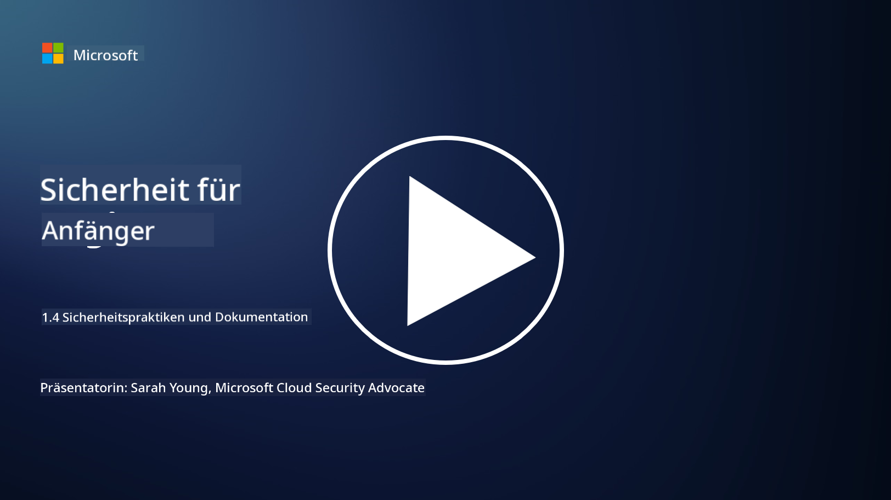

<!--
CO_OP_TRANSLATOR_METADATA:
{
  "original_hash": "d33500902124e52870935bdce4546fcc",
  "translation_date": "2025-09-03T18:32:41+00:00",
  "source_file": "1.4 Security practices and documentation.md",
  "language_code": "de"
}
-->
# Sicherheitspraktiken und Dokumentation

Vielleicht haben Sie schon einmal die Begriffe „Sicherheitsrichtlinie“, „Sicherheitsstandard“ usw. gehört, aber die Realität ist, dass viele Cybersicherheitsfachleute sie nicht korrekt verwenden. In diesem Abschnitt erklären wir, was diese Begriffe bedeuten und warum eine Organisation sie nutzen würde.

## Einführung

In dieser Lektion behandeln wir:

- Was ist eine Sicherheitsrichtlinie?

- Was ist ein Sicherheitsstandard?

- Was ist eine Sicherheitsbaseline?

- Was ist eine Sicherheitsrichtlinie?

- Was ist ein Sicherheitsverfahren?

- Was sind Gesetze und Vorschriften im Kontext der Cybersicherheit?

Diese Begriffe werden häufig im Zusammenhang mit Cybersicherheit verwendet, um verschiedene Ebenen der Sicherheitsdokumentation und -praktiken innerhalb einer Organisation zu definieren. Lassen Sie uns jeden Begriff klären:

## Was ist eine Sicherheitsrichtlinie?

Eine Sicherheitsrichtlinie ist ein übergeordnetes Dokument, das die allgemeinen Sicherheitsziele, Prinzipien und Leitlinien einer Organisation beschreibt. Sie bietet einen Rahmen für sicherheitsbezogene Entscheidungen und legt die Grundhaltung der Organisation in Bezug auf Sicherheit fest. Sicherheitsrichtlinien behandeln Themen wie die akzeptable Nutzung von Ressourcen, Datenschutz, Zugriffskontrolle, Reaktion auf Vorfälle und mehr. Eine Richtlinie ist lösungs- und technologieunabhängig. Ein Beispiel für eine Sicherheitsrichtlinie, die vielen bekannt sein dürfte, ist die Richtlinie zur akzeptablen Nutzung einer Organisation.

## Was ist ein Sicherheitsstandard?

Ein Sicherheitsstandard ist ein detaillierteres und spezifischeres Dokument, das Leitlinien und Anforderungen für die Implementierung von Sicherheitskontrollen und -maßnahmen innerhalb einer Organisation bietet. Standards sind konkreter und technischer als Richtlinien und geben spezifische Anweisungen und Empfehlungen zur Konfiguration und Wartung von Systemen, Netzwerken und Prozessen, um Sicherheitsziele zu erreichen. Ein Beispiel für einen Sicherheitsstandard wäre: _„Alle internen Daten müssen im Ruhezustand und während der Übertragung verschlüsselt sein.“_

## Was ist eine Sicherheitsbaseline?

Eine Sicherheitsbaseline ist eine Reihe von Mindest-Sicherheitskonfigurationen, die zu einem bestimmten Zeitpunkt als wesentlich für ein bestimmtes System, eine Anwendung oder eine Umgebung angesehen werden. Sie definiert einen Ausgangspunkt für die Sicherheit, der in allen relevanten Instanzen implementiert werden sollte. Sicherheitsbaselines helfen, Konsistenz und ein bestimmtes Sicherheitsniveau in der gesamten IT-Infrastruktur einer Organisation sicherzustellen. Ein Beispiel für eine Sicherheitsbaseline wäre: _„Azure-VMs dürfen keinen direkten Internetzugang haben.“_

## Was ist eine Sicherheitsrichtlinie?

Eine Sicherheitsrichtlinie ist ein Dokument, das Empfehlungen und Leitlinien bietet, wenn ein spezifischer Sicherheitsstandard nicht anwendbar ist. Richtlinien versuchen, die „Grauzonen“ zu behandeln, die entstehen, wenn ein Standard eine Angelegenheit nicht abdeckt oder nur teilweise abdeckt.

## Was ist ein Sicherheitsverfahren?

Ein Sicherheitsverfahren ist eine detaillierte Schritt-für-Schritt-Anleitung, die die spezifischen Aktionen und Aufgaben beschreibt, die ausgeführt werden müssen, um einen sicherheitsbezogenen Prozess oder eine Aufgabe umzusetzen. Verfahren sind praktische und umsetzbare Dokumente, die eine klare Abfolge von Maßnahmen für die Reaktion auf Vorfälle, Systemwartung, Benutzer-Onboarding und andere sicherheitsbezogene Aktivitäten bieten. Ein Beispiel für ein Sicherheitsverfahren wäre: _„Wenn ein P1-Sicherheitsvorfall von Microsoft Sentinel generiert wird, muss das Security Operations Center (SOC) den diensthabenden Sicherheitsmanager sofort informieren und die Details des Vorfalls an ihn weiterleiten.“_

Zusammenfassend repräsentieren diese Begriffe verschiedene Ebenen der Dokumentation und Anleitung innerhalb des Cybersicherheitsrahmens einer Organisation. Sicherheitsrichtlinien legen die übergeordneten Ziele fest, Standards bieten detaillierte Anforderungen, Baselines definieren Mindest-Sicherheitskonfigurationen, Richtlinien bieten bewährte Praktiken, und Verfahren bieten umsetzbare Schritte für Sicherheitsprozesse.

## Was sind Gesetze/Vorschriften im Kontext der Cybersicherheit?

Gesetze und Vorschriften beziehen sich auf rechtliche Rahmenwerke, die von Regierungen und Regulierungsbehörden geschaffen wurden, um Regeln, Standards und Anforderungen für die Sicherung digitaler Systeme, Daten und Informationen zu definieren und durchzusetzen. Diese Gesetze und Vorschriften variieren je nach Rechtsgebiet und konzentrieren sich auf verschiedene Aspekte der Cybersicherheit, einschließlich Datenschutz, Privatsphäre, Vorfallberichterstattung und der Sicherheit kritischer Infrastrukturen. Hier sind einige Beispiele für cybersicherheitsbezogene Gesetze und Vorschriften: z. B. Datenschutz-Grundverordnung (DSGVO), Health Insurance Portability and Accountability Act (HIPAA), California Consumer Privacy Act (CCPA), Payment Card Industry Data Security Standard (PCI DSS).

## Weiterführende Literatur

[Information Security Policy Templates | SANS Institute](https://www.sans.org/information-security-policy/)

[Compliance with Cybersecurity and Privacy Laws and Regulations | NIST](https://www.nist.gov/mep/cybersecurity-resources-manufacturers/compliance-cybersecurity-and-privacy-laws-and-regulations)

---

**Haftungsausschluss**:  
Dieses Dokument wurde mit dem KI-Übersetzungsdienst [Co-op Translator](https://github.com/Azure/co-op-translator) übersetzt. Obwohl wir uns um Genauigkeit bemühen, beachten Sie bitte, dass automatisierte Übersetzungen Fehler oder Ungenauigkeiten enthalten können. Das Originaldokument in seiner ursprünglichen Sprache sollte als maßgebliche Quelle betrachtet werden. Für kritische Informationen wird eine professionelle menschliche Übersetzung empfohlen. Wir übernehmen keine Haftung für Missverständnisse oder Fehlinterpretationen, die sich aus der Nutzung dieser Übersetzung ergeben.