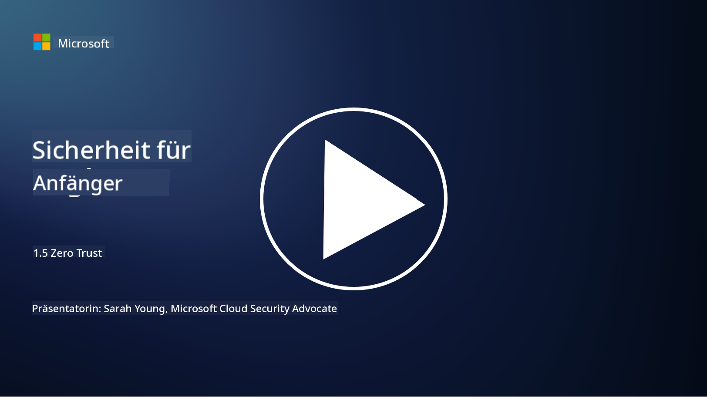
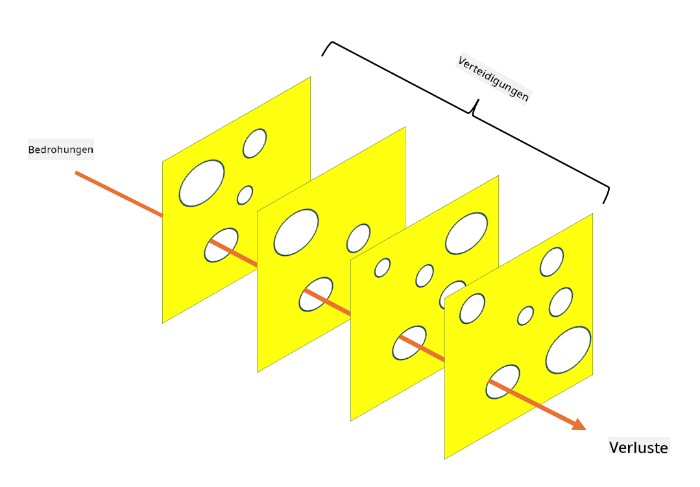

<!--
CO_OP_TRANSLATOR_METADATA:
{
  "original_hash": "75f77f972d2233c584f87c1eb96c983b",
  "translation_date": "2025-09-03T18:22:57+00:00",
  "source_file": "1.5 Zero trust.md",
  "language_code": "de"
}
-->
# Zero Trust

„Zero Trust“ ist ein Begriff, der heutzutage in Sicherheitskreisen häufig verwendet wird. Aber was bedeutet er, ist es nur ein Modewort? In dieser Lektion werden wir genau untersuchen, was Zero Trust ist.

## Einführung

- In dieser Lektion behandeln wir:

- Was ist Zero Trust?

- Wie unterscheidet sich Zero Trust von traditionellen Sicherheitsarchitekturen?

- Was ist Defense in Depth?

## Zero Trust

Zero Trust ist ein Cybersicherheitsansatz, der die traditionelle Vorstellung von „Vertrauen, aber überprüfen“ infrage stellt, indem er davon ausgeht, dass keine Entität, weder innerhalb noch außerhalb des Netzwerks einer Organisation, grundsätzlich vertrauenswürdig sein sollte. Stattdessen fordert Zero Trust, dass jeder Benutzer, jedes Gerät und jede Anwendung, die auf Ressourcen zugreifen möchten, unabhängig von ihrem Standort überprüft werden. Das Kernprinzip von Zero Trust besteht darin, die „Angriffsfläche“ zu minimieren und die potenziellen Auswirkungen von Sicherheitsverletzungen zu reduzieren.

Im Zero Trust-Modell werden folgende Prinzipien betont:

1. **Identität überprüfen**: Authentifizierung und Autorisierung werden rigoros auf alle Benutzer und Geräte angewendet, unabhängig von ihrem Standort. Beachten Sie, dass eine Identität nicht unbedingt menschlich sein muss: Sie kann auch ein Gerät, eine Anwendung usw. sein.

2. **Minimaler Zugriff**: Benutzern und Geräten wird nur der minimale Zugriff gewährt, der erforderlich ist, um ihre Aufgaben auszuführen, wodurch potenzieller Schaden im Falle einer Kompromittierung reduziert wird.

3. **Mikrosegmentierung**: Netzwerkressourcen werden in kleinere Segmente unterteilt, um die seitliche Bewegung innerhalb des Netzwerks im Falle eines Angriffs zu begrenzen.

4. **Kontinuierliche Überwachung**: Laufende Überwachung und Analyse des Verhaltens von Benutzern und Geräten werden durchgeführt, um Anomalien und potenzielle Bedrohungen zu erkennen. Moderne Überwachungstechniken nutzen auch maschinelles Lernen, KI und Bedrohungsinformationen, um zusätzliche Details und Kontext zur Überwachung bereitzustellen.

5. **Datenverschlüsselung**: Daten werden sowohl während der Übertragung als auch im Ruhezustand verschlüsselt, um unbefugten Zugriff zu verhindern.

6. **Strikte Zugriffskontrolle**: Zugriffskontrollen werden basierend auf Kontext wie Benutzerrollen, Gerätezustand und Netzwerkstandort durchgesetzt.

Microsoft unterteilt Zero Trust in fünf Säulen, die wir in einer späteren Lektion besprechen werden.

## Unterschiede zu traditionellen Sicherheitsarchitekturen

Zero Trust unterscheidet sich in mehreren Punkten von traditionellen Sicherheitsarchitekturen, wie z. B. perimeterbasierten Modellen:

1. **Perimeter- vs. Identitätszentriert**: Traditionelle Modelle konzentrieren sich darauf, den Netzwerkperimeter zu sichern und davon auszugehen, dass interne Benutzer und Geräte vertrauenswürdig sind, sobald sie sich innerhalb des Netzwerks befinden. Zero Trust hingegen geht davon aus, dass Bedrohungen sowohl innerhalb als auch außerhalb des Netzwerks entstehen können, und setzt strikte identitätsbasierte Kontrollen durch.

2. **Implizites vs. explizites Vertrauen**: Traditionelle Modelle vertrauen Geräten und Benutzern innerhalb des Netzwerks implizit, bis das Gegenteil bewiesen ist. Zero Trust überprüft Identitäten explizit und überwacht kontinuierlich auf Anomalien.

3. **Flaches vs. segmentiertes Netzwerk**: Traditionelle Architekturen beinhalten oft flache Netzwerke, in denen interne Benutzer breiten Zugriff haben. Zero Trust befürwortet die Segmentierung des Netzwerks in kleinere, isolierte Zonen, um potenzielle Angriffe einzudämmen.

4. **Reaktiv vs. proaktiv**: Traditionelle Sicherheit verlässt sich oft auf reaktive Maßnahmen wie Perimeter-Firewalls und Intrusion-Detection-Systeme. Zero Trust verfolgt einen proaktiven Ansatz, indem es davon ausgeht, dass Angriffe wahrscheinlich sind, und deren Auswirkungen minimiert.

## Defense in Depth

Defense in Depth, auch bekannt als gestaffelte Sicherheit, ist eine Cybersicherheitsstrategie, die den Einsatz mehrerer Sicherheitsschichten und -maßnahmen zum Schutz der Vermögenswerte einer Organisation umfasst. Ziel ist es, überlappende Verteidigungsschichten zu schaffen, sodass, wenn eine Schicht durchbrochen wird, andere weiterhin Schutz bieten können. Jede Schicht konzentriert sich auf einen anderen Aspekt der Sicherheit und erhöht die allgemeine Sicherheitslage einer Organisation.

Defense in Depth umfasst eine Kombination aus technischen, prozeduralen und physischen Sicherheitsmaßnahmen. Dazu können Firewalls, Intrusion-Detection-Systeme, Zugriffskontrollen, Verschlüsselung, Benutzerschulungen, Sicherheitsrichtlinien und mehr gehören. Die Idee ist, mehrere Barrieren zu schaffen, die es Angreifern kollektiv erschweren, die Systeme und Netzwerke einer Organisation zu durchdringen. Dies wird auch manchmal als „Schweizer Käse“-Modell bezeichnet, das auch in der Unfallverhütung in anderen Branchen (z. B. Transport) verwendet wird.

## Weiterführende Literatur

[Was ist Zero Trust?](https://learn.microsoft.com/security/zero-trust/zero-trust-overview?WT.mc_id=academic-96948-sayoung)

[Evolution von Zero Trust – Microsoft Positionspapier](https://query.prod.cms.rt.microsoft.com/cms/api/am/binary/RWJJdT?WT.mc_id=academic-96948-sayoung)

[Zero Trust und BeyondCorp Google Cloud | Google Cloud Blog](https://cloud.google.com/blog/topics/developers-practitioners/zero-trust-and-beyondcorp-google-cloud)

---

**Haftungsausschluss**:  
Dieses Dokument wurde mit dem KI-Übersetzungsdienst [Co-op Translator](https://github.com/Azure/co-op-translator) übersetzt. Obwohl wir uns um Genauigkeit bemühen, beachten Sie bitte, dass automatisierte Übersetzungen Fehler oder Ungenauigkeiten enthalten können. Das Originaldokument in seiner ursprünglichen Sprache sollte als maßgebliche Quelle betrachtet werden. Für kritische Informationen wird eine professionelle menschliche Übersetzung empfohlen. Wir übernehmen keine Haftung für Missverständnisse oder Fehlinterpretationen, die sich aus der Nutzung dieser Übersetzung ergeben.