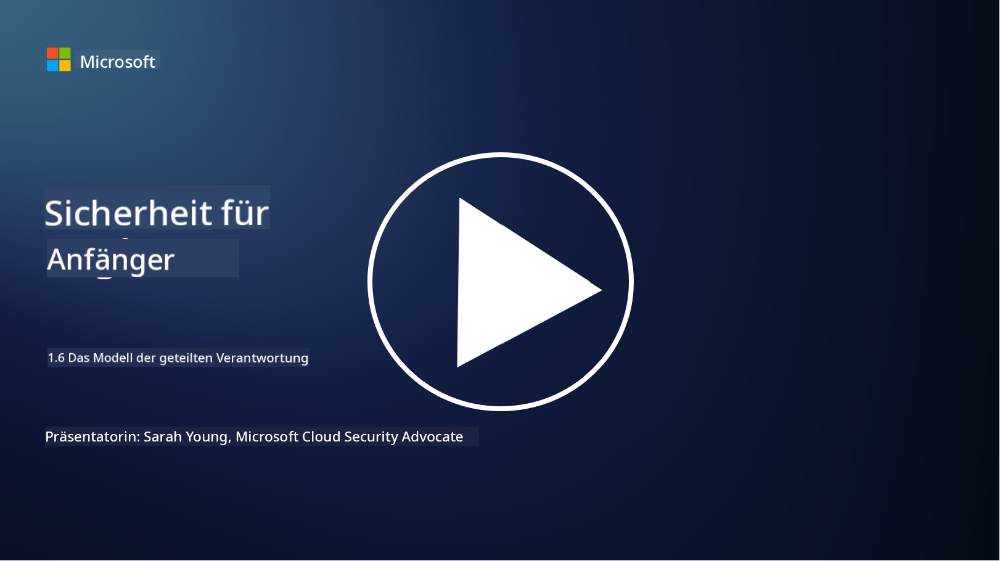

<!--
CO_OP_TRANSLATOR_METADATA:
{
  "original_hash": "a48db640d80c786b928ca178c414f084",
  "translation_date": "2025-09-03T18:34:17+00:00",
  "source_file": "1.6 Shared responsibility model.md",
  "language_code": "de"
}
-->
# Das Modell der geteilten Verantwortung

Geteilte Verantwortung ist ein relativ neues Konzept in der IT, das mit dem Aufkommen des Cloud-Computings entstanden ist. Aus einer Cybersicherheits-Perspektive ist es entscheidend zu verstehen, wer welche Sicherheitskontrollen bereitstellt, um Verteidigungslücken zu vermeiden.

## Einführung

In dieser Lektion behandeln wir:

 - Was bedeutet geteilte Verantwortung im Kontext der Cybersicherheit?
   
 - Was ist der Unterschied in der geteilten Verantwortung für Sicherheitskontrollen
   zwischen IaaS, PaaS und SaaS?

   

 - Wo können Sie herausfinden, welche Sicherheitskontrollen Ihre Cloud-Plattform 
   bereitstellt?

   
 

 - Was bedeutet „Vertrauen, aber überprüfen“?

## Was bedeutet geteilte Verantwortung im Kontext der Cybersicherheit?

Geteilte Verantwortung in der Cybersicherheit bezieht sich auf die Verteilung von Sicherheitsaufgaben zwischen einem Cloud-Service-Provider (CSP) und seinen Kunden. In Cloud-Computing-Umgebungen wie Infrastructure as a Service (IaaS), Platform as a Service (PaaS) und Software as a Service (SaaS) haben sowohl der CSP als auch der Kunde Rollen, die sie übernehmen müssen, um die Sicherheit von Daten, Anwendungen und Systemen zu gewährleisten.

## Was ist der Unterschied in der geteilten Verantwortung für Sicherheitskontrollen zwischen IaaS, PaaS und SaaS?

Die Aufteilung der Verantwortlichkeiten hängt in der Regel von der Art des genutzten Cloud-Services ab:

 - **IaaS (Infrastructure as a Service)**: Der CSP stellt die grundlegende Infrastruktur bereit (Server, Netzwerke, Speicher), während der Kunde für die Verwaltung der Betriebssysteme, Anwendungen und Sicherheitskonfigurationen auf dieser Infrastruktur verantwortlich ist.
   
   
 - **PaaS (Platform as a Service):** Der CSP bietet eine Plattform, auf der Kunden Anwendungen entwickeln und bereitstellen können. Der CSP verwaltet die zugrunde liegende Infrastruktur, während sich der Kunde auf die Anwendungsentwicklung und Datensicherheit konzentriert.

   

 - **SaaS (Software as a Service)**: Der CSP stellt vollständig funktionale Anwendungen bereit, die über das Internet zugänglich sind. In diesem Fall ist der CSP für die Sicherheit der Anwendung und der Infrastruktur verantwortlich, während der Kunde die Benutzerzugriffe und Datennutzung verwaltet.

Das Verständnis der geteilten Verantwortung ist entscheidend, da es klarstellt, welche Sicherheitsaspekte vom CSP abgedeckt werden und welche der Kunde übernehmen muss. Dies hilft, Missverständnisse zu vermeiden und sicherzustellen, dass Sicherheitsmaßnahmen ganzheitlich umgesetzt werden.

## Wo können Sie herausfinden, welche Sicherheitskontrollen Ihre Cloud-Plattform bereitstellt?

Um herauszufinden, welche Sicherheitskontrollen Ihre Cloud-Plattform bereitstellt, sollten Sie die Dokumentation und Ressourcen des Cloud-Service-Providers konsultieren. Dazu gehören:

 - **Website und Dokumentation des CSP**: Die Website des CSP enthält Informationen über die Sicherheitsfunktionen und -kontrollen, die als Teil ihrer Dienste angeboten werden. CSPs stellen in der Regel detaillierte Dokumentationen bereit, die ihre Sicherheitspraktiken, Kontrollen und Empfehlungen erklären. Dazu können Whitepapers, Sicherheitsleitfäden und technische Dokumentationen gehören.
   
 - **Sicherheitsbewertungen und Audits**: Die meisten CSPs lassen ihre Sicherheitskontrollen von unabhängigen Sicherheitsexperten und Organisationen bewerten. Diese Überprüfungen können Einblicke in die Qualität der Sicherheitsmaßnahmen des CSP geben. Manchmal führt dies dazu, dass der CSP ein Sicherheitszertifikat erhält (siehe nächster Punkt).
 - **Sicherheitszertifizierungen**: Die meisten CSPs erwerben Zertifizierungen wie ISO:27001, SOC 2 und FedRAMP usw. Diese Zertifizierungen zeigen, dass der Anbieter bestimmte Sicherheits- und Compliance-Standards erfüllt.

Beachten Sie, dass der Detailgrad und die Verfügbarkeit von Informationen zwischen den Cloud-Anbietern variieren können. Stellen Sie sicher, dass Sie stets offizielle und aktuelle Ressourcen des Cloud-Service-Providers konsultieren, um fundierte Entscheidungen über die Sicherheit Ihrer cloudbasierten Assets zu treffen.

## Was bedeutet „Vertrauen, aber überprüfen“?

Im Kontext der Nutzung eines CSP, einer Drittanbieter-Software oder eines anderen IT-Sicherheitsdienstes könnte eine Organisation zunächst den Sicherheitsversprechen des Anbieters vertrauen. Um jedoch die Sicherheit ihrer Daten und Systeme wirklich zu gewährleisten, sollten diese Versprechen durch Sicherheitsbewertungen, Penetrationstests und eine Überprüfung der Sicherheitskontrollen des externen Anbieters überprüft werden, bevor die Software oder der Dienst vollständig in die eigenen Abläufe integriert wird. Alle Einzelpersonen und Organisationen sollten darauf abzielen, den Sicherheitskontrollen, für die sie nicht verantwortlich sind, zu vertrauen, diese jedoch zu überprüfen.

## Geteilte Verantwortung innerhalb einer Organisation
Denken Sie daran, dass auch die geteilte Verantwortung für Sicherheit innerhalb einer Organisation zwischen verschiedenen Teams berücksichtigt werden muss. Das Sicherheitsteam wird selten alle Kontrollen selbst implementieren und muss mit Betriebsteams, Entwicklern und anderen Teilen des Unternehmens zusammenarbeiten, um alle notwendigen Sicherheitskontrollen umzusetzen, die erforderlich sind, um eine Organisation sicher zu halten.

## Weiterführende Literatur
- [Shared responsibility in the cloud - Microsoft Azure | Microsoft Learn](https://learn.microsoft.com/azure/security/fundamentals/shared-responsibility?WT.mc_id=academic-96948-sayoung)
- [What is shared responsibility model? – Definition from TechTarget.com](https://www.techtarget.com/searchcloudcomputing/definition/shared-responsibility-model)
- [The shared responsibility model explained and what it means for cloud security | CSO Online](https://www.csoonline.com/article/570779/the-shared-responsibility-model-explained-and-what-it-means-for-cloud-security.html)
- [Shared Responsibility for Cloud Security: What You Need to Know (cisecurity.org)](https://www.cisecurity.org/insights/blog/shared-responsibility-cloud-security-what-you-need-to-know)

---

**Haftungsausschluss**:  
Dieses Dokument wurde mit dem KI-Übersetzungsdienst [Co-op Translator](https://github.com/Azure/co-op-translator) übersetzt. Obwohl wir uns um Genauigkeit bemühen, beachten Sie bitte, dass automatisierte Übersetzungen Fehler oder Ungenauigkeiten enthalten können. Das Originaldokument in seiner ursprünglichen Sprache sollte als maßgebliche Quelle betrachtet werden. Für kritische Informationen wird eine professionelle menschliche Übersetzung empfohlen. Wir übernehmen keine Haftung für Missverständnisse oder Fehlinterpretationen, die sich aus der Nutzung dieser Übersetzung ergeben.