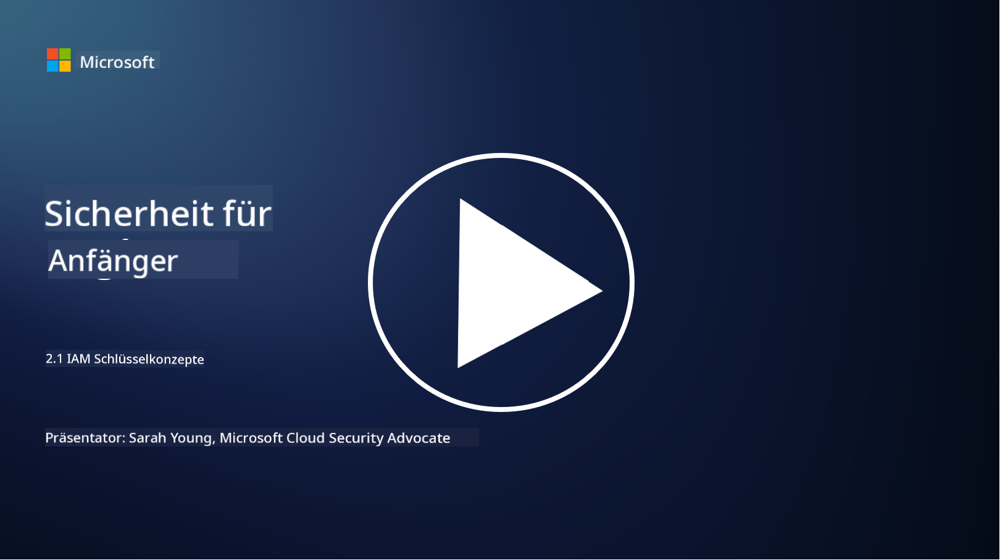

<!--
CO_OP_TRANSLATOR_METADATA:
{
  "original_hash": "2e3864e3d579f0dbb4ac2ec8c5f82acf",
  "translation_date": "2025-09-03T18:03:34+00:00",
  "source_file": "2.1 IAM key concepts.md",
  "language_code": "de"
}
-->
# IAM Schlüsselkonzepte

Haben Sie jemals in einen Computer oder eine Website eingeloggt? Natürlich haben Sie das! Das bedeutet, dass Sie bereits Identitätskontrollen in Ihrem Alltag verwendet haben. Identity and Access Management (IAM) ist eine zentrale Säule der Sicherheit, und wir werden in den nächsten Lektionen mehr darüber erfahren.

**Einführung**

In dieser Lektion behandeln wir:

- Was verstehen wir unter Identity and Access Management (IAM) im
  Kontext der Cybersicherheit?
  
- Was ist das Prinzip der minimalen Rechte?
  
- Was bedeutet Trennung von Aufgaben?
  
- Was sind Authentifizierung und Autorisierung?

## Was verstehen wir unter Identity and Access Management (IAM) im Kontext der Cybersicherheit?

Identity and Access Management (IAM) bezieht sich auf eine Reihe von Prozessen, Technologien und Richtlinien, die implementiert werden, um sicherzustellen, dass die richtigen Personen den angemessenen Zugriff auf Ressourcen innerhalb der digitalen Umgebung einer Organisation haben. IAM umfasst die Verwaltung digitaler Identitäten (Benutzer, Mitarbeiter, Partner) und deren Zugriff auf Systeme, Anwendungen, Daten und Netzwerke. Das Hauptziel von IAM ist es, die Sicherheit zu verbessern, den Benutzerzugriff zu vereinfachen und die Einhaltung von Organisationsrichtlinien und Vorschriften sicherzustellen. IAM-Lösungen umfassen typischerweise Benutzerauthentifizierung, Autorisierung, Identitätsbereitstellung, Zugriffskontrolle und das Lebenszyklusmanagement von Benutzern (sicherstellen, dass Konten gelöscht werden, wenn sie nicht mehr verwendet werden).

## Was ist das Prinzip der minimalen Rechte?

Das Prinzip der minimalen Rechte ist ein grundlegendes Konzept, das dafür plädiert, Benutzern und Systemen nur die minimalen Rechte zu gewähren, die notwendig sind, um ihre vorgesehenen Aufgaben oder Rollen auszuführen. Dieses Prinzip hilft, potenziellen Schaden im Falle eines Sicherheitsvorfalls oder einer Bedrohung von innen zu begrenzen. Durch die Einhaltung des Prinzips der minimalen Rechte reduzieren Organisationen die Angriffsfläche und minimieren das Risiko von unbefugtem Zugriff, Datenverletzungen und versehentlichem Missbrauch von Rechten. In der Praxis bedeutet dies, dass Benutzern nur Zugriff auf die spezifischen Ressourcen und Funktionen gewährt wird, die für ihre Arbeitsrollen erforderlich sind – und nicht mehr. Zum Beispiel: Wenn Sie nur ein Dokument lesen müssen, wäre es übertrieben, Ihnen volle Administratorrechte für dieses Dokument zu gewähren.

## Was bedeutet Trennung von Aufgaben?

Die Trennung von Aufgaben ist ein Prinzip, das darauf abzielt, Interessenkonflikte zu vermeiden und das Risiko von Betrug und Fehlern zu reduzieren, indem kritische Aufgaben und Verantwortlichkeiten auf verschiedene Personen innerhalb einer Organisation verteilt werden. Im Kontext der Cybersicherheit bedeutet die Trennung von Aufgaben, sicherzustellen, dass keine einzelne Person die Kontrolle über alle Aspekte eines kritischen Prozesses oder Systems hat. Ziel ist es, ein System von Checks and Balances zu schaffen, das verhindert, dass eine einzelne Person sowohl die Einrichtung als auch die Genehmigung eines Prozesses durchführen kann. Zum Beispiel könnte dies in Finanzsystemen bedeuten, dass die Person, die Transaktionen in das System eingibt, nicht dieselbe Person ist, die diese Transaktionen genehmigt. Dies reduziert das Risiko, dass unbefugte oder betrügerische Handlungen unentdeckt bleiben.

## Was sind Authentifizierung und Autorisierung?

Authentifizierung und Autorisierung sind zwei grundlegende Konzepte in der Cybersicherheit, die eine entscheidende Rolle bei der Sicherstellung der Sicherheit und Integrität von Computersystemen und Daten spielen. Sie werden oft zusammen verwendet, um den Zugriff auf Ressourcen zu kontrollieren und sensible Informationen zu schützen.

**1. Authentifizierung**: Authentifizierung ist der Prozess der Überprüfung der Identität eines Benutzers, Systems oder einer Entität, die versucht, auf ein Computersystem oder eine bestimmte Ressource zuzugreifen. Sie stellt sicher, dass die behauptete Identität echt und korrekt ist. Authentifizierungsmethoden beinhalten typischerweise die Verwendung von einem oder mehreren der folgenden Faktoren:

   a. Etwas, das Sie wissen: Dazu gehören Passwörter, PINs oder andere geheime Informationen, die nur der berechtigte Benutzer besitzen sollte.
   
   b. Etwas, das Sie haben: Dazu gehören physische Token oder Geräte wie Smartcards, Sicherheitstoken oder Mobiltelefone, die verwendet werden, um die Identität des Benutzers zu bestätigen.
   
   c. Etwas, das Sie sind: Dies bezieht sich auf biometrische Merkmale wie Fingerabdrücke, Gesichtserkennung oder Netzhautscans, die einzigartig für eine Person sind.

Authentifizierungsmechanismen werden verwendet, um sicherzustellen, dass ein Benutzer tatsächlich derjenige ist, der er vorgibt zu sein, bevor ihm Zugriff auf ein System oder eine Ressource gewährt wird. Sie helfen, unbefugten Zugriff zu verhindern und sicherzustellen, dass nur legitime Benutzer Aktionen innerhalb eines Systems ausführen können.

**2. Autorisierung**: Autorisierung ist der Prozess der Gewährung oder Verweigerung spezifischer Berechtigungen und Privilegien für authentifizierte Benutzer oder Entitäten, nachdem ihre Identität überprüft wurde. Sie bestimmt, welche Aktionen oder Operationen ein Benutzer innerhalb eines Systems oder auf bestimmten Ressourcen ausführen darf. Autorisierung basiert oft auf vordefinierten Richtlinien, Zugriffskontrollregeln und Rollen, die Benutzern zugewiesen werden.

Autorisierung kann als die Antwort auf die Frage "Was darf ein authentifizierter Benutzer tun?" betrachtet werden. Sie umfasst die Definition und Durchsetzung von Zugriffskontrollrichtlinien, um sensible Daten und Ressourcen vor unbefugtem Zugriff oder Änderungen zu schützen.

**Zusammenfassung:**

- Authentifizierung stellt die Identität von Benutzern oder Entitäten fest.
- Autorisierung bestimmt, welche Aktionen und Ressourcen authentifizierte Benutzer ausführen oder nutzen dürfen.

## Weiterführende Literatur

- [Describe identity concepts - Training | Microsoft Learn](https://learn.microsoft.com/training/modules/describe-identity-principles-concepts/?WT.mc_id=academic-96948-sayoung)
- [Introduction to identity - Microsoft Entra | Microsoft Learn](https://learn.microsoft.com/azure/active-directory/fundamentals/identity-fundamental-concepts?WT.mc_id=academic-96948-sayoung)
- [What is Identity Access Management (IAM)? | Microsoft Security](https://www.microsoft.com/security/business/security-101/what-is-identity-access-management-iam?WT.mc_id=academic-96948-sayoung)
- [What is IAM? Identity and access management explained | CSO Online](https://www.csoonline.com/article/518296/what-is-iam-identity-and-access-management-explained.html)
- [What is IAM? (auth0.com)](https://auth0.com/blog/what-is-iam/)
- [Security+: implementing Identity and Access Management (IAM) controls [updated 2021] | Infosec (infosecinstitute.com)](https://resources.infosecinstitute.com/certifications/securityplus/security-implementing-identity-and-access-management-iam-controls/)
- [least privilege - Glossary | CSRC (nist.gov)](https://csrc.nist.gov/glossary/term/least_privilege)
- [Security: The Principle of Least Privilege (POLP) - Microsoft Community Hub](https://techcommunity.microsoft.com/t5/azure-sql-blog/security-the-principle-of-least-privilege-polp/ba-p/2067390?WT.mc_id=academic-96948-sayoung)
- [Principle of least privilege | CERT NZ](https://www.cert.govt.nz/it-specialists/critical-controls/principle-of-least-privilege/)
- [Why is separation of duties required by NIST 800-171 and CMMC? - (totem.tech)](https://www.totem.tech/cmmc-separation-of-duties/)

---

**Haftungsausschluss**:  
Dieses Dokument wurde mithilfe des KI-Übersetzungsdienstes [Co-op Translator](https://github.com/Azure/co-op-translator) übersetzt. Obwohl wir uns um Genauigkeit bemühen, weisen wir darauf hin, dass automatisierte Übersetzungen Fehler oder Ungenauigkeiten enthalten können. Das Originaldokument in seiner ursprünglichen Sprache sollte als maßgebliche Quelle betrachtet werden. Für kritische Informationen wird eine professionelle menschliche Übersetzung empfohlen. Wir übernehmen keine Haftung für Missverständnisse oder Fehlinterpretationen, die sich aus der Nutzung dieser Übersetzung ergeben.