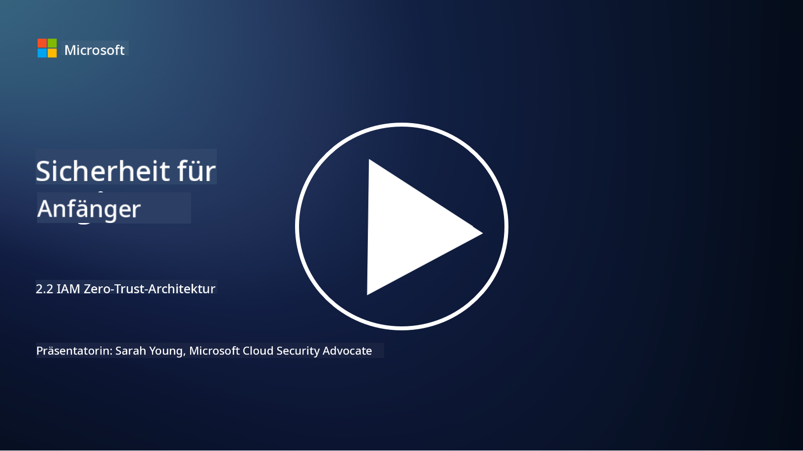

<!--
CO_OP_TRANSLATOR_METADATA:
{
  "original_hash": "4774a978af123f72ebb872199c4c4d4f",
  "translation_date": "2025-09-03T18:21:10+00:00",
  "source_file": "2.2 IAM zero trust architecture.md",
  "language_code": "de"
}
-->
# IAM Zero-Trust-Architektur

Identität ist ein zentraler Bestandteil der Umsetzung einer Zero-Trust-Architektur und des Aufbaus eines Perimeters für jede IT-Umgebung. In diesem Abschnitt werden wir untersuchen, warum es wichtig ist, Identitätskontrollen zur Implementierung von Zero Trust zu verwenden.

## Einführung

In dieser Lektion behandeln wir:

- Warum müssen wir Identität als unseren Perimeter in modernen IT-Umgebungen verwenden?

- Wie unterscheidet sich dies von traditionellen IT-Architekturen?

- Wie wird Identität verwendet, um eine Zero-Trust-Architektur umzusetzen?

## Warum müssen wir Identität als unseren Perimeter in modernen IT-Umgebungen verwenden?

In modernen IT-Umgebungen wird das traditionelle Konzept eines physischen Perimeters (mit Tools wie Firewalls und Netzwerkgrenzen) als primäre Verteidigungslinie gegen Cyberbedrohungen zunehmend weniger effektiv. Dies liegt an der wachsenden Komplexität der Technologie, dem Aufstieg der Remote-Arbeit und der Einführung von Cloud-Diensten. Stattdessen verlagern sich Organisationen darauf, Identität als neuen Perimeter zu nutzen. Das bedeutet, dass die Sicherheit darauf basiert, die Identität von Benutzern, Geräten und Anwendungen zu überprüfen und zu verwalten, die versuchen, auf Ressourcen zuzugreifen – unabhängig von ihrem physischen Standort.

Hier sind die Gründe, warum die Verwendung von Identität als Perimeter in modernen IT-Umgebungen entscheidend ist:

**Remote-Arbeit**: Mit der zunehmenden Verbreitung von Remote-Arbeit und mobilen Geräten greifen Benutzer von verschiedenen Standorten und Geräten auf Ressourcen zu. Der traditionelle Perimeteransatz funktioniert nicht mehr, wenn Benutzer nicht mehr an ein physisches Büro gebunden sind.

**Cloud- und Hybrid-Umgebungen**: Organisationen setzen zunehmend auf Cloud-Dienste und hybride Umgebungen. Daten und Anwendungen befinden sich nicht mehr ausschließlich innerhalb der Räumlichkeiten einer Organisation, wodurch traditionelle Perimeterverteidigungen weniger relevant werden.

**Zero-Trust-Sicherheit**: Das Konzept der Zero-Trust-Sicherheit geht davon aus, dass keine Entität – weder innerhalb noch außerhalb des Netzwerks – automatisch vertrauenswürdig ist. Identität wird zur Grundlage für die Überprüfung von Zugriffsanfragen, unabhängig davon, woher sie stammen.

**Bedrohungslandschaft**: Cyberbedrohungen entwickeln sich weiter, und Angreifer finden Wege, traditionelle Perimeterverteidigungen zu umgehen. Phishing, Social Engineering und Insider-Bedrohungen nutzen oft menschliche Schwachstellen aus, anstatt Netzwerkperimeter zu durchbrechen.

**Datenzentrierter Ansatz**: Der Schutz sensibler Daten hat oberste Priorität. Durch den Fokus auf Identität können Organisationen steuern, wer auf welche Daten zugreift, und so das Risiko von Datenverletzungen reduzieren.

## Wie unterscheidet sich dies von traditionellen IT-Architekturen?

Traditionelle IT-Architekturen basierten stark auf Perimeter-Sicherheitsmodellen, bei denen Firewalls und Netzwerkgrenzen eine wichtige Rolle spielten, um Bedrohungen fernzuhalten. Die Hauptunterschiede zwischen traditionellen und identitätszentrierten Ansätzen sind:

|      Aspekt                 |      Traditionelle IT-Architekturen                                                              |      Identitätszentrierter Ansatz                                                                         |
|-----------------------------|--------------------------------------------------------------------------------------------------|----------------------------------------------------------------------------------------------------------|
|     Fokus                   |     Perimeter-Fokus: Verließ sich auf Perimeterverteidigungen wie Firewalls und Zugriffskontrolle. |     Fokus auf Identitätsüberprüfung: Wechsel von Netzwerkgrenzen zur Überprüfung der Benutzer-/Geräteidentität. |
|     Standort                |     Standortabhängigkeit: Sicherheit war an physische Bürostandorte und Netzwerkgrenzen gebunden. |     Standortunabhängigkeit: Sicherheit ist nicht an bestimmte Standorte gebunden; Zugriff von überall möglich. |
|     Vertrauensannahme       |     Angenommenes Vertrauen: Innerhalb des Netzwerkperimeters wurde Benutzern/Geräten vertraut.   |     Zero-Trust-Ansatz: Vertrauen wird nie angenommen; Zugriff wird basierend auf Identität und Kontext überprüft. |
|     Gerätebetrachtung       |     Gerätevielfalt: Es wurde angenommen, dass Geräte innerhalb des Netzwerkperimeters sicher sind. |     Gerätebewusstsein: Berücksichtigt den Zustand und die Sicherheit von Geräten, unabhängig vom Standort. |
|     Datenschutz             |     Datenschutz: Fokus auf die Sicherung von Netzwerkperimetern zum Schutz von Daten.            |     Datenzentrierter Schutz: Fokus auf die Kontrolle des Datenzugriffs basierend auf Identität und Datenempfindlichkeit. |

## Wie wird Identität verwendet, um eine Zero-Trust-Architektur umzusetzen?

In einer Zero-Trust-Architektur ist das grundlegende Prinzip, niemals automatisch einer Entität zu vertrauen – unabhängig davon, ob sie sich innerhalb oder außerhalb des Netzwerkperimeters befindet. Identität spielt eine zentrale Rolle bei der Umsetzung eines Zero-Trust-Ansatzes, indem sie eine kontinuierliche Überprüfung von Entitäten ermöglicht, die versuchen, auf Ressourcen zuzugreifen. Moderne Sicherheitskontrollen für Identität stellen sicher, dass jeder Benutzer, jedes Gerät, jede Anwendung und jeder Dienst, der Zugriff auf Ressourcen sucht, gründlich identifiziert und authentifiziert wird, bevor der Zugriff gewährt wird. Dies umfasst die Überprüfung ihrer digitalen Identität durch Methoden wie Benutzername/Passwort-Kombinationen, Multi-Faktor-Authentifizierung (MFA), biometrische Verfahren und andere starke Authentifizierungsmechanismen.

## Weiterführende Literatur

- [Securing identity with Zero Trust | Microsoft Learn](https://learn.microsoft.com/security/zero-trust/deploy/identity?WT.mc_id=academic-96948-sayoung)
- [Zero Trust Principles and Guidance for Identity and Access | CSA (cloudsecurityalliance.org)](https://cloudsecurityalliance.org/artifacts/zero-trust-principles-and-guidance-for-iam/)
- [Zero Trust Identity Controls - Essentials Series - Episode 2 - YouTube](https://www.youtube.com/watch?v=fQZQznIKcGM&list=PLXtHYVsvn_b_gtX1-NB62wNervQx1Fhp4&index=13)

---

**Haftungsausschluss**:  
Dieses Dokument wurde mit dem KI-Übersetzungsdienst [Co-op Translator](https://github.com/Azure/co-op-translator) übersetzt. Obwohl wir uns um Genauigkeit bemühen, beachten Sie bitte, dass automatisierte Übersetzungen Fehler oder Ungenauigkeiten enthalten können. Das Originaldokument in seiner ursprünglichen Sprache sollte als maßgebliche Quelle betrachtet werden. Für kritische Informationen wird eine professionelle menschliche Übersetzung empfohlen. Wir übernehmen keine Haftung für Missverständnisse oder Fehlinterpretationen, die sich aus der Nutzung dieser Übersetzung ergeben.