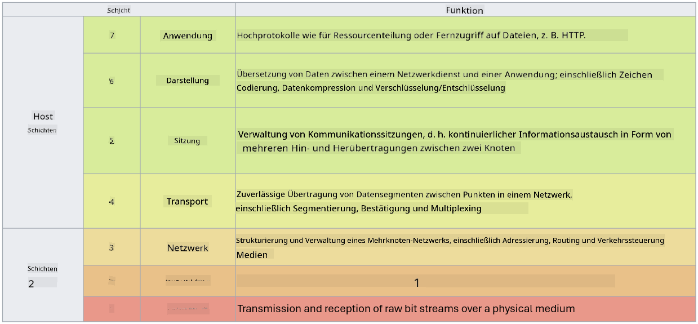

<!--
CO_OP_TRANSLATOR_METADATA:
{
  "original_hash": "252724eceeb183fb9018f88c5e1a3f0c",
  "translation_date": "2025-09-03T18:55:20+00:00",
  "source_file": "3.1 Networking key concepts.md",
  "language_code": "de"
}
-->
# Wichtige Konzepte der Netzwerktechnik

Wenn Sie bereits in der IT gearbeitet haben, sind Sie wahrscheinlich mit Konzepten der Netzwerktechnik in Berührung gekommen. Obwohl wir in modernen Umgebungen Identität als primäre Perimeterkontrolle verwenden, bedeutet dies nicht, dass Netzwerkkontrollen überflüssig sind. Obwohl dies ein umfangreiches Thema ist, werden wir in dieser Lektion einige wichtige Konzepte der Netzwerktechnik behandeln.

In dieser Lektion behandeln wir:

- Was ist IP-Adressierung?

- Was ist das OSI-Modell?

- Was sind TCP/UDP?

- Was sind Portnummern?

- Was ist Verschlüsselung im Ruhezustand und während der Übertragung?

## Was ist IP-Adressierung?

Die IP-Adressierung, oder Internet-Protokoll-Adressierung, ist eine numerische Kennzeichnung, die jedem Gerät zugewiesen wird, das mit einem Computernetzwerk verbunden ist und das Internet-Protokoll für die Kommunikation verwendet. Sie dient als eindeutiger Identifikator für Geräte innerhalb eines Netzwerks und ermöglicht ihnen, Daten über das Internet oder andere verbundene Netzwerke zu senden und zu empfangen. Es gibt zwei Hauptversionen der IP-Adressierung: IPv4 (Internet Protocol Version 4) und IPv6 (Internet Protocol Version 6). Eine IP-Adresse wird typischerweise entweder im IPv4-Format (z. B. 192.168.1.1) oder im IPv6-Format (z. B. 2001:0db8:85a3:0000:0000:8a2e:0370:7334) dargestellt.

## Was ist das OSI-Modell?

Das OSI (Open Systems Interconnection)-Modell ist ein konzeptioneller Rahmen, der die Funktionen eines Kommunikationssystems in sieben verschiedene Schichten standardisiert. Jede Schicht führt spezifische Aufgaben aus und kommuniziert mit benachbarten Schichten, um eine effiziente und zuverlässige Datenkommunikation zwischen Geräten in einem Netzwerk zu gewährleisten. Die Schichten, von unten nach oben, sind wie folgt:

1. Physikalische Schicht

2. Sicherungsschicht

3. Netzwerkschicht

4. Transportschicht

5. Sitzungsschicht

6. Darstellungsschicht

7. Anwendungsschicht

Das OSI-Modell bietet eine gemeinsame Referenz, um zu verstehen, wie Netzwerkprotokolle und -technologien miteinander interagieren, unabhängig von den spezifischen Hardware- oder Softwareimplementierungen.

_ref: https://en.wikipedia.org/wiki/OSI_model_

## Was sind TCP/UDP?

TCP (Transmission Control Protocol) und UDP (User Datagram Protocol) sind zwei grundlegende Protokolle der Transportschicht, die in Computernetzwerken verwendet werden, um die Kommunikation zwischen Geräten über das Internet oder innerhalb eines lokalen Netzwerks zu erleichtern. Sie sind dafür verantwortlich, Daten in Pakete aufzuteilen, diese zu übertragen und die Pakete am Empfangsende wieder in die ursprünglichen Daten zusammenzusetzen. Sie unterscheiden sich jedoch in ihren Eigenschaften und Anwendungsfällen.

**TCP (Transmission Control Protocol)**:

TCP ist ein verbindungsorientiertes Protokoll, das eine zuverlässige und geordnete Datenübertragung zwischen Geräten ermöglicht. Es stellt vor Beginn des Datenaustauschs eine Verbindung zwischen Sender und Empfänger her. TCP sorgt dafür, dass Datenpakete in der richtigen Reihenfolge ankommen und kann verlorene Pakete erneut übertragen, um die Datenintegrität und Vollständigkeit zu gewährleisten. Dies macht TCP geeignet für Anwendungen, die eine zuverlässige Datenübertragung erfordern, wie Web-Browsing, E-Mail, Dateiübertragung (FTP) und Datenbankkommunikation.

**UDP (User Datagram Protocol)**:

UDP ist ein verbindungsloses Protokoll, das eine schnellere Datenübertragung bietet, jedoch nicht die gleiche Zuverlässigkeit wie TCP. Es stellt keine formale Verbindung vor dem Senden von Daten her und enthält keine Mechanismen zur Bestätigung oder erneuten Übertragung verlorener Pakete. UDP eignet sich für Anwendungen, bei denen Geschwindigkeit und Effizienz wichtiger sind als garantierte Lieferung, wie Echtzeitkommunikation, Streaming-Medien, Online-Gaming und DNS-Abfragen.

Zusammenfassend priorisiert TCP Zuverlässigkeit und geordnete Lieferung, was es für Anwendungen geeignet macht, die Datengenauigkeit erfordern, während UDP Geschwindigkeit und Effizienz betont und für Anwendungen geeignet ist, bei denen ein geringfügiger Datenverlust oder eine Umordnung akzeptabel ist, um die Latenz zu reduzieren. Die Wahl zwischen TCP und UDP hängt von den spezifischen Anforderungen der Anwendung oder des Dienstes ab.

## Was sind Portnummern?

In der Netzwerktechnik ist eine Portnummer ein numerischer Identifikator, der verwendet wird, um zwischen verschiedenen Diensten oder Anwendungen zu unterscheiden, die auf einem einzelnen Gerät innerhalb eines Netzwerks ausgeführt werden. Ports helfen dabei, eingehende Daten an die entsprechende Anwendung weiterzuleiten. Portnummern sind 16-Bit-Unsigned-Integer, was bedeutet, dass sie im Bereich von 0 bis 65535 liegen. Sie sind in drei Bereiche unterteilt:

- Well-Known Ports (0-1023): Reserviert für Standarddienste wie HTTP (Port 80) und FTP (Port 21).

- Registrierte Ports (1024-49151): Verwendet für Anwendungen und Dienste, die nicht zum Well-Known-Bereich gehören, aber offiziell registriert sind.

- Dynamische/Private Ports (49152-65535): Verfügbar für temporäre oder private Nutzung durch Anwendungen.

## Was ist Verschlüsselung im Ruhezustand und während der Übertragung?

Verschlüsselung ist der Prozess, Daten in ein sicheres Format umzuwandeln, um sie vor unbefugtem Zugriff oder Manipulation zu schützen. Verschlüsselung kann sowohl auf Daten "im Ruhezustand" (wenn sie auf einem Gerät oder Server gespeichert sind) als auch "während der Übertragung" (wenn sie zwischen Geräten oder über Netzwerke übertragen werden) angewendet werden.

Verschlüsselung im Ruhezustand: Dies umfasst die Verschlüsselung von Daten, die auf Geräten, Servern oder Speichersystemen gespeichert sind. Selbst wenn ein Angreifer physischen Zugriff auf das Speichermedium erhält, kann er ohne die Verschlüsselungsschlüssel nicht auf die Daten zugreifen. Dies ist entscheidend für den Schutz sensibler Daten im Falle von Geräteverlust, Datenverletzungen oder unbefugtem Zugriff.

Verschlüsselung während der Übertragung: Dies umfasst die Verschlüsselung von Daten, während sie zwischen Geräten oder über Netzwerke übertragen werden. Dies verhindert das Abhören und die unbefugte Abfangung von Daten während der Übertragung. Häufige Protokolle für die Verschlüsselung während der Übertragung sind HTTPS für die Webkommunikation und TLS/SSL zur Sicherung verschiedener Arten von Netzwerkverkehr.

## Weiterführende Literatur
- [How Do IP Addresses Work? (howtogeek.com)](https://www.howtogeek.com/341307/how-do-ip-addresses-work/)
- [Understanding IP Address: An Introductory Guide (geekflare.com)](https://geekflare.com/understanding-ip-address/)
- [What is the OSI model? The 7 layers of OSI explained (techtarget.com)](https://www.techtarget.com/searchnetworking/definition/OSI)
- [The OSI Model – The 7 Layers of Networking Explained in Plain English (freecodecamp.org)](https://www.freecodecamp.org/news/osi-model-networking-layers-explained-in-plain-english/)
- [TCP/IP protocols - IBM Documentation](https://www.ibm.com/docs/en/aix/7.3?topic=protocol-tcpip-protocols)
- [Common Ports Cheat Sheet: The Ultimate Ports & Protocols List (stationx.net)](https://www.stationx.net/common-ports-cheat-sheet/)
- [Azure Data Encryption-at-Rest - Azure Security | Microsoft Learn](https://learn.microsoft.com/azure/security/fundamentals/encryption-atrest?WT.mc_id=academic-96948-sayoung)

---

**Haftungsausschluss**:  
Dieses Dokument wurde mithilfe des KI-Übersetzungsdienstes [Co-op Translator](https://github.com/Azure/co-op-translator) übersetzt. Obwohl wir uns um Genauigkeit bemühen, weisen wir darauf hin, dass automatisierte Übersetzungen Fehler oder Ungenauigkeiten enthalten können. Das Originaldokument in seiner ursprünglichen Sprache sollte als maßgebliche Quelle betrachtet werden. Für kritische Informationen wird eine professionelle menschliche Übersetzung empfohlen. Wir übernehmen keine Haftung für Missverständnisse oder Fehlinterpretationen, die aus der Nutzung dieser Übersetzung entstehen.