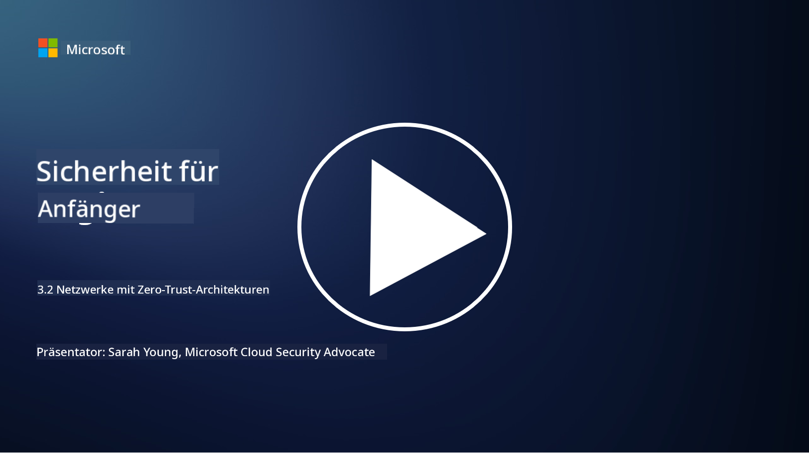

<!--
CO_OP_TRANSLATOR_METADATA:
{
  "original_hash": "680d6e14d9d33fc471c22f44679713f8",
  "translation_date": "2025-09-03T18:37:20+00:00",
  "source_file": "3.2 Networking zero trust architecture.md",
  "language_code": "de"
}
-->
# Netzwerk-Architekturen mit Zero Trust

Das Netzwerk bietet eine entscheidende Ebene in Zero-Trust-Kontrollen. In dieser Lektion lernen wir mehr darüber:

- Was ist Netzwerksegmentierung?  
- Wie hilft Netzwerksegmentierung bei der Umsetzung von Zero Trust?  
- Was ist Ende-zu-Ende-Verschlüsselung?

## Was ist Netzwerksegmentierung?

Netzwerksegmentierung ist die Praxis, ein Netzwerk in kleinere, isolierte Segmente oder Subnetzwerke zu unterteilen. Jedes Segment ist von den anderen isoliert, und der Zugriff zwischen den Segmenten wird basierend auf spezifischen Sicherheitsrichtlinien kontrolliert und eingeschränkt. Netzwerksegmentierung wird eingesetzt, um die Sicherheit zu verbessern, indem die Auswirkungen potenzieller Sicherheitsverletzungen begrenzt und die seitliche Bewegung von Angreifern innerhalb des Netzwerks eingeschränkt wird.

Durch die Implementierung von Netzwerksegmentierung kann eine Organisation "Zonen" schaffen, die verschiedene Arten von Benutzern, Anwendungen und Daten voneinander trennen. Dies reduziert die Angriffsfläche und minimiert den potenziellen Schaden, der durch einen Sicherheitsvorfall entstehen könnte. Netzwerksegmentierung kann durch Technologien wie virtuelle LANs (VLANs), Firewalls und Zugriffskontrollen erreicht werden.

## Wie hilft Netzwerksegmentierung bei der Umsetzung von Zero Trust?

Netzwerksegmentierung steht im Einklang mit den Prinzipien des Zero-Trust-Modells. In einer Zero-Trust-Architektur hilft Netzwerksegmentierung, das Prinzip der "minimalen Rechte" durchzusetzen, indem sichergestellt wird, dass Benutzer und Geräte nur Zugriff auf die spezifischen Ressourcen und Dienste haben, die sie für ihre Aufgaben benötigen. Durch die Unterteilung des Netzwerks in kleinere Zonen können Organisationen strenge Zugriffskontrollen implementieren, kritische Assets isolieren und die seitliche Bewegung von Angreifern verhindern.

Netzwerksegmentierung unterstützt auch die Durchsetzung von identitätsbasierten Zugriffskontrollen, bei denen Benutzer und Geräte gründlich authentifiziert und autorisiert werden, bevor sie auf bestimmte Segmente zugreifen. Dies verhindert unbefugten Zugriff auf sensible Ressourcen und mindert die potenziellen Auswirkungen kompromittierter Zugangsdaten.

## Was ist Ende-zu-Ende-Verschlüsselung?

Ende-zu-Ende-Verschlüsselung (E2E) ist eine Sicherheitsmaßnahme, die sicherstellt, dass Daten während ihrer gesamten Übertragung vom Sender zum Empfänger verschlüsselt bleiben. In diesem Prozess werden Daten am Sender verschlüsselt, und nur der Empfänger besitzt den Entschlüsselungsschlüssel, um die Daten zu entschlüsseln und zu lesen. Die Verschlüsselungs- und Entschlüsselungsprozesse erfolgen an den Endpunkten, wodurch es für unbefugte Parteien, einschließlich Dienstanbieter und Zwischenstellen, äußerst schwierig wird, auf die Klartextdaten zuzugreifen.

E2E-Verschlüsselung bietet ein hohes Maß an Vertraulichkeit und Sicherheit für die Datenübertragung, selbst wenn die Daten durch verschiedene Zwischensysteme oder Netzwerke geleitet werden. Sie wird häufig in sicheren Messaging-Apps, E-Mail-Diensten und anderen Kommunikationsplattformen eingesetzt, um sensible Informationen vor Abhörversuchen und unbefugtem Zugriff zu schützen.

Diese Verschlüsselungsmethode stellt sicher, dass selbst wenn Angreifer Zugriff auf die Daten während der Übertragung erhalten, sie nur verschlüsselte Inhalte sehen, die ohne den Entschlüsselungsschlüssel bedeutungslos sind. Ende-zu-Ende-Verschlüsselung spielt eine entscheidende Rolle beim Schutz der Privatsphäre der Benutzer und beim Schutz sensibler Informationen vor unbefugtem Zugriff.

## Was ist SASE?

SASE steht für "Secure Access Service Edge" und ist ein Cybersecurity-Framework und eine Architektur, die Netzwerksicherheit und Wide-Area-Networking (WAN)-Funktionen in einem einzigen cloudbasierten Dienst kombiniert. SASE ist darauf ausgelegt, sicheren und skalierbaren Zugriff auf Netzwerkressourcen, Anwendungen und Daten für Remote- und mobile Benutzer zu bieten, während die Netzwerkverwaltung vereinfacht und die Komplexität traditioneller Netzwerk- und Sicherheitsarchitekturen reduziert wird.

Wichtige Merkmale und Komponenten von SASE umfassen:

1. **Cloud-basiert:** SASE wird als Cloud-Dienst bereitgestellt, was bedeutet, dass Sicherheits- und Netzwerkfunktionen aus der Cloud bereitgestellt werden, anstatt auf traditionelle On-Premises-Hardware und -Appliances zu setzen.  

2. **Integration von Sicherheit und Netzwerk:** SASE integriert verschiedene Sicherheitsdienste wie Secure Web Gateways (SWG), Firewall as a Service (FWaaS), Data Loss Prevention (DLP), Zero-Trust Network Access (ZTNA) und WAN-Optimierung mit Wide-Area-Networking-Funktionen. Diese Integration hilft, Sicherheits- und Netzwerkoperationen zu vereinfachen.  

3. **Zero Trust:** SASE basiert auf dem Prinzip von Zero Trust, was bedeutet, dass strenge Zugriffskontrollen und Richtlinien für minimale Rechte durchgesetzt werden. Benutzer und Geräte werden nicht standardmäßig vertraut und müssen authentifiziert und autorisiert werden, bevor sie auf Ressourcen zugreifen.  

4. **Identitätszentriert:** SASE konzentriert sich auf Benutzer- und Geräteidentitäten als Grundlage für Zugriffskontrollen. Identitäts- und kontextbasierte Richtlinien werden verwendet, um Zugriffsberechtigungen zu bestimmen, und diese Richtlinien passen sich dynamisch basierend auf Benutzerverhalten und Kontext an.  

5. **Skalierbarkeit und Flexibilität:** SASE kann problemlos skaliert werden, um eine große Anzahl von Benutzern und Geräten zu unterstützen, was es für Organisationen mit vielfältigen und sich entwickelnden Netzwerk- und Sicherheitsanforderungen geeignet macht.  

SASE ist besonders relevant in der modernen Ära von Remote-Arbeit und Cloud-Adoption, da es einen umfassenden und agilen Ansatz zur Sicherung und Verwaltung des Netzwerkzugriffs bietet. Es hilft Organisationen, sich an sich ändernde Sicherheits- und Netzwerkanforderungen anzupassen, während der Fokus auf benutzerzentrierte und Zero-Trust-Sicherheitsmodelle erhalten bleibt.

## Weiterführende Literatur

- [What Is Network Segmentation? - Cisco](https://www.cisco.com/c/en/us/products/security/what-is-network-segmentation.html#~benefits)  
- [What Is Micro-Segmentation? - Cisco](https://www.cisco.com/c/en/us/products/security/what-is-microsegmentation.html)  
- [Implementing Network Segmentation and Segregation | Cyber.gov.au](https://www.cyber.gov.au/resources-business-and-government/maintaining-devices-and-systems/system-hardening-and-administration/network-hardening/implementing-network-segmentation-and-segregation)  
- [What Is Network Segmentation and Why It Matters | CompTIA](https://www.comptia.org/blog/security-awareness-training-network-segmentation)  
- [Network Segmentation: Concepts and Practices (cmu.edu)](https://insights.sei.cmu.edu/blog/network-segmentation-concepts-and-practices/)  
- [Secure networks with Zero Trust | Microsoft Learn](https://learn.microsoft.com/security/zero-trust/deploy/networks?WT.mc_id=academic-96948-sayoung)  
- [What is end-to-end encryption? | IBM](https://www.ibm.com/topics/end-to-end-encryption)  
- [What Is End-to-End Encryption, and Why Does It Matter? (howtogeek.com)](https://www.howtogeek.com/711656/what-is-end-to-end-encryption-and-why-does-it-matter/)  
- [Definition of Secure Access Service Edge (SASE) - Gartner Information Technology Glossary](https://www.gartner.com/en/information-technology/glossary/secure-access-service-edge-sase)  
- [What Is Secure Access Service Edge (SASE)? | Microsoft Security](https://www.microsoft.com/security/business/security-101/what-is-sase?WT.mc_id=academic-96948-sayoung)  

---

**Haftungsausschluss**:  
Dieses Dokument wurde mit dem KI-Übersetzungsdienst [Co-op Translator](https://github.com/Azure/co-op-translator) übersetzt. Obwohl wir uns um Genauigkeit bemühen, beachten Sie bitte, dass automatisierte Übersetzungen Fehler oder Ungenauigkeiten enthalten können. Das Originaldokument in seiner ursprünglichen Sprache sollte als maßgebliche Quelle betrachtet werden. Für kritische Informationen wird eine professionelle menschliche Übersetzung empfohlen. Wir übernehmen keine Haftung für Missverständnisse oder Fehlinterpretationen, die sich aus der Nutzung dieser Übersetzung ergeben.