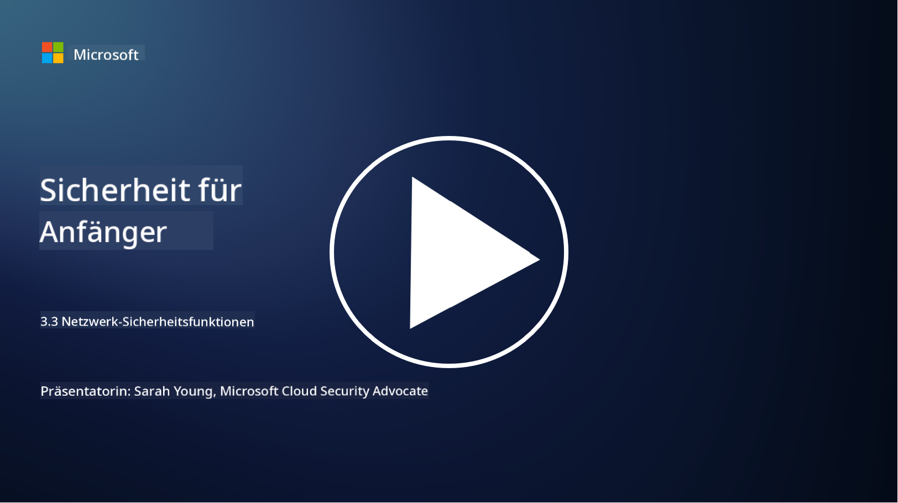

<!--
CO_OP_TRANSLATOR_METADATA:
{
  "original_hash": "c3aba077bb98eebc925dd58d870229ab",
  "translation_date": "2025-09-03T18:18:57+00:00",
  "source_file": "3.3 Network security capabilities.md",
  "language_code": "de"
}
-->
# Netzwerk-Sicherheitsfunktionen

In dieser Lektion lernen wir die folgenden Funktionen kennen, die zur Sicherung eines Netzwerks verwendet werden können:

- Traditionelle Firewalls
- Webanwendungs-Firewalls
- Cloud-Sicherheitsgruppen
- CDN
- Lastverteiler
- Bastion Hosts
- VPNs
- DDoS-Schutz

## Traditionelle Firewalls

Traditionelle Firewalls sind Sicherheitsgeräte, die den ein- und ausgehenden Netzwerkverkehr basierend auf vordefinierten Sicherheitsregeln überwachen und kontrollieren. Sie fungieren als Barriere zwischen einem vertrauenswürdigen internen Netzwerk und unzuverlässigen externen Netzwerken, indem sie den Verkehr filtern, um unbefugten Zugriff und potenzielle Bedrohungen zu verhindern.

## Webanwendungs-Firewalls

Webanwendungs-Firewalls (WAFs) sind spezialisierte Firewalls, die Webanwendungen vor verschiedenen Angriffen wie SQL-Injection, Cross-Site-Scripting und anderen Schwachstellen schützen. Sie analysieren HTTP-Anfragen und -Antworten, um bösartigen Datenverkehr zu identifizieren und zu blockieren, der auf Webanwendungen abzielt.

## Cloud-Sicherheitsgruppen

Sicherheitsgruppen sind eine grundlegende Netzwerk-Sicherheitsfunktion, die von Cloud-Dienstanbietern bereitgestellt wird. Sie fungieren als virtuelle Firewalls, die den ein- und ausgehenden Datenverkehr zu und von Cloud-Ressourcen wie virtuellen Maschinen (VMs) und Instanzen kontrollieren. Sicherheitsgruppen ermöglichen es Organisationen, Regeln zu definieren, die festlegen, welche Arten von Datenverkehr erlaubt oder blockiert werden, und bieten eine zusätzliche Verteidigungsschicht für Cloud-Bereitstellungen.

## Content Delivery Network (CDN)

Ein Content Delivery Network ist ein verteiltes Netzwerk von Servern, die sich an verschiedenen geografischen Standorten befinden. CDNs verbessern die Leistung und Verfügbarkeit von Websites, indem sie Inhalte zwischenspeichern und von Servern bereitstellen, die näher am Benutzer liegen. Sie bieten auch einen gewissen Schutz vor DDoS-Angriffen, indem sie den Datenverkehr auf mehrere Serverstandorte verteilen.

## Lastverteiler

Lastverteiler verteilen eingehenden Netzwerkverkehr auf mehrere Server, um die Ressourcennutzung zu optimieren, hohe Verfügbarkeit sicherzustellen und die Anwendungsleistung zu verbessern. Sie helfen, Serverüberlastungen zu vermeiden und effiziente Antwortzeiten aufrechtzuerhalten, wodurch die Widerstandsfähigkeit des Netzwerks erhöht wird.

## Bastion Hosts

Bastion Hosts sind hochsichere und isolierte Server, die kontrollierten Zugriff auf ein Netzwerk von einem externen, unzuverlässigen Netzwerk (wie dem Internet) ermöglichen. Sie dienen als Einstiegspunkte für Administratoren, um interne Systeme sicher zu erreichen. Bastion Hosts sind in der Regel mit starken Sicherheitsmaßnahmen konfiguriert, um die Angriffsfläche zu minimieren.

## Virtuelle private Netzwerke (VPNs)

VPNs erstellen verschlüsselte Tunnel zwischen dem Gerät eines Benutzers und einem entfernten Server, um sichere und private Kommunikation über potenziell unsichere Netzwerke wie das Internet zu gewährleisten. VPNs werden häufig verwendet, um Fernzugriff auf interne Netzwerke zu ermöglichen, sodass Benutzer Ressourcen nutzen können, als wären sie physisch im selben Netzwerk.

## DDoS-Schutz-Tools

DDoS (Distributed Denial of Service)-Schutz-Tools und -Dienste sind darauf ausgelegt, die Auswirkungen von DDoS-Angriffen zu mindern, bei denen mehrere kompromittierte Geräte ein Netzwerk oder einen Dienst überfluten, um ihn zu überlasten. DDoS-Schutzlösungen identifizieren und filtern bösartigen Datenverkehr, sodass legitimer Datenverkehr weiterhin sein Ziel erreichen kann.

## Weiterführende Literatur

- [Was ist eine Firewall? - Cisco](https://www.cisco.com/c/en/us/products/security/firewalls/what-is-a-firewall.html#~types-of-firewalls)
- [Was macht eine Firewall eigentlich? (howtogeek.com)](https://www.howtogeek.com/144269/htg-explains-what-firewalls-actually-do/)
- [Was ist eine Firewall? Wie Firewalls funktionieren & Arten von Firewalls (kaspersky.com)](https://www.kaspersky.com/resource-center/definitions/firewall)
- [Netzwerksicherheitsgruppe - Funktionsweise | Microsoft Learn](https://learn.microsoft.com/azure/virtual-network/network-security-group-how-it-works)
- [Einführung in Azure Content Delivery Network (CDN) - Training | Microsoft Learn](https://learn.microsoft.com/training/modules/intro-to-azure-content-delivery-network/?WT.mc_id=academic-96948-sayoung)
- [Was ist ein Content Delivery Network (CDN)? - Azure | Microsoft Learn](https://learn.microsoft.com/azure/cdn/cdn-overview?WT.mc_id=academic-96948-sayoung)
- [Was ist Lastverteilung? Wie Lastverteiler funktionieren (nginx.com)](https://www.nginx.com/resources/glossary/load-balancing/)
- [Bastion Hosts vs. VPNs · Tailscale](https://tailscale.com/learn/bastion-hosts-vs-vpns/)
- [Was ist VPN? Wie es funktioniert, Arten von VPNs (kaspersky.com)](https://www.kaspersky.com/resource-center/definitions/what-is-a-vpn)
- [Einführung in Azure DDoS-Schutz - Training | Microsoft Learn](https://learn.microsoft.com/training/modules/introduction-azure-ddos-protection/?WT.mc_id=academic-96948-sayoung)
- [Was ist ein DDoS-Angriff? | Microsoft Security](https://www.microsoft.com/security/business/security-101/what-is-a-ddos-attack?WT.mc_id=academic-96948-sayoung)

---

**Haftungsausschluss**:  
Dieses Dokument wurde mithilfe des KI-Übersetzungsdienstes [Co-op Translator](https://github.com/Azure/co-op-translator) übersetzt. Obwohl wir uns um Genauigkeit bemühen, weisen wir darauf hin, dass automatisierte Übersetzungen Fehler oder Ungenauigkeiten enthalten können. Das Originaldokument in seiner ursprünglichen Sprache sollte als maßgebliche Quelle betrachtet werden. Für kritische Informationen wird eine professionelle menschliche Übersetzung empfohlen. Wir übernehmen keine Haftung für Missverständnisse oder Fehlinterpretationen, die aus der Nutzung dieser Übersetzung entstehen.