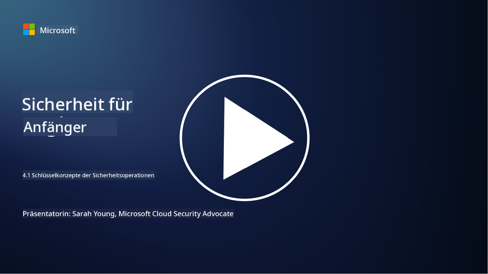

<!--
CO_OP_TRANSLATOR_METADATA:
{
  "original_hash": "6a55b31df9eebf550d040cef0ef7dff3",
  "translation_date": "2025-09-03T18:59:43+00:00",
  "source_file": "4.1 SecOps key concepts.md",
  "language_code": "de"
}
-->
# Schlüsselkonzepte der Sicherheitsoperationen

Sicherheitsoperationen sind ein wesentlicher Bestandteil der gesamten Sicherheitsfunktion einer Organisation. In dieser Lektion erfahren wir mehr darüber:

- Was ist eine Sicherheitsoperationsfunktion innerhalb eines Unternehmens?

- Welche Formen können Sicherheitsoperationen annehmen?

- Wie unterscheiden sich Sicherheitsoperationen von traditionellen IT-Operationen?

## Was ist eine Sicherheitsoperationsfunktion innerhalb eines Unternehmens?

Eine Sicherheitsoperationsfunktion innerhalb eines Unternehmens bezieht sich auf ein dediziertes Team oder eine Abteilung, die für die Überwachung, Erkennung, Untersuchung und Reaktion auf Cybersecurity-Bedrohungen und -Vorfälle verantwortlich ist. Das Hauptziel einer Sicherheitsoperationsfunktion besteht darin, die Vertraulichkeit, Integrität und Verfügbarkeit der digitalen Vermögenswerte einer Organisation zu gewährleisten, indem Sicherheitsrisiken proaktiv identifiziert und gemindert sowie effektiv auf Sicherheitsvorfälle reagiert wird.

## Welche Formen können Sicherheitsoperationen annehmen?

Sicherheitsoperationen können je nach Größe und Komplexität der Organisation verschiedene Formen annehmen. Einige gängige Formen sind:

**Security Operations Center (SOC):** Ein zentrales Team, das rund um die Uhr für die Überwachung, Analyse und Reaktion auf Sicherheitsereignisse verantwortlich ist. SOCs nutzen oft fortschrittliche Tools und Technologien, um Bedrohungen in Echtzeit zu identifizieren und darauf zu reagieren.

**Incident Response Team:** Ein spezialisiertes Team, das sich auf die Reaktion auf Sicherheitsvorfälle und -verletzungen konzentriert. Sie führen Untersuchungen durch, koordinieren Reaktionsmaßnahmen und unterstützen die Wiederherstellung.

**Threat Hunting Team:** Ein Team, das proaktiv nach Anzeichen fortgeschrittener Bedrohungen und versteckter Schwachstellen sucht, die von traditionellen Sicherheitstools möglicherweise nicht erkannt werden.

**Red Team/Blue Team:** Das Red Team simuliert Angriffe, um Schwachstellen zu identifizieren, während das Blue Team diese Angriffe abwehrt. Beide Teams arbeiten zusammen, um Sicherheitsmaßnahmen zu verbessern.

**Managed Security Services Provider (MSSP):** Einige Organisationen lagern ihre Sicherheitsoperationen an Drittanbieter aus, die sich auf Sicherheitsüberwachung und Vorfallreaktion spezialisiert haben.

## Wie unterscheiden sich Sicherheitsoperationen von traditionellen IT-Operationen?

Sicherheitsoperationen und traditionelle IT-Operationen sind verwandte, aber unterschiedliche Funktionen:

**Fokus:** IT-Operationen konzentrieren sich auf die Verwaltung und Wartung der IT-Infrastruktur der Organisation, um deren Funktionalität und Verfügbarkeit sicherzustellen. Sicherheitsoperationen hingegen priorisieren die Identifizierung und Minderung von Sicherheitsrisiken sowie die Reaktion auf Vorfälle.

**Verantwortlichkeiten:** IT-Operationen umfassen Aufgaben wie Systemwartung, Software-Updates und Benutzerunterstützung. Sicherheitsoperationen befassen sich mit Bedrohungserkennung, Vorfallreaktion, Schwachstellenmanagement und Sicherheitsüberwachung.

**Zeitliche Priorität:** IT-Operationen legen Wert auf die sofortige Verfügbarkeit und Leistung von Systemen. Sicherheitsoperationen konzentrieren sich auf die Identifizierung und Behebung von Bedrohungen, was nicht immer mit sofortiger Verfügbarkeit übereinstimmt.

**Fachkenntnisse:** Sicherheitsoperationen erfordern spezialisierte Fähigkeiten in Bedrohungsanalyse, Vorfallreaktion und Cybersecurity-Tools. IT-Operationen erfordern Expertise in Systemadministration, Netzwerkmanagement und Anwendungsunterstützung.

## Workflow der Vorfallreaktion

Die Kernfunktionen des NIST Cybersecurity Framework listen fünf übergeordnete Funktionen auf, die kontinuierlich als Teil der Betriebsumgebung einer Organisation durchgeführt werden sollten, um Cybersecurity-Risiken zu reduzieren.

Es ist wichtig zu verstehen, dass diese Aktivitäten Teil eines größeren Kreislaufs sein sollten, der sich in die umfassenderen Cybersecurity-Prozesse einer Organisation einfügt und mit ihnen übereinstimmt.

**Hinweis:** Weitere Informationen zum NIST Cybersecurity Framework finden Sie unter [https://www.nist.gov/cybersecurity](https://www.nist.gov/cybersecurity)

## Weiterführende Literatur

- [Sicherheitsoperationen | Microsoft Learn](https://learn.microsoft.com/security/operations/overview?WT.mc_id=academic-96948-sayoung)
- [Implementierung von Sicherheitsoperationsprozessen | Microsoft Learn](https://learn.microsoft.com/security/operations/?WT.mc_id=academic-96948-sayoung)
- [Was ist ein Security Operations Center (SOC)? | Microsoft Security](https://www.microsoft.com/security/business/security-101/what-is-a-security-operations-center-soc?WT.mc_id=academic-96948-sayoung)
- [Was ist ein Security Operations Center | Cybersecurity | CompTIA](https://www.comptia.org/content/articles/what-is-a-security-operations-center)

---

**Haftungsausschluss**:  
Dieses Dokument wurde mit dem KI-Übersetzungsdienst [Co-op Translator](https://github.com/Azure/co-op-translator) übersetzt. Obwohl wir uns um Genauigkeit bemühen, weisen wir darauf hin, dass automatisierte Übersetzungen Fehler oder Ungenauigkeiten enthalten können. Das Originaldokument in seiner ursprünglichen Sprache sollte als maßgebliche Quelle betrachtet werden. Für kritische Informationen wird eine professionelle menschliche Übersetzung empfohlen. Wir übernehmen keine Haftung für Missverständnisse oder Fehlinterpretationen, die sich aus der Nutzung dieser Übersetzung ergeben.