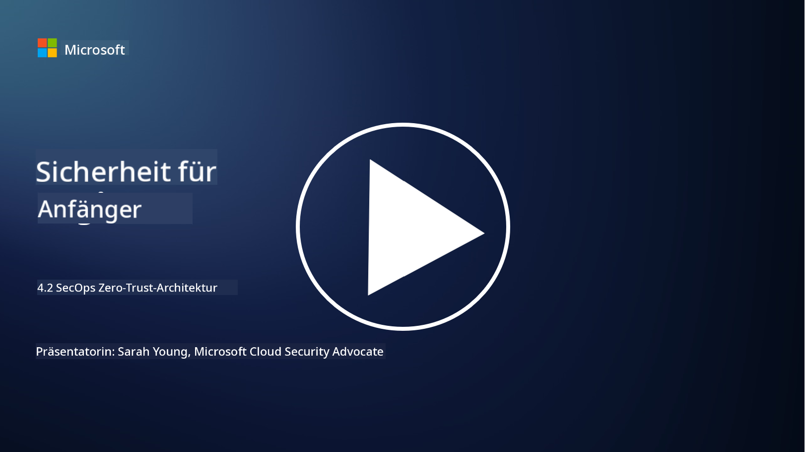

<!--
CO_OP_TRANSLATOR_METADATA:
{
  "original_hash": "45bbdc114e70936816b0b3e7c40189cf",
  "translation_date": "2025-09-03T18:39:29+00:00",
  "source_file": "4.2 SecOps zero trust architecture.md",
  "language_code": "de"
}
-->
# SecOps Zero-Trust-Architektur

Sicherheitsoperationen bilden zwei Teile der Zero-Trust-Architektur, und in dieser Lektion lernen wir beide kennen:

- Wie müssen IT-Architekturen aufgebaut sein, um eine zentrale Protokollsammlung zu ermöglichen?

- Was sind die Best Practices für Sicherheitsoperationen in modernen IT-Umgebungen?

## Wie müssen IT-Architekturen aufgebaut sein, um eine zentrale Protokollsammlung zu ermöglichen?

Die zentrale Protokollsammlung ist ein wesentlicher Bestandteil moderner Sicherheitsoperationen. Sie ermöglicht es Organisationen, Protokolle und Daten aus verschiedenen Quellen wie Servern, Anwendungen, Netzwerkgeräten und Sicherheitstools in einem zentralen Repository zu sammeln, um sie zu analysieren, zu überwachen und auf Vorfälle zu reagieren. Hier sind einige Best Practices für den Aufbau von IT-Architekturen zur Unterstützung der zentralen Protokollsammlung:

1. **Integration von Protokollquellen**:

- Stellen Sie sicher, dass alle relevanten Geräte und Systeme so konfiguriert sind, dass sie Protokolle generieren. Dazu gehören Server, Firewalls, Router, Switches, Anwendungen und Sicherheitsgeräte.

- Konfigurieren Sie die Protokollquellen so, dass sie Protokolle an einen zentralen Protokollsammel- oder Verwaltungssystem weiterleiten.

2. **Das richtige SIEM-Tool auswählen**:

- Wählen Sie eine SIEM-Lösung (Security Information and Event Management), die den Anforderungen und der Skalierung Ihrer Organisation entspricht.

- Stellen Sie sicher, dass die gewählte Lösung Protokollsammlung, Aggregation, Analyse und Berichterstattung unterstützt.

3. **Skalierbarkeit und Redundanz**:

- Entwerfen Sie die Architektur so, dass sie skalierbar ist, um eine wachsende Anzahl von Protokollquellen und ein erhöhtes Protokollvolumen zu bewältigen.

- Implementieren Sie Redundanz für hohe Verfügbarkeit, um Unterbrechungen durch Hardware- oder Netzwerkfehler zu vermeiden.

4. **Protokolle sicher übertragen**:

- Verwenden Sie sichere Protokolle wie TLS/SSL oder IPsec, um Protokolle von den Quellen zum zentralen Repository zu transportieren.

- Implementieren Sie Authentifizierung und Zugriffskontrollen, um sicherzustellen, dass nur autorisierte Geräte Protokolle senden können.

5. **Normalisierung**:

- Standardisieren Sie Protokollformate und normalisieren Sie Daten, um Konsistenz und einfache Analyse zu gewährleisten.

6. **Speicherung und Aufbewahrung**:

- Legen Sie die geeignete Aufbewahrungsdauer für Protokolle basierend auf Compliance- und Sicherheitsanforderungen fest.

- Speichern Sie Protokolle sicher, um sie vor unbefugtem Zugriff und Manipulation zu schützen.

## Was sind die Best Practices für Sicherheitsoperationen in modernen IT-Umgebungen?

Zusätzlich zur zentralen Protokollsammlung sind hier einige Best Practices für Sicherheitsoperationen in modernen IT-Umgebungen:

1. **Kontinuierliche Überwachung**: Implementieren Sie eine kontinuierliche Überwachung von Netzwerk- und Systemaktivitäten, um Bedrohungen in Echtzeit zu erkennen und darauf zu reagieren.

2. **Bedrohungsinformationen**: Bleiben Sie über neue Bedrohungen und Schwachstellen informiert, indem Sie Bedrohungsinformationsfeeds und -dienste nutzen.

3. **Benutzerschulung**: Führen Sie regelmäßige Sicherheitsbewusstseinsschulungen für Mitarbeiter durch, um Risiken durch Social Engineering und Phishing-Angriffe zu minimieren.

4. **Vorfallreaktionsplan**: Entwickeln und testen Sie einen Vorfallreaktionsplan, um eine schnelle und effektive Reaktion auf Sicherheitsvorfälle zu gewährleisten.

5. **Sicherheitsautomatisierung**: Nutzen Sie Sicherheitsautomatisierungs- und Orchestrierungstools, um die Reaktion auf Vorfälle und repetitive Aufgaben zu optimieren.

6. **Backup und Wiederherstellung**: Implementieren Sie robuste Backup- und Disaster-Recovery-Lösungen, um die Datenverfügbarkeit im Falle von Datenverlust oder Ransomware-Angriffen sicherzustellen.

## Weiterführende Literatur

- [Microsoft Security Best Practices module: Security operations | Microsoft Learn](https://learn.microsoft.com/security/operations/security-operations-videos-and-decks?WT.mc_id=academic-96948-sayoung)
- [Security operations - Cloud Adoption Framework | Microsoft Learn](https://learn.microsoft.com/azure/cloud-adoption-framework/secure/security-operations?WT.mc_id=academic-96948-sayoung)
- [What is Security Operations and Analytics Platform Architecture? A Definition of SOAPA, How It Works, Benefits, and More (digitalguardian.com)](https://www.digitalguardian.com/blog/what-security-operations-and-analytics-platform-architecture-definition-soapa-how-it-works#:~:text=All%20in%20all%2C%20security%20operations%20and%20analytics%20platform,become%20more%20efficient%20and%20operative%20with%20your%20security.)

---

**Haftungsausschluss**:  
Dieses Dokument wurde mit dem KI-Übersetzungsdienst [Co-op Translator](https://github.com/Azure/co-op-translator) übersetzt. Obwohl wir uns um Genauigkeit bemühen, beachten Sie bitte, dass automatisierte Übersetzungen Fehler oder Ungenauigkeiten enthalten können. Das Originaldokument in seiner ursprünglichen Sprache sollte als maßgebliche Quelle betrachtet werden. Für kritische Informationen wird eine professionelle menschliche Übersetzung empfohlen. Wir übernehmen keine Haftung für Missverständnisse oder Fehlinterpretationen, die sich aus der Nutzung dieser Übersetzung ergeben.