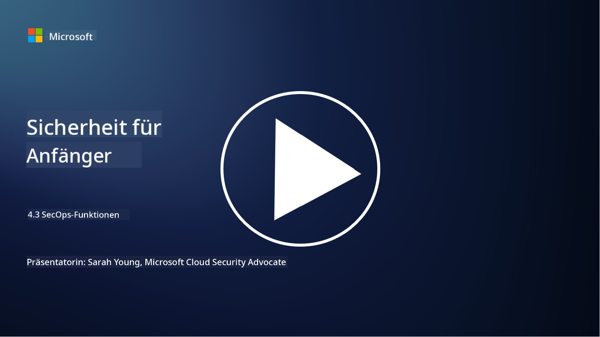

<!--
CO_OP_TRANSLATOR_METADATA:
{
  "original_hash": "553eb694c89f1caca0694e8d8ab89e0e",
  "translation_date": "2025-09-03T18:48:15+00:00",
  "source_file": "4.3 SecOps capabilities.md",
  "language_code": "de"
}
-->
# SecOps-Funktionen

In diesem Abschnitt behandeln wir weitere Details zu den zentralen Tools und Funktionen, die in Sicherheitsoperationen verwendet werden können.

In dieser Lektion behandeln wir:

- Was ist ein Security Information and Event Management (SIEM)-Tool?

- Was ist XDR?

- Welche Funktionen können genutzt werden, um Sicherheitsoperationen zu verbessern?

## Was ist ein Security Information and Event Management (SIEM)-Tool?

Ein Security Information and Event Management (SIEM)-Tool bietet Analysen von Sicherheitswarnungen, die in der IT-Umgebung einer Organisation generiert werden. Es sammelt, aggregiert, korreliert und analysiert Protokolldaten und Sicherheitsereignisse aus verschiedenen Quellen wie Netzwerkgeräten, Servern, Anwendungen und Sicherheitssystemen.

Wichtige Funktionen und Fähigkeiten von SIEM-Tools umfassen:

1. **Protokollsammlung**: SIEM-Tools sammeln Protokolle und Sicherheitsereignisdaten aus einer Vielzahl von Geräten, Systemen und Anwendungen, einschließlich Firewalls, Intrusion-Detection-Systemen, Antivirensoftware und mehr.

2. **Daten-Normalisierung**: Sie normalisieren Protokolldaten in ein einheitliches Format, um die Analyse und Korrelation zu erleichtern.

3. **Ereigniskorrelation**: SIEM-Tools korrelieren Ereignisse, um Muster und Anomalien zu identifizieren, die auf Sicherheitsvorfälle oder Bedrohungen hinweisen könnten.

4. **Warnungen und Benachrichtigungen**: SIEM-Tools generieren in Echtzeit Warnungen und Benachrichtigungen, wenn verdächtige Aktivitäten oder Sicherheitsverletzungen erkannt werden, sodass sofort reagiert werden kann.

5. **Vorfallserkennung**: Sie erleichtern die Erkennung von Sicherheitsvorfällen, einschließlich unbefugtem Zugriff, Datenverletzungen, Malware-Infektionen und Insider-Bedrohungen.

6. **Analyse des Benutzer- und Entitätsverhaltens (UEBA)**: Einige SIEM-Tools integrieren UEBA-Funktionen, um abnormales Verhalten von Benutzern und Entitäten zu erkennen, das auf kompromittierte Konten oder Insider-Bedrohungen hinweisen könnte.

7. **Integration von Bedrohungsinformationen**: SIEM-Tools können mit Bedrohungsinformations-Feeds integriert werden, um die Bedrohungserkennung zu verbessern, indem bekannte Indikatoren für Kompromittierungen (IOCs) mit Netzwerkaktivitäten verglichen werden.

8. **Automatisierung und Orchestrierung**: Automatisierungsfunktionen ermöglichen es SIEMs, auf häufige Sicherheitsvorfälle automatisiert zu reagieren, wodurch Reaktionszeiten verkürzt und manueller Aufwand reduziert wird.

9. **Dashboard und Visualisierung**: Sie bieten Dashboards und Visualisierungstools zur Überwachung von Sicherheitsdaten und Erstellung benutzerdefinierter Berichte.

10. **Integration mit anderen Sicherheitstools**: SIEM-Tools integrieren sich häufig mit anderen Sicherheitstools und Technologien, wie Endpoint Detection and Response (EDR)-Lösungen, um eine ganzheitliche Sicht auf die Sicherheitslage einer Organisation zu bieten.

## Was ist XDR?

XDR (Extended Detection and Response) ist eine Technologie, die die Fähigkeiten traditioneller Endpoint Detection and Response (EDR) erweitert und mit umfassenderer Sicherheitstelemetrie aus verschiedenen Quellen kombiniert, um eine ganzheitlichere Sicht auf die Sicherheitslage einer Organisation zu bieten. XDR zielt darauf ab, die Bedrohungserkennung, Vorfallreaktion und allgemeine Sicherheit zu verbessern, indem es die Einschränkungen von ausschließlich EDR-, SIEM- oder anderen einzelnen Sicherheitstools überwindet.

Wichtige Merkmale und Komponenten von XDR umfassen:

1. **Datenintegration**: XDR integriert Daten aus mehreren Quellen, einschließlich Endpunkten, Netzwerkverkehr, Cloud-Diensten, E-Mails und mehr. Diese umfassende Datenaggregation bietet einen breiteren Kontext für die Bedrohungserkennung und -analyse.

2. **Erweiterte Analysen**: XDR nutzt erweiterte Analysen, maschinelles Lernen und Verhaltensanalysen, um Sicherheitsbedrohungen zu identifizieren und zu priorisieren. Es sucht nach Mustern und Anomalien in den integrierten Daten, um sowohl bekannte als auch unbekannte Bedrohungen zu erkennen.

3. **Automatisierte Bedrohungserkennung**: XDR automatisiert die Erkennung von Sicherheitsbedrohungen und Anomalien, indem Informationen aus verschiedenen Quellen korreliert werden. Es kann komplexe Angriffsketten identifizieren, die sich über mehrere Vektoren erstrecken.

4. **Vorfalluntersuchung und -reaktion**: XDR bietet Tools zur Untersuchung und Reaktion auf Vorfälle, die Sicherheitsteams dabei helfen, den Umfang und die Auswirkungen von Vorfällen schnell zu bewerten und geeignete Gegenmaßnahmen zu ergreifen.

5. **Integration von Bedrohungsinformationen**: Es integriert Bedrohungsinformations-Feeds und Daten, um die Bedrohungserkennung zu verbessern, indem bekannte Indikatoren für Kompromittierungen (IOCs) mit der Netzwerk- und Endpunktaktivität der Organisation verglichen werden.

6. **Einheitliche Konsole**: XDR bietet in der Regel eine einheitliche Konsole oder ein Dashboard, auf dem Sicherheitsteams Sicherheitswarnungen und Vorfälle aus verschiedenen Quellen zentral anzeigen und verwalten können.

7. **Plattformübergreifende Abdeckung**: XDR-Lösungen decken eine Vielzahl von Plattformen ab, einschließlich Endpunkten, Servern, Cloud-Umgebungen und mobilen Geräten, und sind somit für moderne, plattformübergreifende IT-Umgebungen geeignet.

## Welche Funktionen können genutzt werden, um Sicherheitsoperationen zu verbessern?

Um Sicherheitsoperationen zu verbessern, können Organisationen mehrere Funktionen zusätzlich zu SIEM-Tools nutzen:

1. **Maschinelles Lernen und Künstliche Intelligenz**: Implementieren Sie erweiterte Analysen, maschinelles Lernen und KI, um sich entwickelnde Bedrohungen zu erkennen und die Bedrohungssuche zu automatisieren.

2. **Analyse des Benutzer- und Entitätsverhaltens (UEBA)**: Analysieren Sie das Verhalten von Benutzern und Entitäten, um Anomalien und Insider-Bedrohungen zu erkennen.

3. **Bedrohungsinformations-Feeds**: Integrieren Sie Bedrohungsinformations-Feeds, um über die neuesten Bedrohungen und Indikatoren für Kompromittierungen auf dem Laufenden zu bleiben.

4. **Security Orchestration, Automation, and Response (SOAR)**: Implementieren Sie SOAR-Plattformen, um die Reaktion auf Vorfälle zu automatisieren und Arbeitsabläufe in Sicherheitsoperationen zu optimieren.

5. **Täuschungstechnologien**: Setzen Sie Täuschungstechnologien ein, um Angreifer innerhalb des Netzwerks zu täuschen und zu erkennen.

## Weiterführende Literatur

- [Was ist SIEM? | Microsoft Security](https://www.microsoft.com/security/business/security-101/what-is-siem?WT.mc_id=academic-96948-sayoung)
- [Was ist SIEM? - Security Information and Event Management - Cisco](https://www.cisco.com/c/en/us/products/security/what-is-siem.html)
- [Security Information and Event Management - Wikipedia](https://en.wikipedia.org/wiki/Security_information_and_event_management)
- [Was ist XDR? | Microsoft Security](https://www.microsoft.com/security/business/security-101/what-is-xdr?WT.mc_id=academic-96948-sayoung)
- [XDR & XDR Security (kaspersky.com.au)](https://www.kaspersky.com.au/resource-center/definitions/what-is-xdr)
- [Die Macht von SecOps: Neudefinition zentraler Sicherheitsfunktionen - The New Stack](https://thenewstack.io/the-power-of-secops-redefining-core-security-capabilities/)
- [Sieben Schritte zur Verbesserung Ihrer Sicherheitsoperationen und -reaktionen (securityintelligence.com)](https://securityintelligence.com/seven-steps-to-improve-your-security-operations-and-response/)

---

**Haftungsausschluss**:  
Dieses Dokument wurde mit dem KI-Übersetzungsdienst [Co-op Translator](https://github.com/Azure/co-op-translator) übersetzt. Obwohl wir uns um Genauigkeit bemühen, weisen wir darauf hin, dass automatisierte Übersetzungen Fehler oder Ungenauigkeiten enthalten können. Das Originaldokument in seiner ursprünglichen Sprache sollte als maßgebliche Quelle betrachtet werden. Für kritische Informationen wird eine professionelle menschliche Übersetzung empfohlen. Wir übernehmen keine Haftung für Missverständnisse oder Fehlinterpretationen, die aus der Nutzung dieser Übersetzung entstehen.