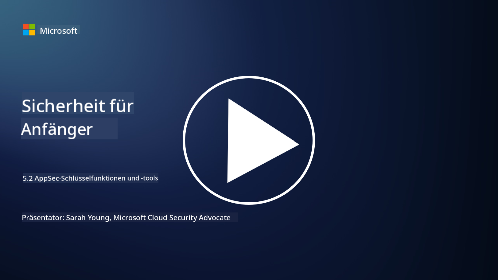

<!--
CO_OP_TRANSLATOR_METADATA:
{
  "original_hash": "790a3fa7e535ec60bb51bde13e759781",
  "translation_date": "2025-09-03T18:41:04+00:00",
  "source_file": "5.2 AppSec key capabilities.md",
  "language_code": "de"
}
-->
## Einführung

In dieser Lektion behandeln wir die wichtigsten Fähigkeiten und Werkzeuge, die in der Anwendungssicherheit eingesetzt werden.

## Wichtige Fähigkeiten und Werkzeuge in der Anwendungssicherheit

Die zentralen Fähigkeiten und Werkzeuge, die in der Anwendungssicherheit eingesetzt werden, sind entscheidend, um Sicherheitslücken und Bedrohungen in Softwareanwendungen zu identifizieren, zu mindern und zu verhindern. Hier sind einige der wichtigsten:

**1. Statische Anwendungssicherheitsprüfung (SAST)**:

- **Fähigkeiten**: Analysiert Quellcode, Bytecode oder Binärcode, um Sicherheitslücken im Code der Anwendung zu identifizieren.

- **Werkzeuge**: Beispiele sind Fortify, Checkmarx und Veracode.

**2. Dynamische Anwendungssicherheitsprüfung (DAST)**:

- **Fähigkeiten**: Scannt eine laufende Anwendung, um Schwachstellen zu identifizieren, indem Eingabeanfragen gesendet und Antworten analysiert werden.

- **Werkzeuge**: Beispiele sind ZAP, Burp Suite und Qualys Web Application Scanning.

**3. Interaktive Anwendungssicherheitsprüfung (IAST)**:

- **Fähigkeiten**: Kombiniert Elemente von SAST und DAST, um Code zur Laufzeit zu analysieren, genauere Ergebnisse zu liefern und Fehlalarme zu reduzieren.

- **Werkzeuge**: Beispiele sind Contrast Security und HCL AppScan.

**4. Laufzeitanwendungsselbstschutz (RASP)**:

- **Fähigkeiten**: Überwacht und schützt Anwendungen in Echtzeit, indem Sicherheitsbedrohungen erkannt und darauf reagiert wird.

- **Werkzeuge**: Beispiele sind Veracode Runtime Protection und F5 Advanced WAF mit RASP.

**5. Web Application Firewalls (WAFs)**:

- **Fähigkeiten**: Bietet eine Schutzschicht zwischen der Anwendung und dem Internet, filtert eingehenden Datenverkehr und blockiert bösartige Anfragen.

- **Werkzeuge**: Beispiele sind ModSecurity, AWS WAF und Akamai Kona Site Defender.

**6. Abhängigkeitsprüfung**:

- **Fähigkeiten**: Identifiziert Schwachstellen in Drittanbieter-Bibliotheken und -Komponenten, die in der Anwendung verwendet werden.

- **Werkzeuge**: Beispiele sind OWASP Dependency-Check und Snyk.

**7. Penetrationstests (Pen Testing)**:

- **Fähigkeiten**: Simuliert reale Angriffe, um Schwachstellen zu entdecken und die Sicherheit einer Anwendung zu bewerten.

- **Werkzeuge**: Durchgeführt von zertifizierten ethischen Hackern und Sicherheitsexperten mit verschiedenen Tools wie Metasploit und Nmap.

**8. Sicherheitsprüfung und -analyse**:

- **Fähigkeiten**: Scannt nach bekannten Schwachstellen, Konfigurationsfehlern und Sicherheitsfehlkonfigurationen.

- **Werkzeuge**: Beispiele sind Nessus, Qualys Vulnerability Management und OpenVAS.

**9. Container-Sicherheitswerkzeuge**:

- **Fähigkeiten**: Konzentriert sich auf die Sicherung containerisierter Anwendungen und ihrer Umgebungen.

- **Werkzeuge**: Beispiele sind Docker Security Scanning und Aqua Security.

**10. Schulung für sicheres Entwickeln**:

- **Fähigkeiten**: Bietet Schulungs- und Sensibilisierungsprogramme für Entwicklungsteams, um sichere Programmierpraktiken zu fördern.

- **Werkzeuge**: Maßgeschneiderte Schulungsprogramme und Plattformen.

**11. Sicherheitsprüfungs-Frameworks**:

- **Fähigkeiten**: Bietet umfassende Test-Frameworks für verschiedene Anforderungen der Anwendungssicherheitsprüfung.

- **Werkzeuge**: OWASP Amass, OWASP OWTF und FrAppSec.

**12. Werkzeuge zur Überprüfung von sicherem Code**:

- **Fähigkeiten**: Überprüft Quellcode auf Sicherheitslücken und bewährte Programmierpraktiken.

- **Werkzeuge**: Beispiele sind SonarQube und Checkmarx.

**13. Werkzeuge für sichere APIs und Microservices**:

- **Fähigkeiten**: Konzentriert sich auf die Sicherung von APIs und Microservices, einschließlich Authentifizierung, Autorisierung und Datenschutz.

- **Werkzeuge**: Beispiele sind Apigee, AWS API Gateway und Istio.

## Weiterführende Literatur

- [Was ist Anwendungssicherheit? Konzepte, Werkzeuge & Best Practices | HackerOne](https://www.hackerone.com/knowledge-center/what-application-security-concepts-tools-best-practices)
- [Was ist IAST? (Interaktive Anwendungssicherheitsprüfung) (comparitech.com)](https://www.comparitech.com/net-admin/what-is-iast/)
- [10 Arten von Anwendungssicherheitsprüfungswerkzeugen: Wann und wie man sie einsetzt (cmu.edu)](https://insights.sei.cmu.edu/blog/10-types-of-application-security-testing-tools-when-and-how-to-use-them/)
- [Das Gleichgewicht des Cybersecurity-Risikos verschieben: Prinzipien und Ansätze für Sicherheit durch Design und Standard | Cyber.gov.au](https://www.cyber.gov.au/about-us/view-all-content/publications/principles-and-approaches-for-security-by-design-and-default)

---

**Haftungsausschluss**:  
Dieses Dokument wurde mithilfe des KI-Übersetzungsdienstes [Co-op Translator](https://github.com/Azure/co-op-translator) übersetzt. Obwohl wir uns um Genauigkeit bemühen, weisen wir darauf hin, dass automatisierte Übersetzungen Fehler oder Ungenauigkeiten enthalten können. Das Originaldokument in seiner ursprünglichen Sprache sollte als maßgebliche Quelle betrachtet werden. Für kritische Informationen wird eine professionelle menschliche Übersetzung empfohlen. Wir übernehmen keine Haftung für Missverständnisse oder Fehlinterpretationen, die sich aus der Nutzung dieser Übersetzung ergeben.