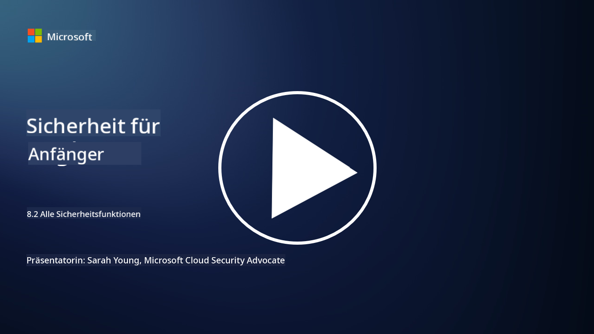

<!--
CO_OP_TRANSLATOR_METADATA:
{
  "original_hash": "b6bb7175672298d1e2f73ba7e0006f95",
  "translation_date": "2025-09-03T18:44:59+00:00",
  "source_file": "8.2 AI security capabilities.md",
  "language_code": "de"
}
-->
# Sicherheitsfunktionen für KI

## Welche Werkzeuge und Fähigkeiten stehen uns derzeit zur Verfügung, um KI-Systeme zu sichern?

Derzeit gibt es mehrere Werkzeuge und Fähigkeiten, um KI-Systeme zu sichern:

-   **Counterfit**: Ein Open-Source-Automatisierungstool für Sicherheitstests von KI-Systemen, das Organisationen dabei hilft, Sicherheitsrisiken von KI zu bewerten und die Robustheit ihrer Algorithmen sicherzustellen.
-   **Tools für adversarielle maschinelle Lernverfahren**: Diese Werkzeuge bewerten die Widerstandsfähigkeit von maschinellen Lernmodellen gegenüber Angriffen und helfen dabei, Schwachstellen zu identifizieren und zu beheben.
-   **KI-Sicherheits-Toolkits**: Es gibt Open-Source-Toolkits, die Ressourcen zur Sicherung von KI-Systemen bereitstellen, einschließlich Bibliotheken und Frameworks zur Implementierung von Sicherheitsmaßnahmen.
-   **Kollaborative Plattformen**: Partnerschaften zwischen Unternehmen und KI-Communities zur Entwicklung von KI-spezifischen Sicherheitsscannern und anderen Tools, um die Lieferkette von KI zu sichern.

Diese Werkzeuge und Fähigkeiten sind Teil eines wachsenden Bereichs, der sich der Verbesserung der Sicherheit von KI-Systemen gegen eine Vielzahl von Bedrohungen widmet. Sie repräsentieren eine Kombination aus Forschung, praktischen Tools und Zusammenarbeit in der Industrie, um die einzigartigen Herausforderungen der KI-Technologien zu bewältigen.

## Was ist mit KI-Red-Teaming? Wie unterscheidet es sich vom traditionellen Sicherheits-Red-Teaming?

KI-Red-Teaming unterscheidet sich in mehreren wesentlichen Aspekten vom traditionellen Sicherheits-Red-Teaming:

-   **Fokus auf KI-Systeme**: KI-Red-Teaming konzentriert sich speziell auf die einzigartigen Schwachstellen von KI-Systemen, wie maschinelle Lernmodelle und Datenpipelines, anstatt auf traditionelle IT-Infrastrukturen.
-   **Testen des Verhaltens von KI**: Es beinhaltet das Testen, wie KI-Systeme auf ungewöhnliche oder unerwartete Eingaben reagieren, was Schwachstellen aufdecken kann, die von Angreifern ausgenutzt werden könnten.
-   **Untersuchung von KI-Ausfällen**: KI-Red-Teaming betrachtet sowohl böswillige als auch harmlose Ausfälle und berücksichtigt eine breitere Palette von Szenarien und potenziellen Systemfehlern, die über reine Sicherheitsverletzungen hinausgehen.
-   **Prompt-Injection und Inhaltserzeugung**: Es umfasst auch das Testen auf Fehler wie Prompt-Injection, bei denen Angreifer KI-Systeme manipulieren, um schädliche oder unzuverlässige Inhalte zu erzeugen.
-   **Ethische und verantwortungsvolle KI**: Es ist Teil der Sicherstellung einer verantwortungsvollen KI-Entwicklung, um sicherzustellen, dass KI-Systeme robust gegenüber Versuchen sind, sie zu unerwünschtem Verhalten zu bringen.

Insgesamt ist KI-Red-Teaming eine erweiterte Praxis, die nicht nur Sicherheitslücken untersucht, sondern auch andere Arten von Systemfehlern spezifisch für KI-Technologien testet. Es ist ein entscheidender Bestandteil der Entwicklung sicherer KI-Systeme, indem neuartige Risiken im Zusammenhang mit der Bereitstellung von KI verstanden und gemindert werden.

## Weiterführende Literatur

 - [Microsoft AI Red Team building future of safer AI | Microsoft Security Blog](https://www.microsoft.com/en-us/security/blog/2023/08/07/microsoft-ai-red-team-building-future-of-safer-ai/?WT.mc_id=academic-96948-sayoung)
 - [Announcing Microsoft’s open automation framework to red team generative AI Systems | Microsoft Security Blog](https://www.microsoft.com/en-us/security/blog/2024/02/22/announcing-microsofts-open-automation-framework-to-red-team-generative-ai-systems/?WT.mc_id=academic-96948-sayoung)
 - [AI Security Tools: The Open-Source Toolkit | Wiz](https://www.wiz.io/academy/ai-security-tools)

---

**Haftungsausschluss**:  
Dieses Dokument wurde mit dem KI-Übersetzungsdienst [Co-op Translator](https://github.com/Azure/co-op-translator) übersetzt. Obwohl wir uns um Genauigkeit bemühen, weisen wir darauf hin, dass automatisierte Übersetzungen Fehler oder Ungenauigkeiten enthalten können. Das Originaldokument in seiner ursprünglichen Sprache sollte als maßgebliche Quelle betrachtet werden. Für kritische Informationen wird eine professionelle menschliche Übersetzung empfohlen. Wir übernehmen keine Haftung für Missverständnisse oder Fehlinterpretationen, die sich aus der Nutzung dieser Übersetzung ergeben.