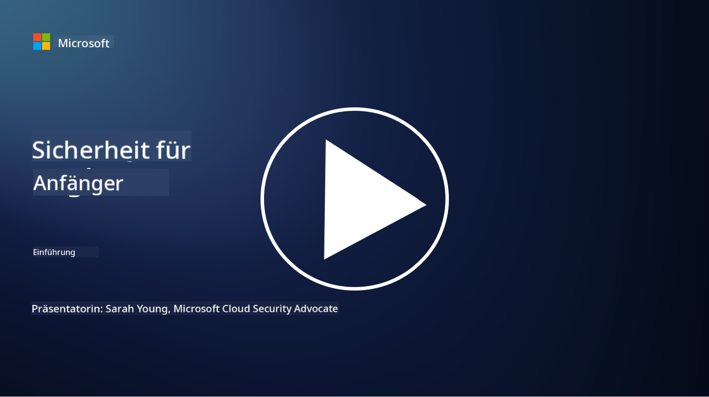

<!--
CO_OP_TRANSLATOR_METADATA:
{
  "original_hash": "79a7e63fa60f649eb3560e1cd7246272",
  "translation_date": "2025-11-18T17:03:37+00:00",
  "source_file": "README.md",
  "language_code": "de"
}
-->

### 🌐 Mehrsprachige Unterstützung

#### Unterstützt durch GitHub Action (Automatisiert & Immer aktuell)

<!-- CO-OP TRANSLATOR LANGUAGES TABLE START -->
[Arabisch](../ar/README.md) | [Bengalisch](../bn/README.md) | [Bulgarisch](../bg/README.md) | [Burmesisch (Myanmar)](../my/README.md) | [Chinesisch (Vereinfacht)](../zh/README.md) | [Chinesisch (Traditionell, Hongkong)](../hk/README.md) | [Chinesisch (Traditionell, Macau)](../mo/README.md) | [Chinesisch (Traditionell, Taiwan)](../tw/README.md) | [Kroatisch](../hr/README.md) | [Tschechisch](../cs/README.md) | [Dänisch](../da/README.md) | [Niederländisch](../nl/README.md) | [Estnisch](../et/README.md) | [Finnisch](../fi/README.md) | [Französisch](../fr/README.md) | [Deutsch](./README.md) | [Griechisch](../el/README.md) | [Hebräisch](../he/README.md) | [Hindi](../hi/README.md) | [Ungarisch](../hu/README.md) | [Indonesisch](../id/README.md) | [Italienisch](../it/README.md) | [Japanisch](../ja/README.md) | [Koreanisch](../ko/README.md) | [Litauisch](../lt/README.md) | [Malaiisch](../ms/README.md) | [Marathi](../mr/README.md) | [Nepalesisch](../ne/README.md) | [Nigerianisches Pidgin](../pcm/README.md) | [Norwegisch](../no/README.md) | [Persisch (Farsi)](../fa/README.md) | [Polnisch](../pl/README.md) | [Portugiesisch (Brasilien)](../br/README.md) | [Portugiesisch (Portugal)](../pt/README.md) | [Punjabi (Gurmukhi)](../pa/README.md) | [Rumänisch](../ro/README.md) | [Russisch](../ru/README.md) | [Serbisch (Kyrillisch)](../sr/README.md) | [Slowakisch](../sk/README.md) | [Slowenisch](../sl/README.md) | [Spanisch](../es/README.md) | [Swahili](../sw/README.md) | [Schwedisch](../sv/README.md) | [Tagalog (Filipino)](../tl/README.md) | [Tamil](../ta/README.md) | [Thai](../th/README.md) | [Türkisch](../tr/README.md) | [Ukrainisch](../uk/README.md) | [Urdu](../ur/README.md) | [Vietnamesisch](../vi/README.md)
<!-- CO-OP TRANSLATOR LANGUAGES TABLE END -->

**Falls Sie zusätzliche Übersetzungen wünschen, finden Sie die unterstützten Sprachen [hier](https://github.com/Azure/co-op-translator/blob/main/getting_started/supported-languages.md)**

#### Treten Sie unserer Community bei 

# 🚀 Cybersicherheit für Anfänger – ein Lehrplan

In diesem Zeitalter der rasanten Einführung von KI-Technologien ist es umso wichtiger, zu verstehen, wie IT-Systeme gesichert werden können. Dieser Kurs wurde entwickelt, um Ihnen grundlegende Konzepte der Cybersicherheit zu vermitteln und Ihr Sicherheitslernen zu starten. Er ist herstellerunabhängig und in kleine Lektionen unterteilt, die jeweils etwa 30-60 Minuten dauern. Jede Lektion enthält ein kleines Quiz und Links zu weiterführenden Informationen, falls Sie tiefer in das Thema eintauchen möchten.

Was dieser Kurs abdeckt 📚

- 🔐 Grundlegende Konzepte der Cybersicherheit wie das CIA-Dreieck, die Unterschiede zwischen Risiken, Bedrohungen usw.
- 🛡️ Verständnis, was eine Sicherheitsmaßnahme ist und welche Formen sie annehmen kann.
- 🌐 Verständnis, was Zero Trust ist und warum es in der modernen Cybersicherheit wichtig ist.
- 🔑 Verständnis von Schlüsselkonzepten und Themen in den Bereichen Identität, Netzwerk, Sicherheitsoperationen, Infrastruktur und Datensicherheit.
- 🔧 Beispiele für Werkzeuge zur Implementierung von Sicherheitsmaßnahmen.

Was dieser Kurs nicht abdeckt 🙅‍♂️

- 🚫 Wie man spezifische Sicherheitswerkzeuge verwendet.
- 🚫 Wie man "hackt" oder Red-Teaming/offensive Sicherheit betreibt.
- 🚫 Informationen über spezifische Compliance-Standards.

Wenn Sie diesen Kurs abgeschlossen haben, können Sie mit einigen unserer Microsoft Learn-Module weitermachen. Wir empfehlen Ihnen, Ihr Lernen mit [Microsoft Security, Compliance, and Identity Fundamentals](https://learn.microsoft.com/training/paths/describe-concepts-of-security-compliance-identity/?WT.mc_id=academic-96948-sayoung) fortzusetzen.

Letztendlich könnten Sie in Betracht ziehen, die [Prüfung SC-900: Microsoft Security, Compliance, and Identity Fundamentals](https://learn.microsoft.com/credentials/certifications/exams/sc-900/?WT.mc_id=academic-96948-sayoung) abzulegen.

> 💁 Wenn Sie Feedback oder Vorschläge zu diesem Kurs haben oder Inhalte vermissen, würden wir uns freuen, von Ihnen zu hören!

## Modulübersicht 📝 
| **Modulnummer**   | **Modulname**                            | **Vermittelte Konzepte**             | **Lernziele**                                                                                                   |
|-------------------|-------------------------------------------|--------------------------------------|-----------------------------------------------------------------------------------------------------------------|
| **1.1**           | Grundlegende Sicherheitskonzepte          | [Das CIA-Dreieck](https://github.com/microsoft/Security-101/blob/main/1.1%20The%20CIA%20triad%20and%20other%20key%20concepts.md)                        | Lernen Sie Vertraulichkeit, Verfügbarkeit und Integrität kennen. Auch Authentizität, Nichtabstreitbarkeit und Datenschutz. |
| **1.2**           | Grundlegende Sicherheitskonzepte          | [Häufige Bedrohungen der Cybersicherheit](https://github.com/microsoft/Security-101/blob/main/1.2%20Common%20cybersecurity%20threats.md)        | Lernen Sie die häufigsten Bedrohungen der Cybersicherheit für Einzelpersonen und Organisationen kennen.         |
| **1.3**           | Grundlegende Sicherheitskonzepte          | [Verständnis des Risikomanagements](https://github.com/microsoft/Security-101/blob/main/1.3%20Understanding%20risk%20management.md)       | Lernen Sie, Risiken zu bewerten und zu verstehen – Auswirkungen/Wahrscheinlichkeit und Implementierung von Maßnahmen.                                                                                                               | |
| **1.4**           | Grundlegende Sicherheitskonzepte          | [Sicherheitspraktiken und Dokumentation](https://github.com/microsoft/Security-101/blob/main/1.4%20Security%20practices%20and%20documentation.md) | Lernen Sie den Unterschied zwischen Richtlinien, Verfahren, Standards und Vorschriften/Gesetzen kennen.         |
| **1.5**           | Grundlegende Sicherheitskonzepte          | [Zero Trust](https://github.com/microsoft/Security-101/blob/main/1.5%20Zero%20trust.md)                           | Lernen Sie, was Zero Trust ist und wie es die Architektur beeinflusst. Was ist Verteidigung in der Tiefe?       |
| **1.6**           | Grundlegende Sicherheitskonzepte          | [Das Modell der geteilten Verantwortung](https://github.com/microsoft/Security-101/blob/main/1.6%20Shared%20responsibility%20model.md)                           | Was ist das Modell der geteilten Verantwortung und wie beeinflusst es die Cybersicherheit?                      |
| **1.7**           | [Quiz am Ende des Moduls](https://github.com/microsoft/Security-101/blob/main/1.7%20End%20of%20module%20quiz.md)                        |                                      |                                                                                                                 |
| **2.1**           | Grundlagen des Identitäts- und Zugriffsmanagements | [IAM Schlüsselkonzepte](https://github.com/microsoft/Security-101/blob/main/2.1%20IAM%20key%20concepts.md)                     | Lernen Sie das Prinzip der minimalen Rechte, die Trennung von Aufgaben und wie IAM Zero Trust unterstützt.      |
| **2.2**           | Grundlagen des Identitäts- und Zugriffsmanagements | [IAM Zero Trust Architektur](https://github.com/microsoft/Security-101/blob/main/2.2%20IAM%20zero%20trust%20architecture.md)          | Lernen Sie, wie Identität die neue Grenze für moderne IT-Umgebungen ist und welche Bedrohungen sie mindert.     |
| **2.3**           | Grundlagen des Identitäts- und Zugriffsmanagements | [IAM Fähigkeiten](https://github.com/microsoft/Security-101/blob/main/2.3%20IAM%20capabilities.md)                     | Lernen Sie IAM-Fähigkeiten und Maßnahmen zur Sicherung von Identitäten kennen.                                  |
| **2.4**           | [Quiz am Ende des Moduls](https://github.com/microsoft/Security-101/blob/main/2.4%20End%20of%20module%20quiz.md)                        |                                      |                                                                                                                 |
| **3.1**           | Grundlagen der Netzwerksicherheit         | [Netzwerk Schlüsselkonzepte](https://github.com/microsoft/Security-101/blob/main/3.1%20Networking%20key%20concepts.md)              | Lernen Sie Netzwerk-Konzepte (IP-Adressen, Portnummern, Verschlüsselung usw.) kennen.                           |
| **3.2**           | Grundlagen der Netzwerksicherheit         | [Netzwerk Zero Trust Architektur](https://github.com/microsoft/Security-101/blob/main/3.2%20Networking%20zero%20trust%20architecture.md)   | Lernen Sie, wie Netzwerke zu einer End-to-End-ZT-Architektur beitragen und welche Bedrohungen sie mindern.      |
| **3.3**           | Grundlagen der Netzwerksicherheit         | [Netzwerksicherheitsfähigkeiten](https://github.com/microsoft/Security-101/blob/main/3.3%20Network%20security%20capabilities.md)        | Lernen Sie Netzwerksicherheits-Tools kennen – Firewalls, WAF, DDoS-Schutz usw.                                 |
| **3.4**           | [Quiz am Ende des Moduls](https://github.com/microsoft/Security-101/blob/main/3.4%20End%20of%20module%20quiz.md)                        |                                      |                                                                                                                 |
| **4.1**           | Grundlagen der Sicherheitsoperationen     | [SecOps Schlüsselkonzepte](https://github.com/microsoft/Security-101/blob/main/4.1%20SecOps%20key%20concepts.md)                  | Lernen Sie, warum Sicherheitsoperationen wichtig sind und wie sie sich von normalen IT-Operations-Teams unterscheiden. |
| **4.2**           | Grundlagen der Sicherheitsoperationen     | [SecOps Zero Trust Architektur](https://github.com/microsoft/Security-101/blob/main/4.2%20SecOps%20zero%20trust%20architecture.md)       | Lernen Sie, wie SecOps zu einer End-to-End-ZT-Architektur beiträgt und welche Bedrohungen sie mindert.          |
| **4.3**           | Grundlagen der Sicherheitsoperationen     | [SecOps Fähigkeiten](https://github.com/microsoft/Security-101/blob/main/4.3%20SecOps%20capabilities.md)                  | Lernen Sie SecOps-Tools kennen – SIEM, XDR usw.                                                                 |
| **4.4**           | [Quiz am Ende des Moduls](https://github.com/microsoft/Security-101/blob/main/4.4%20End%20of%20module%20quiz.md)                        |                                      |                                                                                                                 |
| **5.1**           | Grundlagen der Anwendungssicherheit       | [AppSec Schlüsselkonzepte](https://github.com/microsoft/Security-101/blob/main/5.1%20AppSec%20key%20concepts.md)                  | Lernen Sie AppSec-Konzepte wie "Secure by Design", Eingabevalidierung usw. kennen.                              |
| **5.2**           | Grundlagen der Anwendungssicherheit         | [AppSec-Funktionen](https://github.com/microsoft/Security-101/blob/main/5.2%20AppSec%20key%20capabilities.md)                  | Lernen Sie mehr über AppSec-Tools: Sicherheitstools für Pipelines, Code-Scanning, Geheimnis-Scanning usw.                       |
| **5.3**           | [Quiz am Ende des Moduls](https://github.com/microsoft/Security-101/blob/main/5.3%20End%20of%20module%20quiz.md)                        |                                      |                                                                                                                 |
| **6.1**           | Grundlagen der Infrastruktursicherheit      | [Schlüsselkonzepte der Infrastruktursicherheit](https://github.com/microsoft/Security-101/blob/main/6.1%20Infrastructure%20security%20key%20concepts.md) | Lernen Sie mehr über Systemhärtung, Patchen, Sicherheits-Hygiene, Containersicherheit.                                  |
| **6.2**           | Grundlagen der Infrastruktursicherheit      | [Funktionen der Infrastruktursicherheit](https://github.com/microsoft/Security-101/blob/main/6.2%20Infrastructure%20security%20capabilities.md) | Lernen Sie mehr über Tools, die bei der Infrastruktursicherheit helfen können, z. B. CSPM, Containersicherheit usw.            |
| **6.3**           | [Quiz am Ende des Moduls](https://github.com/microsoft/Security-101/blob/main/6.3%20End%20of%20module%20quiz.md)                        |                                      |                                                                                                                 |
| **7.1**           | Grundlagen der Datensicherheit                | [Schlüsselkonzepte der Datensicherheit](https://github.com/microsoft/Security-101/blob/main/7.1%20Data%20security%20key%20concepts.md)           | Lernen Sie mehr über Datenklassifizierung und -aufbewahrung und warum dies für eine Organisation wichtig ist.                     |
| **7.2**           | Grundlagen der Datensicherheit                | [Funktionen der Datensicherheit](https://github.com/microsoft/Security-101/blob/main/7.2%20Data%20security%20capabilities.md)           | Lernen Sie mehr über Tools zur Datensicherheit – DLP, Risikomanagement für Insider, Daten-Governance usw.                          |
| **7.3**           | [Quiz am Ende des Moduls](https://github.com/microsoft/Security-101/blob/main/7.3%20End%20of%20module%20quiz.md)                        |
| **8.1**           | Grundlagen der KI-Sicherheit                | [Schlüsselkonzepte der KI-Sicherheit](https://github.com/microsoft/Security-101/blob/main/8.1%20AI%20security%20key%20concepts.md)          | Lernen Sie die Unterschiede und Gemeinsamkeiten zwischen traditioneller Sicherheit und KI-Sicherheit kennen.                 |
| **8.2**           | Grundlagen der KI-Sicherheit                | [Funktionen der KI-Sicherheit](https://github.com/microsoft/Security-101/blob/main/8.2%20AI%20security%20capabilities.md)           | Lernen Sie mehr über KI-Sicherheits-Tools und die Kontrollen, die zur Sicherung von KI verwendet werden können.                         |
| **8.3**           | Grundlagen der KI-Sicherheit                | [Verantwortungsvolle KI](https://github.com/microsoft/Security-101/blob/main/8.3%20Responsible%20AI.md)          | Lernen Sie, was verantwortungsvolle KI ist und welche spezifischen Risiken für KI-Sicherheitsexperten relevant sind.                          |
| **8.4**           | [Quiz am Ende des Moduls](https://github.com/microsoft/Security-101/blob/main/8.4%20End%20of%20module%20quiz.md)     

## 🎒 Weitere Kurse 

Unser Team erstellt auch andere Kurse! Schauen Sie sich diese an:

<!-- CO-OP TRANSLATOR OTHER COURSES START -->
### Azure / Edge / MCP / Agents

---
 
### Generative KI-Serie

[-9333EA?style=for-the-badge&labelColor=E5E7EB&color=9333EA)](https://github.com/microsoft/Generative-AI-for-beginners-dotnet?WT.mc_id=academic-105485-koreyst)
[-C084FC?style=for-the-badge&labelColor=E5E7EB&color=C084FC)](https://github.com/microsoft/generative-ai-for-beginners-java?WT.mc_id=academic-105485-koreyst)
[-E879F9?style=for-the-badge&labelColor=E5E7EB&color=E879F9)](https://github.com/microsoft/generative-ai-with-javascript?WT.mc_id=academic-105485-koreyst)

---
 
### Kernlernen

---
 
### Copilot-Serie

<!-- CO-OP TRANSLATOR OTHER COURSES END -->

## Hilfe erhalten

Wenn Sie nicht weiterkommen oder Fragen zum Erstellen von KI-Anwendungen haben, treten Sie mit anderen Lernenden und erfahrenen Entwicklern in Diskussionen über MCP ein. Es ist eine unterstützende Community, in der Fragen willkommen sind und Wissen frei geteilt wird.

Wenn Sie Produktfeedback haben oder auf Fehler beim Erstellen stoßen, besuchen Sie:

---

<!-- CO-OP TRANSLATOR DISCLAIMER START -->
**Haftungsausschluss**:  
Dieses Dokument wurde mit dem KI-Übersetzungsdienst [Co-op Translator](https://github.com/Azure/co-op-translator) übersetzt. Obwohl wir uns um Genauigkeit bemühen, beachten Sie bitte, dass automatisierte Übersetzungen Fehler oder Ungenauigkeiten enthalten können. Das Originaldokument in seiner ursprünglichen Sprache sollte als maßgebliche Quelle betrachtet werden. Für kritische Informationen wird eine professionelle menschliche Übersetzung empfohlen. Wir übernehmen keine Haftung für Missverständnisse oder Fehlinterpretationen, die sich aus der Nutzung dieser Übersetzung ergeben.
<!-- CO-OP TRANSLATOR DISCLAIMER END -->