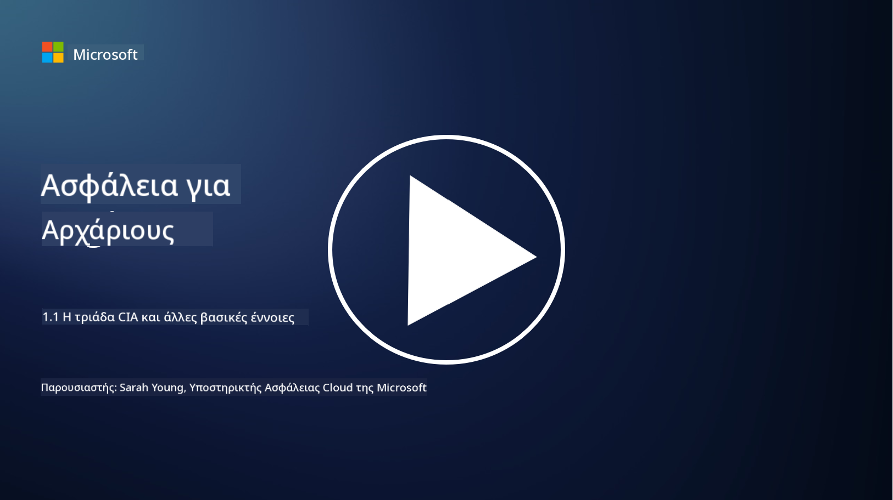
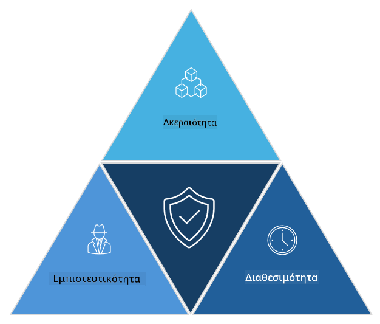

<!--
CO_OP_TRANSLATOR_METADATA:
{
  "original_hash": "16a76f9fa372fb63cffb6d76b855f023",
  "translation_date": "2025-09-03T21:39:41+00:00",
  "source_file": "1.1 The CIA triad and other key concepts.md",
  "language_code": "el"
}
-->
# Το τρίπτυχο CIA και άλλες βασικές έννοιες

## Εισαγωγή

Σε αυτό το μάθημα, θα καλύψουμε:

 - Τι είναι η κυβερνοασφάλεια;
   
 
 - Τι είναι το τρίπτυχο CIA της κυβερνοασφάλειας;

   

 - Τι είναι η αυθεντικότητα, η μη αποκήρυξη και η ιδιωτικότητα στο πλαίσιο της κυβερνοασφάλειας;

## Τι είναι η κυβερνοασφάλεια;

Η κυβερνοασφάλεια, γνωστή και ως ασφάλεια πληροφοριών, είναι η πρακτική προστασίας συστημάτων υπολογιστών, δικτύων, συσκευών και δεδομένων από ψηφιακές επιθέσεις, μη εξουσιοδοτημένη πρόσβαση, ζημιά ή κλοπή. Ο κύριος στόχος της κυβερνοασφάλειας είναι να διασφαλίσει την εμπιστευτικότητα, την ακεραιότητα και τη διαθεσιμότητα των ψηφιακών πόρων και πληροφοριών. Οι επαγγελματίες της κυβερνοασφάλειας σχεδιάζουν και εφαρμόζουν μέτρα ασφαλείας για την προστασία πόρων, δεδομένων και πληροφοριών. Καθώς όλο και περισσότερες πτυχές της ζωής μας γίνονται ψηφιακές και διαδικτυακές, η κυβερνοασφάλεια έχει γίνει κορυφαία προτεραιότητα τόσο για ιδιώτες όσο και για οργανισμούς.

## Τι είναι το τρίπτυχο CIA της κυβερνοασφάλειας;

Το τρίπτυχο της κυβερνοασφάλειας αναφέρεται στο μοντέλο που ενσωματώνει τις τρεις βασικές παραμέτρους για οποιαδήποτε εργασία κυβερνοασφάλειας ή σχεδιασμό συστήματος/περιβάλλοντος:

### Εμπιστευτικότητα

Αυτή είναι η παράμετρος που οι περισσότεροι άνθρωποι συνδέουν με την έννοια της "κυβερνοασφάλειας": η εμπιστευτικότητα είναι η διαδικασία προστασίας δεδομένων και πληροφοριών από μη εξουσιοδοτημένες προσπάθειες πρόσβασης, δηλαδή μόνο όσοι χρειάζονται να δουν τις πληροφορίες μπορούν να έχουν πρόσβαση σε αυτές. Ωστόσο, δεν είναι όλα τα δεδομένα ίσης σημασίας, και τα δεδομένα συνήθως κατηγοριοποιούνται και προστατεύονται με βάση το πόση ζημιά θα μπορούσε να προκληθεί αν αποκτηθούν από λάθος άτομα.

### Ακεραιότητα

Αναφέρεται στην προστασία της ακρίβειας και της αξιοπιστίας των δεδομένων που περιέχονται σε περιβάλλοντα και στην αποτροπή τροποποίησης ή αλλαγής των δεδομένων από μη εξουσιοδοτημένα άτομα. π.χ. ένας μαθητής αλλάζει την ημερομηνία γέννησής του στο αρχείο του στο DMV για να φαίνεται μεγαλύτερος και να επανεκτυπώσει την άδεια οδήγησης με παλαιότερη ημερομηνία γέννησης ώστε να αγοράσει αλκοόλ.

### Διαθεσιμότητα

Αυτή είναι μια παράμετρος που αφορά τη λειτουργική πληροφορική, αλλά η διαθεσιμότητα είναι επίσης σημαντική για την κυβερνοασφάλεια. Υπάρχουν συγκεκριμένοι τύποι επιθέσεων που στοχεύουν τη διαθεσιμότητα και οι επαγγελματίες ασφαλείας πρέπει να προστατεύονται από αυτές (π.χ. επιθέσεις άρνησης υπηρεσίας – DDoS).

**Το τρίπτυχο CIA της κυβερνοασφάλειας**

## Τι είναι η αυθεντικότητα, η μη αποκήρυξη και η ιδιωτικότητα στο πλαίσιο της κυβερνοασφάλειας;

Αυτές είναι πρόσθετες σημαντικές έννοιες που σχετίζονται με τη διασφάλιση της ασφάλειας και της αξιοπιστίας των συστημάτων και των δεδομένων:

**Αυθεντικότητα** - αναφέρεται στη διασφάλιση ότι οι πληροφορίες, η επικοινωνία ή η οντότητα με την οποία αλληλεπιδράτε είναι γνήσια και δεν έχουν παραποιηθεί ή τροποποιηθεί από μη εξουσιοδοτημένα μέρη.

**Μη αποκήρυξη** - είναι η έννοια της διασφάλισης ότι ένα μέρος δεν μπορεί να αρνηθεί τη συμμετοχή του ή την αυθεντικότητα μιας συναλλαγής ή επικοινωνίας. Αποτρέπει κάποιον από το να ισχυριστεί ότι δεν έστειλε ένα μήνυμα ή δεν πραγματοποίησε μια συγκεκριμένη ενέργεια όταν υπάρχουν αποδείξεις για το αντίθετο.

**Ιδιωτικότητα** - αναφέρεται στην προστασία ευαίσθητων και προσωπικά αναγνωρίσιμων πληροφοριών από μη εξουσιοδοτημένη πρόσβαση, χρήση, αποκάλυψη ή τροποποίηση. Περιλαμβάνει τον έλεγχο του ποιος έχει πρόσβαση σε προσωπικά δεδομένα και πώς αυτά τα δεδομένα συλλέγονται, αποθηκεύονται και κοινοποιούνται.

## Πρόσθετη ανάγνωση

[What Is Information Security (InfoSec)? | Microsoft Security](https://www.microsoft.com/security/business/security-101/what-is-information-security-infosec#:~:text=Three%20pillars%20of%20information%20security%3A%20the%20CIA%20triad,as%20guiding%20principles%20for%20implementing%20an%20InfoSec%20plan.)

---

**Αποποίηση ευθύνης**:  
Αυτό το έγγραφο έχει μεταφραστεί χρησιμοποιώντας την υπηρεσία αυτόματης μετάφρασης [Co-op Translator](https://github.com/Azure/co-op-translator). Παρόλο που καταβάλλουμε προσπάθειες για ακρίβεια, παρακαλούμε να έχετε υπόψη ότι οι αυτοματοποιημένες μεταφράσεις ενδέχεται να περιέχουν λάθη ή ανακρίβειες. Το πρωτότυπο έγγραφο στη μητρική του γλώσσα θα πρέπει να θεωρείται η αυθεντική πηγή. Για κρίσιμες πληροφορίες, συνιστάται επαγγελματική ανθρώπινη μετάφραση. Δεν φέρουμε ευθύνη για τυχόν παρεξηγήσεις ή εσφαλμένες ερμηνείες που προκύπτουν από τη χρήση αυτής της μετάφρασης.