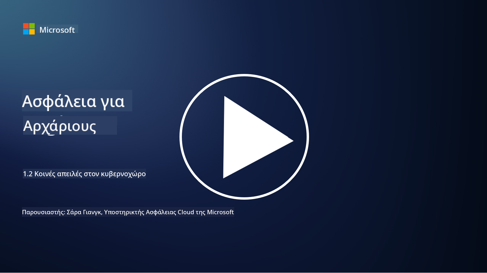

<!--
CO_OP_TRANSLATOR_METADATA:
{
  "original_hash": "6fc3030323139d7134a4ca9d03eccac9",
  "translation_date": "2025-09-03T20:12:13+00:00",
  "source_file": "1.2 Common cybersecurity threats.md",
  "language_code": "el"
}
-->
# Κοινές απειλές στον κυβερνοχώρο

## Εισαγωγή

Σε αυτό το μάθημα, θα καλύψουμε:

- Τι είναι μια απειλή στον κυβερνοχώρο;

- Γιατί οι κακόβουλοι παράγοντες θέλουν να παραβιάσουν δεδομένα και συστήματα πληροφορικής;

- Ποιες είναι οι πιο κοινές μορφές απειλών στον κυβερνοχώρο;

- Τι είναι το πλαίσιο MITRE ATT&CK;

- Πού μπορώ να ενημερώνομαι για το τοπίο των απειλών στον κυβερνοχώρο;

## Τι είναι μια απειλή στον κυβερνοχώρο;

Μια απειλή στον κυβερνοχώρο αναφέρεται σε οποιονδήποτε πιθανό κίνδυνο ή ρίσκο που μπορεί να θέσει σε κίνδυνο την εμπιστευτικότητα, την ακεραιότητα ή τη διαθεσιμότητα δεδομένων ή συστημάτων πληροφορικής. Αυτές οι απειλές προέρχονται από κακόβουλους παράγοντες που προσπαθούν να εκμεταλλευτούν ευπάθειες για να αποκτήσουν μη εξουσιοδοτημένη πρόσβαση, να κλέψουν ευαίσθητες πληροφορίες, να διαταράξουν λειτουργίες ή να προκαλέσουν ζημιά σε άτομα, οργανισμούς ή ακόμα και ολόκληρα έθνη. Οι απειλές στον κυβερνοχώρο μπορούν να πάρουν διάφορες μορφές και να στοχεύσουν διαφορετικές πτυχές ψηφιακών συστημάτων και δεδομένων.

## Γιατί οι κακόβουλοι παράγοντες θέλουν να παραβιάσουν δεδομένα και συστήματα πληροφορικής;

Οι κακόβουλοι παράγοντες παραβιάζουν δεδομένα και συστήματα πληροφορικής για διάφορους λόγους, συχνά καθοδηγούμενοι από προσωπικό όφελος, ιδεολογικά κίνητρα ή την επιθυμία να προκαλέσουν αναστάτωση. Η κατανόηση αυτών των κινήτρων μπορεί να βοηθήσει οργανισμούς και άτομα να αμυνθούν καλύτερα απέναντι στις απειλές στον κυβερνοχώρο. Μερικοί συνηθισμένοι λόγοι για τους οποίους οι κακόβουλοι παράγοντες πραγματοποιούν κυβερνοεπιθέσεις περιλαμβάνουν:

1. **Οικονομικό Όφελος**: Πολλές επιθέσεις καθοδηγούνται από την επιθυμία για οικονομικό κέρδος. Οι κακόβουλοι παράγοντες μπορεί να κλέψουν ευαίσθητες πληροφορίες, όπως αριθμούς πιστωτικών καρτών, τραπεζικούς λογαριασμούς ή προσωπικά δεδομένα, για να διαπράξουν απάτη, κλοπή ταυτότητας, να εκβιάσουν άτομα ή οργανισμούς ή να πουλήσουν τα κλεμμένα δεδομένα στο σκοτεινό διαδίκτυο.

2. **Κατασκοπεία**: Κράτη, ανταγωνιστές ή άλλες οντότητες μπορεί να εμπλακούν σε κυβερνοκατασκοπεία για να κλέψουν ευαίσθητα κυβερνητικά, εταιρικά ή ερευνητικά δεδομένα για πολιτικό, οικονομικό ή στρατιωτικό πλεονέκτημα.

3. **Διατάραξη και Σαμποτάζ**: Ορισμένες επιθέσεις στοχεύουν στη διατάραξη κρίσιμων υποδομών, υπηρεσιών ή λειτουργιών για πολιτικούς ή ιδεολογικούς λόγους. Αυτές οι επιθέσεις μπορούν να προκαλέσουν εκτεταμένο χάος, οικονομικές απώλειες και ζημιά στη φήμη.

4. **Ιδεολογικά Κίνητρα**: Χάκερς και ομάδες με ιδεολογικά ή πολιτικά κίνητρα μπορεί να παραβιάσουν συστήματα για να ευαισθητοποιήσουν σχετικά με συγκεκριμένα ζητήματα, να προωθήσουν τις πεποιθήσεις τους ή να διαμαρτυρηθούν ενάντια σε συγκεκριμένες ενέργειες ή οργανισμούς.

5. **Ακούσιες Ενέργειες**: Δεν είναι όλες οι κακόβουλες ενέργειες σκόπιμες. Ορισμένα άτομα μπορεί να συμβάλλουν άθελά τους σε απειλές στον κυβερνοχώρο, πέφτοντας θύματα κοινωνικής μηχανικής ή αποτελώντας μέρος ενός παραβιασμένου δικτύου.

Τελικά, τα κίνητρα για την παραβίαση δεδομένων και συστημάτων πληροφορικής μπορεί να διαφέρουν σημαντικά, και ο αντίκτυπος αυτών των επιθέσεων μπορεί να είναι σοβαρός. Είναι σημαντικό για άτομα, οργανισμούς και κυβερνήσεις να λαμβάνουν σοβαρά υπόψη την κυβερνοασφάλεια και να εφαρμόζουν μέτρα για την προστασία από αυτές τις απειλές.

## Ποιες είναι οι πιο κοινές μορφές απειλών στον κυβερνοχώρο;

Υπάρχουν αρκετές κοινές μορφές κυβερνοεπιθέσεων που χρησιμοποιούν οι κακόβουλοι παράγοντες για να παραβιάσουν συστήματα, να κλέψουν δεδομένα και να προκαλέσουν διαταραχές. Εδώ είναι μερικές από τις πιο διαδεδομένες μορφές τη στιγμή της συγγραφής:

1. **Phishing**:

Το phishing περιλαμβάνει την αποστολή παραπλανητικών email ή μηνυμάτων που φαίνονται να προέρχονται από αξιόπιστες πηγές, με σκοπό να εξαπατήσουν τους παραλήπτες ώστε να αποκαλύψουν ευαίσθητες πληροφορίες, όπως κωδικούς πρόσβασης, αριθμούς πιστωτικών καρτών ή προσωπικά δεδομένα. Το phishing μπορεί επίσης να οδηγήσει τα θύματα σε κακόβουλους ιστότοπους ή να τα κάνει να κατεβάσουν κακόβουλο λογισμικό.

2. **Malware**:

Το κακόβουλο λογισμικό (malware) περιλαμβάνει μια σειρά από κακόβουλα προγράμματα που έχουν σχεδιαστεί για να μολύνουν συστήματα, να κλέψουν δεδομένα ή να προκαλέσουν ζημιά. Τύποι κακόβουλου λογισμικού περιλαμβάνουν:

- **Ransomware**: Κρυπτογραφεί αρχεία και απαιτεί λύτρα για την αποκρυπτογράφησή τους.

- **Trojans**: Μεταμφιεσμένα ως νόμιμο λογισμικό, δίνουν στους επιτιθέμενους μη εξουσιοδοτημένη πρόσβαση.

- **Ιοί**: Αυτοαναπαραγόμενα προγράμματα που προσκολλώνται σε αρχεία και εξαπλώνονται.

- **Worms**: Αυτοαναπαραγόμενα προγράμματα που εξαπλώνονται μέσω δικτύων.

3. **Denial of Service (DoS) και Distributed Denial of Service (DDoS)**:

Οι επιθέσεις DoS υπερφορτώνουν ένα σύστημα-στόχο, καθιστώντας το μη διαθέσιμο στους χρήστες. Οι επιθέσεις DDoS περιλαμβάνουν τη χρήση ενός δικτύου παραβιασμένων συσκευών για να πλημμυρίσουν έναν στόχο με κίνηση, καθιστώντας δύσκολη τη λειτουργία του συστήματος ή σταματώντας το εντελώς.

4. **SQL Injection**:

Σε αυτή την επίθεση, οι επιτιθέμενοι χειραγωγούν πεδία εισόδου μιας διαδικτυακής εφαρμογής για να εισάγουν κακόβουλα ερωτήματα SQL, αποκτώντας πιθανώς μη εξουσιοδοτημένη πρόσβαση σε βάσεις δεδομένων και ευαίσθητα δεδομένα.

5. **Cross-Site Scripting (XSS)**:

Οι επιτιθέμενοι εισάγουν κακόβουλα σενάρια σε διαδικτυακές εφαρμογές, τα οποία εκτελούνται από τους ανυποψίαστους χρήστες στους περιηγητές τους. Αυτό μπορεί να οδηγήσει σε κλοπή δεδομένων χρηστών ή/και στη διάδοση κακόβουλου λογισμικού.

6. **Κοινωνική Μηχανική**:

Η κοινωνική μηχανική εκμεταλλεύεται την ανθρώπινη ψυχολογία για να χειραγωγήσει άτομα ώστε να αποκαλύψουν εμπιστευτικές πληροφορίες ή να εκτελέσουν ενέργειες που θέτουν σε κίνδυνο την ασφάλεια.

7. **Zero-Day (0day) Exploits**:

Αυτές οι επιθέσεις στοχεύουν ευπάθειες σε λογισμικό ή υλικό που δεν είναι ακόμη γνωστές στον προμηθευτή ή στο κοινό. Οι επιτιθέμενοι εκμεταλλεύονται αυτές τις ευπάθειες πριν αναπτυχθούν διορθώσεις. Πολλοί οργανισμοί ανησυχούν για τα zero-days, καθώς δεν υπάρχει διαθέσιμη διόρθωση, αλλά δεν είναι τόσο συνηθισμένα όσο οι άλλες επιθέσεις αυτής της λίστας. Όταν ανακαλύπτεται ένα zero-day, οι ερευνητές ασφαλείας εργάζονται γρήγορα για να δημιουργήσουν μια διόρθωση, και έτσι τα zero-days είναι γενικά βραχύβια.

8. **Επιθέσεις Διαπιστευτηρίων**:

Αυτές οι επιθέσεις περιλαμβάνουν επιθέσεις brute force, όπου οι επιτιθέμενοι μαντεύουν επανειλημμένα κωδικούς πρόσβασης, και επιθέσεις credential stuffing, όπου κλεμμένα διαπιστευτήρια από έναν ιστότοπο χρησιμοποιούνται για προσπάθεια πρόσβασης σε άλλους ιστότοπους.

## Τι είναι το πλαίσιο MITRE ATT&CK;

Το [πλαίσιο MITRE ATT&CK](https://attack.mitre.org/) (Adversarial Tactics, Techniques, and Common Knowledge) είναι ένα πλαίσιο που καταγράφει και κατηγοριοποιεί τις τακτικές, τεχνικές και διαδικασίες (TTPs) που χρησιμοποιούν οι επιτιθέμενοι κατά τη διάρκεια κυβερνοεπιθέσεων. Το πλαίσιο δημιουργήθηκε από τον οργανισμό MITRE, έναν μη κερδοσκοπικό οργανισμό που λειτουργεί ερευνητικά και αναπτυξιακά κέντρα για διάφορες κυβερνητικές υπηρεσίες.

Το πλαίσιο MITRE ATT&CK παρέχει έναν τυποποιημένο τρόπο περιγραφής και ανάλυσης των απειλών στον κυβερνοχώρο, επιτρέποντας στους επαγγελματίες της κυβερνοασφάλειας να κατανοούν καλύτερα και να αμύνονται ενάντια σε διάφορες τεχνικές επιθέσεων. Χρησιμοποιείται ευρέως από ομάδες ασφαλείας, κυνηγούς απειλών και ανταποκριτές περιστατικών για:

1. **Κατανόηση της Συμπεριφοράς των Επιτιθέμενων**: Το πλαίσιο τεκμηριώνει πραγματικές συμπεριφορές επιθέσεων, περιγράφοντας τα βήματα που ακολουθούν οι επιτιθέμενοι από την αρχική είσοδο έως την επίτευξη των στόχων τους. Καλύπτει ένα ευρύ φάσμα τεχνικών επιθέσεων που χρησιμοποιούνται από διαφορετικές ομάδες απειλών.

2. **Σχεδιασμό και Εφαρμογή Αμυντικών Στρατηγικών**: Οι ομάδες ασφαλείας μπορούν να χρησιμοποιήσουν το πλαίσιο για να αναπτύξουν προληπτικές στρατηγικές άμυνας που ευθυγραμμίζονται με τις συγκεκριμένες τακτικές και τεχνικές που μπορεί να χρησιμοποιήσουν οι επιτιθέμενοι.

3. **Ανταπόκριση σε Περιστατικά και Κυνηγός Απειλών**: Κατά τη διερεύνηση περιστατικών ή τη διεξαγωγή κυνηγιού απειλών, οι επαγγελματίες ασφαλείας μπορούν να ανατρέξουν στο πλαίσιο για να εντοπίσουν και να μετριάσουν συγκεκριμένες τεχνικές που χρησιμοποιούνται από τους επιτιθέμενους.

Το πλαίσιο MITRE ATT&CK είναι οργανωμένο σε πίνακες που ομαδοποιούν τεχνικές επιθέσεων με βάση συγκεκριμένες πλατφόρμες και περιβάλλοντα, όπως Windows, macOS, Linux και υπηρεσίες cloud. Κάθε πίνακας χωρίζεται σε τακτικές (υψηλού επιπέδου στόχοι) και τεχνικές (συγκεκριμένες μέθοδοι που χρησιμοποιούνται για την επίτευξη αυτών των στόχων). Για κάθε τεχνική, το πλαίσιο παρέχει πληροφορίες σχετικά με τον τρόπο λειτουργίας της, πιθανές μεθόδους μετριασμού και σχετικές αναφορές σε πραγματικούς επιτιθέμενους που έχουν χρησιμοποιήσει την τεχνική.

Το πλαίσιο ενημερώνεται και επεκτείνεται συνεχώς καθώς συλλέγονται νέες πληροφορίες για απειλές και καθώς εξελίσσεται το τοπίο της κυβερνοασφάλειας. Είναι ένας πολύτιμος πόρος για τη βελτίωση της κυβερνοασφάλειας ενός οργανισμού, επιτρέποντας μια βαθύτερη κατανόηση του τρόπου λειτουργίας των επιτιθέμενων και του τρόπου άμυνας ενάντια στις τακτικές τους.

## Πού μπορώ να ενημερώνομαι για το τοπίο των απειλών στον κυβερνοχώρο;

Υπάρχουν πολλές πηγές που μπορούν να χρησιμοποιηθούν για να ενημερώνεστε σχετικά με τις απειλές στον κυβερνοχώρο. Εδώ είναι μια επιλογή:

- [Open Web Application Security Project (OWASP) top 10 vulnerabilities](https://owasp.org/Top10/)
- [Common Vulnerabilities and Exposures (CVEs)](https://www.bing.com/ck/a?!&&p=53df6007f017bca2JmltdHM9MTY5MjU3NjAwMCZpZ3VpZD0zYmY4N2RiYS1jYWI1LTYwMDgtMWY1YS02ZmYyY2JjNjYxZWUmaW5zaWQ9NTc2OQ&ptn=3&hsh=3&fclid=3bf87dba-cab5-6008-1f5a-6ff2cbc661ee&psq=cve&u=a1aHR0cHM6Ly9iaW5nLmNvbS9hbGluay9saW5rP3VybD1odHRwcyUzYSUyZiUyZmN2ZS5taXRyZS5vcmclMmYmc291cmNlPXNlcnAtcnImaD1BZXN4S0VBWTNnbGhNZEFpd3daMlNSZkZQNTlrODhIUnYxRUtlSkY1RTk0JTNkJnA9a2tvZmZjaWFsd2Vic2l0ZQ&ntb=1 "Common Vulnerabilities and Exposures")
- [Microsoft Security Response Center blogs](https://msrc.microsoft.com/blog/)
- [National Institute of Standards and Technology (NIST)](https://www.dhs.gov/topics/cybersecurity): Το NIST παρέχει πόρους, ειδοποιήσεις και τις τελευταίες ενημερώσεις για πιθανές απειλές στον κυβερνοχώρο.
- [Cybersecurity and Infrastructure Security Agency (CISA)](https://www.cisa.gov/resources-tools/resources/free-cybersecurity-services-and-tools): Το CISA παρέχει πόρους κυβερνοασφάλειας και βέλτιστες πρακτικές για επιχειρήσεις, κυβερνητικές υπηρεσίες και άλλους οργανισμούς. Το CISA μοιράζεται ενημερωμένες πληροφορίες σχετικά με τύπους δραστηριοτήτων ασφαλείας υψηλού αντίκτυπου που επηρεάζουν την κοινότητα συνολικά και σε βάθος ανάλυση για νέες και εξελισσόμενες απειλές στον κυβερνοχώρο.
- [National Cybersecurity Center of Excellence (NCCoE)](https://www.dhs.gov/topics/cybersecurity): Το NCCoE είναι ένας κόμβος που παρέχει πρακτικές λύσεις κυβερνοασφάλειας που μπορούν να εφαρμοστούν σε πραγματικές καταστάσεις.
- [US-CERT](https://www.cisa.gov/resources-tools/resources/free-cybersecurity-services-and-tools): Η Ομάδα Ετοιμότητας Υπολογιστών των Ηνωμένων Πολιτειών (US-CERT) παρέχει μια ποικιλία πόρων κυβερνοασφάλειας, συμπεριλαμβανομένων ειδοποιήσεων, συμβουλών και άλλων.
- Η Ομάδα Αντιμετώπισης Έκτακτων Αναγκών Κυβερνοασφάλειας (CERT) της χώρας σας.

---

**Αποποίηση ευθύνης**:  
Αυτό το έγγραφο έχει μεταφραστεί χρησιμοποιώντας την υπηρεσία αυτόματης μετάφρασης AI [Co-op Translator](https://github.com/Azure/co-op-translator). Παρόλο που καταβάλλουμε προσπάθειες για ακρίβεια, παρακαλούμε να έχετε υπόψη ότι οι αυτόματες μεταφράσεις ενδέχεται να περιέχουν λάθη ή ανακρίβειες. Το πρωτότυπο έγγραφο στη μητρική του γλώσσα θα πρέπει να θεωρείται η αυθεντική πηγή. Για κρίσιμες πληροφορίες, συνιστάται επαγγελματική ανθρώπινη μετάφραση. Δεν φέρουμε ευθύνη για τυχόν παρεξηγήσεις ή εσφαλμένες ερμηνείες που προκύπτουν από τη χρήση αυτής της μετάφρασης.