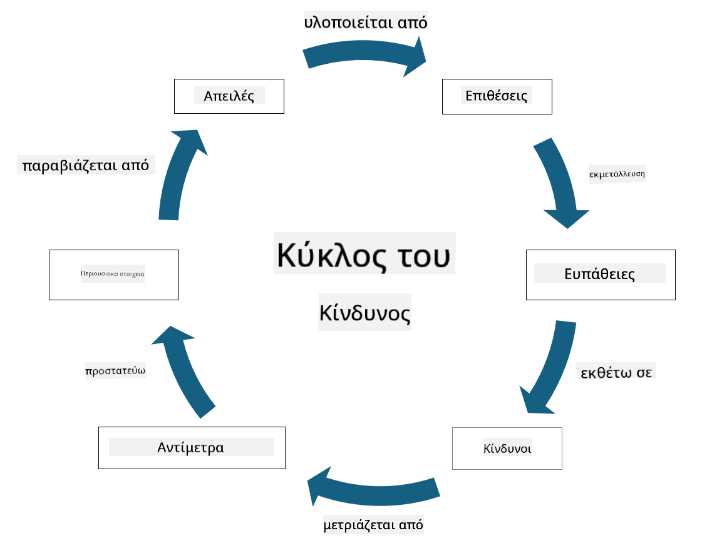

<!--
CO_OP_TRANSLATOR_METADATA:
{
  "original_hash": "fcca304f072cabf206388199e8e2e578",
  "translation_date": "2025-09-03T21:53:40+00:00",
  "source_file": "1.3 Understanding risk management.md",
  "language_code": "el"
}
-->
# Κατανόηση της διαχείρισης κινδύνων

## Εισαγωγή

Σε αυτό το μάθημα, θα καλύψουμε:

 - Ορισμούς κοινών όρων ασφαλείας

 - Τύπους μέτρων ασφαλείας

 - Αξιολόγηση κινδύνων ασφαλείας

## Ορισμοί κοινών όρων ασφαλείας

Αυτοί οι όροι αποτελούν θεμελιώδεις έννοιες στον τομέα της κυβερνοασφάλειας και της διαχείρισης κινδύνων. Ας αναλύσουμε κάθε όρο και πώς σχετίζονται μεταξύ τους:

1. **Παράγοντας Απειλής**:

Ένας παράγοντας απειλής είναι ένα άτομο, ομάδα, οργανισμός ή αυτοματοποιημένο σύστημα που έχει τη δυνατότητα να εκμεταλλευτεί ευπάθειες σε ένα σύστημα ή δίκτυο για να προκαλέσει ζημιά ή βλάβη. Παράγοντες απειλής μπορεί να είναι χάκερ, δημιουργοί κακόβουλου λογισμικού, δυσαρεστημένοι υπάλληλοι ή οποιαδήποτε οντότητα που αποτελεί κίνδυνο για τα πληροφοριακά και τεχνολογικά συστήματα.

2. **Απειλή**:

Μια απειλή είναι ένα πιθανό γεγονός ή ενέργεια που μπορεί να εκμεταλλευτεί ευπάθειες σε ένα σύστημα και να προκαλέσει ζημιά σε ένα περιουσιακό στοιχείο. Οι απειλές μπορεί να περιλαμβάνουν ενέργειες όπως hacking, παραβιάσεις δεδομένων, επιθέσεις άρνησης υπηρεσίας και άλλα. Οι απειλές είναι το "τι" όσον αφορά τη δυνητική ζημιά που μπορεί να προκληθεί στα περιουσιακά στοιχεία ενός οργανισμού.

3. **Ευπάθεια**:

Μια ευπάθεια είναι μια αδυναμία ή ελάττωμα στον σχεδιασμό, την υλοποίηση ή τη διαμόρφωση ενός συστήματος που μπορεί να εκμεταλλευτεί ένας παράγοντας απειλής για να παραβιάσει την ασφάλεια του συστήματος. Οι ευπάθειες μπορεί να υπάρχουν σε λογισμικό, υλικό, διαδικασίες ή ανθρώπινη συμπεριφορά. Η αναγνώριση και η αντιμετώπιση των ευπαθειών είναι απαραίτητη για την ελαχιστοποίηση του κινδύνου επιτυχημένων επιθέσεων.

4. **Κίνδυνος**:

Ο κίνδυνος είναι η πιθανότητα απώλειας, βλάβης ή ζημιάς που προκύπτει από την αλληλεπίδραση μεταξύ μιας απειλής και μιας ευπάθειας. Είναι η πιθανότητα ένας παράγοντας απειλής να εκμεταλλευτεί μια ευπάθεια για να προκαλέσει αρνητική επίδραση. Οι κίνδυνοι συχνά αξιολογούνται με βάση τον πιθανό αντίκτυπο και την πιθανότητα εμφάνισης.

5. **Περιουσιακό Στοιχείο**:

Ένα περιουσιακό στοιχείο είναι οτιδήποτε έχει αξία και ο οργανισμός επιδιώκει να προστατεύσει. Τα περιουσιακά στοιχεία μπορεί να περιλαμβάνουν φυσικά αντικείμενα (όπως υπολογιστές και διακομιστές), δεδομένα (πληροφορίες πελατών, οικονομικά αρχεία), πνευματική ιδιοκτησία (εμπορικά μυστικά, διπλώματα ευρεσιτεχνίας) και ακόμη και ανθρώπινους πόρους (δεξιότητες και γνώσεις υπαλλήλων). Η προστασία των περιουσιακών στοιχείων είναι βασικός στόχος της κυβερνοασφάλειας.

6. **Έκθεση**:

Η έκθεση αναφέρεται στην κατάσταση κατά την οποία ένα σύστημα είναι ευάλωτο σε πιθανές απειλές. Εμφανίζεται όταν υπάρχει μια ευπάθεια που θα μπορούσε να εκμεταλλευτεί ένας παράγοντας απειλής. Η έκθεση υπογραμμίζει τον κίνδυνο που σχετίζεται με την ύπαρξη ευπαθειών σε ένα σύστημα ή δίκτυο.

7. **Μέτρο Ελέγχου**:

Ένα μέτρο ελέγχου είναι μια ενέργεια που εφαρμόζεται για τη μείωση του κινδύνου που σχετίζεται με ευπάθειες και απειλές. Τα μέτρα ελέγχου μπορεί να είναι τεχνικά, διαδικαστικά ή διοικητικά. Σχεδιάζονται για να αποτρέπουν, να ανιχνεύουν ή να μετριάζουν πιθανές απειλές και ευπάθειες. Παραδείγματα περιλαμβάνουν firewalls, ελέγχους πρόσβασης, κρυπτογράφηση, πολιτικές ασφαλείας και εκπαίδευση υπαλλήλων.

Συνοψίζοντας τη σχέση μεταξύ αυτών των όρων: Οι παράγοντες απειλής εκμεταλλεύονται ευπάθειες για να πραγματοποιήσουν απειλές, οι οποίες μπορούν να οδηγήσουν σε κινδύνους που έχουν τη δυνατότητα να προκαλέσουν ζημιά σε πολύτιμα περιουσιακά στοιχεία. Η έκθεση εμφανίζεται όταν υπάρχουν ευπάθειες, και τα μέτρα ελέγχου εφαρμόζονται για να μειώσουν τον κίνδυνο αποτρέποντας ή μετριάζοντας τον αντίκτυπο των απειλών στα περιουσιακά στοιχεία. Αυτό το πλαίσιο αποτελεί τη βάση της διαχείρισης κινδύνων κυβερνοασφάλειας, καθοδηγώντας τους οργανισμούς στην αναγνώριση, αξιολόγηση και αντιμετώπιση πιθανών κινδύνων για τα πληροφοριακά τους συστήματα και περιουσιακά στοιχεία.

## Τύποι μέτρων ασφαλείας

Τα μέτρα ασφαλείας είναι ενέργειες ή μέτρα που εφαρμόζονται για την προστασία των πληροφοριακών συστημάτων και περιουσιακών στοιχείων από διάφορες απειλές και ευπάθειες. Μπορούν να ταξινομηθούν σε διάφορες κατηγορίες ανάλογα με τον στόχο και τον σκοπό τους. Ακολουθούν ορισμένοι κοινοί τύποι μέτρων ασφαλείας:

1. **Διοικητικά Μέτρα**:

Αυτά τα μέτρα σχετίζονται με πολιτικές, διαδικασίες και κατευθυντήριες γραμμές που διέπουν τις πρακτικές ασφαλείας και τη συμπεριφορά των χρηστών στον οργανισμό.

- Πολιτικές και διαδικασίες ασφαλείας: Τεκμηριωμένες κατευθυντήριες γραμμές που ορίζουν πώς διατηρείται η ασφάλεια στον οργανισμό.

- Ευαισθητοποίηση και εκπαίδευση ασφαλείας: Προγράμματα για την εκπαίδευση των υπαλλήλων σχετικά με τις βέλτιστες πρακτικές ασφαλείας και τις πιθανές απειλές.

- Αντιμετώπιση και διαχείριση περιστατικών: Σχέδια για την απόκριση και τον μετριασμό περιστατικών ασφαλείας.

2. **Τεχνικά Μέτρα**:

Τα τεχνικά μέτρα περιλαμβάνουν τη χρήση τεχνολογίας για την επιβολή μέτρων ασφαλείας και την προστασία συστημάτων και δεδομένων. Παραδείγματα τεχνικών μέτρων είναι:

- Έλεγχοι πρόσβασης: Μέτρα που περιορίζουν την πρόσβαση των χρηστών σε πόρους βάσει των ρόλων και των δικαιωμάτων τους.

- Κρυπτογράφηση: Μετατροπή δεδομένων σε ασφαλή μορφή για την αποτροπή μη εξουσιοδοτημένης πρόσβασης.

- Firewalls: Συσκευές ασφαλείας δικτύου που φιλτράρουν και ελέγχουν την εισερχόμενη και εξερχόμενη κίνηση.

- Συστήματα Ανίχνευσης και Πρόληψης Εισβολών (IDPS): Εργαλεία που παρακολουθούν την κίνηση δικτύου για ύποπτη δραστηριότητα.

- Λογισμικό προστασίας από ιούς και κακόβουλο λογισμικό: Προγράμματα που ανιχνεύουν και αφαιρούν κακόβουλο λογισμικό.

- Μηχανισμοί αυθεντικοποίησης: Μέθοδοι επαλήθευσης της ταυτότητας των χρηστών, όπως κωδικοί πρόσβασης, βιομετρικά δεδομένα και πολυπαραγοντική αυθεντικοποίηση.

- Διαχείριση ενημερώσεων: Τακτική ενημέρωση λογισμικού για την αντιμετώπιση γνωστών ευπαθειών.

3. **Φυσικά Μέτρα**:

Τα φυσικά μέτρα είναι ενέργειες για την προστασία φυσικών περιουσιακών στοιχείων και εγκαταστάσεων.

- Φύλακες ασφαλείας και προσωπικό ελέγχου πρόσβασης: Προσωπικό που παρακολουθεί και ελέγχει την πρόσβαση στις φυσικές εγκαταστάσεις.

- Κάμερες παρακολούθησης: Συστήματα βιντεοπαρακολούθησης για την παρακολούθηση και καταγραφή δραστηριοτήτων.

- Κλειδαριές και φυσικά εμπόδια: Φυσικά μέτρα για τον περιορισμό της πρόσβασης σε ευαίσθητες περιοχές.

- Περιβαλλοντικά μέτρα: Ενέργειες για τη ρύθμιση της θερμοκρασίας, της υγρασίας και άλλων περιβαλλοντικών παραγόντων που επηρεάζουν τον εξοπλισμό και τα κέντρα δεδομένων.

4. **Λειτουργικά Μέτρα**:

Αυτά τα μέτρα σχετίζονται με τις καθημερινές λειτουργίες και δραστηριότητες που διασφαλίζουν τη συνεχή ασφάλεια των συστημάτων.

- Διαχείριση αλλαγών: Διαδικασίες για την παρακολούθηση και έγκριση αλλαγών σε συστήματα και διαμορφώσεις.

- Αντίγραφα ασφαλείας και αποκατάσταση καταστροφών: Σχέδια για τη δημιουργία αντιγράφων ασφαλείας δεδομένων και την αποκατάσταση σε περίπτωση αποτυχίας συστημάτων ή καταστροφών.

- Καταγραφή και έλεγχος: Παρακολούθηση και καταγραφή δραστηριοτήτων συστημάτων για σκοπούς ασφαλείας και συμμόρφωσης.

- Ασφαλείς πρακτικές προγραμματισμού: Κατευθυντήριες γραμμές για τη συγγραφή λογισμικού με ελαχιστοποίηση ευπαθειών.

5. **Νομικά και Κανονιστικά Μέτρα**:

Αυτά τα μέτρα διασφαλίζουν τη συμμόρφωση με τους σχετικούς νόμους, κανονισμούς και βιομηχανικά πρότυπα. Τα πρότυπα που πρέπει να ακολουθήσει ένας οργανισμός εξαρτώνται από τη δικαιοδοσία, τον κλάδο και άλλους παράγοντες.

- Κανονισμοί προστασίας δεδομένων: Συμμόρφωση με νόμους όπως GDPR, HIPAA και CCPA.

- Βιομηχανικά πρότυπα: Τήρηση προτύπων όπως PCI DSS για την ασφάλεια δεδομένων πληρωμών.

Αυτές οι κατηγορίες μέτρων ασφαλείας συνεργάζονται για να δημιουργήσουν μια ολοκληρωμένη στάση ασφαλείας για τους οργανισμούς, βοηθώντας τους να προστατεύσουν τα συστήματα, τα δεδομένα και τα περιουσιακά τους στοιχεία από ένα ευρύ φάσμα απειλών.

## Αξιολόγηση κινδύνων ασφαλείας

Ορισμένοι επαγγελματίες ασφαλείας πιστεύουν ότι η διαχείριση κινδύνων είναι αποκλειστική ευθύνη των ειδικών διαχείρισης κινδύνων. Ωστόσο, η κατανόηση της διαδικασίας διαχείρισης κινδύνων ασφαλείας είναι σημαντική για κάθε επαγγελματία ασφαλείας, ώστε να μπορεί να εκφράσει τους κινδύνους ασφαλείας με τρόπο που να γίνεται κατανοητός και εφαρμόσιμος από τον υπόλοιπο οργανισμό.

Οι οργανισμοί πρέπει να αξιολογούν συνεχώς τους κινδύνους ασφαλείας και να αποφασίζουν ποιες ενέργειες (ή μη ενέργειες) θα λάβουν για την αντιμετώπιση των κινδύνων για την επιχείρηση. Παρακάτω παρατίθεται μια επισκόπηση του τρόπου με τον οποίο γίνεται συνήθως αυτή η διαδικασία. Σημειώστε ότι αυτή η διαδικασία συνήθως εκτελείται από διάφορες ομάδες εντός ενός οργανισμού και σπάνια ανατίθεται σε μία μόνο ομάδα.

1. **Αναγνώριση Περιουσιακών Στοιχείων και Απειλών**:

Ο οργανισμός αναγνωρίζει τα περιουσιακά στοιχεία που θέλει να προστατεύσει. Αυτά μπορεί να περιλαμβάνουν δεδομένα, συστήματα, υλικό, λογισμικό, πνευματική ιδιοκτησία και άλλα. Στη συνέχεια, αναγνωρίζουν πιθανές απειλές που θα μπορούσαν να στοχεύσουν αυτά τα περιουσιακά στοιχεία.

2. **Αξιολόγηση Ευπαθειών**:

Οι οργανισμοί εντοπίζουν ευπάθειες ή αδυναμίες σε συστήματα ή διαδικασίες που θα μπορούσαν να εκμεταλλευτούν οι απειλές. Αυτές οι ευπάθειες μπορεί να προέρχονται από ελαττώματα λογισμικού, λανθασμένες διαμορφώσεις, έλλειψη μέτρων ασφαλείας και ανθρώπινα λάθη.

3. **Αξιολόγηση Πιθανότητας**:

Ο οργανισμός αξιολογεί την πιθανότητα εμφάνισης κάθε απειλής. Αυτό περιλαμβάνει την εξέταση ιστορικών δεδομένων, πληροφοριών για απειλές, τάσεων του κλάδου και εσωτερικών παραγόντων. Η πιθανότητα μπορεί να κατηγοριοποιηθεί ως χαμηλή, μεσαία ή υψηλή, ανάλογα με την πιθανότητα υλοποίησης της απειλής.

4. **Αξιολόγηση Αντίκτυπου**:

Στη συνέχεια, ο οργανισμός καθορίζει τον πιθανό αντίκτυπο κάθε απειλής εάν εκμεταλλευτεί μια ευπάθεια. Ο αντίκτυπος μπορεί να περιλαμβάνει οικονομικές απώλειες, λειτουργικές διακοπές, ζημιά στη φήμη, νομικές συνέπειες και άλλα. Ο αντίκτυπος μπορεί επίσης να κατηγοριοποιηθεί ως χαμηλός, μεσαίος ή υψηλός, ανάλογα με τις πιθανές συνέπειες.

5. **Υπολογισμός Κινδύνου**:

Οι αξιολογήσεις πιθανότητας και αντίκτυπου συνδυάζονται για τον υπολογισμό του συνολικού επιπέδου κινδύνου για κάθε αναγνωρισμένη απειλή. Αυτό γίνεται συχνά χρησιμοποιώντας έναν πίνακα κινδύνου που αποδίδει αριθμητικές τιμές ή ποιοτικούς χαρακτηρισμούς στα επίπεδα πιθανότητας και αντίκτυπου. Το προκύπτον επίπεδο κινδύνου βοηθά στην προτεραιοποίηση των κινδύνων που χρειάζονται άμεση προσοχή.

6. **Προτεραιοποίηση και Λήψη Αποφάσεων**:

Ο οργανισμός προτεραιοποιεί τους κινδύνους εστιάζοντας σε αυτούς με τις υψηλότερες συνδυασμένες τιμές πιθανότητας και αντίκτυπου. Αυτό τους επιτρέπει να κατανείμουν πόρους και να εφαρμόσουν μέτρα ελέγχου πιο αποτελεσματικά. Οι απειλές υψηλού κινδύνου απαιτούν άμεση προσοχή, ενώ οι απειλές χαμηλότερου κινδύνου μπορεί να αντιμετωπιστούν σε μεγαλύτερο χρονικό διάστημα.

7. **Αντιμετώπιση Κινδύνου**:

Με βάση την αξιολόγηση κινδύνου, ο οργανισμός καθορίζει πώς να μετριάσει ή να διαχειριστεί κάθε κίνδυνο. Αυτό μπορεί να περιλαμβάνει την εφαρμογή μέτρων ασφαλείας, τη μεταφορά του κινδύνου μέσω ασφάλισης ή ακόμη και την αποδοχή ορισμένων επιπέδων υπολειπόμενου κινδύνου εάν θεωρούνται διαχειρίσιμα/υπερβολικά δαπανηρά για διόρθωση/κ.λπ.

8. **Συνεχής Παρακολούθηση και Ανασκόπηση**:

Η αξιολόγηση κινδύνου δεν είναι μια διαδικασία που γίνεται μία φορά. Πρέπει να διεξάγεται περιοδικά ή όποτε υπάρχουν σημαντικές αλλαγές στο περιβάλλον του οργανισμού. Η συνεχής παρακολούθηση διασφαλίζει ότι λαμβάνονται υπόψη νέες απειλές, ευπάθειες ή αλλαγές στο επιχειρηματικό τοπίο.

Με την αξιολόγηση των κινδύνων ασφαλείας με αυτή τη δομημένη μέθοδο, οι οργανισμοί μπορούν να λαμβάνουν τεκμηριωμένες αποφάσεις σχετικά με την κατανομή πόρων, τα μέτρα ασφαλείας και τις συνολικές στρατηγικές διαχείρισης κινδύνων. Στόχος είναι η μείωση της συνολικής έκθεσης του οργανισμού σε κινδύνους, ενώ παράλληλα ευθυγραμμίζονται οι προσπάθειες ασφαλείας με τους επιχειρηματικούς στόχ

---

**Αποποίηση ευθύνης**:  
Αυτό το έγγραφο έχει μεταφραστεί χρησιμοποιώντας την υπηρεσία αυτόματης μετάφρασης [Co-op Translator](https://github.com/Azure/co-op-translator). Παρόλο που καταβάλλουμε προσπάθειες για ακρίβεια, παρακαλούμε να έχετε υπόψη ότι οι αυτοματοποιημένες μεταφράσεις ενδέχεται να περιέχουν σφάλματα ή ανακρίβειες. Το πρωτότυπο έγγραφο στη μητρική του γλώσσα θα πρέπει να θεωρείται η αυθεντική πηγή. Για κρίσιμες πληροφορίες, συνιστάται επαγγελματική ανθρώπινη μετάφραση. Δεν φέρουμε ευθύνη για τυχόν παρεξηγήσεις ή εσφαλμένες ερμηνείες που προκύπτουν από τη χρήση αυτής της μετάφρασης.