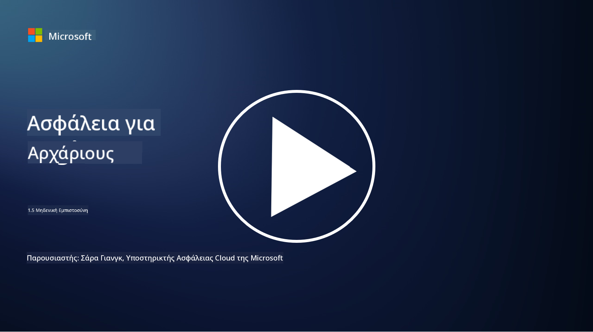
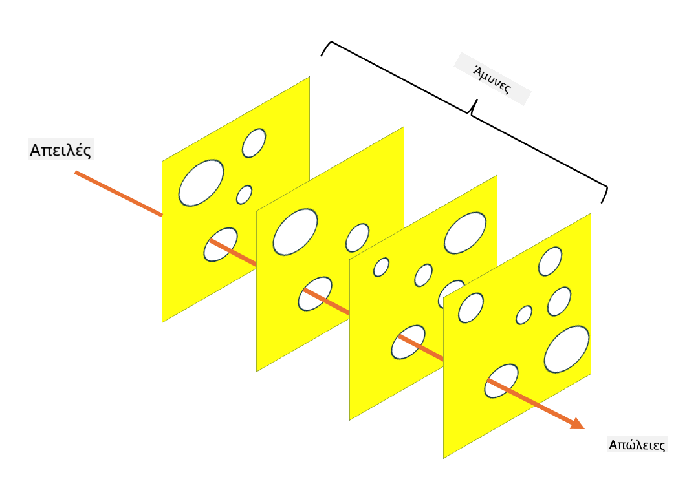

<!--
CO_OP_TRANSLATOR_METADATA:
{
  "original_hash": "75f77f972d2233c584f87c1eb96c983b",
  "translation_date": "2025-09-03T20:31:34+00:00",
  "source_file": "1.5 Zero trust.md",
  "language_code": "el"
}
-->
# Μηδενική Εμπιστοσύνη

Η «Μηδενική Εμπιστοσύνη» είναι μια φράση που χρησιμοποιείται συχνά στους κύκλους ασφαλείας στις μέρες μας. Αλλά τι σημαίνει, είναι απλώς μια λέξη της μόδας; Σε αυτό το μάθημα, θα εξετάσουμε ακριβώς τι είναι η μηδενική εμπιστοσύνη.

## Εισαγωγή

 - Σε αυτό το μάθημα, θα καλύψουμε:
   
   
 - Τι είναι η μηδενική εμπιστοσύνη;

   
  

 - Πώς διαφέρει η μηδενική εμπιστοσύνη από τις παραδοσιακές αρχιτεκτονικές ασφαλείας;

   
   

 - Τι είναι η άμυνα σε βάθος;

## Μηδενική Εμπιστοσύνη

Η Μηδενική Εμπιστοσύνη είναι μια προσέγγιση κυβερνοασφάλειας που αμφισβητεί την παραδοσιακή έννοια του «εμπιστεύσου αλλά επαλήθευσε» υποθέτοντας ότι καμία οντότητα, είτε εντός είτε εκτός του δικτύου ενός οργανισμού, δεν πρέπει να θεωρείται εγγενώς αξιόπιστη. Αντίθετα, η Μηδενική Εμπιστοσύνη υποστηρίζει την επαλήθευση κάθε χρήστη, συσκευής και εφαρμογής που προσπαθεί να αποκτήσει πρόσβαση σε πόρους, ανεξαρτήτως της τοποθεσίας τους. Η βασική αρχή της Μηδενικής Εμπιστοσύνης είναι η ελαχιστοποίηση της «επιφάνειας επίθεσης» και η μείωση του πιθανού αντίκτυπου των παραβιάσεων ασφαλείας.

Στο μοντέλο Μηδενικής Εμπιστοσύνης, δίνεται έμφαση στις ακόλουθες αρχές:

1. **Επαλήθευση Ταυτότητας**: Η αυθεντικοποίηση και η εξουσιοδότηση εφαρμόζονται αυστηρά σε όλους τους χρήστες και τις συσκευές, ανεξαρτήτως της τοποθεσίας τους. Θυμηθείτε ότι μια ταυτότητα δεν είναι απαραίτητα ανθρώπινη: μπορεί να είναι μια συσκευή, μια εφαρμογή, κ.λπ.

2. **Ελάχιστα Δικαιώματα**: Οι χρήστες και οι συσκευές λαμβάνουν το ελάχιστο επίπεδο πρόσβασης που είναι απαραίτητο για την εκτέλεση των εργασιών τους, μειώνοντας τη δυνητική ζημιά σε περίπτωση παραβίασης.

3. **Μικρο-Τμηματοποίηση**: Οι πόροι του δικτύου χωρίζονται σε μικρότερα τμήματα για να περιοριστεί η πλευρική κίνηση εντός του δικτύου σε περίπτωση παραβίασης.

4. **Συνεχής Παρακολούθηση**: Διεξάγεται συνεχής παρακολούθηση και ανάλυση της συμπεριφοράς χρηστών και συσκευών για την ανίχνευση ανωμαλιών και πιθανών απειλών. Οι σύγχρονες τεχνικές παρακολούθησης χρησιμοποιούν επίσης μηχανική μάθηση, AI και πληροφορίες απειλών για να παρέχουν πρόσθετες λεπτομέρειες και πλαίσιο στην παρακολούθηση.

5. **Κρυπτογράφηση Δεδομένων**: Τα δεδομένα κρυπτογραφούνται τόσο κατά τη μεταφορά όσο και κατά την αποθήκευση για την αποτροπή μη εξουσιοδοτημένης πρόσβασης.

6. **Αυστηρός Έλεγχος Πρόσβασης**: Οι έλεγχοι πρόσβασης εφαρμόζονται βάσει πλαισίου, όπως οι ρόλοι χρηστών, η κατάσταση της συσκευής και η τοποθεσία του δικτύου.

Η Microsoft χωρίζει τη μηδενική εμπιστοσύνη σε πέντε πυλώνες, τους οποίους θα συζητήσουμε σε επόμενο μάθημα.

## Διαφορές από Παραδοσιακές Αρχιτεκτονικές Ασφαλείας

Η Μηδενική Εμπιστοσύνη διαφέρει από τις παραδοσιακές αρχιτεκτονικές ασφαλείας, όπως τα μοντέλα που βασίζονται στην περίμετρο, με διάφορους τρόπους:

1. **Περίμετρος vs. Κεντρικότητα Ταυτότητας**: Τα παραδοσιακά μοντέλα επικεντρώνονται στην ασφάλεια της περιμέτρου του δικτύου και υποθέτουν ότι οι εσωτερικοί χρήστες και συσκευές μπορούν να εμπιστευτούν μόλις βρεθούν εντός. Η Μηδενική Εμπιστοσύνη, από την άλλη, υποθέτει ότι οι απειλές μπορούν να προέρχονται τόσο από το εσωτερικό όσο και από το εξωτερικό του δικτύου και εφαρμόζει αυστηρούς ελέγχους βάσει ταυτότητας.

2. **Σιωπηρή vs. Ρητή Εμπιστοσύνη**: Τα παραδοσιακά μοντέλα εμπιστεύονται σιωπηρά τις συσκευές και τους χρήστες εντός του δικτύου μέχρι να αποδειχθεί το αντίθετο. Η Μηδενική Εμπιστοσύνη επαληθεύει ρητά τις ταυτότητες και παρακολουθεί συνεχώς για ανωμαλίες.

3. **Επίπεδο vs. Τμηματοποιημένο Δίκτυο**: Οι παραδοσιακές αρχιτεκτονικές συχνά περιλαμβάνουν επίπεδα δίκτυα όπου οι εσωτερικοί χρήστες έχουν ευρεία πρόσβαση. Η Μηδενική Εμπιστοσύνη υποστηρίζει τη διαίρεση του δικτύου σε μικρότερες, απομονωμένες ζώνες για τον περιορισμό πιθανών παραβιάσεων.

4. **Αντιδραστική vs. Προληπτική Προσέγγιση**: Η παραδοσιακή ασφάλεια συχνά βασίζεται σε αντιδραστικά μέτρα, όπως τα τείχη προστασίας περιμέτρου και η ανίχνευση εισβολών. Η Μηδενική Εμπιστοσύνη υιοθετεί μια προληπτική προσέγγιση υποθέτοντας ότι οι παραβιάσεις είναι πιθανές και ελαχιστοποιώντας τον αντίκτυπό τους.

## Άμυνα σε Βάθος

Η άμυνα σε βάθος, γνωστή και ως πολυεπίπεδη ασφάλεια, είναι μια στρατηγική κυβερνοασφάλειας που περιλαμβάνει την ανάπτυξη πολλαπλών επιπέδων ελέγχων και μέτρων ασφαλείας για την προστασία των περιουσιακών στοιχείων ενός οργανισμού. Ο στόχος είναι να δημιουργηθούν επικαλυπτόμενα επίπεδα άμυνας, ώστε αν ένα επίπεδο παραβιαστεί, τα υπόλοιπα να συνεχίσουν να παρέχουν προστασία. Κάθε επίπεδο επικεντρώνεται σε διαφορετική πτυχή της ασφάλειας και αυξάνει τη συνολική ασφάλεια ενός οργανισμού.

Η άμυνα σε βάθος περιλαμβάνει έναν συνδυασμό τεχνικών, διαδικαστικών και φυσικών μέτρων ασφαλείας. Αυτά μπορεί να περιλαμβάνουν τείχη προστασίας, συστήματα ανίχνευσης εισβολών, ελέγχους πρόσβασης, κρυπτογράφηση, εκπαίδευση χρηστών, πολιτικές ασφαλείας και άλλα. Η ιδέα είναι να δημιουργηθούν πολλαπλά εμπόδια που συλλογικά καθιστούν δύσκολη την παραβίαση των συστημάτων και δικτύων ενός οργανισμού. Αυτό είναι επίσης γνωστό ως το μοντέλο «ελβετικό τυρί», το οποίο χρησιμοποιείται επίσης στην πρόληψη ατυχημάτων σε άλλες βιομηχανίες (π.χ. μεταφορές).

## Περαιτέρω ανάγνωση

[Τι είναι η Μηδενική Εμπιστοσύνη;](https://learn.microsoft.com/security/zero-trust/zero-trust-overview?WT.mc_id=academic-96948-sayoung)

[Εξέλιξη της Μηδενικής Εμπιστοσύνης – Έγγραφο Θέσης της Microsoft](https://query.prod.cms.rt.microsoft.com/cms/api/am/binary/RWJJdT?WT.mc_id=academic-96948-sayoung)

[Μηδενική Εμπιστοσύνη και BeyondCorp Google Cloud | Google Cloud Blog](https://cloud.google.com/blog/topics/developers-practitioners/zero-trust-and-beyondcorp-google-cloud)

---

**Αποποίηση ευθύνης**:  
Αυτό το έγγραφο έχει μεταφραστεί χρησιμοποιώντας την υπηρεσία αυτόματης μετάφρασης [Co-op Translator](https://github.com/Azure/co-op-translator). Παρόλο που καταβάλλουμε προσπάθειες για ακρίβεια, παρακαλούμε να έχετε υπόψη ότι οι αυτοματοποιημένες μεταφράσεις ενδέχεται να περιέχουν λάθη ή ανακρίβειες. Το πρωτότυπο έγγραφο στη μητρική του γλώσσα θα πρέπει να θεωρείται η αυθεντική πηγή. Για κρίσιμες πληροφορίες, συνιστάται επαγγελματική ανθρώπινη μετάφραση. Δεν φέρουμε ευθύνη για τυχόν παρεξηγήσεις ή εσφαλμένες ερμηνείες που προκύπτουν από τη χρήση αυτής της μετάφρασης.