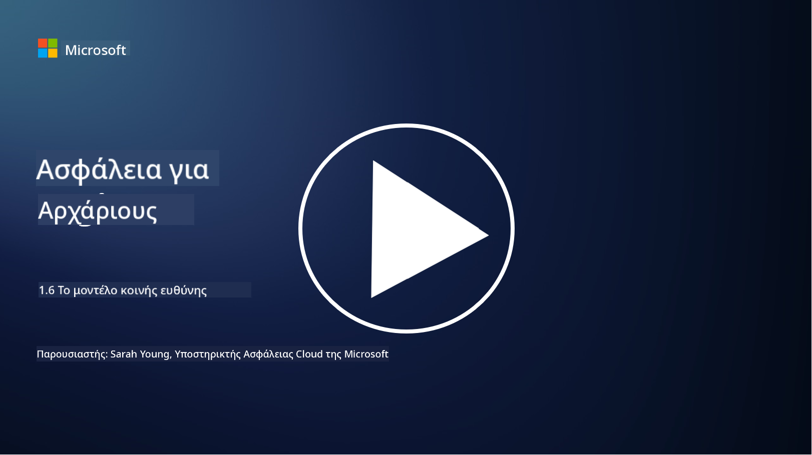

<!--
CO_OP_TRANSLATOR_METADATA:
{
  "original_hash": "a48db640d80c786b928ca178c414f084",
  "translation_date": "2025-09-03T21:04:28+00:00",
  "source_file": "1.6 Shared responsibility model.md",
  "language_code": "el"
}
-->
# Το μοντέλο κοινής ευθύνης

Η κοινή ευθύνη είναι μια νεότερη έννοια στην πληροφορική που προέκυψε με την εμφάνιση του cloud computing. Από την άποψη της κυβερνοασφάλειας, είναι κρίσιμο να κατανοήσουμε ποιος παρέχει ποια μέτρα ασφαλείας, ώστε να μην υπάρχουν κενά στην άμυνα.

## Εισαγωγή

Σε αυτό το μάθημα, θα καλύψουμε:

 - Τι είναι η κοινή ευθύνη στο πλαίσιο της κυβερνοασφάλειας;
   
 - Ποια είναι η διαφορά στην κοινή ευθύνη για μέτρα ασφαλείας
   μεταξύ IaaS, PaaS και SaaS;

   

 - Πού μπορείτε να βρείτε πληροφορίες για τα μέτρα ασφαλείας που παρέχει η πλατφόρμα cloud σας;

   
 

 - Τι σημαίνει "εμπιστεύσου αλλά επαλήθευσε";

## Τι είναι η κοινή ευθύνη στο πλαίσιο της κυβερνοασφάλειας;

Η κοινή ευθύνη στην κυβερνοασφάλεια αναφέρεται στη διανομή των ευθυνών ασφαλείας μεταξύ ενός παρόχου υπηρεσιών cloud (CSP) και των πελατών του. Σε περιβάλλοντα cloud computing, όπως Infrastructure as a Service (IaaS), Platform as a Service (PaaS) και Software as a Service (SaaS), τόσο ο CSP όσο και ο πελάτης έχουν ρόλους για να εξασφαλίσουν την ασφάλεια των δεδομένων, των εφαρμογών και των συστημάτων.

## Ποια είναι η διαφορά στην κοινή ευθύνη για μέτρα ασφαλείας μεταξύ IaaS, PaaS και SaaS;

Η κατανομή των ευθυνών συνήθως εξαρτάται από τον τύπο της υπηρεσίας cloud που χρησιμοποιείται:

 - **IaaS (Infrastructure as a Service)**: Ο CSP παρέχει τη βασική υποδομή (servers, δίκτυα, αποθήκευση), ενώ ο πελάτης είναι υπεύθυνος για τη διαχείριση των λειτουργικών συστημάτων, των εφαρμογών και των ρυθμίσεων ασφαλείας σε αυτήν την υποδομή.
   
   
 - **PaaS (Platform as a Service):** Ο CSP προσφέρει μια πλατφόρμα στην οποία οι πελάτες μπορούν να δημιουργήσουν και να αναπτύξουν εφαρμογές. Ο CSP διαχειρίζεται την υποκείμενη υποδομή, ενώ ο πελάτης επικεντρώνεται στην ανάπτυξη εφαρμογών και την ασφάλεια των δεδομένων.

   

 - **SaaS (Software as a Service)**: Ο CSP παρέχει πλήρως λειτουργικές εφαρμογές προσβάσιμες μέσω του διαδικτύου. Σε αυτήν την περίπτωση, ο CSP είναι υπεύθυνος για την ασφάλεια της εφαρμογής και της υποδομής, ενώ ο πελάτης διαχειρίζεται την πρόσβαση των χρηστών και τη χρήση των δεδομένων.

Η κατανόηση της κοινής ευθύνης είναι κρίσιμη, καθώς διευκρινίζει ποια μέτρα ασφαλείας καλύπτονται από τον CSP και ποια πρέπει να αντιμετωπίσει ο πελάτης. Αυτό βοηθά στην αποφυγή παρεξηγήσεων και εξασφαλίζει ότι τα μέτρα ασφαλείας εφαρμόζονται συνολικά.

## Πού μπορείτε να βρείτε πληροφορίες για τα μέτρα ασφαλείας που παρέχει η πλατφόρμα cloud σας;

Για να βρείτε πληροφορίες σχετικά με τα μέτρα ασφαλείας που παρέχει η πλατφόρμα cloud σας, πρέπει να ανατρέξετε στην τεκμηρίωση και τους πόρους του παρόχου υπηρεσιών cloud. Αυτά περιλαμβάνουν:

 - **Ιστοσελίδα και τεκμηρίωση του CSP**: Η ιστοσελίδα του CSP θα περιέχει πληροφορίες σχετικά με τις δυνατότητες και τα μέτρα ασφαλείας που προσφέρονται ως μέρος των υπηρεσιών τους. Οι CSP συνήθως παρέχουν λεπτομερή τεκμηρίωση που εξηγεί τις πρακτικές ασφαλείας, τα μέτρα και τις συστάσεις τους. Αυτό μπορεί να περιλαμβάνει whitepapers, οδηγούς ασφαλείας και τεχνική τεκμηρίωση.
   
 - **Αξιολογήσεις και ελέγχους ασφαλείας**: Οι περισσότεροι CSP υποβάλλουν τα μέτρα ασφαλείας τους σε αξιολογήσεις από ανεξάρτητους ειδικούς και οργανισμούς ασφαλείας. Αυτές οι αξιολογήσεις μπορούν να παρέχουν πληροφορίες για την ποιότητα των μέτρων ασφαλείας του CSP. Μερικές φορές αυτό οδηγεί τον CSP να αποκτήσει πιστοποιητικό συμμόρφωσης ασφαλείας (βλ. επόμενο σημείο).
 - **Πιστοποιήσεις συμμόρφωσης ασφαλείας**: Οι περισσότεροι CSP αποκτούν πιστοποιήσεις όπως ISO:27001, SOC 2 και FedRAMP, κ.λπ. Αυτές οι πιστοποιήσεις δείχνουν ότι ο πάροχος πληροί συγκεκριμένα πρότυπα ασφαλείας και συμμόρφωσης.

Να θυμάστε ότι το επίπεδο λεπτομέρειας και η διαθεσιμότητα πληροφοριών μπορεί να διαφέρουν μεταξύ των παρόχων cloud. Πάντα να βεβαιώνεστε ότι συμβουλεύεστε επίσημους και ενημερωμένους πόρους που παρέχονται από τον πάροχο υπηρεσιών cloud για να λαμβάνετε ενημερωμένες αποφάσεις σχετικά με την ασφάλεια των περιουσιακών σας στοιχείων στο cloud.

## Τι σημαίνει "εμπιστεύσου αλλά επαλήθευσε";

Στο πλαίσιο της χρήσης ενός CSP, λογισμικού τρίτων ή άλλης υπηρεσίας IT ασφαλείας, ένας οργανισμός μπορεί αρχικά να εμπιστευτεί τους ισχυρισμούς του παρόχου σχετικά με τα μέτρα ασφαλείας. Ωστόσο, για να εξασφαλίσει πραγματικά την ασφάλεια των δεδομένων και των συστημάτων του, θα πρέπει να επαληθεύσει αυτούς τους ισχυρισμούς μέσω αξιολογήσεων ασφαλείας, δοκιμών διείσδυσης και ανασκόπησης των μέτρων ασφαλείας του εξωτερικού παρόχου πριν ενσωματώσει πλήρως το λογισμικό ή την υπηρεσία στις λειτουργίες του. Όλοι οι οργανισμοί και τα άτομα πρέπει να επιδιώκουν να εμπιστεύονται αλλά να επαληθεύουν τα μέτρα ασφαλείας για τα οποία δεν είναι υπεύθυνοι.

## Κοινή ευθύνη εντός ενός οργανισμού

Να θυμάστε ότι η κοινή ευθύνη για την ασφάλεια εντός ενός οργανισμού μεταξύ διαφορετικών ομάδων πρέπει επίσης να λαμβάνεται υπόψη. Η ομάδα ασφαλείας σπάνια θα εφαρμόσει όλα τα μέτρα μόνη της και θα χρειαστεί να συνεργαστεί με τις ομάδες λειτουργιών, τους προγραμματιστές και άλλα μέρη της επιχείρησης για να εφαρμόσει όλα τα μέτρα ασφαλείας που απαιτούνται για να διατηρηθεί ένας οργανισμός ασφαλής.

## Περαιτέρω ανάγνωση
- [Shared responsibility in the cloud - Microsoft Azure | Microsoft Learn](https://learn.microsoft.com/azure/security/fundamentals/shared-responsibility?WT.mc_id=academic-96948-sayoung)
- [What is shared responsibility model? – Definition from TechTarget.com](https://www.techtarget.com/searchcloudcomputing/definition/shared-responsibility-model)
- [The shared responsibility model explained and what it means for cloud security | CSO Online](https://www.csoonline.com/article/570779/the-shared-responsibility-model-explained-and-what-it-means-for-cloud-security.html)
- [Shared Responsibility for Cloud Security: What You Need to Know (cisecurity.org)](https://www.cisecurity.org/insights/blog/shared-responsibility-cloud-security-what-you-need-to-know)

---

**Αποποίηση ευθύνης**:  
Αυτό το έγγραφο έχει μεταφραστεί χρησιμοποιώντας την υπηρεσία αυτόματης μετάφρασης [Co-op Translator](https://github.com/Azure/co-op-translator). Παρόλο που καταβάλλουμε προσπάθειες για ακρίβεια, παρακαλούμε να έχετε υπόψη ότι οι αυτοματοποιημένες μεταφράσεις ενδέχεται να περιέχουν σφάλματα ή ανακρίβειες. Το πρωτότυπο έγγραφο στη μητρική του γλώσσα θα πρέπει να θεωρείται η αυθεντική πηγή. Για κρίσιμες πληροφορίες, συνιστάται επαγγελματική ανθρώπινη μετάφραση. Δεν φέρουμε ευθύνη για τυχόν παρεξηγήσεις ή εσφαλμένες ερμηνείες που προκύπτουν από τη χρήση αυτής της μετάφρασης.