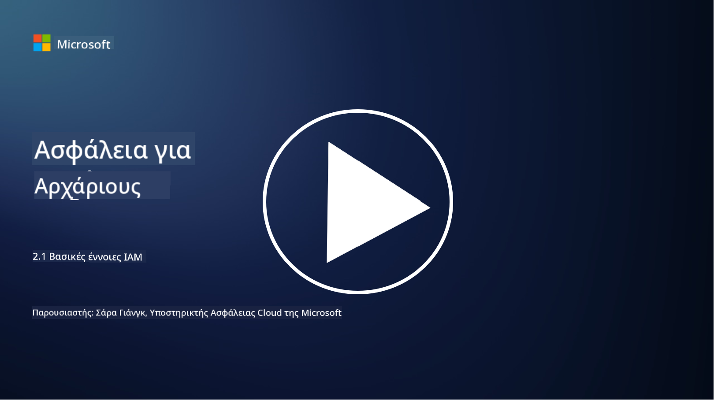

<!--
CO_OP_TRANSLATOR_METADATA:
{
  "original_hash": "2e3864e3d579f0dbb4ac2ec8c5f82acf",
  "translation_date": "2025-09-03T19:36:06+00:00",
  "source_file": "2.1 IAM key concepts.md",
  "language_code": "el"
}
-->
# Βασικές έννοιες IAM

Έχετε συνδεθεί ποτέ σε έναν υπολογιστή ή σε μια ιστοσελίδα; Φυσικά και έχετε! Αυτό σημαίνει ότι έχετε ήδη χρησιμοποιήσει ελέγχους ταυτότητας στην καθημερινή σας ζωή. Η διαχείριση ταυτότητας και πρόσβασης (IAM) αποτελεί βασικό πυλώνα της ασφάλειας, και θα μάθουμε περισσότερα γι' αυτήν στα επόμενα μαθήματα.

**Εισαγωγή**

Σε αυτό το μάθημα, θα καλύψουμε:

- Τι εννοούμε με τη διαχείριση ταυτότητας και πρόσβασης (IAM) στο
  πλαίσιο της κυβερνοασφάλειας;
  
- Τι είναι η αρχή της ελάχιστης προνομιακής πρόσβασης;
  
- Τι είναι ο διαχωρισμός καθηκόντων;
  
- Τι είναι η αυθεντικοποίηση και η εξουσιοδότηση;

## Τι εννοούμε με τη διαχείριση ταυτότητας και πρόσβασης (IAM) στο πλαίσιο της κυβερνοασφάλειας;

Η διαχείριση ταυτότητας και πρόσβασης (IAM) αναφέρεται σε ένα σύνολο διαδικασιών, τεχνολογιών και πολιτικών που εφαρμόζονται για να διασφαλιστεί ότι τα σωστά άτομα έχουν την κατάλληλη πρόσβαση σε πόρους μέσα στο ψηφιακό περιβάλλον ενός οργανισμού. Το IAM περιλαμβάνει τη διαχείριση ψηφιακών ταυτοτήτων (χρηστών, υπαλλήλων, συνεργατών) και της πρόσβασής τους σε συστήματα, εφαρμογές, δεδομένα και δίκτυα. Ο κύριος στόχος του IAM είναι η ενίσχυση της ασφάλειας, η απλοποίηση της πρόσβασης των χρηστών και η συμμόρφωση με τις πολιτικές και τους κανονισμούς του οργανισμού. Οι λύσεις IAM συνήθως περιλαμβάνουν αυθεντικοποίηση χρηστών, εξουσιοδότηση, παροχή ταυτότητας, έλεγχο πρόσβασης και διαχείριση του κύκλου ζωής των χρηστών (διασφαλίζοντας ότι οι λογαριασμοί διαγράφονται όταν δεν χρησιμοποιούνται πλέον).

## Τι είναι η αρχή της ελάχιστης προνομιακής πρόσβασης;

Η αρχή της ελάχιστης προνομιακής πρόσβασης είναι μια θεμελιώδης έννοια που υποστηρίζει την παροχή στους χρήστες και στα συστήματα μόνο των ελάχιστων προνομίων που είναι απαραίτητα για την εκτέλεση των προβλεπόμενων εργασιών ή ρόλων τους. Αυτή η αρχή βοηθά στον περιορισμό της πιθανής ζημιάς που μπορεί να προκύψει σε περίπτωση παραβίασης ασφαλείας ή εσωτερικής απειλής. Με την τήρηση της αρχής της ελάχιστης προνομιακής πρόσβασης, οι οργανισμοί μειώνουν την επιφάνεια επίθεσης και ελαχιστοποιούν τον κίνδυνο μη εξουσιοδοτημένης πρόσβασης, παραβιάσεων δεδομένων και τυχαίας κατάχρησης προνομίων. Στην πράξη, αυτό σημαίνει ότι οι χρήστες έχουν πρόσβαση μόνο στους συγκεκριμένους πόρους και λειτουργίες που απαιτούνται για τους ρόλους εργασίας τους, και τίποτα παραπάνω. Για παράδειγμα, αν χρειάζεστε μόνο να διαβάσετε ένα έγγραφο, θα ήταν υπερβολικό να σας δοθούν πλήρη δικαιώματα διαχειριστή για το συγκεκριμένο έγγραφο.

## Τι είναι ο διαχωρισμός καθηκόντων;

Ο διαχωρισμός καθηκόντων είναι μια αρχή που στοχεύει στην αποτροπή συγκρούσεων συμφερόντων και στη μείωση του κινδύνου απάτης και λαθών, διανέμοντας κρίσιμες εργασίες και ευθύνες σε διαφορετικά άτομα μέσα σε έναν οργανισμό. Στο πλαίσιο της κυβερνοασφάλειας, ο διαχωρισμός καθηκόντων περιλαμβάνει τη διασφάλιση ότι κανένα άτομο δεν έχει τον έλεγχο όλων των πτυχών μιας κρίσιμης διαδικασίας ή συστήματος. Ο στόχος είναι να δημιουργηθεί ένα σύστημα ελέγχων και ισορροπιών που αποτρέπει οποιοδήποτε άτομο από το να έχει τη δυνατότητα να εκτελέσει τόσο το στάδιο εγκατάστασης όσο και το στάδιο έγκρισης μιας διαδικασίας. Για παράδειγμα, στα χρηματοοικονομικά συστήματα, αυτό μπορεί να υπαγορεύει ότι το άτομο που καταχωρεί συναλλαγές στο σύστημα δεν πρέπει να είναι το ίδιο άτομο που εγκρίνει αυτές τις συναλλαγές. Αυτό μειώνει τον κίνδυνο μη εξουσιοδοτημένων ή δόλιων ενεργειών που περνούν απαρατήρητες.

## Τι είναι η αυθεντικοποίηση και η εξουσιοδότηση;

Η αυθεντικοποίηση και η εξουσιοδότηση είναι δύο θεμελιώδεις έννοιες στην κυβερνοασφάλεια που παίζουν κρίσιμο ρόλο στη διασφάλιση της ασφάλειας και της ακεραιότητας των υπολογιστικών συστημάτων και δεδομένων. Συχνά χρησιμοποιούνται σε συνδυασμό για τον έλεγχο της πρόσβασης σε πόρους και την προστασία ευαίσθητων πληροφοριών.

**1. Αυθεντικοποίηση**: Η αυθεντικοποίηση είναι η διαδικασία επαλήθευσης της ταυτότητας ενός χρήστη, συστήματος ή οντότητας που προσπαθεί να αποκτήσει πρόσβαση σε ένα υπολογιστικό σύστημα ή συγκεκριμένο πόρο. Διασφαλίζει ότι η δηλωθείσα ταυτότητα είναι γνήσια και ακριβής. Οι μέθοδοι αυθεντικοποίησης συνήθως περιλαμβάνουν τη χρήση ενός ή περισσότερων από τους παρακάτω παράγοντες:
    
    α. Κάτι που γνωρίζετε: Αυτό περιλαμβάνει κωδικούς πρόσβασης, PIN ή άλλες μυστικές πληροφορίες που μόνο ο εξουσιοδοτημένος χρήστης πρέπει να γνωρίζει.
    
    β. Κάτι που έχετε: Αυτό περιλαμβάνει φυσικά αντικείμενα ή συσκευές όπως έξυπνες κάρτες, διακριτικά ασφαλείας ή κινητά τηλέφωνα που χρησιμοποιούνται για την επιβεβαίωση της ταυτότητας του χρήστη.
    
    γ. Κάτι που είστε: Αυτό αναφέρεται σε βιομετρικούς παράγοντες όπως δακτυλικά αποτυπώματα, αναγνώριση προσώπου ή σάρωση αμφιβληστροειδούς που είναι μοναδικά για ένα άτομο.
    

Οι μηχανισμοί αυθεντικοποίησης χρησιμοποιούνται για να επιβεβαιώσουν ότι ένας χρήστης είναι αυτός που δηλώνει ότι είναι πριν του επιτραπεί η πρόσβαση σε ένα σύστημα ή πόρο. Βοηθά στην αποτροπή μη εξουσιοδοτημένης πρόσβασης και διασφαλίζει ότι μόνο νόμιμοι χρήστες μπορούν να εκτελούν ενέργειες μέσα σε ένα σύστημα.

**2. Εξουσιοδότηση**: Η εξουσιοδότηση είναι η διαδικασία παροχής ή άρνησης συγκεκριμένων δικαιωμάτων και προνομίων σε αυθεντικοποιημένους χρήστες ή οντότητες αφού έχει επαληθευτεί η ταυτότητά τους. Καθορίζει ποιες ενέργειες ή λειτουργίες επιτρέπεται να εκτελέσει ένας χρήστης μέσα σε ένα σύστημα ή σε συγκεκριμένους πόρους. Η εξουσιοδότηση βασίζεται συχνά σε προκαθορισμένες πολιτικές, κανόνες ελέγχου πρόσβασης και ρόλους που έχουν ανατεθεί στους χρήστες.

Η εξουσιοδότηση μπορεί να θεωρηθεί ως η απάντηση στην ερώτηση, "Τι μπορεί να κάνει ένας αυθεντικοποιημένος χρήστης;" Περιλαμβάνει τον καθορισμό και την επιβολή πολιτικών ελέγχου πρόσβασης για την προστασία ευαίσθητων δεδομένων και πόρων από μη εξουσιοδοτημένη πρόσβαση ή τροποποίηση.

**Συνοπτικά:**

- Η αυθεντικοποίηση καθορίζει την ταυτότητα των χρηστών ή οντοτήτων.
- Η εξουσιοδότηση καθορίζει ποιες ενέργειες και πόρους μπορούν να έχουν πρόσβαση ή να τροποποιήσουν οι αυθεντικοποιημένοι χρήστες.

## Περαιτέρω ανάγνωση

- [Describe identity concepts - Training | Microsoft Learn](https://learn.microsoft.com/training/modules/describe-identity-principles-concepts/?WT.mc_id=academic-96948-sayoung)
- [Introduction to identity - Microsoft Entra | Microsoft Learn](https://learn.microsoft.com/azure/active-directory/fundamentals/identity-fundamental-concepts?WT.mc_id=academic-96948-sayoung)
- [What is Identity Access Management (IAM)? | Microsoft Security](https://www.microsoft.com/security/business/security-101/what-is-identity-access-management-iam?WT.mc_id=academic-96948-sayoung)
- [What is IAM? Identity and access management explained | CSO Online](https://www.csoonline.com/article/518296/what-is-iam-identity-and-access-management-explained.html)
- [What is IAM? (auth0.com)](https://auth0.com/blog/what-is-iam/)
- [Security+: implementing Identity and Access Management (IAM) controls [updated 2021] | Infosec (infosecinstitute.com)](https://resources.infosecinstitute.com/certifications/securityplus/security-implementing-identity-and-access-management-iam-controls/)
- [least privilege - Glossary | CSRC (nist.gov)](https://csrc.nist.gov/glossary/term/least_privilege)
- [Security: The Principle of Least Privilege (POLP) - Microsoft Community Hub](https://techcommunity.microsoft.com/t5/azure-sql-blog/security-the-principle-of-least-privilege-polp/ba-p/2067390?WT.mc_id=academic-96948-sayoung)
- [Principle of least privilege | CERT NZ](https://www.cert.govt.nz/it-specialists/critical-controls/principle-of-least-privilege/)
- [Why is separation of duties required by NIST 800-171 and CMMC? - (totem.tech)](https://www.totem.tech/cmmc-separation-of-duties/)

---

**Αποποίηση ευθύνης**:  
Αυτό το έγγραφο έχει μεταφραστεί χρησιμοποιώντας την υπηρεσία αυτόματης μετάφρασης [Co-op Translator](https://github.com/Azure/co-op-translator). Παρόλο που καταβάλλουμε προσπάθειες για ακρίβεια, παρακαλούμε να έχετε υπόψη ότι οι αυτοματοποιημένες μεταφράσεις ενδέχεται να περιέχουν λάθη ή ανακρίβειες. Το πρωτότυπο έγγραφο στη μητρική του γλώσσα θα πρέπει να θεωρείται η αυθεντική πηγή. Για κρίσιμες πληροφορίες, συνιστάται επαγγελματική ανθρώπινη μετάφραση. Δεν φέρουμε ευθύνη για τυχόν παρεξηγήσεις ή εσφαλμένες ερμηνείες που προκύπτουν από τη χρήση αυτής της μετάφρασης.