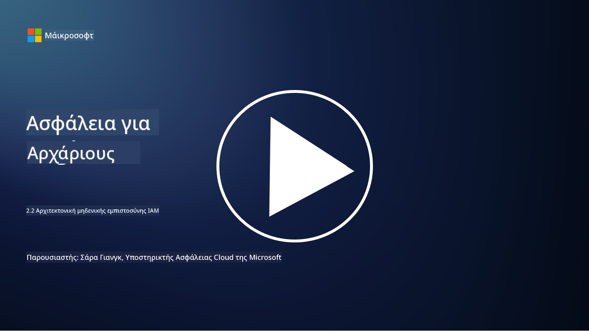

<!--
CO_OP_TRANSLATOR_METADATA:
{
  "original_hash": "4774a978af123f72ebb872199c4c4d4f",
  "translation_date": "2025-09-03T20:26:19+00:00",
  "source_file": "2.2 IAM zero trust architecture.md",
  "language_code": "el"
}
-->
# IAM αρχιτεκτονική μηδενικής εμπιστοσύνης

Η ταυτότητα αποτελεί βασικό μέρος της υλοποίησης μιας αρχιτεκτονικής μηδενικής εμπιστοσύνης και της δημιουργίας ενός περιγράμματος για οποιοδήποτε περιβάλλον πληροφορικής. Σε αυτή την ενότητα θα εξετάσουμε γιατί είναι σημαντικό να χρησιμοποιούμε ελέγχους ταυτότητας για την εφαρμογή της μηδενικής εμπιστοσύνης.

## Εισαγωγή

Σε αυτό το μάθημα, θα καλύψουμε:

 - Γιατί πρέπει να χρησιμοποιούμε την ταυτότητα ως το περίγραμμά μας σε σύγχρονα περιβάλλοντα πληροφορικής;
   
 - Πώς διαφέρει αυτό από τις παραδοσιακές αρχιτεκτονικές πληροφορικής;

 - Πώς χρησιμοποιείται η ταυτότητα για την υλοποίηση μιας αρχιτεκτονικής μηδενικής εμπιστοσύνης;

## Γιατί πρέπει να χρησιμοποιούμε την ταυτότητα ως το περίγραμμά μας σε σύγχρονα περιβάλλοντα πληροφορικής;

Σε σύγχρονα περιβάλλοντα πληροφορικής, η παραδοσιακή έννοια ενός φυσικού περιγράμματος (χρησιμοποιώντας εργαλεία όπως firewalls και όρια δικτύου) ως η κύρια γραμμή άμυνας απέναντι στις κυβερνοαπειλές γίνεται λιγότερο αποτελεσματική λόγω της αυξανόμενης πολυπλοκότητας της τεχνολογίας, της αύξησης της απομακρυσμένης εργασίας και της υιοθέτησης υπηρεσιών cloud. Αντίθετα, οι οργανισμοί στρέφονται προς τη χρήση της ταυτότητας ως το νέο περίγραμμα. Αυτό σημαίνει ότι η ασφάλεια επικεντρώνεται στην επαλήθευση και τη διαχείριση της ταυτότητας χρηστών, συσκευών και εφαρμογών που προσπαθούν να αποκτήσουν πρόσβαση σε πόρους, ανεξάρτητα από τη φυσική τους τοποθεσία.

Ακολουθούν οι λόγοι για τους οποίους η χρήση της ταυτότητας ως περίγραμμα είναι κρίσιμη σε σύγχρονα περιβάλλοντα πληροφορικής:

**Απομακρυσμένο εργατικό δυναμικό**: Με την απομακρυσμένη εργασία και τις κινητές συσκευές να γίνονται ο κανόνας, οι χρήστες μπορούν να αποκτήσουν πρόσβαση σε πόρους από διάφορες τοποθεσίες και συσκευές. Η παραδοσιακή προσέγγιση περιγράμματος δεν λειτουργεί όταν οι χρήστες δεν περιορίζονται πλέον σε ένα φυσικό γραφείο.

**Cloud και υβριδικά περιβάλλοντα**: Οι οργανισμοί υιοθετούν όλο και περισσότερο υπηρεσίες cloud και υβριδικά περιβάλλοντα. Τα δεδομένα και οι εφαρμογές δεν βρίσκονται πλέον αποκλειστικά στις εγκαταστάσεις ενός οργανισμού, καθιστώντας τις παραδοσιακές άμυνες περιγράμματος λιγότερο σχετικές.

**Ασφάλεια μηδενικής εμπιστοσύνης**: Η έννοια της ασφάλειας μηδενικής εμπιστοσύνης υποθέτει ότι καμία οντότητα, είτε εντός είτε εκτός του δικτύου, δεν πρέπει να εμπιστεύεται αυτόματα. Η ταυτότητα γίνεται το θεμέλιο για την επαλήθευση αιτημάτων πρόσβασης, ανεξάρτητα από το πού προέρχονται.

**Τοπίο απειλών**: Οι κυβερνοαπειλές εξελίσσονται και οι επιτιθέμενοι βρίσκουν τρόπους να παρακάμψουν τις παραδοσιακές άμυνες περιγράμματος. Το phishing, η κοινωνική μηχανική και οι εσωτερικές απειλές συχνά εκμεταλλεύονται ανθρώπινες αδυναμίες αντί να προσπαθούν να παραβιάσουν τα περιγράμματα δικτύου.

**Προσέγγιση με επίκεντρο τα δεδομένα**: Η προστασία ευαίσθητων δεδομένων είναι υψίστης σημασίας. Εστιάζοντας στην ταυτότητα, οι οργανισμοί μπορούν να ελέγξουν ποιος έχει πρόσβαση σε ποια δεδομένα, μειώνοντας τον κίνδυνο παραβιάσεων δεδομένων.

## Πώς διαφέρει αυτό από τις παραδοσιακές αρχιτεκτονικές πληροφορικής;

Οι παραδοσιακές αρχιτεκτονικές πληροφορικής βασίζονταν σε μεγάλο βαθμό σε μοντέλα ασφάλειας που επικεντρώνονταν στο περίγραμμα, όπου τα firewalls και τα όρια δικτύου έπαιζαν σημαντικό ρόλο στην αποτροπή απειλών. Οι κύριες διαφορές μεταξύ των παραδοσιακών και των προσεγγίσεων που επικεντρώνονται στην ταυτότητα είναι:

|      Πτυχή                 |      Παραδοσιακές αρχιτεκτονικές πληροφορικής                                                      |      Προσέγγιση με επίκεντρο την ταυτότητα                                                                  |
|-----------------------------|----------------------------------------------------------------------------------------------------|------------------------------------------------------------------------------------------------------------|
|     Εστίαση                |     Εστίαση στο περίγραμμα: Βασίζονταν σε άμυνες περιγράμματος όπως   firewalls και έλεγχος πρόσβασης. |     Εστίαση στην επαλήθευση ταυτότητας: Μετατόπιση από τα όρια δικτύου στην επαλήθευση   ταυτότητας χρήστη/συσκευής. |
|     Τοποθεσία              |     Εξάρτηση από την τοποθεσία: - Η ασφάλεια συνδεόταν με φυσικές τοποθεσίες γραφείων και   όρια δικτύου. |     Ανεξαρτησία τοποθεσίας: Η ασφάλεια δεν συνδέεται με συγκεκριμένες τοποθεσίες· πρόσβαση   από οπουδήποτε. |
|     Υπόθεση εμπιστοσύνης    |     Υποτιθέμενη εμπιστοσύνη: Υποτιθέμενη εμπιστοσύνη εντός του περιγράμματος δικτύου για   χρήστες/συσκευές. |     Προσέγγιση μηδενικής εμπιστοσύνης: Η εμπιστοσύνη δεν υποτίθεται ποτέ· η πρόσβαση επαληθεύεται βάσει   ταυτότητας και πλαισίου. |
|     Εξέταση συσκευών        |     Ποικιλία συσκευών: Υποτίθεται ότι οι συσκευές εντός του περιγράμματος δικτύου ήταν   ασφαλείς. |     Ενημερότητα συσκευών: Λαμβάνεται υπόψη η υγεία και η στάση ασφαλείας της συσκευής,   ανεξαρτήτως τοποθεσίας. |
|     Προστασία δεδομένων     |     Προστασία δεδομένων: Εστίαση στην ασφάλεια των περιγραμμάτων δικτύου για την προστασία   δεδομένων. |     Προστασία με επίκεντρο τα δεδομένα: Εστίαση στον έλεγχο πρόσβασης δεδομένων βάσει   ταυτότητας και ευαισθησίας δεδομένων. |

## Πώς χρησιμοποιείται η ταυτότητα για την υλοποίηση μιας αρχιτεκτονικής μηδενικής εμπιστοσύνης;

Σε μια αρχιτεκτονική μηδενικής εμπιστοσύνης, η θεμελιώδης αρχή είναι να μην εμπιστεύεσαι ποτέ αυτόματα καμία οντότητα, ανεξάρτητα από το αν βρίσκεται εντός ή εκτός του περιγράμματος δικτύου. Η ταυτότητα παίζει κεντρικό ρόλο στην υλοποίηση μιας προσέγγισης μηδενικής εμπιστοσύνης, επιτρέποντας τη συνεχή επαλήθευση των οντοτήτων που προσπαθούν να αποκτήσουν πρόσβαση σε πόρους. Οι σύγχρονοι έλεγχοι ασφάλειας ταυτότητας επιτρέπουν σε κάθε χρήστη, συσκευή, εφαρμογή και υπηρεσία που επιδιώκει πρόσβαση σε πόρους να αναγνωρίζεται και να πιστοποιείται πλήρως πριν χορηγηθεί η πρόσβαση. Αυτό περιλαμβάνει την επαλήθευση της ψηφιακής τους ταυτότητας μέσω μεθόδων όπως συνδυασμοί ονόματος χρήστη/κωδικού πρόσβασης, πολυπαραγοντική πιστοποίηση (MFA), βιομετρικά στοιχεία και άλλοι ισχυροί μηχανισμοί πιστοποίησης.

## Περαιτέρω ανάγνωση

- [Securing identity with Zero Trust | Microsoft Learn](https://learn.microsoft.com/security/zero-trust/deploy/identity?WT.mc_id=academic-96948-sayoung)
- [Zero Trust Principles and Guidance for Identity and Access | CSA (cloudsecurityalliance.org)](https://cloudsecurityalliance.org/artifacts/zero-trust-principles-and-guidance-for-iam/)
- [Zero Trust Identity Controls - Essentials Series - Episode 2 - YouTube](https://www.youtube.com/watch?v=fQZQznIKcGM&list=PLXtHYVsvn_b_gtX1-NB62wNervQx1Fhp4&index=13)

---

**Αποποίηση ευθύνης**:  
Αυτό το έγγραφο έχει μεταφραστεί χρησιμοποιώντας την υπηρεσία αυτόματης μετάφρασης [Co-op Translator](https://github.com/Azure/co-op-translator). Παρόλο που καταβάλλουμε προσπάθειες για ακρίβεια, παρακαλούμε να έχετε υπόψη ότι οι αυτοματοποιημένες μεταφράσεις ενδέχεται να περιέχουν λάθη ή ανακρίβειες. Το πρωτότυπο έγγραφο στη μητρική του γλώσσα θα πρέπει να θεωρείται η αυθεντική πηγή. Για κρίσιμες πληροφορίες, συνιστάται επαγγελματική ανθρώπινη μετάφραση. Δεν φέρουμε ευθύνη για τυχόν παρεξηγήσεις ή εσφαλμένες ερμηνείες που προκύπτουν από τη χρήση αυτής της μετάφρασης.