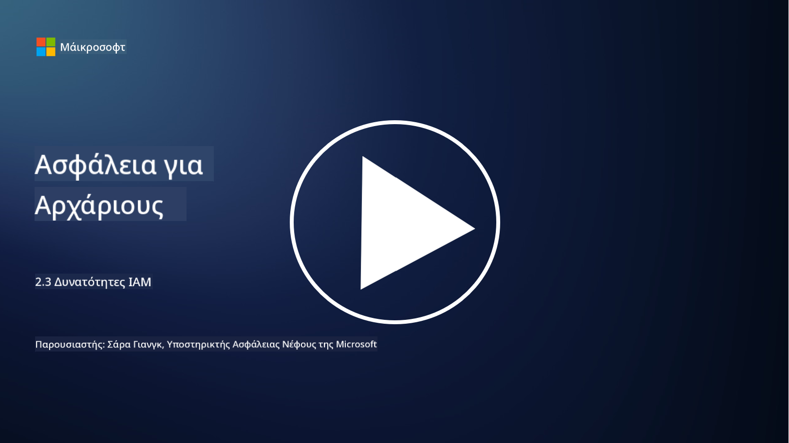

<!--
CO_OP_TRANSLATOR_METADATA:
{
  "original_hash": "bf0b8a54f2c69951744df5a94bc923f7",
  "translation_date": "2025-09-03T22:10:15+00:00",
  "source_file": "2.3 IAM capabilities.md",
  "language_code": "el"
}
-->
# IAM Δυνατότητες

Σε αυτή την ενότητα, θα καλύψουμε περισσότερες λεπτομέρειες σχετικά με τα βασικά εργαλεία και τις δυνατότητες που χρησιμοποιούνται για την ασφάλεια ταυτότητας.

## Εισαγωγή

Σε αυτό το μάθημα, θα καλύψουμε:

 - Τι είναι μια υπηρεσία καταλόγου;
      
     
    
 - Τι είδους δυνατότητες μπορούν να χρησιμοποιηθούν για την ασφάλεια ταυτοτήτων;
>
>        Πολυπαραγοντικός Έλεγχος Ταυτότητας (MFA)
> 
>        Ενιαία Σύνδεση (SSO)
> 
>        Έλεγχος Πρόσβασης Βάσει Ρόλων (RBAC)
> 
>        Προσαρμοστικός Έλεγχος Ταυτότητας
> 
>        Βιομετρικός Έλεγχος Ταυτότητας
> 
>        Διαχείριση Προνομιακής Πρόσβασης (PAM)
> 
>        Διακυβέρνηση και Διαχείριση Ταυτότητας (IGA)
> 
>        Αναλυτική Συμπεριφοράς

## Τι είναι μια υπηρεσία καταλόγου;

Μια υπηρεσία καταλόγου είναι μια εξειδικευμένη βάση δεδομένων που αποθηκεύει και διαχειρίζεται πληροφορίες σχετικά με πόρους δικτύου, όπως χρήστες, ομάδες, συσκευές, εφαρμογές και άλλα αντικείμενα. Λειτουργεί ως κεντρικό αποθετήριο δεδομένων που σχετίζονται με την ταυτότητα και την πρόσβαση, επιτρέποντας στους οργανισμούς να διαχειρίζονται και να ελέγχουν την αυθεντικοποίηση χρηστών, την εξουσιοδότηση και άλλες εργασίες που σχετίζονται με την ασφάλεια με αποτελεσματικότητα.

Οι υπηρεσίες καταλόγου παίζουν κρίσιμο ρόλο στα σύγχρονα περιβάλλοντα πληροφορικής, παρέχοντας τη βάση για λύσεις διαχείρισης ταυτότητας και πρόσβασης (IAM). Διευκολύνουν την ασφαλή πρόσβαση σε πόρους, επιβάλλουν πολιτικές πρόσβασης και απλοποιούν τις διοικητικές εργασίες. Μια από τις πιο γνωστές υπηρεσίες καταλόγου είναι το Microsoft Active Directory, αλλά υπάρχουν και άλλες λύσεις όπως οι κατάλογοι LDAP (Lightweight Directory Access Protocol) που εξυπηρετούν παρόμοιους σκοπούς.

Βασικές λειτουργίες και χαρακτηριστικά μιας υπηρεσίας καταλόγου στο πλαίσιο της κυβερνοασφάλειας περιλαμβάνουν:

 - **Αυθεντικοποίηση Χρηστών**: Οι υπηρεσίες καταλόγου επικυρώνουν τα διαπιστευτήρια των χρηστών (όπως ονόματα χρήστη και κωδικούς πρόσβασης) για να διασφαλίσουν ότι μόνο εξουσιοδοτημένοι χρήστες μπορούν να έχουν πρόσβαση στο δίκτυο και στους πόρους του.
 - **Εξουσιοδότηση Χρηστών**: Καθορίζουν το επίπεδο πρόσβασης που έχει κάθε χρήστης βάσει του ρόλου του, της συμμετοχής του σε ομάδες και άλλων χαρακτηριστικών. Αυτό διασφαλίζει ότι οι χρήστες μπορούν να έχουν πρόσβαση μόνο στους πόρους που δικαιούνται.
 - **Διαχείριση Ομάδων**: Οι υπηρεσίες καταλόγου επιτρέπουν στους διαχειριστές να οργανώνουν τους χρήστες σε λογικές ομάδες, απλοποιώντας τη διαχείριση ελέγχου πρόσβασης. Τα δικαιώματα μπορούν να αποδοθούν σε ομάδες αντί για μεμονωμένους χρήστες.
 - **Πολιτικές Κωδικών Πρόσβασης**: Επιβάλλουν κανόνες για την πολυπλοκότητα και τη λήξη των κωδικών πρόσβασης, ενισχύοντας την ασφάλεια των λογαριασμών χρηστών.
 - **Ενιαία Σύνδεση (SSO)**: Ορισμένες υπηρεσίες καταλόγου υποστηρίζουν SSO, επιτρέποντας στους χρήστες να έχουν πρόσβαση σε πολλαπλές εφαρμογές και υπηρεσίες με ένα μόνο σύνολο διαπιστευτηρίων.
 - **Κεντρική Διαχείριση Χρηστών**: Οι υπηρεσίες καταλόγου κεντροποιούν τις πληροφορίες χρηστών, καθιστώντας ευκολότερη τη διαχείριση λογαριασμών χρηστών, προφίλ και χαρακτηριστικών από μία τοποθεσία.
 - **Καταγραφή και Ελεγχος**: Μπορούν να καταγράφουν δραστηριότητες αυθεντικοποίησης και πρόσβασης χρηστών, βοηθώντας σε ελέγχους ασφαλείας και προσπάθειες συμμόρφωσης.

## Τι είδους δυνατότητες μπορούν να χρησιμοποιηθούν για την ασφάλεια ταυτοτήτων;

**Πολυπαραγοντικός Έλεγχος Ταυτότητας (MFA)**

Ο MFA απαιτεί από τους χρήστες να παρέχουν πολλαπλές μορφές επαλήθευσης πριν από την παροχή πρόσβασης. Αυτό συνήθως περιλαμβάνει κάτι που γνωρίζει ο χρήστης (κωδικός πρόσβασης), κάτι που έχει ο χρήστης (smartphone ή token ασφαλείας) και κάτι που είναι ο χρήστης (βιομετρικά δεδομένα όπως δακτυλικό αποτύπωμα ή αναγνώριση προσώπου).

**Ενιαία Σύνδεση (SSO)**

Το SSO επιτρέπει στους χρήστες να έχουν πρόσβαση σε πολλαπλές εφαρμογές και συστήματα με ένα μόνο σύνολο διαπιστευτηρίων. Αυτό βελτιώνει την εμπειρία του χρήστη και μειώνει τον κίνδυνο που σχετίζεται με τη διαχείριση πολλαπλών κωδικών πρόσβασης.

**Έλεγχος Πρόσβασης Βάσει Ρόλων (RBAC)**

Το RBAC αποδίδει δικαιώματα βάσει προκαθορισμένων ρόλων. Οι χρήστες λαμβάνουν πρόσβαση βάσει των ρόλων τους μέσα σε έναν οργανισμό.

**Προσαρμοστικός Έλεγχος Ταυτότητας**

Ο προσαρμοστικός έλεγχος ταυτότητας αξιολογεί παράγοντες κινδύνου όπως η τοποθεσία, η συσκευή, η ώρα πρόσβασης και η συμπεριφορά του χρήστη για να προσαρμόσει δυναμικά το επίπεδο αυθεντικοποίησης που απαιτείται. Εάν ένα αίτημα φαίνεται ύποπτο, μπορεί να ενεργοποιηθούν επιπλέον βήματα αυθεντικοποίησης.

**Βιομετρικός Έλεγχος Ταυτότητας**

Ο βιομετρικός έλεγχος ταυτότητας χρησιμοποιεί μοναδικά βιολογικά χαρακτηριστικά όπως δακτυλικά αποτυπώματα, χαρακτηριστικά προσώπου, μοτίβα φωνής και ακόμη και συμπεριφορικά χαρακτηριστικά όπως η ταχύτητα πληκτρολόγησης για την επαλήθευση της ταυτότητας.

**Διαχείριση Προνομιακής Πρόσβασης (PAM)**

Η PAM επικεντρώνεται στην ασφάλεια της πρόσβασης σε κρίσιμα συστήματα και δεδομένα, επιβάλλοντας αυστηρούς ελέγχους στους προνομιακούς λογαριασμούς. Περιλαμβάνει δυνατότητες όπως πρόσβαση "just-in-time" και παρακολούθηση συνεδριών.

**Διακυβέρνηση και Διαχείριση Ταυτότητας (IGA)**

Οι λύσεις IGA διαχειρίζονται τις ταυτότητες των χρηστών και την πρόσβασή τους σε πόρους καθ' όλη τη διάρκεια του κύκλου ζωής τους. Αυτό περιλαμβάνει την ένταξη, την παροχή, τον έλεγχο πρόσβασης βάσει ρόλων και την απομάκρυνση.

**Αναλυτική Συμπεριφοράς**

Η αναλυτική συμπεριφοράς παρακολουθεί τη συμπεριφορά των χρηστών και καθορίζει βασικά πρότυπα. Αποκλίσεις από το φυσιολογικό μπορούν να ενεργοποιήσουν ειδοποιήσεις για περαιτέρω διερεύνηση.

# Περαιτέρω ανάγνωση
- [Azure Active Directory fundamentals documentation - Microsoft Entra | Microsoft Learn](https://learn.microsoft.com/azure/active-directory/fundamentals/?WT.mc_id=academic-96948-sayoung)
- [What is Azure Active Directory? - Microsoft Entra | Microsoft Learn](https://learn.microsoft.com/azure/active-directory/fundamentals/whatis?WT.mc_id=academic-96948-sayoung)
- [Manage your multi-cloud identity infrastructure with Microsoft Entra - YouTube](https://www.youtube.com/watch?v=9qQiq3wTS2Y&list=PLXtHYVsvn_b_gtX1-NB62wNervQx1Fhp4&index=18)

---

**Αποποίηση ευθύνης**:  
Αυτό το έγγραφο έχει μεταφραστεί χρησιμοποιώντας την υπηρεσία αυτόματης μετάφρασης [Co-op Translator](https://github.com/Azure/co-op-translator). Παρόλο που καταβάλλουμε προσπάθειες για ακρίβεια, παρακαλούμε να έχετε υπόψη ότι οι αυτοματοποιημένες μεταφράσεις ενδέχεται να περιέχουν λάθη ή ανακρίβειες. Το πρωτότυπο έγγραφο στη μητρική του γλώσσα θα πρέπει να θεωρείται η αυθεντική πηγή. Για κρίσιμες πληροφορίες, συνιστάται επαγγελματική ανθρώπινη μετάφραση. Δεν φέρουμε ευθύνη για τυχόν παρεξηγήσεις ή εσφαλμένες ερμηνείες που προκύπτουν από τη χρήση αυτής της μετάφρασης.