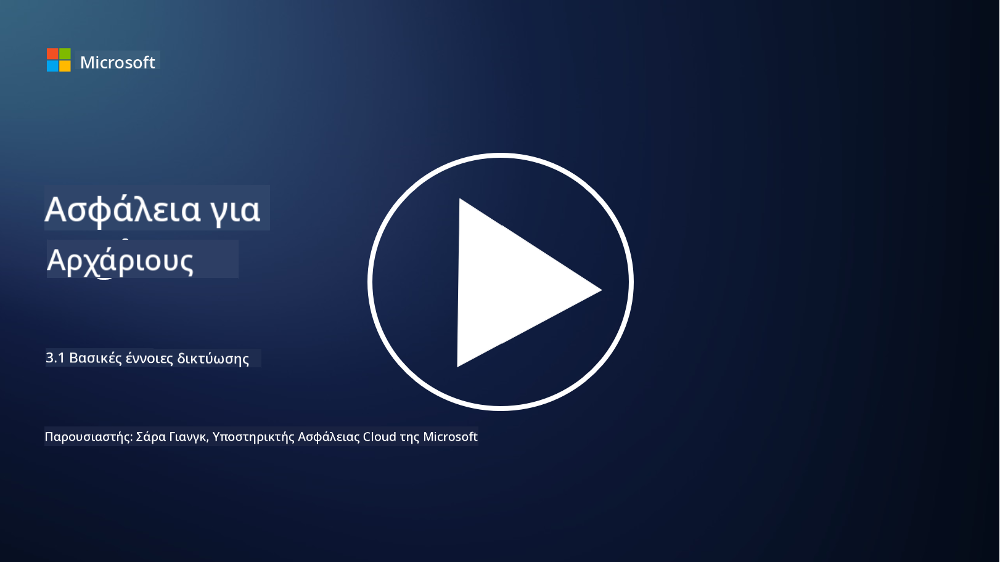
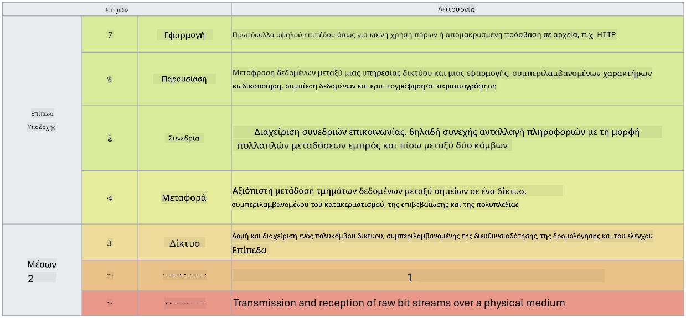

<!--
CO_OP_TRANSLATOR_METADATA:
{
  "original_hash": "252724eceeb183fb9018f88c5e1a3f0c",
  "translation_date": "2025-09-03T22:04:30+00:00",
  "source_file": "3.1 Networking key concepts.md",
  "language_code": "el"
}
-->
# Βασικές έννοιες δικτύωσης

Αν έχετε ασχοληθεί με την πληροφορική, είναι πιθανό να έχετε έρθει σε επαφή με έννοιες δικτύωσης. Παρόλο που χρησιμοποιούμε την ταυτότητα ως κύριο μέσο ελέγχου περιμέτρου σε σύγχρονα περιβάλλοντα, αυτό δεν σημαίνει ότι οι έλεγχοι δικτύου είναι περιττοί. Αν και πρόκειται για ένα τεράστιο θέμα, σε αυτό το μάθημα θα καλύψουμε ορισμένες βασικές έννοιες δικτύωσης.

Σε αυτό το μάθημα θα καλύψουμε:

 - Τι είναι η διευθυνσιοδότηση IP;
   
 - Τι είναι το μοντέλο OSI;

 

 - Τι είναι το TCP/UDP;

   
 

 - Τι είναι οι αριθμοί θύρας;

   
  

 - Τι είναι η κρυπτογράφηση σε κατάσταση ηρεμίας και κατά τη μεταφορά;

## Τι είναι η διευθυνσιοδότηση IP;

Η διευθυνσιοδότηση IP, ή διευθυνσιοδότηση Πρωτοκόλλου Διαδικτύου, είναι μια αριθμητική ετικέτα που αποδίδεται σε κάθε συσκευή που συνδέεται σε ένα δίκτυο υπολογιστών και χρησιμοποιεί το Πρωτόκολλο Διαδικτύου για επικοινωνία. Λειτουργεί ως μοναδικός αναγνωριστικός αριθμός για τις συσκευές μέσα σε ένα δίκτυο, επιτρέποντάς τους να στέλνουν και να λαμβάνουν δεδομένα μέσω του διαδικτύου ή άλλων διασυνδεδεμένων δικτύων. Υπάρχουν δύο κύριες εκδόσεις διευθυνσιοδότησης IP: IPv4 (έκδοση 4 του Πρωτοκόλλου Διαδικτύου) και IPv6 (έκδοση 6 του Πρωτοκόλλου Διαδικτύου). Μια διεύθυνση IP συνήθως αναπαρίσταται είτε σε μορφή IPv4 (π.χ., 192.168.1.1) είτε σε μορφή IPv6 (π.χ., 2001:0db8:85a3:0000:0000:8a2e:0370:7334).

## Τι είναι το μοντέλο OSI;

Το μοντέλο OSI (Open Systems Interconnection) είναι ένα εννοιολογικό πλαίσιο που τυποποιεί τις λειτουργίες ενός συστήματος επικοινωνίας σε επτά διακριτά επίπεδα. Κάθε επίπεδο εκτελεί συγκεκριμένες εργασίες και επικοινωνεί με τα γειτονικά επίπεδα για να εξασφαλίσει αποτελεσματική και αξιόπιστη επικοινωνία δεδομένων μεταξύ συσκευών σε ένα δίκτυο. Τα επίπεδα, από κάτω προς τα πάνω, είναι τα εξής:

 1. Φυσικό Επίπεδο
    
 
 2. Επίπεδο Ζεύξης Δεδομένων

    
    

 1. Δικτυακό Επίπεδο

    
   

 1. Επίπεδο Μεταφοράς

    

 1. Επίπεδο Συνεδρίας

    
   

 1. Επίπεδο Παρουσίασης

    
    

 1. Επίπεδο Εφαρμογής

Το μοντέλο OSI παρέχει ένα κοινό σημείο αναφοράς για την κατανόηση του τρόπου με τον οποίο τα πρωτόκολλα και οι τεχνολογίες δικτύωσης αλληλεπιδρούν, ανεξάρτητα από τις συγκεκριμένες υλοποιήσεις υλικού ή λογισμικού.

_ref: https://en.wikipedia.org/wiki/OSI_model_

## Τι είναι το TCP/UDP;

Το TCP (Transmission Control Protocol) και το UDP (User Datagram Protocol) είναι δύο θεμελιώδη πρωτόκολλα του επιπέδου μεταφοράς που χρησιμοποιούνται σε δίκτυα υπολογιστών για τη διευκόλυνση της επικοινωνίας μεταξύ συσκευών μέσω του διαδικτύου ή ενός τοπικού δικτύου. Είναι υπεύθυνα για τη διάσπαση των δεδομένων σε πακέτα για μετάδοση και στη συνέχεια για την επανασύνθεση αυτών των πακέτων στα αρχικά δεδομένα στην πλευρά του παραλήπτη. Ωστόσο, διαφέρουν ως προς τα χαρακτηριστικά και τις χρήσεις τους.

**TCP (Transmission Control Protocol)**:

Το TCP είναι ένα πρωτόκολλο προσανατολισμένο στη σύνδεση που παρέχει αξιόπιστη και τακτική παράδοση δεδομένων μεταξύ συσκευών. Δημιουργεί μια σύνδεση μεταξύ του αποστολέα και του παραλήπτη πριν ξεκινήσει η ανταλλαγή δεδομένων. Το TCP εξασφαλίζει ότι τα πακέτα δεδομένων φτάνουν με τη σωστή σειρά και μπορεί να χειριστεί την επαναμετάδοση χαμένων πακέτων για να εγγυηθεί την ακεραιότητα και την πληρότητα των δεδομένων. Αυτό καθιστά το TCP κατάλληλο για εφαρμογές που απαιτούν αξιόπιστη παράδοση δεδομένων, όπως η περιήγηση στο διαδίκτυο, το ηλεκτρονικό ταχυδρομείο, η μεταφορά αρχείων (FTP) και η επικοινωνία βάσεων δεδομένων.

**UDP (User Datagram Protocol)**:

Το UDP είναι ένα πρωτόκολλο χωρίς σύνδεση που προσφέρει ταχύτερη μετάδοση δεδομένων αλλά δεν παρέχει το ίδιο επίπεδο αξιοπιστίας όπως το TCP. Δεν δημιουργεί επίσημη σύνδεση πριν από την αποστολή δεδομένων και δεν περιλαμβάνει μηχανισμούς για την επιβεβαίωση ή την επαναμετάδοση χαμένων πακέτων. Το UDP είναι κατάλληλο για εφαρμογές όπου η ταχύτητα και η αποτελεσματικότητα είναι πιο σημαντικές από την εγγυημένη παράδοση, όπως η επικοινωνία σε πραγματικό χρόνο, η ροή πολυμέσων, τα διαδικτυακά παιχνίδια και οι ερωτήσεις DNS.

Συνοπτικά, το TCP δίνει προτεραιότητα στην αξιοπιστία και την τακτική παράδοση, καθιστώντας το κατάλληλο για εφαρμογές που απαιτούν ακρίβεια δεδομένων, ενώ το UDP δίνει έμφαση στην ταχύτητα και την αποτελεσματικότητα, καθιστώντας το κατάλληλο για εφαρμογές όπου η μικρή απώλεια δεδομένων ή η αναδιάταξη της σειράς είναι αποδεκτή με αντάλλαγμα τη μειωμένη καθυστέρηση. Η επιλογή μεταξύ TCP και UDP εξαρτάται από τις συγκεκριμένες απαιτήσεις της εφαρμογής ή της υπηρεσίας που χρησιμοποιείται.

## Τι είναι οι αριθμοί θύρας;

Στη δικτύωση, ένας αριθμός θύρας είναι ένας αριθμητικός αναγνωριστικός αριθμός που χρησιμοποιείται για τη διάκριση μεταξύ διαφορετικών υπηρεσιών ή εφαρμογών που εκτελούνται σε μια συσκευή μέσα σε ένα δίκτυο. Οι θύρες βοηθούν στη δρομολόγηση των εισερχόμενων δεδομένων στην κατάλληλη εφαρμογή. Οι αριθμοί θύρας είναι ακέραιοι 16-bit χωρίς πρόσημο, που σημαίνει ότι κυμαίνονται από 0 έως 65535. Χωρίζονται σε τρεις κατηγορίες:

- Καλά Γνωστές Θύρες (0-1023): Κρατημένες για τυπικές υπηρεσίες όπως το HTTP (θύρα 80) και το FTP (θύρα 21).

- Εγγεγραμμένες Θύρες (1024-49151): Χρησιμοποιούνται για εφαρμογές και υπηρεσίες που δεν ανήκουν στην κατηγορία των καλά γνωστών αλλά είναι επίσημα εγγεγραμμένες.

- Δυναμικές/Ιδιωτικές Θύρες (49152-65535): Διαθέσιμες για προσωρινή ή ιδιωτική χρήση από εφαρμογές.

## Τι είναι η κρυπτογράφηση σε κατάσταση ηρεμίας και κατά τη μεταφορά;

Η κρυπτογράφηση είναι η διαδικασία μετατροπής δεδομένων σε ασφαλή μορφή για την προστασία τους από μη εξουσιοδοτημένη πρόσβαση ή αλλοίωση. Η κρυπτογράφηση μπορεί να εφαρμοστεί στα δεδομένα τόσο "σε κατάσταση ηρεμίας" (όταν αποθηκεύονται σε μια συσκευή ή διακομιστή) όσο και "κατά τη μεταφορά" (όταν μεταδίδονται μεταξύ συσκευών ή μέσω δικτύων).

Κρυπτογράφηση σε Κατάσταση Ηρεμίας: Αυτή περιλαμβάνει την κρυπτογράφηση δεδομένων που αποθηκεύονται σε συσκευές, διακομιστές ή συστήματα αποθήκευσης. Ακόμα κι αν ένας επιτιθέμενος αποκτήσει φυσική πρόσβαση στο μέσο αποθήκευσης, δεν μπορεί να αποκτήσει πρόσβαση στα δεδομένα χωρίς τα κλειδιά κρυπτογράφησης. Αυτό είναι κρίσιμο για την προστασία ευαίσθητων δεδομένων σε περίπτωση κλοπής συσκευής, παραβίασης δεδομένων ή μη εξουσιοδοτημένης πρόσβασης.

Κρυπτογράφηση Κατά τη Μεταφορά: Αυτή περιλαμβάνει την κρυπτογράφηση δεδομένων καθώς ταξιδεύουν μεταξύ συσκευών ή μέσω δικτύων. Αυτό αποτρέπει την υποκλοπή και τη μη εξουσιοδοτημένη παρεμβολή στα δεδομένα κατά τη μετάδοση. Κοινά πρωτόκολλα για κρυπτογράφηση κατά τη μεταφορά περιλαμβάνουν το HTTPS για επικοινωνία στο διαδίκτυο και το TLS/SSL για την ασφάλεια διαφόρων τύπων δικτυακής κίνησης.

## Περαιτέρω ανάγνωση
- [How Do IP Addresses Work? (howtogeek.com)](https://www.howtogeek.com/341307/how-do-ip-addresses-work/)
- [Understanding IP Address: An Introductory Guide (geekflare.com)](https://geekflare.com/understanding-ip-address/)
- [What is the OSI model? The 7 layers of OSI explained (techtarget.com)](https://www.techtarget.com/searchnetworking/definition/OSI)
- [The OSI Model – The 7 Layers of Networking Explained in Plain English (freecodecamp.org)](https://www.freecodecamp.org/news/osi-model-networking-layers-explained-in-plain-english/)
- [TCP/IP protocols - IBM Documentation](https://www.ibm.com/docs/en/aix/7.3?topic=protocol-tcpip-protocols)
- [Common Ports Cheat Sheet: The Ultimate Ports & Protocols List (stationx.net)](https://www.stationx.net/common-ports-cheat-sheet/)
- [Azure Data Encryption-at-Rest - Azure Security | Microsoft Learn](https://learn.microsoft.com/azure/security/fundamentals/encryption-atrest?WT.mc_id=academic-96948-sayoung)

---

**Αποποίηση ευθύνης**:  
Αυτό το έγγραφο έχει μεταφραστεί χρησιμοποιώντας την υπηρεσία αυτόματης μετάφρασης [Co-op Translator](https://github.com/Azure/co-op-translator). Παρόλο που καταβάλλουμε προσπάθειες για ακρίβεια, παρακαλούμε να έχετε υπόψη ότι οι αυτοματοποιημένες μεταφράσεις ενδέχεται να περιέχουν σφάλματα ή ανακρίβειες. Το πρωτότυπο έγγραφο στη μητρική του γλώσσα θα πρέπει να θεωρείται η αυθεντική πηγή. Για κρίσιμες πληροφορίες, συνιστάται επαγγελματική ανθρώπινη μετάφραση. Δεν φέρουμε ευθύνη για τυχόν παρεξηγήσεις ή εσφαλμένες ερμηνείες που προκύπτουν από τη χρήση αυτής της μετάφρασης.