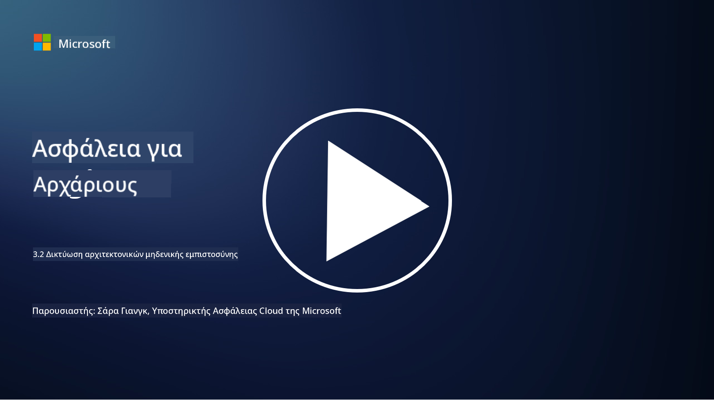

<!--
CO_OP_TRANSLATOR_METADATA:
{
  "original_hash": "680d6e14d9d33fc471c22f44679713f8",
  "translation_date": "2025-09-03T21:14:05+00:00",
  "source_file": "3.2 Networking zero trust architecture.md",
  "language_code": "el"
}
-->
# Δικτυακές αρχιτεκτονικές μηδενικής εμπιστοσύνης

Το δίκτυο παρέχει ένα κρίσιμο επίπεδο ελέγχου στη μηδενική εμπιστοσύνη. Σε αυτό το μάθημα θα μάθουμε περισσότερα για τα εξής:

 - Τι είναι ο διαχωρισμός δικτύου;
 - Πώς βοηθά ο διαχωρισμός δικτύου στην εφαρμογή της μηδενικής εμπιστοσύνης;
 - Τι είναι η κρυπτογράφηση από άκρο σε άκρο;

## Τι είναι ο διαχωρισμός δικτύου;

Ο διαχωρισμός δικτύου είναι η πρακτική του διαχωρισμού ενός δικτύου σε μικρότερα, απομονωμένα τμήματα ή υποδίκτυα. Κάθε τμήμα είναι απομονωμένο από τα άλλα και η πρόσβαση μεταξύ των τμημάτων ελέγχεται και περιορίζεται βάσει συγκεκριμένων πολιτικών ασφαλείας. Ο διαχωρισμός δικτύου χρησιμοποιείται για τη βελτίωση της ασφάλειας, περιορίζοντας τον αντίκτυπο πιθανών παραβιάσεων και μειώνοντας την πλευρική κίνηση των επιτιθέμενων μέσα στο δίκτυο.

Με την εφαρμογή του διαχωρισμού δικτύου, ένας οργανισμός μπορεί να δημιουργήσει "ζώνες" που διαχωρίζουν διαφορετικούς τύπους χρηστών, εφαρμογών και δεδομένων. Αυτό μειώνει την επιφάνεια επίθεσης και ελαχιστοποιεί τη δυνητική ζημιά που μπορεί να προκληθεί από ένα περιστατικό ασφαλείας. Ο διαχωρισμός δικτύου μπορεί να επιτευχθεί μέσω τεχνολογιών όπως εικονικά LANs (VLANs), firewalls και έλεγχοι πρόσβασης.

## Πώς βοηθά ο διαχωρισμός δικτύου στην εφαρμογή της μηδενικής εμπιστοσύνης;

Ο διαχωρισμός δικτύου ευθυγραμμίζεται στενά με τις αρχές του μοντέλου μηδενικής εμπιστοσύνης. Σε μια αρχιτεκτονική μηδενικής εμπιστοσύνης, ο διαχωρισμός δικτύου βοηθά στην εφαρμογή της αρχής της "ελάχιστης προνομιακής πρόσβασης", διασφαλίζοντας ότι οι χρήστες και οι συσκευές έχουν πρόσβαση μόνο στους συγκεκριμένους πόρους και υπηρεσίες που χρειάζονται για να εκτελέσουν τις εργασίες τους. Με τον διαχωρισμό του δικτύου σε μικρότερες ζώνες, οι οργανισμοί μπορούν να εφαρμόσουν αυστηρούς ελέγχους πρόσβασης, να απομονώσουν κρίσιμα στοιχεία και να αποτρέψουν την πλευρική κίνηση των επιτιθέμενων.

Ο διαχωρισμός δικτύου βοηθά επίσης στην εφαρμογή ελέγχων πρόσβασης βάσει ταυτότητας, όπου οι χρήστες και οι συσκευές αυθεντικοποιούνται και εξουσιοδοτούνται πλήρως πριν αποκτήσουν πρόσβαση σε συγκεκριμένα τμήματα. Αυτό αποτρέπει την μη εξουσιοδοτημένη πρόσβαση σε ευαίσθητους πόρους και μειώνει τον δυνητικό αντίκτυπο από συμβιβασμένα διαπιστευτήρια.

## Τι είναι η κρυπτογράφηση από άκρο σε άκρο;

Η κρυπτογράφηση από άκρο σε άκρο (E2E) είναι ένα μέτρο ασφαλείας που διασφαλίζει ότι τα δεδομένα παραμένουν κρυπτογραφημένα καθ' όλη τη διάρκεια της διαδρομής τους από τον αποστολέα στον παραλήπτη. Σε αυτή τη διαδικασία, τα δεδομένα κρυπτογραφούνται στην πλευρά του αποστολέα και μόνο ο παραλήπτης διαθέτει το κλειδί αποκρυπτογράφησης για να τα ξεκλειδώσει και να τα διαβάσει. Οι διαδικασίες κρυπτογράφησης και αποκρυπτογράφησης πραγματοποιούνται στα άκρα, καθιστώντας εξαιρετικά δύσκολη την πρόσβαση μη εξουσιοδοτημένων μερών, συμπεριλαμβανομένων των παρόχων υπηρεσιών και των ενδιάμεσων συστημάτων, στα δεδομένα σε απλή μορφή.

Η κρυπτογράφηση από άκρο σε άκρο παρέχει υψηλό επίπεδο εμπιστευτικότητας και ασφάλειας για τη μετάδοση δεδομένων, ακόμη και αν τα δεδομένα περνούν μέσω διάφορων ενδιάμεσων συστημάτων ή δικτύων. Χρησιμοποιείται συχνά σε ασφαλείς εφαρμογές ανταλλαγής μηνυμάτων, υπηρεσίες email και άλλες πλατφόρμες επικοινωνίας για την προστασία ευαίσθητων πληροφοριών από υποκλοπή και μη εξουσιοδοτημένη πρόσβαση.

Αυτή η μέθοδος κρυπτογράφησης διασφαλίζει ότι ακόμη και αν οι επιτιθέμενοι καταφέρουν να αποκτήσουν πρόσβαση στα δεδομένα κατά τη μεταφορά, θα δουν μόνο κρυπτογραφημένο περιεχόμενο που είναι άχρηστο χωρίς το κλειδί αποκρυπτογράφησης. Η κρυπτογράφηση από άκρο σε άκρο παίζει κρίσιμο ρόλο στη διασφάλιση της ιδιωτικότητας των χρηστών και στην προστασία ευαίσθητων πληροφοριών από την έκθεση σε μη εξουσιοδοτημένα μέρη.

## Τι είναι το SASE;

Το SASE σημαίνει "Secure Access Service Edge" και είναι ένα πλαίσιο και αρχιτεκτονική κυβερνοασφάλειας που συνδυάζει την ασφάλεια δικτύου και τις δυνατότητες ευρείας περιοχής δικτύου (WAN) σε μία υπηρεσία βασισμένη στο cloud. Το SASE έχει σχεδιαστεί για να παρέχει ασφαλή και επεκτάσιμη πρόσβαση σε πόρους δικτύου, εφαρμογές και δεδομένα για απομακρυσμένους και κινητούς χρήστες, ενώ απλοποιεί τη διαχείριση δικτύου και μειώνει την πολυπλοκότητα των παραδοσιακών αρχιτεκτονικών δικτύου και ασφάλειας.

Βασικά χαρακτηριστικά και στοιχεία του SASE περιλαμβάνουν:

1.  **Βασισμένο στο Cloud:** Το SASE παρέχεται ως υπηρεσία cloud, πράγμα που σημαίνει ότι οι λειτουργίες ασφάλειας και δικτύου παρέχονται από το cloud αντί να βασίζονται σε παραδοσιακό υλικό και συσκευές εντός του οργανισμού.
    
2.  **Ενσωμάτωση Ασφάλειας και Δικτύου:** Το SASE ενσωματώνει διάφορες υπηρεσίες ασφάλειας όπως ασφαλείς πύλες ιστού (SWG), firewall ως υπηρεσία (FWaaS), πρόληψη απώλειας δεδομένων (DLP), πρόσβαση δικτύου μηδενικής εμπιστοσύνης (ZTNA) και βελτιστοποίηση WAN με δυνατότητες ευρείας περιοχής δικτύου. Αυτή η ενσωμάτωση βοηθά στην απλοποίηση των λειτουργιών ασφάλειας και δικτύου.
    
3.  **Μηδενική Εμπιστοσύνη:** Το SASE λειτουργεί βάσει της αρχής της μηδενικής εμπιστοσύνης, που σημαίνει ότι εφαρμόζει αυστηρούς ελέγχους πρόσβασης και πολιτικές ελάχιστης προνομιακής πρόσβασης. Οι χρήστες και οι συσκευές δεν θεωρούνται αξιόπιστοι από προεπιλογή και πρέπει να αυθεντικοποιηθούν και να εξουσιοδοτηθούν πριν αποκτήσουν πρόσβαση σε πόρους.
    
4.  **Εστίαση στην Ταυτότητα:** Το SASE επικεντρώνεται στις ταυτότητες χρηστών και συσκευών ως βάση για τον έλεγχο πρόσβασης. Πολιτικές βάσει ταυτότητας και πλαισίου χρησιμοποιούνται για τον καθορισμό δικαιωμάτων πρόσβασης, και αυτές οι πολιτικές προσαρμόζονται δυναμικά βάσει της συμπεριφοράς και του πλαισίου του χρήστη.
    
5.  **Επεκτασιμότητα και Ευελιξία:** Το SASE μπορεί να επεκταθεί εύκολα για να εξυπηρετήσει μεγάλο αριθμό χρηστών και συσκευών, καθιστώντας το κατάλληλο για οργανισμούς με ποικίλες και εξελισσόμενες ανάγκες δικτύου και ασφάλειας.
    

Το SASE είναι ιδιαίτερα σημαντικό στη σύγχρονη εποχή της απομακρυσμένης εργασίας και της υιοθέτησης του cloud, καθώς παρέχει μια ολοκληρωμένη και ευέλικτη προσέγγιση για την ασφάλεια και τη διαχείριση της πρόσβασης στο δίκτυο. Βοηθά τους οργανισμούς να προσαρμοστούν στις μεταβαλλόμενες απαιτήσεις ασφάλειας και δικτύου, διατηρώντας παράλληλα ισχυρή εστίαση στα μοντέλα ασφάλειας που βασίζονται στον χρήστη και στη μηδενική εμπιστοσύνη.

## Περαιτέρω ανάγνωση

- [What Is Network Segmentation? - Cisco](https://www.cisco.com/c/en/us/products/security/what-is-network-segmentation.html#~benefits)
- [What Is Micro-Segmentation? - Cisco](https://www.cisco.com/c/en/us/products/security/what-is-microsegmentation.html)
- [Implementing Network Segmentation and Segregation | Cyber.gov.au](https://www.cyber.gov.au/resources-business-and-government/maintaining-devices-and-systems/system-hardening-and-administration/network-hardening/implementing-network-segmentation-and-segregation)
- [What Is Network Segmentation and Why It Matters | CompTIA](https://www.comptia.org/blog/security-awareness-training-network-segmentation)
- [Network Segmentation: Concepts and Practices (cmu.edu)](https://insights.sei.cmu.edu/blog/network-segmentation-concepts-and-practices/)
- [Secure networks with Zero Trust | Microsoft Learn](https://learn.microsoft.com/security/zero-trust/deploy/networks?WT.mc_id=academic-96948-sayoung)
- [What is end-to-end encryption? | IBM](https://www.ibm.com/topics/end-to-end-encryption)
- [What Is End-to-End Encryption, and Why Does It Matter? (howtogeek.com)](https://www.howtogeek.com/711656/what-is-end-to-end-encryption-and-why-does-it-matter/)
- [Definition of Secure Access Service Edge (SASE) - Gartner Information Technology Glossary](https://www.gartner.com/en/information-technology/glossary/secure-access-service-edge-sase)
- [What Is Secure Access Service Edge (SASE)? | Microsoft Security](https://www.microsoft.com/security/business/security-101/what-is-sase?WT.mc_id=academic-96948-sayoung)

---

**Αποποίηση ευθύνης**:  
Αυτό το έγγραφο έχει μεταφραστεί χρησιμοποιώντας την υπηρεσία αυτόματης μετάφρασης AI [Co-op Translator](https://github.com/Azure/co-op-translator). Παρόλο που καταβάλλουμε προσπάθειες για ακρίβεια, παρακαλούμε να έχετε υπόψη ότι οι αυτόματες μεταφράσεις ενδέχεται να περιέχουν σφάλματα ή ανακρίβειες. Το πρωτότυπο έγγραφο στη μητρική του γλώσσα θα πρέπει να θεωρείται η αυθεντική πηγή. Για κρίσιμες πληροφορίες, συνιστάται επαγγελματική ανθρώπινη μετάφραση. Δεν φέρουμε ευθύνη για τυχόν παρεξηγήσεις ή εσφαλμένες ερμηνείες που προκύπτουν από τη χρήση αυτής της μετάφρασης.