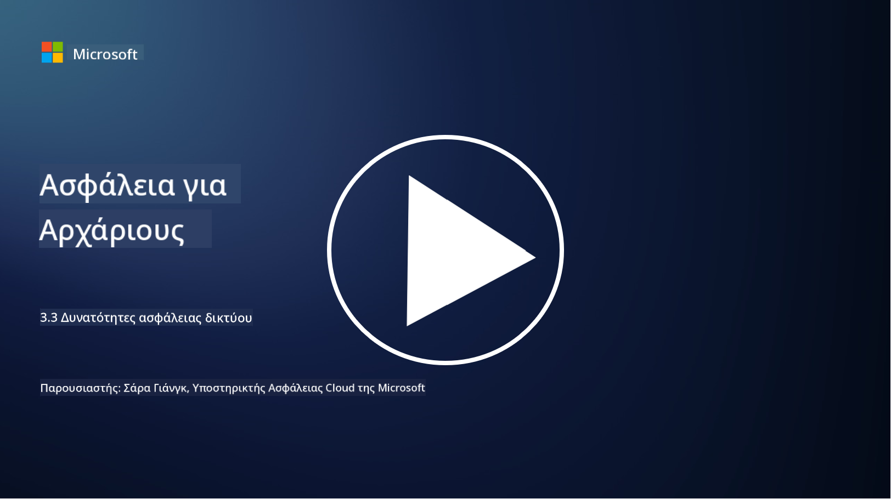

<!--
CO_OP_TRANSLATOR_METADATA:
{
  "original_hash": "c3aba077bb98eebc925dd58d870229ab",
  "translation_date": "2025-09-03T20:20:09+00:00",
  "source_file": "3.3 Network security capabilities.md",
  "language_code": "el"
}
-->
# Δυνατότητες ασφάλειας δικτύου

Σε αυτό το μάθημα θα μάθουμε για τις ακόλουθες δυνατότητες που μπορούν να χρησιμοποιηθούν για την ασφάλεια ενός δικτύου:

 - Παραδοσιακά firewalls
 - Firewalls εφαρμογών ιστού
 - Ομάδες ασφαλείας στο cloud
 - CDN
 - Ισορροπιστές φορτίου
 - Bastion hosts
 - VPNs
 - Προστασία από επιθέσεις DDoS

## Παραδοσιακά Firewalls

Τα παραδοσιακά firewalls είναι συσκευές ασφαλείας που ελέγχουν και παρακολουθούν την εισερχόμενη και εξερχόμενη κίνηση δικτύου βάσει προκαθορισμένων κανόνων ασφαλείας. Λειτουργούν ως φράγμα μεταξύ ενός αξιόπιστου εσωτερικού δικτύου και μη αξιόπιστων εξωτερικών δικτύων, φιλτράροντας την κίνηση για να αποτρέψουν μη εξουσιοδοτημένη πρόσβαση και πιθανές απειλές.

## Firewalls Εφαρμογών Ιστού

Τα Firewalls Εφαρμογών Ιστού (WAFs) είναι εξειδικευμένα firewalls που έχουν σχεδιαστεί για την προστασία εφαρμογών ιστού από διάφορες επιθέσεις, όπως SQL injection, cross-site scripting και άλλες ευπάθειες. Αναλύουν αιτήματα και απαντήσεις HTTP για να εντοπίσουν και να αποκλείσουν κακόβουλη κίνηση που στοχεύει εφαρμογές ιστού.

## Ομάδες Ασφαλείας στο Cloud

Οι ομάδες ασφαλείας είναι μια βασική δυνατότητα ασφάλειας δικτύου που παρέχεται από τους παρόχους υπηρεσιών cloud. Λειτουργούν ως εικονικά firewalls που ελέγχουν την εισερχόμενη και εξερχόμενη κίνηση προς και από πόρους του cloud, όπως εικονικές μηχανές (VMs) και instances. Οι ομάδες ασφαλείας επιτρέπουν στους οργανισμούς να ορίζουν κανόνες που καθορίζουν ποιοι τύποι κίνησης επιτρέπονται και απορρίπτονται, προσθέτοντας ένα επιπλέον επίπεδο άμυνας στις εγκαταστάσεις cloud.

## Δίκτυο Παράδοσης Περιεχομένου (CDN)

Ένα Δίκτυο Παράδοσης Περιεχομένου είναι ένα κατανεμημένο δίκτυο διακομιστών που βρίσκονται σε διάφορες γεωγραφικές τοποθεσίες. Τα CDNs βοηθούν στη βελτίωση της απόδοσης και της διαθεσιμότητας των ιστότοπων, αποθηκεύοντας προσωρινά περιεχόμενο και εξυπηρετώντας το από διακομιστές που βρίσκονται πιο κοντά στον χρήστη. Παρέχουν επίσης ένα επίπεδο προστασίας από επιθέσεις DDoS, διανέμοντας την κίνηση σε πολλαπλές τοποθεσίες διακομιστών.

## Ισορροπιστές Φορτίου

Οι ισορροπιστές φορτίου διανέμουν την εισερχόμενη κίνηση δικτύου σε πολλαπλούς διακομιστές για τη βελτιστοποίηση της χρήσης πόρων, τη διασφάλιση υψηλής διαθεσιμότητας και τη βελτίωση της απόδοσης των εφαρμογών. Βοηθούν στην αποτροπή υπερφόρτωσης των διακομιστών και στη διατήρηση αποτελεσματικών χρόνων απόκρισης, ενισχύοντας την ανθεκτικότητα του δικτύου.

## Bastion Hosts

Τα Bastion hosts είναι εξαιρετικά ασφαλείς και απομονωμένοι διακομιστές που παρέχουν ελεγχόμενη πρόσβαση σε ένα δίκτυο από ένα εξωτερικό, μη αξιόπιστο δίκτυο (όπως το διαδίκτυο). Λειτουργούν ως σημεία εισόδου για τους διαχειριστές ώστε να έχουν ασφαλή πρόσβαση σε εσωτερικά συστήματα. Τα Bastion hosts συνήθως διαμορφώνονται με ισχυρά μέτρα ασφαλείας για την ελαχιστοποίηση της επιφάνειας επίθεσης.

## Εικονικά Ιδιωτικά Δίκτυα (VPNs)

Τα VPNs δημιουργούν κρυπτογραφημένα κανάλια μεταξύ της συσκευής του χρήστη και ενός απομακρυσμένου διακομιστή, εξασφαλίζοντας ασφαλή και ιδιωτική επικοινωνία μέσω δυνητικά μη ασφαλών δικτύων, όπως το διαδίκτυο. Τα VPNs χρησιμοποιούνται συχνά για την παροχή απομακρυσμένης πρόσβασης σε εσωτερικά δίκτυα, επιτρέποντας στους χρήστες να έχουν πρόσβαση σε πόρους σαν να βρίσκονταν φυσικά στο ίδιο δίκτυο.

## Εργαλεία Προστασίας από Επιθέσεις DDoS

Τα εργαλεία και οι υπηρεσίες προστασίας από επιθέσεις DDoS (Distributed Denial of Service) έχουν σχεδιαστεί για να μετριάσουν τον αντίκτυπο των επιθέσεων DDoS, όπου πολλαπλές παραβιασμένες συσκευές κατακλύζουν ένα δίκτυο ή μια υπηρεσία για να την υπερφορτώσουν. Οι λύσεις προστασίας από DDoS εντοπίζουν και φιλτράρουν την κακόβουλη κίνηση, διασφαλίζοντας ότι η νόμιμη κίνηση μπορεί να φτάσει στον προορισμό της.

## Περαιτέρω ανάγνωση

- [What Is a Firewall? - Cisco](https://www.cisco.com/c/en/us/products/security/firewalls/what-is-a-firewall.html#~types-of-firewalls)
- [What Does a Firewall Actually Do? (howtogeek.com)](https://www.howtogeek.com/144269/htg-explains-what-firewalls-actually-do/)
- [What is a Firewall? How Firewalls Work & Types of Firewalls (kaspersky.com)](https://www.kaspersky.com/resource-center/definitions/firewall)
- [Network security group - how it works | Microsoft Learn](https://learn.microsoft.com/azure/virtual-network/network-security-group-how-it-works)
- [Introduction to Azure Content Delivery Network (CDN) - Training | Microsoft Learn](https://learn.microsoft.com/training/modules/intro-to-azure-content-delivery-network/?WT.mc_id=academic-96948-sayoung)
- [What is a content delivery network (CDN)? - Azure | Microsoft Learn](https://learn.microsoft.com/azure/cdn/cdn-overview?WT.mc_id=academic-96948-sayoung)
- [What Is Load Balancing? How Load Balancers Work (nginx.com)](https://www.nginx.com/resources/glossary/load-balancing/)
- [Bastion hosts vs. VPNs · Tailscale](https://tailscale.com/learn/bastion-hosts-vs-vpns/)
- [What is VPN? How It Works, Types of VPN (kaspersky.com)](https://www.kaspersky.com/resource-center/definitions/what-is-a-vpn)
- [Introduction to Azure DDoS Protection - Training | Microsoft Learn](https://learn.microsoft.com/training/modules/introduction-azure-ddos-protection/?WT.mc_id=academic-96948-sayoung)
- [What Is a DDoS Attack? | Microsoft Security](https://www.microsoft.com/security/business/security-101/what-is-a-ddos-attack?WT.mc_id=academic-96948-sayoung)

---

**Αποποίηση ευθύνης**:  
Αυτό το έγγραφο έχει μεταφραστεί χρησιμοποιώντας την υπηρεσία αυτόματης μετάφρασης [Co-op Translator](https://github.com/Azure/co-op-translator). Παρόλο που καταβάλλουμε προσπάθειες για ακρίβεια, παρακαλούμε να έχετε υπόψη ότι οι αυτοματοποιημένες μεταφράσεις ενδέχεται να περιέχουν λάθη ή ανακρίβειες. Το πρωτότυπο έγγραφο στη μητρική του γλώσσα θα πρέπει να θεωρείται η αυθεντική πηγή. Για κρίσιμες πληροφορίες, συνιστάται επαγγελματική ανθρώπινη μετάφραση. Δεν φέρουμε ευθύνη για τυχόν παρεξηγήσεις ή εσφαλμένες ερμηνείες που προκύπτουν από τη χρήση αυτής της μετάφρασης.