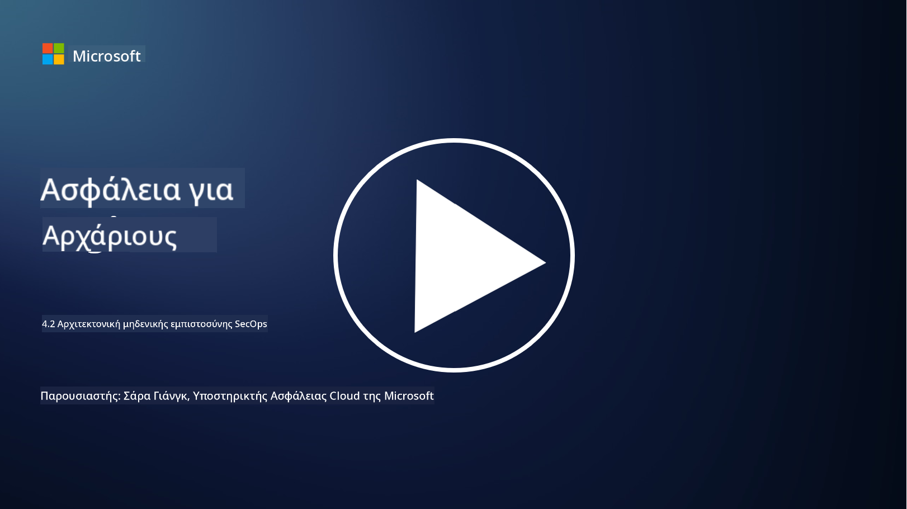

<!--
CO_OP_TRANSLATOR_METADATA:
{
  "original_hash": "45bbdc114e70936816b0b3e7c40189cf",
  "translation_date": "2025-09-03T21:19:38+00:00",
  "source_file": "4.2 SecOps zero trust architecture.md",
  "language_code": "el"
}
-->
# Αρχιτεκτονική μηδενικής εμπιστοσύνης για λειτουργίες ασφαλείας

Οι λειτουργίες ασφαλείας αποτελούν δύο μέρη της αρχιτεκτονικής μηδενικής εμπιστοσύνης και σε αυτό το μάθημα θα μάθουμε για τα εξής:

- Πώς πρέπει να σχεδιάζονται οι αρχιτεκτονικές IT ώστε να επιτρέπουν την κεντρική συλλογή καταγραφών;

- Ποιες είναι οι βέλτιστες πρακτικές για λειτουργίες ασφαλείας σε σύγχρονα περιβάλλοντα IT;

## Πώς πρέπει να σχεδιάζονται οι αρχιτεκτονικές IT ώστε να επιτρέπουν την κεντρική συλλογή καταγραφών;

Η κεντρική συλλογή καταγραφών αποτελεί κρίσιμο στοιχείο των σύγχρονων λειτουργιών ασφαλείας. Επιτρέπει στους οργανισμούς να συγκεντρώνουν καταγραφές και δεδομένα από διάφορες πηγές, όπως διακομιστές, εφαρμογές, συσκευές δικτύου και εργαλεία ασφαλείας, σε ένα κεντρικό αποθετήριο για ανάλυση, παρακολούθηση και αντιμετώπιση περιστατικών. Ακολουθούν ορισμένες βέλτιστες πρακτικές για τη δημιουργία αρχιτεκτονικών IT που υποστηρίζουν την κεντρική συλλογή καταγραφών:

1. **Ενσωμάτωση πηγών καταγραφών**:

- Βεβαιωθείτε ότι όλες οι σχετικές συσκευές και συστήματα είναι διαμορφωμένα ώστε να δημιουργούν καταγραφές. Αυτό περιλαμβάνει διακομιστές, firewalls, routers, switches, εφαρμογές και συσκευές ασφαλείας.

- Διαμορφώστε τις πηγές καταγραφών ώστε να προωθούν τις καταγραφές σε ένα κεντρικό συλλέκτη ή σύστημα διαχείρισης.

2. **Επιλογή του κατάλληλου εργαλείου SIEM (Security Information and Event Management)**:

- Επιλέξτε μια λύση SIEM που να ανταποκρίνεται στις ανάγκες και την κλίμακα του οργανισμού σας.

- Βεβαιωθείτε ότι η επιλεγμένη λύση υποστηρίζει τη συλλογή, συγκέντρωση, ανάλυση και αναφορά καταγραφών.

3. **Επεκτασιμότητα και πλεονασμός**:

- Σχεδιάστε την αρχιτεκτονική ώστε να είναι επεκτάσιμη για να υποστηρίζει αυξανόμενο αριθμό πηγών καταγραφών και αυξημένο όγκο δεδομένων.

- Εφαρμόστε πλεονασμό για υψηλή διαθεσιμότητα ώστε να αποτρέψετε διακοπές λόγω βλαβών υλικού ή δικτύου.

4. **Ασφαλής μεταφορά καταγραφών**:

- Χρησιμοποιήστε ασφαλή πρωτόκολλα όπως TLS/SSL ή IPsec για τη μεταφορά καταγραφών από τις πηγές στο κεντρικό αποθετήριο.

- Εφαρμόστε έλεγχο ταυτότητας και ελέγχους πρόσβασης ώστε μόνο εξουσιοδοτημένες συσκευές να μπορούν να στέλνουν καταγραφές.

5. **Κανονικοποίηση**:

- Τυποποιήστε τις μορφές καταγραφών και κανονικοποιήστε τα δεδομένα για να εξασφαλίσετε συνέπεια και ευκολία ανάλυσης.

6. **Αποθήκευση και διατήρηση**:

- Καθορίστε την κατάλληλη περίοδο διατήρησης για τις καταγραφές βάσει απαιτήσεων συμμόρφωσης και ασφάλειας.

- Αποθηκεύστε τις καταγραφές με ασφάλεια, προστατεύοντάς τες από μη εξουσιοδοτημένη πρόσβαση και αλλοίωση.

## Ποιες είναι οι βέλτιστες πρακτικές για λειτουργίες ασφαλείας σε σύγχρονα περιβάλλοντα IT;

Εκτός από την κεντρική συλλογή καταγραφών, ακολουθούν ορισμένες βέλτιστες πρακτικές για λειτουργίες ασφαλείας σε σύγχρονα περιβάλλοντα IT:

1. **Συνεχής παρακολούθηση**: Εφαρμόστε συνεχή παρακολούθηση δραστηριοτήτων δικτύου και συστημάτων για την ανίχνευση και αντιμετώπιση απειλών σε πραγματικό χρόνο.

2. **Πληροφορίες απειλών**: Ενημερωθείτε για νέες απειλές και ευπάθειες αξιοποιώντας πηγές και υπηρεσίες πληροφοριών απειλών.

3. **Εκπαίδευση χρηστών**: Διεξάγετε τακτική εκπαίδευση ευαισθητοποίησης για την ασφάλεια στους εργαζομένους ώστε να μειώσετε τους κινδύνους που σχετίζονται με κοινωνική μηχανική και επιθέσεις phishing.

4. **Σχέδιο αντιμετώπισης περιστατικών**: Αναπτύξτε και δοκιμάστε ένα σχέδιο αντιμετώπισης περιστατικών για να εξασφαλίσετε γρήγορη και αποτελεσματική αντίδραση σε περιστατικά ασφαλείας.

5. **Αυτοματοποίηση ασφαλείας**: Αξιοποιήστε εργαλεία αυτοματοποίησης και ορχήστρωσης ασφαλείας για να απλοποιήσετε την αντιμετώπιση περιστατικών και επαναλαμβανόμενες εργασίες.

6. **Αντίγραφα ασφαλείας και ανάκτηση**: Εφαρμόστε ισχυρές λύσεις αντιγράφων ασφαλείας και ανάκτησης καταστροφών για να εξασφαλίσετε τη διαθεσιμότητα δεδομένων σε περίπτωση απώλειας δεδομένων ή επιθέσεων ransomware.

## Περαιτέρω ανάγνωση

- [Microsoft Security Best Practices module: Security operations | Microsoft Learn](https://learn.microsoft.com/security/operations/security-operations-videos-and-decks?WT.mc_id=academic-96948-sayoung)
- [Security operations - Cloud Adoption Framework | Microsoft Learn](https://learn.microsoft.com/azure/cloud-adoption-framework/secure/security-operations?WT.mc_id=academic-96948-sayoung)
- [What is Security Operations and Analytics Platform Architecture? A Definition of SOAPA, How It Works, Benefits, and More (digitalguardian.com)](https://www.digitalguardian.com/blog/what-security-operations-and-analytics-platform-architecture-definition-soapa-how-it-works#:~:text=All%20in%20all%2C%20security%20operations%20and%20analytics%20platform,become%20more%20efficient%20and%20operative%20with%20your%20security.)

---

**Αποποίηση ευθύνης**:  
Αυτό το έγγραφο έχει μεταφραστεί χρησιμοποιώντας την υπηρεσία αυτόματης μετάφρασης [Co-op Translator](https://github.com/Azure/co-op-translator). Παρόλο που καταβάλλουμε προσπάθειες για ακρίβεια, παρακαλούμε να έχετε υπόψη ότι οι αυτοματοποιημένες μεταφράσεις ενδέχεται να περιέχουν λάθη ή ανακρίβειες. Το πρωτότυπο έγγραφο στη μητρική του γλώσσα θα πρέπει να θεωρείται η αυθεντική πηγή. Για κρίσιμες πληροφορίες, συνιστάται επαγγελματική ανθρώπινη μετάφραση. Δεν φέρουμε ευθύνη για τυχόν παρεξηγήσεις ή εσφαλμένες ερμηνείες που προκύπτουν από τη χρήση αυτής της μετάφρασης.