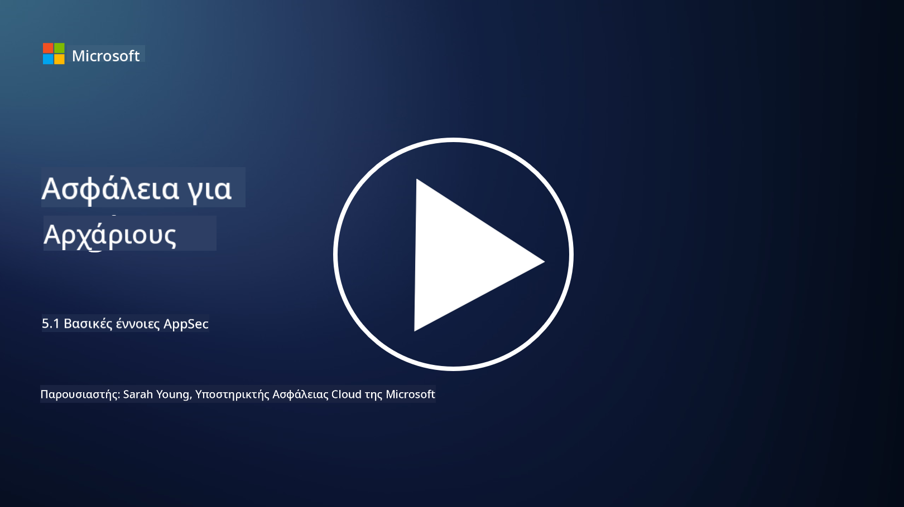

<!--
CO_OP_TRANSLATOR_METADATA:
{
  "original_hash": "e4b56bb23078d3ffb7ad407d280b0c36",
  "translation_date": "2025-09-03T21:09:06+00:00",
  "source_file": "5.1 AppSec key concepts.md",
  "language_code": "el"
}
-->
# Βασικές έννοιες AppSec

Η ασφάλεια εφαρμογών είναι μια εξειδίκευση ασφάλειας από μόνη της. Σε αυτό το μέρος του μαθήματος θα εξετάσουμε πιο αναλυτικά την ασφάλεια εφαρμογών.

## Εισαγωγή

Σε αυτό το μάθημα, θα καλύψουμε:

- Τι είναι η ασφάλεια εφαρμογών;

- Ποιες είναι οι βασικές έννοιες/αρχές της ασφάλειας εφαρμογών;

## Τι είναι η ασφάλεια εφαρμογών;

Η ασφάλεια εφαρμογών, συχνά συντομογραφημένη ως "AppSec," αναφέρεται στην πρακτική προστασίας των λογισμικών εφαρμογών από απειλές, ευπάθειες και επιθέσεις ασφαλείας. Περιλαμβάνει τις διαδικασίες, τις τεχνικές και τα εργαλεία που χρησιμοποιούνται για την αναγνώριση, την αντιμετώπιση και την πρόληψη κινδύνων ασφαλείας καθ' όλη τη διάρκεια του κύκλου ζωής ανάπτυξης, ανάπτυξης και συντήρησης μιας εφαρμογής.

Η ασφάλεια εφαρμογών είναι κρίσιμη επειδή οι εφαρμογές αποτελούν συχνά στόχους για κυβερνοεπιθέσεις. Κακόβουλοι παράγοντες εκμεταλλεύονται ευπάθειες και αδυναμίες στο λογισμικό για να αποκτήσουν μη εξουσιοδοτημένη πρόσβαση, να κλέψουν δεδομένα, να διακόψουν υπηρεσίες ή να εκτελέσουν άλλες κακόβουλες δραστηριότητες. Η αποτελεσματική ασφάλεια εφαρμογών βοηθά στη διασφάλιση της εμπιστευτικότητας, της ακεραιότητας και της διαθεσιμότητας μιας εφαρμογής και των σχετικών δεδομένων.

## Ποιες είναι οι βασικές έννοιες/αρχές της ασφάλειας εφαρμογών;

Οι βασικές έννοιες και αρχές που στηρίζουν την ασφάλεια εφαρμογών περιλαμβάνουν:

1. **Ασφάλεια από τον Σχεδιασμό**:

- Η ασφάλεια πρέπει να ενσωματώνεται στον σχεδιασμό και την αρχιτεκτονική της εφαρμογής από την αρχή, αντί να προστίθεται εκ των υστέρων.

2. **Επικύρωση Εισόδου**:

- Όλες οι εισροές χρηστών πρέπει να επικυρώνονται ώστε να διασφαλίζεται ότι συμμορφώνονται με τα αναμενόμενα πρότυπα και είναι απαλλαγμένες από κακόβουλο κώδικα ή δεδομένα.

3. **Κωδικοποίηση Εξόδου**:

- Τα δεδομένα που αποστέλλονται στον πελάτη πρέπει να κωδικοποιούνται σωστά για την αποτροπή ευπαθειών όπως η cross-site scripting (XSS).

4. **Ταυτοποίηση και Εξουσιοδότηση**:

- Ταυτοποιήστε τους χρήστες και εξουσιοδοτήστε την πρόσβασή τους σε πόρους βάσει των ρόλων και των δικαιωμάτων τους.

5. **Προστασία Δεδομένων**:

- Τα ευαίσθητα δεδομένα πρέπει να κρυπτογραφούνται κατά την αποθήκευση, τη μετάδοση και την επεξεργασία για την αποτροπή μη εξουσιοδοτημένης πρόσβασης.

6. **Διαχείριση Συνεδριών**:

- Η ασφαλής διαχείριση συνεδριών διασφαλίζει ότι οι συνεδρίες χρηστών προστατεύονται από υποκλοπή και μη εξουσιοδοτημένη πρόσβαση.

7. **Ασφαλείς Εξαρτήσεις**:

- Διατηρήστε όλες τις εξαρτήσεις λογισμικού ενημερωμένες με διορθώσεις ασφαλείας για την αποτροπή ευπαθειών.

8. **Διαχείριση Σφαλμάτων και Καταγραφής**:

- Εφαρμόστε ασφαλή διαχείριση σφαλμάτων για να αποφύγετε την αποκάλυψη ευαίσθητων πληροφοριών και διασφαλίστε ασφαλείς πρακτικές καταγραφής.

9. **Δοκιμές Ασφαλείας**:

- Δοκιμάστε τακτικά τις εφαρμογές για ευπάθειες χρησιμοποιώντας μεθόδους όπως δοκιμές διείσδυσης, ανασκοπήσεις κώδικα και αυτοματοποιημένα εργαλεία σάρωσης.

10. **Ασφαλής Κύκλος Ζωής Ανάπτυξης Λογισμικού (SDLC)**:

- Ενσωματώστε πρακτικές ασφαλείας σε κάθε φάση του κύκλου ζωής ανάπτυξης λογισμικού, από τις απαιτήσεις έως την ανάπτυξη και τη συντήρηση.

## Περαιτέρω ανάγνωση

- [SheHacksPurple: What is Application Security? - YouTube](https://www.youtube.com/watch?v=eNmccQNzSSY)
- [What Is Application Security? - Cisco](https://www.cisco.com/c/en/us/solutions/security/application-first-security/what-is-application-security.html#~how-does-it-work)
- [What is application security? A process and tools for securing software | CSO Online](https://www.csoonline.com/article/566471/what-is-application-security-a-process-and-tools-for-securing-software.html)
- [OWASP Cheat Sheet Series | OWASP Foundation](https://owasp.org/www-project-cheat-sheets/)

---

**Αποποίηση ευθύνης**:  
Αυτό το έγγραφο έχει μεταφραστεί χρησιμοποιώντας την υπηρεσία αυτόματης μετάφρασης [Co-op Translator](https://github.com/Azure/co-op-translator). Παρόλο που καταβάλλουμε προσπάθειες για ακρίβεια, παρακαλούμε να έχετε υπόψη ότι οι αυτοματοποιημένες μεταφράσεις ενδέχεται να περιέχουν λάθη ή ανακρίβειες. Το πρωτότυπο έγγραφο στη μητρική του γλώσσα θα πρέπει να θεωρείται η αυθεντική πηγή. Για κρίσιμες πληροφορίες, συνιστάται επαγγελματική ανθρώπινη μετάφραση. Δεν φέρουμε ευθύνη για τυχόν παρεξηγήσεις ή εσφαλμένες ερμηνείες που προκύπτουν από τη χρήση αυτής της μετάφρασης.