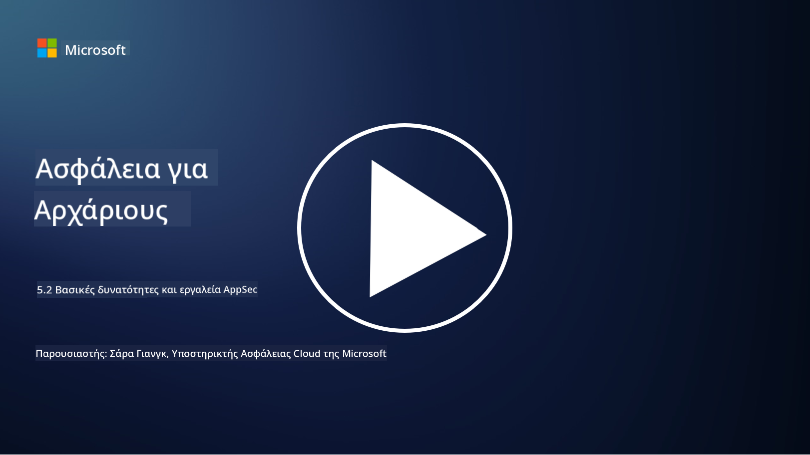

<!--
CO_OP_TRANSLATOR_METADATA:
{
  "original_hash": "790a3fa7e535ec60bb51bde13e759781",
  "translation_date": "2025-09-03T21:24:02+00:00",
  "source_file": "5.2 AppSec key capabilities.md",
  "language_code": "el"
}
-->
Σε αυτήν την ενότητα, θα καλύψουμε περισσότερες λεπτομέρειες σχετικά με τα βασικά εργαλεία και τις δυνατότητες που χρησιμοποιούνται στην ασφάλεια εφαρμογών:

## Εισαγωγή

Σε αυτό το μάθημα, θα εξετάσουμε ποιες είναι οι βασικές δυνατότητες και τα εργαλεία που χρησιμοποιούνται στην ασφάλεια εφαρμογών.

## Βασικές δυνατότητες και εργαλεία ασφάλειας εφαρμογών

Οι βασικές δυνατότητες και τα εργαλεία που χρησιμοποιούνται στην ασφάλεια εφαρμογών είναι απαραίτητα για την αναγνώριση, την αντιμετώπιση και την πρόληψη ευπαθειών και απειλών ασφαλείας σε λογισμικές εφαρμογές. Ακολουθούν μερικά από τα πιο σημαντικά:

**1. Στατική Δοκιμή Ασφάλειας Εφαρμογών (SAST)**:

- **Δυνατότητες**: Αναλύει τον πηγαίο κώδικα, τον bytecode ή τον δυαδικό κώδικα για να εντοπίσει ευπάθειες ασφαλείας στη βάση κώδικα της εφαρμογής.

- **Εργαλεία**: Παραδείγματα περιλαμβάνουν Fortify, Checkmarx και Veracode.

**2. Δυναμική Δοκιμή Ασφάλειας Εφαρμογών (DAST)**:

- **Δυνατότητες**: Σαρώνει μια εφαρμογή που εκτελείται για να εντοπίσει ευπάθειες στέλνοντας αιτήματα εισόδου και αναλύοντας τις αποκρίσεις.

- **Εργαλεία**: Παραδείγματα περιλαμβάνουν ZAP, Burp Suite και Qualys Web Application Scanning.

**3. Διαδραστική Δοκιμή Ασφάλειας Εφαρμογών (IAST)**:

- **Δυνατότητες**: Συνδυάζει στοιχεία του SAST και του DAST για να αναλύσει τον κώδικα κατά την εκτέλεση, παρέχοντας πιο ακριβή αποτελέσματα και μειώνοντας τα ψευδώς θετικά.

- **Εργαλεία**: Παραδείγματα περιλαμβάνουν Contrast Security και HCL AppScan.

**4. Αυτοπροστασία Εφαρμογών Κατά την Εκτέλεση (RASP)**:

- **Δυνατότητες**: Παρακολουθεί και προστατεύει εφαρμογές σε πραγματικό χρόνο, εντοπίζοντας και αντιμετωπίζοντας απειλές ασφαλείας καθώς αυτές συμβαίνουν.

- **Εργαλεία**: Παραδείγματα περιλαμβάνουν Veracode Runtime Protection και F5 Advanced WAF με RASP.

**5. Τείχη Προστασίας Εφαρμογών Ιστού (WAFs)**:

- **Δυνατότητες**: Παρέχει ένα προστατευτικό στρώμα μεταξύ της εφαρμογής και του διαδικτύου, φιλτράροντας την εισερχόμενη κίνηση και μπλοκάροντας κακόβουλα αιτήματα.

- **Εργαλεία**: Παραδείγματα περιλαμβάνουν ModSecurity, AWS WAF και Akamai Kona Site Defender.

**6. Σάρωση Εξαρτήσεων**:

- **Δυνατότητες**: Εντοπίζει ευπάθειες σε βιβλιοθήκες και εξαρτήματα τρίτων που χρησιμοποιούνται στην εφαρμογή.

- **Εργαλεία**: Παραδείγματα περιλαμβάνουν OWASP Dependency-Check και Snyk.

**7. Δοκιμή Διείσδυσης (Pen Testing)**:

- **Δυνατότητες**: Προσομοιώνει επιθέσεις πραγματικού κόσμου για να ανακαλύψει ευπάθειες και να αξιολογήσει την ασφάλεια μιας εφαρμογής.

- **Εργαλεία**: Διεξάγεται από πιστοποιημένους ηθικούς χάκερ και επαγγελματίες ασφαλείας χρησιμοποιώντας διάφορα εργαλεία όπως Metasploit και Nmap.

**8. Σάρωση και Ανάλυση Ασφαλείας**:

- **Δυνατότητες**: Σαρώνει για γνωστές ευπάθειες, σφάλματα διαμόρφωσης και λανθασμένες ρυθμίσεις ασφαλείας.

- **Εργαλεία**: Παραδείγματα περιλαμβάνουν Nessus, Qualys Vulnerability Management και OpenVAS.

**9. Εργαλεία Ασφάλειας Κοντέινερ**:

- **Δυνατότητες**: Εστιάζουν στην ασφάλεια εφαρμογών που βασίζονται σε κοντέινερ και των περιβαλλόντων τους.

- **Εργαλεία**: Παραδείγματα περιλαμβάνουν Docker Security Scanning και Aqua Security.

**10. Εκπαίδευση Ασφαλούς Ανάπτυξης**:

- **Δυνατότητες**: Παρέχει προγράμματα εκπαίδευσης και ευαισθητοποίησης για ομάδες ανάπτυξης ώστε να προωθήσουν ασφαλείς πρακτικές κωδικοποίησης.

- **Εργαλεία**: Εξατομικευμένα προγράμματα εκπαίδευσης και πλατφόρμες.

**11. Πλαίσια Δοκιμών Ασφάλειας**:

- **Δυνατότητες**: Παρέχουν ολοκληρωμένα πλαίσια δοκιμών για διαφορετικές ανάγκες ασφάλειας εφαρμογών.

- **Εργαλεία**: OWASP Amass, OWASP OWTF και FrAppSec.

**12. Εργαλεία Ανασκόπησης Ασφαλούς Κώδικα**:

- **Δυνατότητες**: Ανασκοπούν τον πηγαίο κώδικα για ευπάθειες ασφαλείας και βέλτιστες πρακτικές κωδικοποίησης.

- **Εργαλεία**: Παραδείγματα περιλαμβάνουν SonarQube και Checkmarx.

**13. Εργαλεία Ασφαλείας APIs και Μικροϋπηρεσιών**:

- **Δυνατότητες**: Εστιάζουν στην ασφάλεια των APIs και των μικροϋπηρεσιών, συμπεριλαμβανομένου του ελέγχου ταυτότητας, της εξουσιοδότησης και της προστασίας δεδομένων.

- **Εργαλεία**: Παραδείγματα περιλαμβάνουν Apigee, AWS API Gateway και Istio.

## Περαιτέρω ανάγνωση

- [What Is Application Security? Concepts, Tools & Best Practices | HackerOne](https://www.hackerone.com/knowledge-center/what-application-security-concepts-tools-best-practices)
- [What is IAST? (Interactive Application Security Testing) (comparitech.com)](https://www.comparitech.com/net-admin/what-is-iast/)
- [10 Types of Application Security Testing Tools: When and How to Use Them (cmu.edu)](https://insights.sei.cmu.edu/blog/10-types-of-application-security-testing-tools-when-and-how-to-use-them/)
- [Shifting the Balance of Cybersecurity Risk: Principles and Approaches for Security-by-Design and Default | Cyber.gov.au](https://www.cyber.gov.au/about-us/view-all-content/publications/principles-and-approaches-for-security-by-design-and-default)

---

**Αποποίηση ευθύνης**:  
Αυτό το έγγραφο έχει μεταφραστεί χρησιμοποιώντας την υπηρεσία αυτόματης μετάφρασης [Co-op Translator](https://github.com/Azure/co-op-translator). Παρόλο που καταβάλλουμε προσπάθειες για ακρίβεια, παρακαλούμε να έχετε υπόψη ότι οι αυτοματοποιημένες μεταφράσεις ενδέχεται να περιέχουν λάθη ή ανακρίβειες. Το πρωτότυπο έγγραφο στη μητρική του γλώσσα θα πρέπει να θεωρείται η αυθεντική πηγή. Για κρίσιμες πληροφορίες, συνιστάται επαγγελματική ανθρώπινη μετάφραση. Δεν φέρουμε ευθύνη για τυχόν παρεξηγήσεις ή εσφαλμένες ερμηνείες που προκύπτουν από τη χρήση αυτής της μετάφρασης.