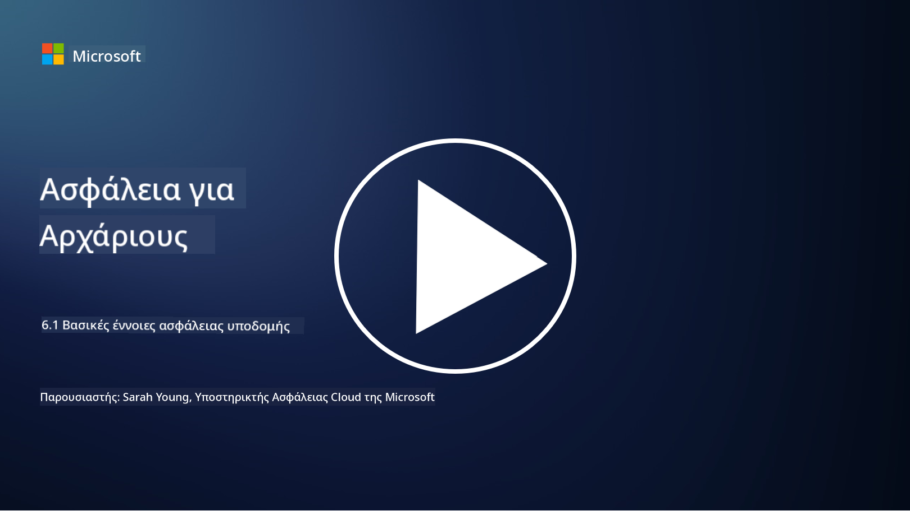

<!--
CO_OP_TRANSLATOR_METADATA:
{
  "original_hash": "882ebf66a648f419bcbf680ed6aefa00",
  "translation_date": "2025-09-03T20:04:05+00:00",
  "source_file": "6.1 Infrastructure security key concepts.md",
  "language_code": "el"
}
-->
# Βασικές έννοιες ασφάλειας υποδομής

Η «υποδομή» αναφέρεται στα θεμέλια κάθε περιβάλλοντος πληροφορικής, που περιλαμβάνουν διακομιστές, υπηρεσίες cloud και κοντέινερ – μια μεγάλη ποικιλία διαφορετικών τεχνολογιών. Οι εφαρμογές που συζητήθηκαν στην προηγούμενη ενότητα λειτουργούν πάνω σε υποδομές, επομένως αυτές μπορούν επίσης να αποτελέσουν στόχο επιθέσεων.

Σε αυτό το μάθημα, θα καλύψουμε:

- Τι είναι η υγιεινή ασφάλειας και γιατί είναι σημαντική;

- Τι είναι η διαχείριση στάσης ασφάλειας;

- Τι είναι η ενημέρωση λογισμικού (patching) και γιατί είναι σημαντική;

- Τι είναι τα κοντέινερ και τι διαφέρει στην ασφάλειά τους;

## Τι είναι η υγιεινή ασφάλειας και γιατί είναι σημαντική;

Η **υγιεινή ασφάλειας** αναφέρεται στο σύνολο πρακτικών και συμπεριφορών που ακολουθούν άτομα και οργανισμοί για να διατηρήσουν καλές συνήθειες κυβερνοασφάλειας. Περιλαμβάνει τη λήψη μέτρων για την προστασία συστημάτων, δεδομένων και δικτύων από απειλές και ευπάθειες. Η καλή υγιεινή ασφάλειας είναι σημαντική για διάφορους λόγους:

- **Πρόληψη Επιθέσεων**: Η τήρηση βέλτιστων πρακτικών μπορεί να αποτρέψει κοινές κυβερνοεπιθέσεις, όπως phishing, μολύνσεις από κακόβουλο λογισμικό και μη εξουσιοδοτημένη πρόσβαση.

- **Προστασία Δεδομένων**: Η σωστή υγιεινή ασφάλειας διασφαλίζει ευαίσθητα και εμπιστευτικά δεδομένα από κλοπή ή έκθεση.

- **Διατήρηση Εμπιστοσύνης**: Οι οργανισμοί που επιδεικνύουν καλή υγιεινή ασφάλειας χτίζουν εμπιστοσύνη με πελάτες και συνεργάτες.

- **Συμμόρφωση**: Πολλοί κανονισμοί και πρότυπα απαιτούν από τους οργανισμούς να ακολουθούν πρακτικές υγιεινής ασφάλειας.

- **Μείωση Κινδύνου**: Η συνεπής υγιεινή ασφάλειας μειώνει τον συνολικό κίνδυνο περιστατικών και παραβιάσεων ασφάλειας.

Η υγιεινή ασφάλειας περιλαμβάνει πρακτικές όπως η διατήρηση ενημερωμένου λογισμικού, η χρήση ισχυρών κωδικών πρόσβασης και πολυπαραγοντικής αυθεντικοποίησης, τακτικά αντίγραφα ασφαλείας, εκπαίδευση εργαζομένων και παρακολούθηση ύποπτων δραστηριοτήτων. Αποτελεί τη βάση μιας ισχυρής στάσης κυβερνοασφάλειας.

## Τι είναι η διαχείριση στάσης ασφάλειας;

Η Διαχείριση Στάσης Ασφάλειας αναφέρεται στην πρακτική αξιολόγησης, παρακολούθησης και διαχείρισης της συνολικής στάσης κυβερνοασφάλειας ενός οργανισμού. Η στάση κυβερνοασφάλειας αναφέρεται στη συνολική προσέγγιση και ετοιμότητα ενός οργανισμού να προστατεύσει τα συστήματα πληροφορικής (IT), τα δίκτυα, τα δεδομένα και τα περιουσιακά του στοιχεία από κυβερνοαπειλές και επιθέσεις. Περιλαμβάνει τις στρατηγικές, τις πολιτικές, τις πρακτικές και τις τεχνολογίες που χρησιμοποιεί ένας οργανισμός για να διασφαλίσει τα ψηφιακά του περιουσιακά στοιχεία και να διατηρήσει την εμπιστευτικότητα, την ακεραιότητα και τη διαθεσιμότητα των πληροφοριών του. 

Η διαχείριση στάσης ασφάλειας περιλαμβάνει την αξιολόγηση και τη διατήρηση της ασφάλειας συστημάτων, δικτύων, εφαρμογών και δεδομένων ώστε να ευθυγραμμίζονται με πολιτικές ασφάλειας, βέλτιστες πρακτικές και απαιτήσεις συμμόρφωσης. Στόχος της είναι να παρέχει μια ολοκληρωμένη εικόνα της κατάστασης ασφάλειας ενός οργανισμού, να εντοπίζει ευπάθειες και αδυναμίες και να δίνει προτεραιότητα στις προσπάθειες αποκατάστασης.

## Τι είναι η ενημέρωση λογισμικού (patching) και γιατί είναι σημαντική;

Η **ενημέρωση λογισμικού (patching)** αναφέρεται στη διαδικασία εφαρμογής ενημερώσεων λογισμικού, γνωστών ως patches ή διορθώσεις, σε λογισμικό, λειτουργικά συστήματα και εφαρμογές. Αυτές οι ενημερώσεις συνήθως αντιμετωπίζουν ευπάθειες ασφάλειας, σφάλματα και άλλα ζητήματα που μπορούν να εκμεταλλευτούν οι επιτιθέμενοι. Οι συσκευές υλικού απαιτούν επίσης ενημερώσεις: μπορεί να είναι το firmware ή το ενσωματωμένο λειτουργικό τους σύστημα. Η ενημέρωση υλικού μπορεί να είναι πολύ πιο δύσκολη από την ενημέρωση λογισμικού.

Η ενημέρωση λογισμικού είναι σημαντική για διάφορους λόγους:

- **Ασφάλεια**: Οι ενημερώσεις διορθώνουν γνωστές ευπάθειες που μπορούν να εκμεταλλευτούν οι επιτιθέμενοι για να παραβιάσουν συστήματα και να κλέψουν δεδομένα.

- **Σταθερότητα**: Οι ενημερώσεις συχνά περιλαμβάνουν βελτιώσεις σταθερότητας και απόδοσης, μειώνοντας τον κίνδυνο σφαλμάτων ή αποτυχίας συστημάτων.

- **Συμμόρφωση**: Πολλοί κανονισμοί και πρότυπα συμμόρφωσης απαιτούν από τους οργανισμούς να εφαρμόζουν ενημερώσεις ασφάλειας άμεσα.

- **Διατήρηση Εμπιστοσύνης**: Η τακτική ενημέρωση βοηθά στη διατήρηση της εμπιστοσύνης πελατών και ενδιαφερόμενων μερών, δείχνοντας δέσμευση στην ασφάλεια.

- **Μείωση Κινδύνου**: Η ενημέρωση μειώνει την επιφάνεια επίθεσης και την πιθανότητα επιτυχών κυβερνοεπιθέσεων.

Η αποτυχία εφαρμογής ενημερώσεων εγκαίρως μπορεί να αφήσει συστήματα ευάλωτα σε γνωστές εκμεταλλεύσεις, αυξάνοντας τον κίνδυνο παραβιάσεων ασφάλειας και απώλειας δεδομένων.

## Τι είναι τα κοντέινερ και τι διαφέρει στην ασφάλειά τους;

Τα κοντέινερ είναι μια μορφή ελαφρών, αυτόνομων και εκτελέσιμων πακέτων λογισμικού που περιέχουν όλα όσα χρειάζονται για την εκτέλεση ενός κομματιού λογισμικού, συμπεριλαμβανομένου του κώδικα, του runtime, των βιβλιοθηκών και των εργαλείων συστήματος. Τα κοντέινερ παρέχουν ένα συνεπές και απομονωμένο περιβάλλον για εφαρμογές, διευκολύνοντας την ανάπτυξη, τη συσκευασία και την υλοποίηση λογισμικού σε διαφορετικά περιβάλλοντα και πλατφόρμες. Δημοφιλείς τεχνολογίες κοντεϊνοποίησης περιλαμβάνουν το Docker και το Kubernetes.

Η ασφάλεια κοντέινερ αναφέρεται στις πρακτικές και τις τεχνολογίες που χρησιμοποιούνται για την προστασία των κοντέινερ και των εφαρμογών που φιλοξενούν από διάφορες απειλές και ευπάθειες. Η ασφάλεια κοντέινερ είναι κρίσιμη επειδή, ενώ τα κοντέινερ προσφέρουν πολλά οφέλη όσον αφορά τη φορητότητα και την κλιμάκωση, εισάγουν επίσης πιθανά προβλήματα ασφάλειας:

1. **Ασφάλεια Εικόνας**: Οι εικόνες κοντέινερ μπορεί να περιέχουν ευπάθειες, και αν αυτές οι εικόνες δεν ενημερώνονται και διορθώνονται τακτικά, μπορούν να εκμεταλλευτούν από επιτιθέμενους. Η ασφάλεια κοντέινερ περιλαμβάνει τη σάρωση εικόνων για γνωστές ευπάθειες και τη διασφάλιση ότι χρησιμοποιούνται μόνο αξιόπιστες εικόνες.

2. **Ασφάλεια Εκτέλεσης**: Τα εκτελούμενα κοντέινερ πρέπει να είναι απομονωμένα μεταξύ τους και από το σύστημα φιλοξενίας για να αποτραπεί μη εξουσιοδοτημένη πρόσβαση και πιθανές επιθέσεις. Οι μηχανισμοί ασφάλειας εκτέλεσης περιλαμβάνουν τεχνολογίες απομόνωσης κοντέινερ όπως namespaces και cgroups, καθώς και εργαλεία για την παρακολούθηση και τον έλεγχο της συμπεριφοράς των κοντέινερ.

3. **Ασφάλεια Δικτύου**: Τα κοντέινερ επικοινωνούν μεταξύ τους και με εξωτερικά συστήματα μέσω δικτύων. Η σωστή τμηματοποίηση δικτύου και οι κανόνες firewall είναι απαραίτητα για τον έλεγχο της κυκλοφορίας μεταξύ κοντέινερ και την αποτροπή μη εξουσιοδοτημένης πρόσβασης.

4. **Έλεγχος Πρόσβασης**: Η διασφάλιση ότι μόνο εξουσιοδοτημένοι χρήστες και διεργασίες μπορούν να έχουν πρόσβαση και να τροποποιούν κοντέινερ είναι κρίσιμη. Συχνά χρησιμοποιούνται εργαλεία διαχείρισης ταυτότητας και έλεγχος πρόσβασης βάσει ρόλων (RBAC).

5. **Καταγραφή και Παρακολούθηση**: Η ασφάλεια κοντέινερ περιλαμβάνει τη συλλογή και ανάλυση καταγραφών και δεδομένων παρακολούθησης για την ανίχνευση και την αντιμετώπιση περιστατικών ασφάλειας και ανωμαλιών σε πραγματικό χρόνο.

6. **Ασφάλεια Ορχήστρωσης**: Όταν χρησιμοποιούνται πλατφόρμες ορχήστρωσης κοντέινερ όπως το Kubernetes, η ασφάλεια του επιπέδου ορχήστρωσης είναι εξίσου σημαντική. Αυτό περιλαμβάνει την ασφάλεια του Kubernetes API server, τη διασφάλιση σωστών πολιτικών RBAC και τον έλεγχο δραστηριότητας του cluster.

7. **Διαχείριση Μυστικών**: Η διαχείριση ευαίσθητων πληροφοριών, όπως κλειδιά API και κωδικοί πρόσβασης, στα κοντέινερ απαιτεί ασφαλείς λύσεις αποθήκευσης και διαχείρισης για την αποτροπή έκθεσης.

Οι λύσεις ασφάλειας κοντέινερ συχνά περιλαμβάνουν έναν συνδυασμό βέλτιστων πρακτικών ασφάλειας, εργαλείων σάρωσης ευπαθειών, μηχανισμών προστασίας εκτέλεσης, ρυθμίσεων ασφάλειας δικτύου και χαρακτηριστικών ασφάλειας ορχήστρωσης κοντέινερ. Η συνεχής παρακολούθηση και αυτοματοποίηση είναι απαραίτητα στοιχεία της ασφάλειας κοντέινερ για την ταχεία ανίχνευση και αντιμετώπιση απειλών καθώς οι εφαρμογές κοντεϊνοποίησης εξελίσσονται και κλιμακώνονται.

## Περαιτέρω ανάγνωση

- [The importance of security hygiene | Security Magazine](https://www.securitymagazine.com/articles/99510-the-importance-of-security-hygiene)
- [What is CSPM? | Microsoft Security](https://www.microsoft.com/security/business/security-101/what-is-cspm?WT.mc_id=academic-96948-sayoung)
- [What is Cloud Security Posture Management (CSPM)? | HackerOne](https://www.hackerone.com/knowledge-center/what-cloud-security-posture-management)
- [Function of cloud security posture management - Cloud Adoption Framework | Microsoft Learn](https://learn.microsoft.com/azure/cloud-adoption-framework/organize/cloud-security-posture-management?WT.mc_id=academic-96948-sayoung)
- [What Is a CNAPP? | Microsoft Security](https://www.microsoft.com/security/business/security-101/what-is-cnapp)
- [Why Everyone Is Talking About CNAPP (forbes.com)](https://www.forbes.com/sites/forbestechcouncil/2021/12/10/why-everyone-is-talking-about-cnapp/?sh=567275ca1549)
- [Why is patching important to cybersecurity? - CyberSmart](https://cybersmart.co.uk/blog/why-is-patching-important-to-cybersecurity/)
- [What Is Container Security? Complete Guide [2023] (aquasec.com)](https://www.aquasec.com/cloud-native-academy/container-security/container-security/)

---

**Αποποίηση ευθύνης**:  
Αυτό το έγγραφο έχει μεταφραστεί χρησιμοποιώντας την υπηρεσία αυτόματης μετάφρασης [Co-op Translator](https://github.com/Azure/co-op-translator). Παρόλο που καταβάλλουμε προσπάθειες για ακρίβεια, παρακαλούμε να έχετε υπόψη ότι οι αυτοματοποιημένες μεταφράσεις ενδέχεται να περιέχουν σφάλματα ή ανακρίβειες. Το πρωτότυπο έγγραφο στη μητρική του γλώσσα θα πρέπει να θεωρείται η αυθεντική πηγή. Για κρίσιμες πληροφορίες, συνιστάται επαγγελματική ανθρώπινη μετάφραση. Δεν φέρουμε ευθύνη για τυχόν παρεξηγήσεις ή εσφαλμένες ερμηνείες που προκύπτουν από τη χρήση αυτής της μετάφρασης.