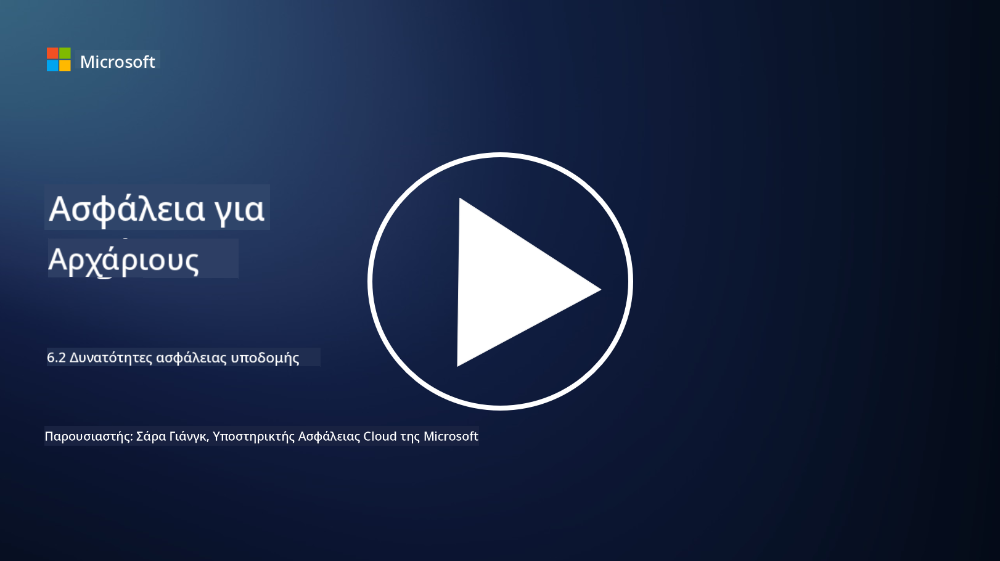

<!--
CO_OP_TRANSLATOR_METADATA:
{
  "original_hash": "7d79ba0e7668b3bdae1fba7aa047f6c0",
  "translation_date": "2025-09-03T20:52:29+00:00",
  "source_file": "6.2 Infrastructure security capabilities.md",
  "language_code": "el"
}
-->
# Δυνατότητες ασφάλειας υποδομής

Σε αυτή την ενότητα, θα καλύψουμε περισσότερες λεπτομέρειες σχετικά με τα βασικά εργαλεία και τις δυνατότητες που χρησιμοποιούνται για την ασφάλεια υποδομής.

**Εισαγωγή**

Σε αυτό το μάθημα, θα καλύψουμε:

- Τι είναι η διαχείριση ευπαθειών;

- Τι είναι το CSPM;

- Τι είναι το CNAPP;

## Τι είναι η διαχείριση ευπαθειών;

Η διαχείριση ευπαθειών είναι μια συστηματική διαδικασία εντοπισμού, αξιολόγησης, προτεραιοποίησης, μετριασμού και παρακολούθησης ευπαθειών σε συστήματα υπολογιστών, λογισμικό, δίκτυα και υποδομές. Ο κύριος στόχος της διαχείρισης ευπαθειών είναι η μείωση της έκθεσης ενός οργανισμού σε κινδύνους ασφαλείας, αντιμετωπίζοντας προληπτικά γνωστές ευπάθειες πριν αυτές αξιοποιηθούν από κακόβουλους παράγοντες. Ακολουθεί μια επισκόπηση των βασικών βημάτων που περιλαμβάνονται:

Εντοπισμός: Σάρωση και ανακάλυψη ευπαθειών στα περιουσιακά στοιχεία του οργανισμού, όπως διακομιστές, εφαρμογές, συσκευές δικτύου και τερματικά.

Αξιολόγηση: Εκτίμηση της σοβαρότητας και της πιθανής επίδρασης κάθε ευπάθειας με βάση παράγοντες όπως η βαθμολογία του Common Vulnerability Scoring System (CVSS) και το επιχειρηματικό πλαίσιο.

Προτεραιοποίηση: Κατάταξη των ευπαθειών με βάση το επίπεδο κινδύνου και την πιθανή επίδραση στις λειτουργίες και τα δεδομένα του οργανισμού.

Μετριασμός: Ανάπτυξη και εφαρμογή στρατηγικών για την αντιμετώπιση ή τον μετριασμό των ευπαθειών, όπως η εφαρμογή ενημερώσεων, η διαμόρφωση ρυθμίσεων ασφαλείας ή η ανάπτυξη αντισταθμιστικών ελέγχων.

Επαλήθευση: Επιβεβαίωση ότι τα μέτρα μετριασμού ήταν αποτελεσματικά στην αντιμετώπιση των ευπαθειών.

Συνεχής Παρακολούθηση: Συνεχής παρακολούθηση ευπαθειών και πιθανών απειλών, με τακτικές σαρώσεις και αξιολογήσεις ευπαθειών.

Η διαχείριση ευπαθειών αποτελεί κρίσιμο στοιχείο της κυβερνοασφάλειας, βοηθώντας τους οργανισμούς να διατηρούν ισχυρή στάση ασφαλείας και να μειώνουν την πιθανότητα παραβιάσεων ασφαλείας. Παραδείγματα εργαλείων διαχείρισης ευπαθειών είναι το Defender for Cloud, το Nessus και το Qualys.

## Τι είναι το CSPM;

Το Cloud Security Posture Management (CSPM) είναι ένα σύνολο εργαλείων, διαδικασιών και πρακτικών που έχουν σχεδιαστεί για την αξιολόγηση, παρακολούθηση και επιβολή ρυθμίσεων ασφαλείας και βέλτιστων πρακτικών σε περιβάλλοντα cloud. Οι λύσεις CSPM βοηθούν τους οργανισμούς να εντοπίζουν και να αντιμετωπίζουν λανθασμένες ρυθμίσεις, κενά ασφαλείας και παραβιάσεις συμμόρφωσης στην υποδομή τους στο cloud, όπως στο Amazon Web Services (AWS), Microsoft Azure, Google Cloud Platform (GCP) και άλλους παρόχους cloud.

Βασικά στοιχεία του CSPM περιλαμβάνουν:

- Αξιολόγηση Ρυθμίσεων: Σάρωση πόρων και υπηρεσιών cloud για τον εντοπισμό λανθασμένων ρυθμίσεων, μη ασφαλών ρυθμίσεων και αποκλίσεων από τις βέλτιστες πρακτικές ασφαλείας.

- Επιβολή Πολιτικών Ασφαλείας: Επιβολή πολιτικών ασφαλείας και προτύπων συμμόρφωσης σε περιβάλλοντα cloud μέσω αυτόματης αντιμετώπισης λανθασμένων ρυθμίσεων ή δημιουργίας ειδοποιήσεων.

- Συνεχής Παρακολούθηση: Παροχή συνεχούς ορατότητας στη στάση ασφαλείας των πόρων και στοιχείων του cloud, με ειδοποιήσεις σε πραγματικό χρόνο για περιστατικά ασφαλείας.

- Αναφορές Συμμόρφωσης: Δημιουργία αναφορών και πινάκων ελέγχου για την επίδειξη συμμόρφωσης με κανονιστικές απαιτήσεις και βιομηχανικά πρότυπα.

Το CSPM βοηθά τους οργανισμούς να διασφαλίζουν ότι η υποδομή τους στο cloud είναι ασφαλής, συμμορφωμένη και ευθυγραμμισμένη με τις βέλτιστες πρακτικές, μειώνοντας τον κίνδυνο περιστατικών ασφαλείας που σχετίζονται με το cloud. Παραδείγματα εργαλείων CSPM περιλαμβάνουν το Defender for Cloud και το Snyk.

## Τι είναι το CNAPP;

Το CNAPP σημαίνει Cloud-Native Application Protection Platform. Είναι μια ολοκληρωμένη πλατφόρμα λογισμικού που απλοποιεί την παρακολούθηση, τον εντοπισμό και την αντιμετώπιση πιθανών απειλών και ευπαθειών ασφαλείας στο cloud. Συνδυάζει πολλαπλά εργαλεία και δυνατότητες σε μια ενιαία λύση λογισμικού για τη μείωση της πολυπλοκότητας και τη διευκόλυνση των λειτουργιών των ομάδων DevOps και DevSecOps. Το CNAPP προσφέρει ολοκληρωμένη ασφάλεια cloud και εφαρμογών καθ' όλη τη διάρκεια του κύκλου ζωής CI/CD της εφαρμογής, από την ανάπτυξη έως την παραγωγή. Ανταποκρίνεται στην ανάγκη της βιομηχανίας για σύγχρονα εργαλεία παρακολούθησης ασφαλείας cloud, διαχείρισης στάσης ασφαλείας, πρόληψης παραβιάσεων και ελέγχου. Οι λύσεις CNAPP παρέχουν στις ομάδες ασφαλείας τη δυνατότητα να ποσοτικοποιούν και να ανταποκρίνονται στους κινδύνους στο περιβάλλον cloud. Ορισμένα χαρακτηριστικά του CNAPP περιλαμβάνουν ενισχυμένη ορατότητα, ποσοτικοποίηση κινδύνων, ασφαλή ανάπτυξη λογισμικού και μια συνδυασμένη λύση ασφαλείας cloud. Τα CNAPPs ενοποιούν πολλαπλά εργαλεία ασφαλείας cloud που παραδοσιακά ήταν απομονωμένα σε μια ενιαία διεπαφή χρήστη, καθιστώντας ευκολότερη την προστασία ολόκληρου του αποτυπώματος εφαρμογών cloud ενός οργανισμού. Τα CNAPPs ενοποιούν πολλαπλά εργαλεία ασφαλείας cloud και πηγές δεδομένων, όπως σάρωση κοντέινερ, διαχείριση στάσης ασφαλείας cloud, σάρωση υποδομής ως κώδικα, διαχείριση δικαιωμάτων υποδομής cloud και πλατφόρμες προστασίας φορτίου εργασίας cloud σε πραγματικό χρόνο.

## Περαιτέρω ανάγνωση
- [What is CSPM? | Microsoft Security](https://www.microsoft.com/security/business/security-101/what-is-cspm?WT.mc_id=academic-96948-sayoung)
- [What is Cloud Security Posture Management (CSPM)? | HackerOne](https://www.hackerone.com/knowledge-center/what-cloud-security-posture-management)
- [Function of cloud security posture management - Cloud Adoption Framework | Microsoft Learn](https://learn.microsoft.com/azure/cloud-adoption-framework/organize/cloud-security-posture-management?WT.mc_id=academic-96948-sayoung)
- [What Is a CNAPP? | Microsoft Security](https://www.microsoft.com/security/business/security-101/what-is-cnapp?WT.mc_id=academic-96948-sayoung)
- [Why Everyone Is Talking About CNAPP (forbes.com)](https://www.forbes.com/sites/forbestechcouncil/2021/12/10/why-everyone-is-talking-about-cnapp/?sh=567275ca1549)
- [Improving Your Multi-Cloud Security with a Cloud-Native Application Protection Platform (CNAPP)](https://www.youtube.com/watch?v=5w42kQ_QjZg&t=212s)

---

**Αποποίηση ευθύνης**:  
Αυτό το έγγραφο έχει μεταφραστεί χρησιμοποιώντας την υπηρεσία αυτόματης μετάφρασης AI [Co-op Translator](https://github.com/Azure/co-op-translator). Παρόλο που καταβάλλουμε προσπάθειες για ακρίβεια, παρακαλούμε να έχετε υπόψη ότι οι αυτοματοποιημένες μεταφράσεις ενδέχεται να περιέχουν λάθη ή ανακρίβειες. Το πρωτότυπο έγγραφο στη μητρική του γλώσσα θα πρέπει να θεωρείται η αυθεντική πηγή. Για κρίσιμες πληροφορίες, συνιστάται επαγγελματική ανθρώπινη μετάφραση. Δεν φέρουμε ευθύνη για τυχόν παρεξηγήσεις ή εσφαλμένες ερμηνείες που προκύπτουν από τη χρήση αυτής της μετάφρασης.