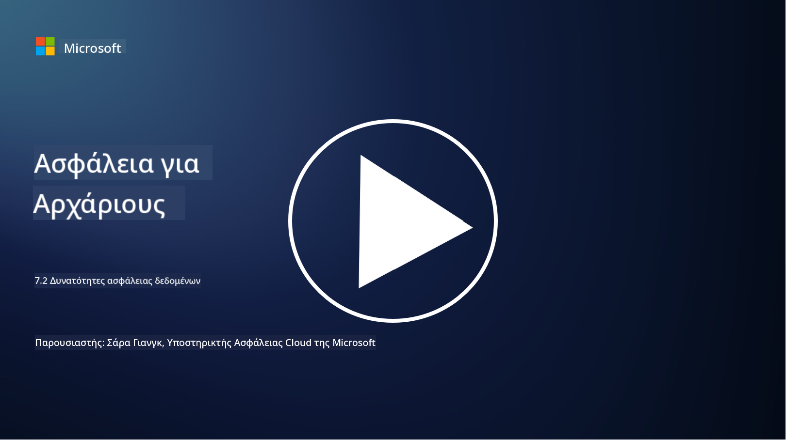

<!--
CO_OP_TRANSLATOR_METADATA:
{
  "original_hash": "50697add9758e54693442d502d2d5f8a",
  "translation_date": "2025-09-03T21:28:54+00:00",
  "source_file": "7.2 Data security capabilities.md",
  "language_code": "el"
}
-->
# Δυνατότητες ασφάλειας δεδομένων

Σε αυτή την ενότητα, θα καλύψουμε περισσότερες λεπτομέρειες σχετικά με τα βασικά εργαλεία και τις δυνατότητες που χρησιμοποιούνται για την ασφάλεια δεδομένων:

**Εισαγωγή**

Σε αυτό το μάθημα, θα καλύψουμε:

- Τι είναι τα εργαλεία πρόληψης απώλειας δεδομένων;

- Τι είναι τα εργαλεία διαχείρισης κινδύνου από εσωτερικές απειλές;

- Ποια εργαλεία διατήρησης δεδομένων είναι διαθέσιμα;

## Τι είναι τα εργαλεία πρόληψης απώλειας δεδομένων;

Τα εργαλεία Πρόληψης Απώλειας Δεδομένων (Data Loss Prevention - DLP) αναφέρονται σε ένα σύνολο λύσεων λογισμικού και τεχνολογιών που έχουν σχεδιαστεί για να αποτρέπουν τη μη εξουσιοδοτημένη πρόσβαση, κοινοποίηση ή διαρροή ευαίσθητων ή εμπιστευτικών δεδομένων εντός ενός οργανισμού. Αυτά τα εργαλεία χρησιμοποιούν επιθεώρηση περιεχομένου, επιβολή πολιτικών και παρακολούθηση για να εντοπίζουν και να προστατεύουν ευαίσθητα δεδομένα από την έκθεση ή την κακή χρήση. Παραδείγματα προϊόντων DLP περιλαμβάνουν: Symantec Data Loss Prevention, McAfee Total Protection for Data Loss Prevention, Microsoft 365 DLP**: Ενσωματώνεται με εφαρμογές του Microsoft 365 για να βοηθήσει τους οργανισμούς να εντοπίζουν και να προστατεύουν ευαίσθητα δεδομένα σε emails, έγγραφα και μηνύματα.

## Τι είναι τα εργαλεία διαχείρισης κινδύνου από εσωτερικές απειλές;

Τα εργαλεία Διαχείρισης Κινδύνου από Εσωτερικές Απειλές βοηθούν τους οργανισμούς να εντοπίζουν και να μετριάζουν τους κινδύνους που προέρχονται από υπαλλήλους, εργολάβους ή συνεργάτες που μπορεί να θέσουν σε κίνδυνο την ασφάλεια δεδομένων, είτε σκόπιμα είτε ακούσια. Αυτά τα εργαλεία παρακολουθούν τη συμπεριφορά των χρηστών, τα μοτίβα πρόσβασης και τη χρήση δεδομένων για να εντοπίζουν ύποπτες δραστηριότητες και πιθανές εσωτερικές απειλές. Παραδείγματα προϊόντων διαχείρισης κινδύνου από εσωτερικές απειλές περιλαμβάνουν: Microsoft Insider Risk Management (μέρος του Microsoft 365), Forcepoint Insider Threat Data Protection, Varonis Insider Threat Detection.

## Ποια εργαλεία διατήρησης δεδομένων είναι διαθέσιμα;

Τα εργαλεία διατήρησης δεδομένων περιλαμβάνουν λογισμικό και λύσεις που έχουν σχεδιαστεί για να διαχειρίζονται τη διατήρηση και τη διαγραφή δεδομένων σύμφωνα με τις πολιτικές διατήρησης δεδομένων και τις νομικές απαιτήσεις ενός οργανισμού. Αυτά τα εργαλεία βοηθούν στην αυτοματοποίηση της διαδικασίας διατήρησης δεδομένων για συγκεκριμένες χρονικές περιόδους και στην ασφαλή διαγραφή τους όταν δεν είναι πλέον απαραίτητα. Παραδείγματα προϊόντων διατήρησης δεδομένων περιλαμβάνουν: Veritas Enterprise Vault, Commvault Complete Data Protection, Microsoft data lifecycle management. Αυτές οι λύσεις εργαλείων βοηθούν τους οργανισμούς να διατηρούν τον έλεγχο της διατήρησης και της διάθεσης δεδομένων, εξασφαλίζοντας τη συμμόρφωση με τους κανονισμούς προστασίας δεδομένων ενώ διαχειρίζονται αποτελεσματικά τα δεδομένα καθ' όλη τη διάρκεια του κύκλου ζωής τους.

## Περαιτέρω ανάγνωση

- [Guide to Data Security Posture Management (DSPM) | CSA (cloudsecurityalliance.org)](https://cloudsecurityalliance.org/blog/2023/03/31/the-big-guide-to-data-security-posture-management-dspm/)
- [Data Loss Prevention across endpoints, apps, & services | Microsoft Purview](https://youtu.be/hvqq8L_0kgI)
- [18 Best Data Loss Prevention Software Tools 2023 (Free + Paid) (comparitech.com)](https://www.comparitech.com/data-privacy-management/data-loss-prevention-tools-software/)
- [Data Loss Prevention (nist.gov)](https://tsapps.nist.gov/publication/get_pdf.cfm?pub_id=904672)
- [Learn about insider risk management | Microsoft Learn](https://learn.microsoft.com/purview/insider-risk-management?WT.mc_id=academic-96948-sayoung)
- [Data Lifecycle Management | IBM](https://www.ibm.com/topics/data-lifecycle-management)
- [What Is Data Lifecycle Management (DLM)? | 2023 Best Practices (selecthub.com)](https://www.selecthub.com/big-data-analytics/data-lifecycle-management/)

---

**Αποποίηση ευθύνης**:  
Αυτό το έγγραφο έχει μεταφραστεί χρησιμοποιώντας την υπηρεσία αυτόματης μετάφρασης AI [Co-op Translator](https://github.com/Azure/co-op-translator). Παρόλο που καταβάλλουμε προσπάθειες για ακρίβεια, παρακαλούμε να έχετε υπόψη ότι οι αυτοματοποιημένες μεταφράσεις ενδέχεται να περιέχουν σφάλματα ή ανακρίβειες. Το πρωτότυπο έγγραφο στη μητρική του γλώσσα θα πρέπει να θεωρείται η αυθεντική πηγή. Για κρίσιμες πληροφορίες, συνιστάται επαγγελματική ανθρώπινη μετάφραση. Δεν φέρουμε ευθύνη για τυχόν παρεξηγήσεις ή εσφαλμένες ερμηνείες που προκύπτουν από τη χρήση αυτής της μετάφρασης.