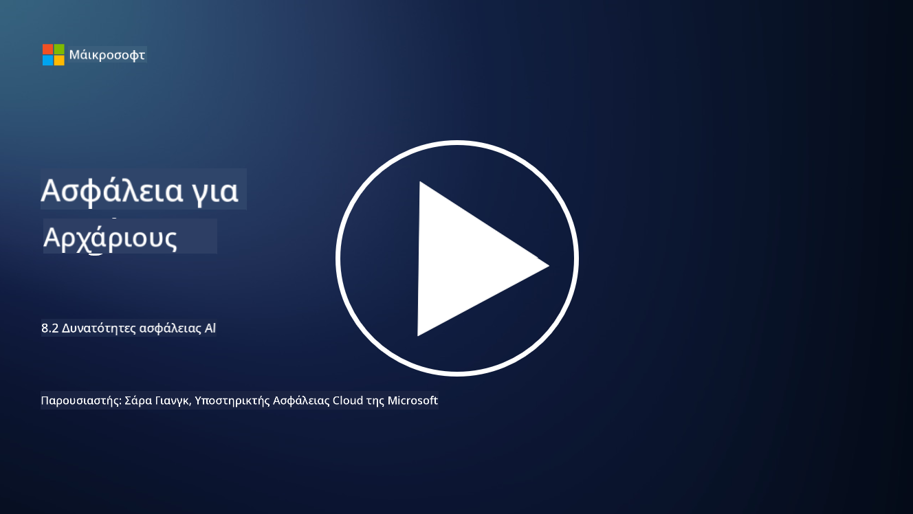

<!--
CO_OP_TRANSLATOR_METADATA:
{
  "original_hash": "b6bb7175672298d1e2f73ba7e0006f95",
  "translation_date": "2025-09-03T21:35:50+00:00",
  "source_file": "8.2 AI security capabilities.md",
  "language_code": "el"
}
-->
# Δυνατότητες ασφάλειας AI

## Ποια εργαλεία και δυνατότητες έχουμε αυτή τη στιγμή για την ασφάλεια των συστημάτων AI;

Αυτή τη στιγμή υπάρχουν αρκετά εργαλεία και δυνατότητες για την ασφάλεια των συστημάτων AI:

-   **Counterfit**: Ένα εργαλείο αυτοματισμού ανοιχτού κώδικα για δοκιμές ασφάλειας συστημάτων AI, σχεδιασμένο να βοηθά οργανισμούς να πραγματοποιούν αξιολογήσεις κινδύνου ασφάλειας AI και να διασφαλίζουν την ανθεκτικότητα των αλγορίθμων τους.
-   **Εργαλεία Αντίξοης Μηχανικής Μάθησης**: Αυτά τα εργαλεία αξιολογούν την ανθεκτικότητα των μοντέλων μηχανικής μάθησης απέναντι σε αντίξοες επιθέσεις, βοηθώντας στον εντοπισμό και την αντιμετώπιση ευπαθειών.
-   **Εργαλειοθήκες Ασφάλειας AI**: Υπάρχουν διαθέσιμες εργαλειοθήκες ανοιχτού κώδικα που παρέχουν πόρους για την ασφάλεια των συστημάτων AI, συμπεριλαμβανομένων βιβλιοθηκών και πλαισίων για την εφαρμογή μέτρων ασφάλειας.
-   **Συνεργατικές Πλατφόρμες**: Συνεργασίες μεταξύ εταιρειών και κοινοτήτων AI για την ανάπτυξη σαρωτών ασφάλειας ειδικών για AI και άλλων εργαλείων για την ασφάλεια της εφοδιαστικής αλυσίδας AI.

Αυτά τα εργαλεία και οι δυνατότητες αποτελούν μέρος ενός αναπτυσσόμενου πεδίου που επικεντρώνεται στην ενίσχυση της ασφάλειας των συστημάτων AI απέναντι σε διάφορες απειλές. Αντιπροσωπεύουν έναν συνδυασμό έρευνας, πρακτικών εργαλείων και συνεργασίας της βιομηχανίας με στόχο την αντιμετώπιση των μοναδικών προκλήσεων που θέτουν οι τεχνολογίες AI.

## Τι γίνεται με το AI red teaming; Πώς διαφέρει από το παραδοσιακό red teaming ασφάλειας;

Το AI red teaming διαφέρει από το παραδοσιακό red teaming ασφάλειας σε αρκετές βασικές πτυχές:

-   **Εστίαση στα Συστήματα AI**: Το AI red teaming επικεντρώνεται στις μοναδικές ευπάθειες των συστημάτων AI, όπως τα μοντέλα μηχανικής μάθησης και οι αγωγοί δεδομένων, αντί για την παραδοσιακή υποδομή IT.
-   **Δοκιμή Συμπεριφοράς AI**: Περιλαμβάνει τη δοκιμή του πώς τα συστήματα AI ανταποκρίνονται σε ασυνήθιστες ή απροσδόκητες εισόδους, κάτι που μπορεί να αποκαλύψει ευπάθειες που θα μπορούσαν να εκμεταλλευτούν οι επιτιθέμενοι.
-   **Εξερεύνηση Αποτυχιών AI**: Το AI red teaming εξετάζει τόσο κακόβουλες όσο και αθώες αποτυχίες, λαμβάνοντας υπόψη ένα ευρύτερο φάσμα σεναρίων και πιθανών αποτυχιών συστημάτων πέρα από τις παραβιάσεις ασφάλειας.
-   **Εισαγωγή Εντολών και Δημιουργία Περιεχομένου**: Περιλαμβάνει επίσης τη διερεύνηση αποτυχιών όπως η εισαγωγή εντολών, όπου οι επιτιθέμενοι χειραγωγούν τα συστήματα AI για να παράγουν επιβλαβές ή μη τεκμηριωμένο περιεχόμενο.
-   **Ηθική και Υπεύθυνη AI**: Αποτελεί μέρος της διασφάλισης υπεύθυνου AI από τον σχεδιασμό, διασφαλίζοντας ότι τα συστήματα AI είναι ανθεκτικά απέναντι σε προσπάθειες να τα κάνουν να λειτουργούν με μη προβλεπόμενους τρόπους.

Συνολικά, το AI red teaming είναι μια διευρυμένη πρακτική που όχι μόνο καλύπτει την ανίχνευση ευπαθειών ασφάλειας αλλά περιλαμβάνει και τη δοκιμή για άλλους τύπους αποτυχιών συστημάτων που είναι ειδικοί για τις τεχνολογίες AI. Είναι ένα κρίσιμο μέρος της ανάπτυξης ασφαλέστερων συστημάτων AI μέσω της κατανόησης και της αντιμετώπισης νέων κινδύνων που σχετίζονται με την ανάπτυξη AI.

## Περαιτέρω ανάγνωση

 - [Microsoft AI Red Team building future of safer AI | Microsoft Security Blog](https://www.microsoft.com/en-us/security/blog/2023/08/07/microsoft-ai-red-team-building-future-of-safer-ai/?WT.mc_id=academic-96948-sayoung)
 - [Announcing Microsoft’s open automation framework to red team generative AI Systems | Microsoft Security Blog](https://www.microsoft.com/en-us/security/blog/2024/02/22/announcing-microsofts-open-automation-framework-to-red-team-generative-ai-systems/?WT.mc_id=academic-96948-sayoung)
 - [AI Security Tools: The Open-Source Toolkit | Wiz](https://www.wiz.io/academy/ai-security-tools)

---

**Αποποίηση ευθύνης**:  
Αυτό το έγγραφο έχει μεταφραστεί χρησιμοποιώντας την υπηρεσία αυτόματης μετάφρασης [Co-op Translator](https://github.com/Azure/co-op-translator). Παρόλο που καταβάλλουμε προσπάθειες για ακρίβεια, παρακαλούμε να έχετε υπόψη ότι οι αυτοματοποιημένες μεταφράσεις ενδέχεται να περιέχουν σφάλματα ή ανακρίβειες. Το πρωτότυπο έγγραφο στη μητρική του γλώσσα θα πρέπει να θεωρείται η αυθεντική πηγή. Για κρίσιμες πληροφορίες, συνιστάται επαγγελματική ανθρώπινη μετάφραση. Δεν φέρουμε ευθύνη για τυχόν παρεξηγήσεις ή εσφαλμένες ερμηνείες που προκύπτουν από τη χρήση αυτής της μετάφρασης.