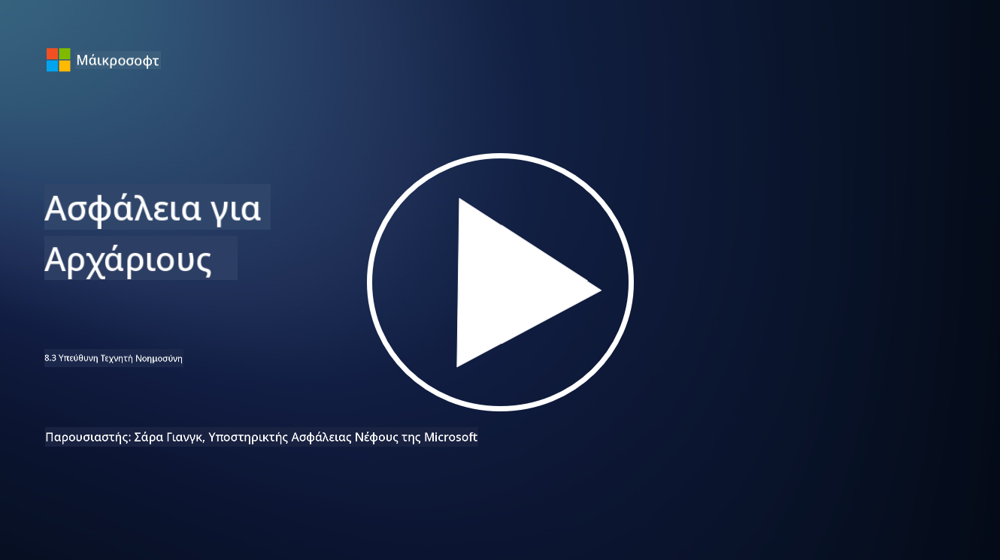

<!--
CO_OP_TRANSLATOR_METADATA:
{
  "original_hash": "5e9775ee91bde7d44577891d5f11c4c5",
  "translation_date": "2025-09-03T20:46:04+00:00",
  "source_file": "8.3 Responsible AI.md",
  "language_code": "el"
}
-->
# Υπεύθυνη Τεχνητή Νοημοσύνη

## Τι είναι η υπεύθυνη τεχνητή νοημοσύνη και πώς σχετίζεται με την ασφάλεια της τεχνητής νοημοσύνης;

Η υπεύθυνη τεχνητή νοημοσύνη αναφέρεται στην ανάπτυξη και χρήση της τεχνητής νοημοσύνης με τρόπο που είναι ηθικός, διαφανής και ευθυγραμμισμένος με τις κοινωνικές αξίες. Περιλαμβάνει αρχές όπως η δικαιοσύνη, η λογοδοσία και η ανθεκτικότητα, διασφαλίζοντας ότι τα συστήματα τεχνητής νοημοσύνης σχεδιάζονται και λειτουργούν προς όφελος των ατόμων, των κοινοτήτων και της κοινωνίας συνολικά.

Η σχέση μεταξύ υπεύθυνης τεχνητής νοημοσύνης και ασφάλειας της τεχνητής νοημοσύνης είναι σημαντική επειδή:

-   **Ηθικές Σκέψεις**: Η υπεύθυνη τεχνητή νοημοσύνη περιλαμβάνει ηθικές σκέψεις που επηρεάζουν άμεσα την ασφάλεια, όπως η προστασία της ιδιωτικότητας και των δεδομένων. Η διασφάλιση ότι τα συστήματα τεχνητής νοημοσύνης σέβονται την ιδιωτικότητα των χρηστών και προστατεύουν τα προσωπικά δεδομένα είναι βασική πτυχή της υπεύθυνης τεχνητής νοημοσύνης.
-   **Ανθεκτικότητα και Αξιοπιστία**: Τα συστήματα τεχνητής νοημοσύνης πρέπει να είναι ανθεκτικά απέναντι σε χειραγώγηση και επιθέσεις, κάτι που αποτελεί βασική αρχή τόσο της υπεύθυνης τεχνητής νοημοσύνης όσο και της ασφάλειας της τεχνητής νοημοσύνης. Αυτό περιλαμβάνει την προστασία από επιθέσεις αντιπάλων και τη διασφάλιση της ακεραιότητας των διαδικασιών λήψης αποφάσεων της τεχνητής νοημοσύνης.
-   **Διαφάνεια και Επεξηγησιμότητα**: Μέρος της υπεύθυνης τεχνητής νοημοσύνης είναι η διασφάλιση ότι τα συστήματα τεχνητής νοημοσύνης είναι διαφανή και οι αποφάσεις τους μπορούν να εξηγηθούν. Αυτό είναι κρίσιμο για την ασφάλεια, καθώς οι ενδιαφερόμενοι πρέπει να κατανοούν πώς λειτουργούν τα συστήματα τεχνητής νοημοσύνης για να εμπιστεύονται τα μέτρα ασφαλείας τους.
-   **Λογοδοσία**: Τα συστήματα τεχνητής νοημοσύνης πρέπει να είναι υπεύθυνα για τις ενέργειές τους, πράγμα που σημαίνει ότι πρέπει να υπάρχουν μηχανισμοί για την ανίχνευση αποφάσεων και τη διόρθωση τυχόν προβλημάτων. Αυτό ευθυγραμμίζεται με τις πρακτικές ασφαλείας που παρακολουθούν και ελέγχουν τις δραστηριότητες του συστήματος για την πρόληψη και την αντιμετώπιση παραβιάσεων.

Ουσιαστικά, η υπεύθυνη τεχνητή νοημοσύνη και η ασφάλεια της τεχνητής νοημοσύνης είναι αλληλένδετες, με τις πρακτικές της υπεύθυνης τεχνητής νοημοσύνης να ενισχύουν την ασφάλεια των συστημάτων τεχνητής νοημοσύνης και το αντίστροφο. Η εφαρμογή των αρχών της υπεύθυνης τεχνητής νοημοσύνης βοηθά στη δημιουργία συστημάτων τεχνητής νοημοσύνης που είναι όχι μόνο ηθικά σωστά αλλά και πιο ασφαλή απέναντι σε πιθανές απειλές.

## Πώς μπορώ να διασφαλίσω ότι το σύστημα τεχνητής νοημοσύνης μου είναι και ασφαλές και ηθικό;

Η διασφάλιση ότι το σύστημα τεχνητής νοημοσύνης σας είναι και ασφαλές και ηθικό απαιτεί μια πολυδιάστατη προσέγγιση που περιλαμβάνει τα εξής βήματα:

- **Τήρηση Ηθικών Αρχών**: Ακολουθήστε καθιερωμένες ηθικές κατευθυντήριες γραμμές που δίνουν έμφαση στην ανθρώπινη, κοινωνική και περιβαλλοντική ευημερία, τη δικαιοσύνη, την προστασία της ιδιωτικότητας, την αξιοπιστία, τη διαφάνεια, τη δυνατότητα αμφισβήτησης και τη λογοδοσία.

- **Εφαρμογή Ισχυρών Μέτρων Ασφαλείας**: Χρησιμοποιήστε προληπτικές δοκιμές ασφαλείας και προγράμματα διαχείρισης εμπιστοσύνης, κινδύνων και ασφάλειας της τεχνητής νοημοσύνης για την προστασία από απειλές και ευπάθειες.

- **Συμμετοχή Διαφορετικών Ενδιαφερόμενων**: Εμπλέξτε ένα ευρύ φάσμα συμμετεχόντων στη διαδικασία ανάπτυξης της τεχνητής νοημοσύνης, συμπεριλαμβανομένων ηθικολόγων, κοινωνικών επιστημόνων και εκπροσώπων από τις επηρεαζόμενες κοινότητες, ώστε να διασφαλιστεί ότι λαμβάνονται υπόψη διαφορετικές προοπτικές και αξίες.

- **Διασφάλιση Διαφάνειας και Επεξηγησιμότητας**: Βεβαιωθείτε ότι οι διαδικασίες λήψης αποφάσεων της τεχνητής νοημοσύνης είναι διαφανείς και μπορούν να εξηγηθούν, επιτρέποντας μεγαλύτερη εμπιστοσύνη και ευκολότερη αναγνώριση πιθανών προκαταλήψεων ή σφαλμάτων.

- **Διατήρηση Ιδιωτικότητας Δεδομένων**: Προστατεύστε την ιδιωτικότητα και την αυθεντικότητα των δεδομένων μέσω κρυπτογράφησης και άλλων μέτρων προστασίας δεδομένων, ώστε να σέβεστε τα δικαιώματα ιδιωτικότητας των χρηστών.

- **Ενεργοποίηση Ανθρώπινης Εποπτείας**: Εφαρμόστε μηχανισμούς για ανθρώπινη εποπτεία, ώστε να επιτρέπεται η αμφισβήτηση των αποφάσεων που λαμβάνονται από τα συστήματα τεχνητής νοημοσύνης και να διασφαλίζεται η λογοδοσία.

- **Ενημέρωση για την Ασφάλεια της Τεχνητής Νοημοσύνης**: Παραμείνετε ενημερωμένοι σχετικά με την τελευταία έρευνα και τις συζητήσεις για την ασφάλεια της τεχνητής νοημοσύνης, ώστε να κατανοήσετε το εξελισσόμενο τοπίο της ασφάλειας και της ηθικής της τεχνητής νοημοσύνης.

- **Συμμόρφωση με Κανονισμούς**: Βεβαιωθείτε ότι το σύστημα τεχνητής νοημοσύνης σας συμμορφώνεται με όλους τους σχετικούς νόμους και κανονισμούς, οι οποίοι μπορεί να περιλαμβάνουν νόμους προστασίας δεδομένων, νόμους κατά των διακρίσεων και κατευθυντήριες γραμμές που αφορούν συγκεκριμένους κλάδους.

## Μπορείτε να μου δώσετε παραδείγματα προβλημάτων ασφαλείας που προκαλούνται από ανήθικη χρήση της τεχνητής νοημοσύνης;

Ακολουθούν ορισμένα παραδείγματα προβλημάτων ασφαλείας που μπορεί να προκύψουν από την ανήθικη χρήση της τεχνητής νοημοσύνης:

- **Προκατειλημμένη Λήψη Αποφάσεων**: Τα συστήματα τεχνητής νοημοσύνης μπορούν να διαιωνίσουν και να ενισχύσουν υπάρχουσες προκαταλήψεις εάν εκπαιδευτούν σε προκατειλημμένα σύνολα δεδομένων. Για παράδειγμα, εάν μια μηχανή αναζήτησης εκπαιδευτεί σε δεδομένα που αντικατοπτρίζουν κοινωνικά στερεότυπα, μπορεί να εμφανίσει προκατειλημμένα αποτελέσματα αναζήτησης, οδηγώντας σε άδικη μεταχείριση ή διακρίσεις.

- **Τεχνητή Νοημοσύνη στα Δικαστικά Συστήματα**: Η χρήση της τεχνητής νοημοσύνης στη λήψη νομικών αποφάσεων μπορεί να εγείρει ηθικά ζητήματα, ειδικά εάν η διαδικασία λήψης αποφάσεων της τεχνητής νοημοσύνης στερείται διαφάνειας ή επηρεάζεται από προκατειλημμένα δεδομένα. Αυτό θα μπορούσε να οδηγήσει σε άδικα νομικά αποτελέσματα και να παραβιάσει τα δικαιώματα των ατόμων.

- **Χειραγώγηση Συστημάτων Τεχνητής Νοημοσύνης**: Τα συστήματα τεχνητής νοημοσύνης μπορεί να είναι ευάλωτα σε επιθέσεις αντιπάλων, όπου μικρές τροποποιήσεις στα δεδομένα εισόδου μπορούν να προκαλέσουν λανθασμένα αποτελέσματα. Για παράδειγμα, τα αυτόνομα οχήματα θα μπορούσαν να παραπλανηθούν ώστε να ερμηνεύσουν λανθασμένα τα σήματα κυκλοφορίας, οδηγώντας σε κινδύνους ασφαλείας.

- **Τεχνητή Νοημοσύνη για Παρακολούθηση**: Η χρήση της τεχνητής νοημοσύνης για σκοπούς παρακολούθησης μπορεί να οδηγήσει σε παραβιάσεις της ιδιωτικότητας, ειδικά εάν χρησιμοποιείται χωρίς κατάλληλη συναίνεση ή με τρόπους που παραβιάζουν τις ατομικές ελευθερίες. Αυτό μπορεί να είναι ιδιαίτερα προβληματικό σε αυταρχικά καθεστώτα που μπορεί να χρησιμοποιούν την τεχνητή νοημοσύνη για την παρακολούθηση και καταστολή της διαφωνίας.

Αυτά τα παραδείγματα υπογραμμίζουν τη σημασία των ηθικών σκέψεων στην ανάπτυξη και την εφαρμογή συστημάτων τεχνητής νοημοσύνης για την πρόληψη προβλημάτων ασφαλείας και την προστασία των δικαιωμάτων και της ιδιωτικότητας των ατόμων.

## Περαιτέρω ανάγνωση

 - [Microsoft Responsible AI Standard v2 General Requirements](https://query.prod.cms.rt.microsoft.com/cms/api/am/binary/RE5cmFl?culture=en-us&country=us&WT.mc_id=academic-96948-sayoung)
 - [Responsible AI (mit.edu)](https://sloanreview.mit.edu/big-ideas/responsible-ai/)
 - [13 Principles for Using AI Responsibly (hbr.org)](https://hbr.org/2023/06/13-principles-for-using-ai-responsibly)

---

**Αποποίηση ευθύνης**:  
Αυτό το έγγραφο έχει μεταφραστεί χρησιμοποιώντας την υπηρεσία αυτόματης μετάφρασης [Co-op Translator](https://github.com/Azure/co-op-translator). Παρόλο που καταβάλλουμε προσπάθειες για ακρίβεια, παρακαλούμε να έχετε υπόψη ότι οι αυτοματοποιημένες μεταφράσεις ενδέχεται να περιέχουν λάθη ή ανακρίβειες. Το πρωτότυπο έγγραφο στη μητρική του γλώσσα θα πρέπει να θεωρείται η αυθεντική πηγή. Για κρίσιμες πληροφορίες, συνιστάται επαγγελματική ανθρώπινη μετάφραση. Δεν φέρουμε ευθύνη για τυχόν παρεξηγήσεις ή εσφαλμένες ερμηνείες που προκύπτουν από τη χρήση αυτής της μετάφρασης.