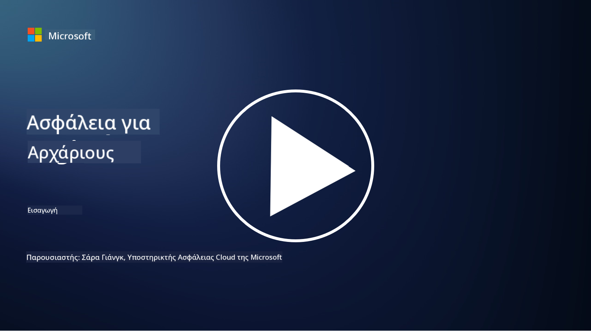

<!--
CO_OP_TRANSLATOR_METADATA:
{
  "original_hash": "33e83c2beb28a1b6e031416624dc23aa",
  "translation_date": "2025-10-11T10:56:29+00:00",
  "source_file": "README.md",
  "language_code": "el"
}
-->

### 🌐 Υποστήριξη Πολλαπλών Γλωσσών

#### Υποστηρίζεται μέσω GitHub Action (Αυτοματοποιημένο & Πάντα Ενημερωμένο)

<!-- ΠΙΝΑΚΑΣ ΓΛΩΣΣΩΝ CO-OP TRANSLATOR START -->
[Αραβικά](../ar/README.md) | [Βεγγαλικά](../bn/README.md) | [Βουλγαρικά](../bg/README.md) | [Βιρμανικά (Μιανμάρ)](../my/README.md) | [Κινέζικα (Απλοποιημένα)](../zh/README.md) | [Κινέζικα (Παραδοσιακά, Χονγκ Κονγκ)](../hk/README.md) | [Κινέζικα (Παραδοσιακά, Μακάου)](../mo/README.md) | [Κινέζικα (Παραδοσιακά, Ταϊβάν)](../tw/README.md) | [Κροατικά](../hr/README.md) | [Τσέχικα](../cs/README.md) | [Δανικά](../da/README.md) | [Ολλανδικά](../nl/README.md) | [Εσθονικά](../et/README.md) | [Φινλανδικά](../fi/README.md) | [Γαλλικά](../fr/README.md) | [Γερμανικά](../de/README.md) | [Ελληνικά](./README.md) | [Εβραϊκά](../he/README.md) | [Χίντι](../hi/README.md) | [Ουγγρικά](../hu/README.md) | [Ινδονησιακά](../id/README.md) | [Ιταλικά](../it/README.md) | [Ιαπωνικά](../ja/README.md) | [Κορεατικά](../ko/README.md) | [Λιθουανικά](../lt/README.md) | [Μαλαισιανά](../ms/README.md) | [Μαραθικά](../mr/README.md) | [Νεπαλικά](../ne/README.md) | [Νορβηγικά](../no/README.md) | [Περσικά (Φαρσί)](../fa/README.md) | [Πολωνικά](../pl/README.md) | [Πορτογαλικά (Βραζιλία)](../br/README.md) | [Πορτογαλικά (Πορτογαλία)](../pt/README.md) | [Παντζάμπι (Γκουρμούκι)](../pa/README.md) | [Ρουμανικά](../ro/README.md) | [Ρωσικά](../ru/README.md) | [Σερβικά (Κυριλλικά)](../sr/README.md) | [Σλοβακικά](../sk/README.md) | [Σλοβενικά](../sl/README.md) | [Ισπανικά](../es/README.md) | [Σουαχίλι](../sw/README.md) | [Σουηδικά](../sv/README.md) | [Ταγκαλόγκ (Φιλιππινέζικα)](../tl/README.md) | [Ταμίλ](../ta/README.md) | [Ταϊλανδικά](../th/README.md) | [Τουρκικά](../tr/README.md) | [Ουκρανικά](../uk/README.md) | [Ουρντού](../ur/README.md) | [Βιετναμέζικα](../vi/README.md)
<!-- ΠΙΝΑΚΑΣ ΓΛΩΣΣΩΝ CO-OP TRANSLATOR END -->

**Αν θέλετε να υποστηριχθούν επιπλέον γλώσσες, μπορείτε να δείτε τη λίστα [εδώ](https://github.com/Azure/co-op-translator/blob/main/getting_started/supported-languages.md)**

#### Γίνετε Μέλος της Κοινότητάς μας 

# 🚀 Κυβερνοασφάλεια για Αρχάριους – ένα πρόγραμμα σπουδών

Στην εποχή της ταχείας υιοθέτησης της τεχνολογίας AI, είναι ακόμα πιο κρίσιμο να κατανοήσουμε πώς να προστατεύουμε τα συστήματα IT. Αυτό το μάθημα έχει σχεδιαστεί για να σας διδάξει βασικές έννοιες κυβερνοασφάλειας, ώστε να ξεκινήσετε την εκμάθηση της ασφάλειας. Είναι ανεξάρτητο από προμηθευτές και χωρίζεται σε μικρά μαθήματα που διαρκούν περίπου 30-60 λεπτά το καθένα. Κάθε μάθημα περιλαμβάνει ένα μικρό κουίζ και συνδέσμους για περαιτέρω ανάγνωση, αν θέλετε να εμβαθύνετε στο θέμα.

Τι καλύπτει αυτό το μάθημα 📚

- 🔐 Βασικές έννοιες κυβερνοασφάλειας, όπως το τρίγωνο CIA, οι διαφορές μεταξύ κινδύνων, απειλών κ.λπ.
- 🛡️ Κατανόηση του τι είναι ένα μέτρο ασφαλείας και ποιες μορφές μπορεί να πάρει.
- 🌐 Κατανόηση του τι είναι το zero trust και γιατί είναι σημαντικό στη σύγχρονη κυβερνοασφάλεια.
- 🔑 Κατανόηση βασικών εννοιών και θεμάτων σχετικά με την ταυτότητα, τη δικτύωση, τις λειτουργίες ασφαλείας, την υποδομή και την ασφάλεια δεδομένων.
- 🔧 Παροχή παραδειγμάτων εργαλείων που χρησιμοποιούνται για την εφαρμογή μέτρων ασφαλείας.

Τι δεν καλύπτει αυτό το μάθημα 🙅‍♂️

- 🚫 Πώς να χρησιμοποιείτε συγκεκριμένα εργαλεία ασφαλείας.
- 🚫 Πώς να "χακάρετε" ή να κάνετε red teaming/επιθετική ασφάλεια.
- 🚫 Εκμάθηση συγκεκριμένων προτύπων συμμόρφωσης.

Όταν ολοκληρώσετε αυτό το μάθημα, μπορείτε να προχωρήσετε σε ορισμένα από τα Microsoft Learn modules μας. Σας προτείνουμε να συνεχίσετε την εκμάθησή σας με το [Microsoft Security, Compliance, and Identity Fundamentals.](https://learn.microsoft.com/training/paths/describe-concepts-of-security-compliance-identity/?WT.mc_id=academic-96948-sayoung) 

Τελικά, μπορείτε να εξετάσετε το ενδεχόμενο να δώσετε την [Εξέταση SC-900: Microsoft Security, Compliance, and Identity Fundamentals.](https://learn.microsoft.com/credentials/certifications/exams/sc-900/?WT.mc_id=academic-96948-sayoung)

> 💁 Αν έχετε οποιαδήποτε σχόλια ή προτάσεις για αυτό το μάθημα και περιεχόμενο που λείπει, θα χαρούμε να ακούσουμε από εσάς!

## Επισκόπηση Ενοτήτων 📝 
| **Αριθμός Ενότητας** | **Όνομα Ενότητας**                           | **Διδασκόμενες Έννοιες**                  | **Στόχοι Μάθησης**                                                                                          |
|-------------------|-------------------------------------------|--------------------------------------|-----------------------------------------------------------------------------------------------------------------|
| **1.1**           | Βασικές έννοιες ασφάλειας                   | [Το τρίγωνο CIA](https://github.com/microsoft/Security-101/blob/main/1.1%20The%20CIA%20triad%20and%20other%20key%20concepts.md)                        | Μάθετε για την εμπιστευτικότητα, τη διαθεσιμότητα και την ακεραιότητα. Επίσης την αυθεντικότητα, την μη αποποίηση και την ιδιωτικότητα. |
| **1.2**           | Βασικές έννοιες ασφάλειας                   | [Κοινές απειλές κυβερνοασφάλειας](https://github.com/microsoft/Security-101/blob/main/1.2%20Common%20cybersecurity%20threats.md)        | Μάθετε για τις κοινές απειλές κυβερνοασφάλειας που αντιμετωπίζουν άτομα και οργανισμοί.                             |
| **1.3**           | Βασικές έννοιες ασφάλειας                   | [Κατανόηση της διαχείρισης κινδύνων](https://github.com/microsoft/Security-101/blob/main/1.3%20Understanding%20risk%20management.md)       | Μάθετε για την αξιολόγηση και την κατανόηση του κινδύνου – αντίκτυπος/πιθανότητα και εφαρμογή μέτρων.                                                                                                               | |
| **1.4**           | Βασικές έννοιες ασφάλειας                   | [Πρακτικές ασφάλειας και τεκμηρίωση](https://github.com/microsoft/Security-101/blob/main/1.4%20Security%20practices%20and%20documentation.md) | Μάθετε για τη διαφορά μεταξύ πολιτικών, διαδικασιών, προτύπων και κανονισμών/νόμων.                         |
| **1.5**           | Βασικές έννοιες ασφάλειας                   | [Zero trust](https://github.com/microsoft/Security-101/blob/main/1.5%20Zero%20trust.md)                           | Μάθετε τι είναι το zero trust και πώς επηρεάζει την αρχιτεκτονική. Τι είναι η άμυνα σε βάθος;                   |
| **1.6**           | Βασικές έννοιες ασφάλειας                   | [Το μοντέλο κοινής ευθύνης](https://github.com/microsoft/Security-101/blob/main/1.6%20Shared%20responsibility%20model.md)                           | Τι είναι το μοντέλο κοινής ευθύνης και πώς επηρεάζει την κυβερνοασφάλεια;                  |
| **1.7**           | [Κουίζ τέλους ενότητας](https://github.com/microsoft/Security-101/blob/main/1.7%20End%20of%20module%20quiz.md)                        |                                      |                                                                                                                 |
| **2.1**           | Θεμελιώδεις αρχές διαχείρισης ταυτότητας & πρόσβασης | [Βασικές έννοιες IAM](https://github.com/microsoft/Security-101/blob/main/2.1%20IAM%20key%20concepts.md)                     | Μάθετε για την αρχή της ελάχιστης προνομιακής πρόσβασης, τον διαχωρισμό καθηκόντων, πώς το IAM υποστηρίζει το zero trust.               |
| **2.2**           | Θεμελιώδεις αρχές διαχείρισης ταυτότητας & πρόσβασης | [Αρχιτεκτονική zero trust IAM](https://github.com/microsoft/Security-101/blob/main/2.2%20IAM%20zero%20trust%20architecture.md)          | Μάθετε πώς η ταυτότητα είναι το νέο περίγραμμα για σύγχρονα περιβάλλοντα IT και τις απειλές που αντιμετωπίζει.          |
| **2.3**           | Θεμελιώδεις αρχές διαχείρισης ταυτότητας & πρόσβασης | [Δυνατότητες IAM](https://github.com/microsoft/Security-101/blob/main/2.3%20IAM%20capabilities.md)                     | Μάθετε για τις δυνατότητες και τα μέτρα ασφαλείας IAM για την προστασία των ταυτοτήτων                                                  |
| **2.4**           | [Κουίζ τέλους ενότητας](https://github.com/microsoft/Security-101/blob/main/2.4%20End%20of%20module%20quiz.md)                        |                                      |                                                                                                                 |
| **3.1**           | Θεμελιώδεις αρχές ασφάλειας δικτύου             | [Βασικές έννοιες δικτύωσης](https://github.com/microsoft/Security-101/blob/main/3.1%20Networking%20key%20concepts.md)              | Μάθετε για έννοιες δικτύωσης (IP διευθύνσεις, αριθμοί θυρών, κρυπτογράφηση κ.λπ.)                                 |
| **3.2**           | Θεμελιώδεις αρχές ασφάλειας δικτύου             | [Αρχιτεκτονική zero trust δικτύωσης](https://github.com/microsoft/Security-101/blob/main/3.2%20Networking%20zero%20trust%20architecture.md)   | Μάθετε πώς η δικτύωση συμβάλλει σε μια αρχιτεκτονική E2E ZT και τις απειλές που αντιμετωπίζει.                  |
| **3.3**           | Θεμελιώδεις αρχές ασφάλειας δικτύου             | [Δυνατότητες ασφάλειας δικτύου](https://github.com/microsoft/Security-101/blob/main/3.3%20Network%20security%20capabilities.md)        | Μάθετε για εργαλεία ασφάλειας δικτύου – firewalls, WAF, προστασία DDoS κ.λπ.                                    |
| **3.4**           | [Κουίζ τέλους ενότητας](https://github.com/microsoft/Security-101/blob/main/3.4%20End%20of%20module%20quiz.md)                        |                                      |                                                                                                                 |
| **4.1**           | Θεμελιώδεις αρχές λειτουργιών ασφαλείας          | [Βασικές έννοιες SecOps](https://github.com/microsoft/Security-101/blob/main/4.1%20SecOps%20key%20concepts.md)                  | Μάθετε γιατί οι λειτουργίες ασφαλείας είναι σημαντικές και πώς διαφέρουν από τις κανονικές ομάδες IT ops.                  |
| **4.2**           | Θεμελιώδεις αρχές λειτουργιών ασφαλείας          | [Αρχιτεκτονική zero trust SecOps](https://github.com/microsoft/Security-101/blob/main/4.2%20SecOps%20zero%20trust%20architecture.md)       | Μάθετε πώς οι SecOps συμβάλλουν σε μια αρχιτεκτονική E2E ZT και τις απειλές που αντιμετωπίζουν.                      |
| **4.3**           | Θεμελιώδεις αρχές λειτουργιών ασφαλείας          | [Δυνατότητες SecOps](https://github.com/microsoft/Security-101/blob/main/4.3%20SecOps%20capabilities.md)                  | Μάθετε για εργαλεία SecOps – SIEM, XDR κ.λπ.                                                                    |
| **4.4**           | [Κουίζ τέλους ενότητας](https://github.com/microsoft/Security-101/blob/main/4.4%20End%20of%20module%20quiz.md)                        |                                      |                                                                                                                 |
| **5.1**           | Θεμελιώδεις αρχές ασφάλειας εφαρμογών         | [Βασικές έννοιες AppSec](https://github.com/microsoft/Security-101/blob/main/5.1%20AppSec%20key%20concepts.md)                  | Μάθετε για έννοιες AppSec όπως ασφαλής σχεδιασμός, επικύρωση εισόδου κ.λπ.                                    |
| **5.2**           | Βασικές αρχές ασφάλειας εφαρμογών         | [Δυνατότητες AppSec](https://github.com/microsoft/Security-101/blob/main/5.2%20AppSec%20key%20capabilities.md)                  | Μάθετε για τα εργαλεία AppSec: εργαλεία ασφάλειας pipeline, σάρωση κώδικα, σάρωση μυστικών, κ.λπ.                       |
| **5.3**           | [Τεστ τέλους ενότητας](https://github.com/microsoft/Security-101/blob/main/5.3%20End%20of%20module%20quiz.md)                        |                                      |                                                                                                                 |
| **6.1**           | Βασικές αρχές ασφάλειας υποδομών      | [Βασικές έννοιες ασφάλειας υποδομών](https://github.com/microsoft/Security-101/blob/main/6.1%20Infrastructure%20security%20key%20concepts.md) | Μάθετε για την ενίσχυση συστημάτων, ενημερώσεις, υγιεινή ασφάλειας, ασφάλεια κοντέινερ.                                  |
| **6.2**           | Βασικές αρχές ασφάλειας υποδομών      | [Δυνατότητες ασφάλειας υποδομών](https://github.com/microsoft/Security-101/blob/main/6.2%20Infrastructure%20security%20capabilities.md) | Μάθετε για εργαλεία που μπορούν να βοηθήσουν στην ασφάλεια υποδομών, π.χ. CSPM, ασφάλεια κοντέινερ, κ.λπ.            |
| **6.3**           | [Τεστ τέλους ενότητας](https://github.com/microsoft/Security-101/blob/main/6.3%20End%20of%20module%20quiz.md)                        |                                      |                                                                                                                 |
| **7.1**           | Βασικές αρχές ασφάλειας δεδομένων                | [Βασικές έννοιες ασφάλειας δεδομένων](https://github.com/microsoft/Security-101/blob/main/7.1%20Data%20security%20key%20concepts.md)           | Μάθετε για την ταξινόμηση και τη διατήρηση δεδομένων και γιατί είναι σημαντικά για έναν οργανισμό.                     |
| **7.2**           | Βασικές αρχές ασφάλειας δεδομένων                | [Δυνατότητες ασφάλειας δεδομένων](https://github.com/microsoft/Security-101/blob/main/7.2%20Data%20security%20capabilities.md)           | Μάθετε για εργαλεία ασφάλειας δεδομένων – DLP, διαχείριση εσωτερικών κινδύνων, διακυβέρνηση δεδομένων, κ.λπ.                          |
| **7.3**           | [Τεστ τέλους ενότητας](https://github.com/microsoft/Security-101/blob/main/7.3%20End%20of%20module%20quiz.md)                        |
| **8.1**           | Βασικές αρχές ασφάλειας AI                | [Βασικές έννοιες ασφάλειας AI](https://github.com/microsoft/Security-101/blob/main/8.1%20AI%20security%20key%20concepts.md)          | Μάθετε για τις διαφορές και τις ομοιότητες μεταξύ παραδοσιακής ασφάλειας και ασφάλειας AI.                 |
| **8.2**           | Βασικές αρχές ασφάλειας AI                | [Δυνατότητες ασφάλειας AI](https://github.com/microsoft/Security-101/blob/main/8.2%20AI%20security%20capabilities.md)           | Μάθετε για εργαλεία ασφάλειας AI και τους ελέγχους που μπορούν να χρησιμοποιηθούν για την ασφάλεια AI.                         |
| **8.3**           | Βασικές αρχές ασφάλειας AI                | [Υπεύθυνη AI](https://github.com/microsoft/Security-101/blob/main/8.3%20Responsible%20AI.md)          | Μάθετε τι είναι η υπεύθυνη AI και για τις συγκεκριμένες βλάβες AI που πρέπει να γνωρίζουν οι επαγγελματίες ασφάλειας.                          |
| **8.4**           | [Τεστ τέλους ενότητας](https://github.com/microsoft/Security-101/blob/main/8.4%20End%20of%20module%20quiz.md)     

## 🎒 Άλλα Μαθήματα 

Η ομάδα μας δημιουργεί και άλλα μαθήματα! Δείτε:

- [Generative AI για αρχάριους](https://aka.ms/genai-beginners)
- [Generative AI για αρχάριους .NET](https://github.com/microsoft/Generative-AI-for-beginners-dotnet)
- [Generative AI με JavaScript](https://github.com/microsoft/generative-ai-with-javascript)
- [Generative AI με Java](https://github.com/microsoft/Generative-AI-for-beginners-java)
- [AI για αρχάριους](https://aka.ms/ai-beginners)
- [Επιστήμη δεδομένων για αρχάριους](https://aka.ms/datascience-beginners)
- [ML για αρχάριους](https://aka.ms/ml-beginners)
- [Κυβερνοασφάλεια για αρχάριους](https://github.com/microsoft/Security-101) 
- [Web Dev για αρχάριους](https://aka.ms/webdev-beginners)
- [IoT για αρχάριους](https://aka.ms/iot-beginners)
- [XR Development για αρχάριους](https://github.com/microsoft/xr-development-for-beginners)
- [Mastering GitHub Copilot για συνεργατική προγραμματιστική εργασία](https://github.com/microsoft/Mastering-GitHub-Copilot-for-Paired-Programming)
- [Mastering GitHub Copilot για προγραμματιστές C#/.NET](https://github.com/microsoft/mastering-github-copilot-for-dotnet-csharp-developers)
- [Choose Your Own Copilot Adventure](https://github.com/microsoft/CopilotAdventures)

---

**Αποποίηση ευθύνης**:  
Αυτό το έγγραφο έχει μεταφραστεί χρησιμοποιώντας την υπηρεσία αυτόματης μετάφρασης [Co-op Translator](https://github.com/Azure/co-op-translator). Παρόλο που καταβάλλουμε προσπάθειες για ακρίβεια, παρακαλούμε να έχετε υπόψη ότι οι αυτόματες μεταφράσεις ενδέχεται να περιέχουν λάθη ή ανακρίβειες. Το πρωτότυπο έγγραφο στη γλώσσα του θα πρέπει να θεωρείται η αυθεντική πηγή. Για κρίσιμες πληροφορίες, συνιστάται επαγγελματική ανθρώπινη μετάφραση. Δεν φέρουμε ευθύνη για τυχόν παρεξηγήσεις ή εσφαλμένες ερμηνείες που προκύπτουν από τη χρήση αυτής της μετάφρασης.