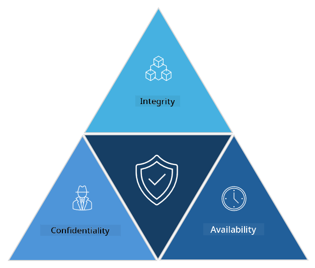

<!--
CO_OP_TRANSLATOR_METADATA:
{
  "original_hash": "16a76f9fa372fb63cffb6d76b855f023",
  "translation_date": "2025-09-04T01:08:18+00:00",
  "source_file": "1.1 The CIA triad and other key concepts.md",
  "language_code": "en"
}
-->
# The CIA triad and other key concepts

## Introduction

In this lesson, we’ll cover:

 - What is cybersecurity?
   
 - What is the cybersecurity CIA triad?

 - What are authenticity, nonrepudiation, and privacy in the context of cybersecurity?

## What is cybersecurity?

Cybersecurity, also called information security, involves protecting computer systems, networks, devices, and data from digital threats, unauthorized access, damage, or theft. The main objective of cybersecurity is to maintain the confidentiality, integrity, and availability of digital assets and information. Cybersecurity professionals create and implement security measures to safeguard assets, data, and information. As our lives increasingly move online, cybersecurity has become a critical concern for both individuals and organizations.

## What is the cybersecurity CIA triad?

The cybersecurity triad is a model that highlights the three key principles to consider when working on cybersecurity or designing a system/environment:

### Confidentiality

This is the aspect most people associate with "cybersecurity." Confidentiality involves protecting data and information from unauthorized access, ensuring that only those who need to see the information can access it. However, not all data is equally sensitive, so data is typically classified and protected based on the potential damage that could result from unauthorized access.

### Integrity

Integrity focuses on maintaining the accuracy and reliability of data within systems, ensuring it cannot be altered or modified by unauthorized individuals. For example, a student changing their date of birth in DMV records to appear older and obtain a new license for purchasing alcohol would be a breach of integrity.

### Availability

While availability is a general concern in IT operations, it is also crucial in cybersecurity. Certain types of attacks specifically target availability, such as distributed denial of service (DDoS) attacks, which security professionals must defend against.

**Cybersecurity CIA Triad**

## What are authenticity, nonrepudiation, and privacy in the context of cybersecurity?

These are additional essential concepts that help ensure the security and reliability of systems and data:

**Authenticity** - Ensures that the information, communication, or entity you are interacting with is legitimate and has not been altered or tampered with by unauthorized parties.

**Nonrepudiation** - Ensures that a party cannot deny their involvement in a transaction or communication. It prevents someone from claiming they didn’t send a message or perform a specific action when there is evidence proving otherwise.

**Privacy** - Involves protecting sensitive and personally identifiable information from unauthorized access, use, disclosure, or manipulation. It includes controlling who can access personal data and how that data is collected, stored, and shared.

## Additional reading

[What Is Information Security (InfoSec)? | Microsoft Security](https://www.microsoft.com/security/business/security-101/what-is-information-security-infosec#:~:text=Three%20pillars%20of%20information%20security%3A%20the%20CIA%20triad,as%20guiding%20principles%20for%20implementing%20an%20InfoSec%20plan.)

---

**Disclaimer**:  
This document has been translated using the AI translation service [Co-op Translator](https://github.com/Azure/co-op-translator). While we strive for accuracy, please note that automated translations may contain errors or inaccuracies. The original document in its native language should be regarded as the authoritative source. For critical information, professional human translation is recommended. We are not responsible for any misunderstandings or misinterpretations resulting from the use of this translation.