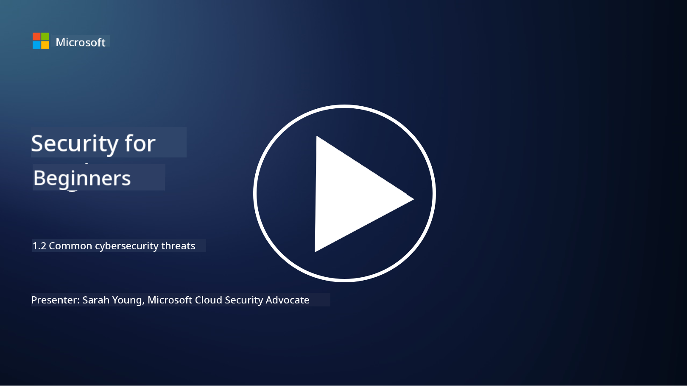

<!--
CO_OP_TRANSLATOR_METADATA:
{
  "original_hash": "6fc3030323139d7134a4ca9d03eccac9",
  "translation_date": "2025-09-03T23:20:30+00:00",
  "source_file": "1.2 Common cybersecurity threats.md",
  "language_code": "en"
}
-->
# Common cybersecurity threats

## Introduction

In this lesson, we’ll cover:

- What is a cybersecurity threat?

- Why do malicious actors want to compromise data and IT systems?

- What are the most common types of cybersecurity threats?

- What is the MITRE ATT&CK framework?

- Where can I keep up to date with the cybersecurity threat landscape?

## What is a cybersecurity threat?

A cybersecurity threat refers to any potential danger or risk that could compromise the confidentiality, integrity, or availability of data or IT systems. These threats are posed by malicious actors who exploit vulnerabilities to gain unauthorized access, steal sensitive information, disrupt operations, or cause harm to individuals, organizations, or even nations. Cybersecurity threats come in various forms and target different aspects of digital systems and data.

## Why do malicious actors want to compromise data and IT systems?

Malicious actors compromise data and IT systems for various reasons, often driven by personal gain, ideological motives, or the intent to cause disruption. Understanding these motivations can help organizations and individuals better defend against cyber threats. Common reasons include:

1. **Financial Gain**: Many attacks are motivated by profit. Malicious actors may steal sensitive information like credit card numbers, bank account details, or personal identification information to commit fraud, identity theft, demand ransom, or sell stolen data on the dark web.

2. **Espionage**: Nation-states, competitors, or other entities may engage in cyber espionage to steal sensitive government, corporate, or research data for political, economic, or military advantage.

3. **Disruption and Sabotage**: Some attacks aim to disrupt critical infrastructure, services, or operations for political or ideological reasons, causing widespread chaos, financial loss, and reputational damage.

4. **Ideological Motivations**: Hacktivists or groups with political or ideological motives may compromise systems to raise awareness, promote their beliefs, or protest against specific actions or organizations.

5. **Unintentional Actions**: Not all malicious actions are deliberate; some individuals may unknowingly contribute to cyber threats by falling victim to social engineering or being part of a compromised network.

The motivations for compromising data and IT systems vary widely, and the impact of these attacks can be severe. It's crucial for individuals, organizations, and governments to take cybersecurity seriously and implement measures to protect against these threats.

## What are the most common types of cybersecurity threats?

Malicious actors use various methods to compromise systems, steal data, and cause disruptions. Here are some of the most common types:

1. **Phishing**:

Phishing involves sending deceptive emails or messages that appear to be from legitimate sources to trick recipients into revealing sensitive information, such as passwords, credit card numbers, or personal details. It can also lead victims to malicious websites or prompt them to download malware.

2. **Malware**:

Malware (malicious software) includes a range of programs designed to infect systems, steal data, or cause damage. Types of malware include:

- **Ransomware**: Encrypts files and demands payment for decryption.

- **Trojans**: Disguised as legitimate software, they grant attackers unauthorized access.

- **Viruses**: Self-replicating programs that attach to files and spread.

- **Worms**: Self-replicating programs that spread through networks.

3. **Denial of Service (DoS) and Distributed Denial of Service (DDoS)**:

DoS attacks overwhelm a target system, making it unavailable to users. DDoS attacks use a network of compromised devices to flood a target with traffic, disrupting or halting its functionality.

4. **SQL Injection**:

Attackers manipulate a web application's input fields to inject malicious SQL queries, potentially gaining unauthorized access to databases and sensitive data.

5. **Cross-Site Scripting (XSS)**:

Attackers inject malicious scripts into web applications, which are executed by users' browsers. This can lead to data theft or malware distribution.

6. **Social Engineering**:

Social engineering exploits human psychology to manipulate individuals into revealing confidential information or performing actions that compromise security.

7. **Zero-Day (0day) Exploits**:

These attacks target vulnerabilities in software or hardware that are unknown to the vendor or public. Attackers exploit these vulnerabilities before patches are developed. While zero-days are concerning, they are less common than other attacks on this list. Security researchers work quickly to develop patches, making zero-days generally short-lived.

8. **Credential Attacks**:

These include brute force attacks, where attackers repeatedly guess passwords, and credential stuffing attacks, where stolen credentials from one site are used to attempt access on other sites.

## What is the MITRE ATT&CK framework?

The [MITRE ATT&CK framework](https://attack.mitre.org/) (Adversarial Tactics, Techniques, and Common Knowledge) is a resource that categorizes the tactics, techniques, and procedures (TTPs) used by adversaries during cyberattacks. Developed by MITRE Corporation, a not-for-profit organization, the framework provides a standardized way to describe and analyze cyber threats, helping cybersecurity professionals understand and defend against various attack methods.

The MITRE ATT&CK framework is widely used by security teams, threat hunters, and incident responders to:

1. **Understand Adversarial Behavior**: It documents real-world attack behaviors, outlining the steps attackers take from initial entry to achieving their objectives. It covers a wide range of techniques used by different threat groups.

2. **Plan and Implement Defense Strategies**: Security teams can use the framework to develop proactive defense strategies tailored to specific adversarial tactics and techniques.

3. **Incident Response and Threat Hunting**: During investigations or threat hunting, security professionals can refer to the framework to identify and mitigate specific techniques used by attackers.

The framework is organized into matrices that group attack techniques based on platforms and environments, such as Windows, macOS, Linux, and cloud services. Each matrix is divided into tactics (high-level goals) and techniques (specific methods to achieve those goals). For each technique, the framework provides details on how it works, potential mitigations, and references to real-world threat actors.

The MITRE ATT&CK framework is continuously updated as new threat intelligence emerges and the cybersecurity landscape evolves. It’s a valuable tool for improving an organization’s cybersecurity posture by offering insights into attacker behavior and defense strategies.

## Where can I keep up to date with the cybersecurity threat landscape?

There are many resources available to stay informed about cybersecurity threats. Here are a few:

- [Open Web Application Security Project (OWASP) top 10 vulnerabilities](https://owasp.org/Top10/)
- [Common Vulnerabilities and Exposures (CVEs)](https://www.bing.com/ck/a?!&&p=53df6007f017bca2JmltdHM9MTY5MjU3NjAwMCZpZ3VpZD0zYmY4N2RiYS1jYWI1LTYwMDgtMWY1YS02ZmYyY2JjNjYxZWUmaW5zaWQ9NTc2OQ&ptn=3&hsh=3&fclid=3bf87dba-cab5-6008-1f5a-6ff2cbc661ee&psq=cve&u=a1aHR0cHM6Ly9iaW5nLmNvbS9hbGluay9saW5rP3VybD1odHRwcyUzYSUyZiUyZmN2ZS5taXRyZS5vcmclMmYmc291cmNlPXNlcnAtcnImaD1BZXN4S0VBWTNnbGhNZEFpd3daMlNSZkZQNTlrODhIUnYxRUtlSkY1RTk0JTNkJnA9a2NvZmZjaWFsd2Vic2l0ZQ&ntb=1 "Common Vulnerabilities and Exposures")
- [Microsoft Security Response Center blogs](https://msrc.microsoft.com/blog/)
- [National Institute of Standards and Technology (NIST)](https://www.dhs.gov/topics/cybersecurity): NIST provides resources, alerts, and updates on cybersecurity threats.
- [Cybersecurity and Infrastructure Security Agency (CISA)](https://www.cisa.gov/resources-tools/resources/free-cybersecurity-services-and-tools): CISA offers cybersecurity resources and best practices for businesses, government agencies, and other organizations. It shares up-to-date information about high-impact security activities and in-depth analysis of new and evolving threats.
- [National Cybersecurity Center of Excellence (NCCoE)](https://www.dhs.gov/topics/cybersecurity): NCCoE provides practical cybersecurity solutions for real-world applications.
- [US-CERT](https://www.cisa.gov/resources-tools/resources/free-cybersecurity-services-and-tools): The United States Computer Emergency Readiness Team (US-CERT) offers cybersecurity resources, alerts, tips, and more.
- Your country's Cyber Emergency Response Team (CERT)

---

**Disclaimer**:  
This document has been translated using the AI translation service [Co-op Translator](https://github.com/Azure/co-op-translator). While we aim for accuracy, please note that automated translations may include errors or inaccuracies. The original document in its native language should be regarded as the authoritative source. For critical information, professional human translation is advised. We are not responsible for any misunderstandings or misinterpretations resulting from the use of this translation.