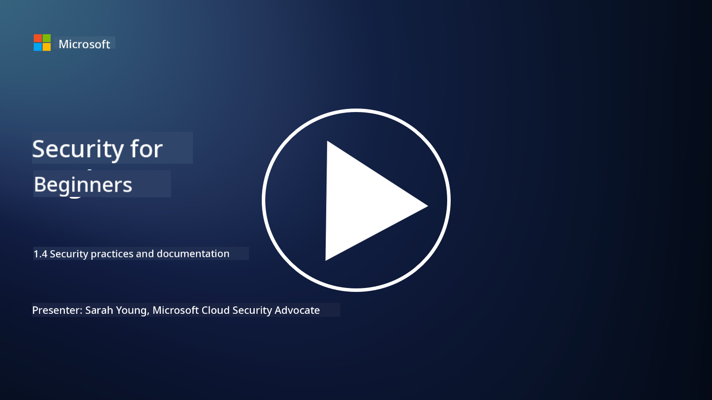

<!--
CO_OP_TRANSLATOR_METADATA:
{
  "original_hash": "d33500902124e52870935bdce4546fcc",
  "translation_date": "2025-09-04T00:17:56+00:00",
  "source_file": "1.4 Security practices and documentation.md",
  "language_code": "en"
}
-->
# Security practices and documentation 

You may have heard terms like “security policy,” “security standard,” etc., but the truth is that many cybersecurity professionals don’t use them correctly. In this section, we’ll explain what each term means and why an organization would use them.

## Introduction

In this lesson, we’ll cover:

 - What is a security policy?
 - What is a security standard?
 - What is a security baseline?
 - What is a security guideline?
 - What is a security procedure?
 - What are laws and regulations in the context of cybersecurity?

These terms are commonly used in cybersecurity to define various levels of security documentation and practices within an organization. Let’s break down each term:

## What is a security policy?

A security policy is a high-level document that defines an organization’s overall security goals, principles, and guidelines. It serves as a framework for making security-related decisions and establishes the organization’s security posture. Security policies typically address topics like acceptable use of resources, data protection, access control, incident response, and more. Policies are independent of specific solutions or technologies. A common example of a security policy is an organization’s acceptable use policy.

## What is a security standard?

A security standard is a more detailed document that outlines specific guidelines and requirements for implementing security controls within an organization. Standards are more technical and concrete than policies, providing clear instructions for configuring and maintaining systems, networks, and processes to achieve security objectives. For example, a security standard might state: _“All internal data must be encrypted at rest and in transit.”_

## What is a security baseline?

A security baseline is a set of minimum security configurations that are considered essential for a specific system, application, or environment at a given time. It establishes a foundational level of security that should be applied consistently across all relevant instances. Security baselines help ensure uniformity and a basic level of protection throughout an organization’s IT infrastructure. For example, a security baseline might state: _“Azure VMs must not have direct Internet access.”_

## What is a security guideline?

A security guideline is a document that provides recommendations and advice when a specific security standard does not apply. Guidelines address the “gray areas” that arise when a standard either doesn’t cover or only partially covers a particular issue.

## What is a security procedure?

A security procedure is a detailed, step-by-step guide that outlines the specific actions and tasks required to carry out a security-related process or activity. Procedures are practical and actionable documents that provide clear instructions for tasks like incident response, system maintenance, user onboarding, and more. For example, a security procedure might state: _“When a P1 security incident is generated by Microsoft Sentinel, the security operations center (SOC) must immediately inform the on-call security manager and send the details of the incident to them.”_

In summary, these terms represent different levels of documentation and guidance within an organization’s cybersecurity framework. Security policies define high-level goals, standards provide detailed requirements, baselines establish minimum configurations, guidelines offer best practices, and procedures outline actionable steps for security processes.

## What are laws/regulations in the context of cybersecurity?

Laws and regulations refer to legal frameworks created by governments and regulatory bodies to establish and enforce rules, standards, and requirements for securing digital systems, data, and information. These laws and regulations vary by region and focus on different aspects of cybersecurity, such as data protection, privacy, incident reporting, and securing critical infrastructure. Examples of cybersecurity-related laws and regulations include the General Data Protection Regulation (GDPR), Health Insurance Portability and Accountability Act (HIPAA), California Consumer Privacy Act (CCPA), and Payment Card Industry Data Security Standard (PCI DSS).

## Further reading

[Information Security Policy Templates | SANS Institute](https://www.sans.org/information-security-policy/)

[Compliance with Cybersecurity and Privacy Laws and Regulations | NIST](https://www.nist.gov/mep/cybersecurity-resources-manufacturers/compliance-cybersecurity-and-privacy-laws-and-regulations)

---

**Disclaimer**:  
This document has been translated using the AI translation service [Co-op Translator](https://github.com/Azure/co-op-translator). While we aim for accuracy, please note that automated translations may include errors or inaccuracies. The original document in its native language should be regarded as the authoritative source. For critical information, professional human translation is advised. We are not responsible for any misunderstandings or misinterpretations resulting from the use of this translation.